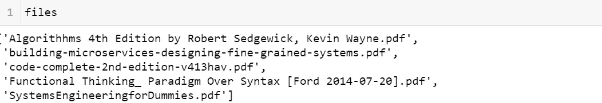
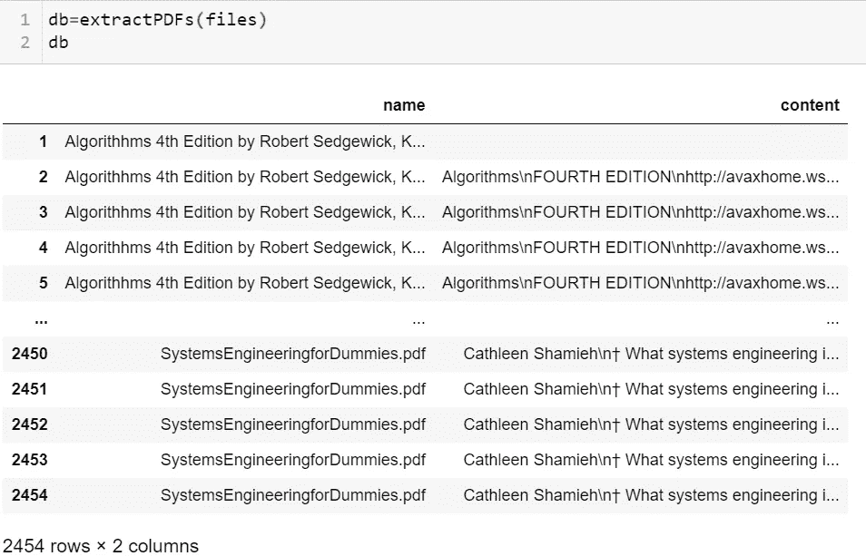
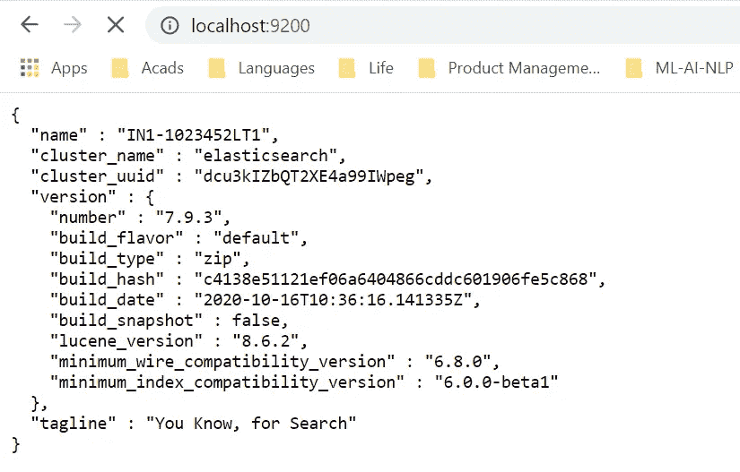

# 如何让 Elasticsearch 获取 Python 熊猫数据帧

> 原文：<https://betterprogramming.pub/how-to-get-elasticsearch-to-ingest-pandas-dataframes-836fe006209c>

## 和 pdf。简单的指南


作者图片

# 什么是 Elasticsearch？

[Elasticsearch](https://www.elastic.co/elasticsearch/) 是一款惊人的搜索引擎工具，能以闪电般的速度产生搜索结果。它是基于 Apache 的 Lucene 库构建的。它有一个 HTTP web 界面，并提供全文搜索引擎功能。它是分布式的，因为一个文档被分成多个部分或*碎片*并存储在不同的节点中。它也是容错的，这意味着它为用户提供了创建和存储他们希望存储的文档副本的选项。

Elasticsearch 以 JSON 文件的形式存储文档，这是无模式的，类似于 NoSQL 系统。Elasticsearch 虽然是用 Java 编写的，但也提供了一个 [Python 客户端](https://elasticsearch-py.readthedocs.io/en/7.10.0a2/)库。

# 如何摄取数据帧

我发现 Elasticsearch 是最多产的聊天机器人平台之一。这些平台接收包含问题和答案的文档。用户提出的任何问题都将通过在相关问答文档中执行搜索来回答。

事实上，Elasticsearch 有自己的相关性计算器，基于 Tf-IDf(词频，逆文档频率)方法。由于这不是本文的目的，我鼓励你学习更多关于 [Tf-IDf 方法](https://monkeylearn.com/blog/what-is-tf-idf/)的知识。

按照第一种方法，聊天机器人开发者提供包含 FAQ 的文档。这个文档可以是 Word 文档、富文本文件、标记文本文件、JSON 甚至 PDF 的形式。但 Elasticsearch 并不支持所有格式。PDF 是需要使用其他方式输入的格式之一。

此外，许多研究这些智能系统的数据科学家处理基于 Python 的数据结构，最突出的是数据帧。不幸的是，Elasticsearch 本身并不支持数据框架。

我想到了一箭双雕。首先，我将向您展示如何将 PDF 文件转换成数据帧，然后如何将数据帧编入 Elasticsearch。

# 但是首先，PDF！

PDF 文件可以有多个页面。它们可能包含也可能不包含图像。为了这篇文章，让我们假设他们没有图像；都是文字。我们首先需要提取 PDF 文件中每一页的所有文本。我创建了一个数据框架，存储书名和书中每一页的内容。因此，数据帧中的每一行都是在相应的名称列中提到的书中的一页。

从 PDF 文件中提取文本的示例代码

我的源文件夹有五个 PDF 文件。我从每本书里提取页面，然后创建一个数据框架。



我的源文件夹中的 pdf



每行是“名称”列中相应标题的一页

# 弹性搜索库

Elasticsearch 有自己的 Python 客户端库，名为 elasticsearch-py。它非常容易使用，并有助于索引，更新，删除和阅读弹性搜索索引的行动。默认情况下，它将监听 localhost:9200，但是如果您想要更改主机地址，您需要将它作为参数传递给`Elasticsearch()`方法。

要创建一个 Elasticsearch 会话，调用`Elasticsearch()`方法:

```
from elasticsearch import Elasticsearches = Elasticsearch()
```

要确保您的 Elasticsearch 会话处于活动状态，请在您的 web 浏览器中访问 http://localhost:9200/。如果您的会话处于活动状态，您应该能够在网页上看到以下消息:



您的弹性搜索会话已激活

好的。既然会话是活动的，我们可以开始索引我们的数据。下面是一个示例，我在其中索引了数据帧中的前两条记录:

```
es.index(index=”example”, doc_type=”sample_text", id=42, body={“name”:db.iloc[:2][‘name’],”content”:db.iloc[:2][‘content’]})
```

这将产生如下输出:

```
{'_index': 'example',
 '_type': 'sample_text',
 '_id': '42',
 '_version': 1,
 'result': 'created',
 '_shards': {'total': 2, 'successful': 1, 'failed': 0},
 '_seq_no': 0,
 '_primary_term': 1}
```

让我们看看我们的数据是否已被正确索引。为此，我们使用了`get()`方法:

```
es.get(index=”example”, doc_type=”sample_text", id=42)[‘_source’]
```

您必须能够看到数据帧的前两条记录:

```
{'name': ['Algorithhms 4th Edition by Robert Sedgewick, Kevin Wayne.pdf','Algorithhms 4th Edition by Robert Sedgewick, Kevin Wayne.pdf'],'content': ['','Algorithms\nFOURTH EDITION\nhttp://avaxhome.ws/blogs/ChrisRedfield\n']}
```

我们做到了！我们已经能够将我们的数据框架的一部分放入 Elasticsearch。

要获取整个数据帧，我们可以执行以下操作:

要检查是否正确索引了数据，请再次使用`get()`方法:

```
es.get(index=”index”, doc_type=”index123",id=173)[‘_source’]
```

您将获得以下内容:

```
{'name': ['Algorithhms 4th Edition by Robert Sedgewick, Kevin Wayne.pdf',
  'Algorithhms 4th Edition by Robert Sedgewick, Kevin Wayne.pdf',
  'Algorithhms 4th Edition by Robert Sedgewick, Kevin Wayne.pdf',
  'Algorithhms 4th Edition by Robert Sedgewick, Kevin Wayne.pdf',
  'Algorithhms 4th Edition by Robert Sedgewick, Kevin Wayne.pdf',
  'Algorithhms 4th Edition by Robert Sedgewick, Kevin Wayne.pdf',
  'Algorithhms 4th Edition by Robert Sedgewick, Kevin Wayne.pdf',
  'Algorithhms 4th Edition by Robert Sedgewick, Kevin Wayne.pdf',
  'Algorithhms 4th Edition by Robert Sedgewick, Kevin Wayne.pdf',
  'Algorithhms 4th Edition by Robert Sedgewick, Kevin Wayne.pdf',
  'Algorithhms 4th Edition by Robert Sedgewick, Kevin Wayne.pdf',
  'Algorithhms 4th Edition by Robert Sedgewick, Kevin Wayne.pdf',....],
'content': ['',
  'Algorithms\nFOURTH EDITION\nhttp://avaxhome.ws/blogs/ChrisRedfield\n',
  'Algorithms\nFOURTH EDITION\nhttp://avaxhome.ws/blogs/ChrisRedfield\nThis page intentionally left blank ',
  'Algorithms\nFOURTH EDITION\nhttp://avaxhome.ws/blogs/ChrisRedfield\nThis page intentionally left blank Algorithms\nRobert Sedgewick\nandKevin Wayne\nPrinceton University\nFOURTH EDITION\nUpper Saddle River, NJ \n† Boston † Indianapolis † San Francisco\nNew York † Toronto † Montreal † London † Munich † Paris † Madrid\nCapetown † Sydney † Tokyo † Singapore † Mexico City\n',
  'Algorithms\nFOURTH EDITION\nhttp://avaxhome.ws/blogs/ChrisRedfield\nThis page intentionally left blank Algorithms\nRobert Sedgewick\nandKevin Wayne\nPrinceton University\nFOURTH EDITION\nUpper Saddle River, NJ \n† Boston † Indianapolis † San Francisco\nNew York † Toronto † Montreal † London † Munich † Paris † Madrid\nCapetown † Sydney † Tokyo † Singapore † Mexico City\nMany of the designations used by manufacturers and sellers to distinguish their products are claimed as \ntrademarks. Where those designations appear in this book, and the publisher was aware of a trademark \nclaim, the designations have been printed with initial capital letters or in all capitals. \nThe authors and publisher have taken care in the preparation of this book, but make no expressed or im-\nplied warranty of any kind and assume no responsibility for errors or omissions. No liability is assumed \nfor incidental or consequential damages in connection with or arising out of the use of the information or \nprograms contained herein. \nThe publ....]}
```

这意味着你已经成功地获得了你的数据！恭喜你！

关于将各种数据格式编入 Elasticsearch 的更多细节，请浏览[详细文档](https://elasticsearch-py.readthedocs.io/en/7.9.1/)。