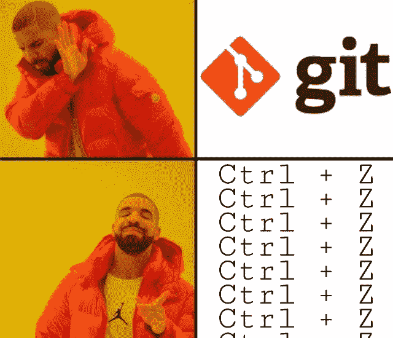
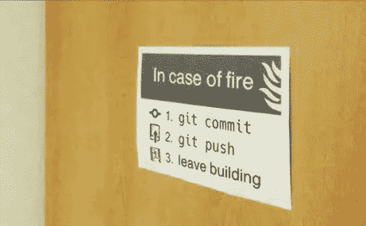
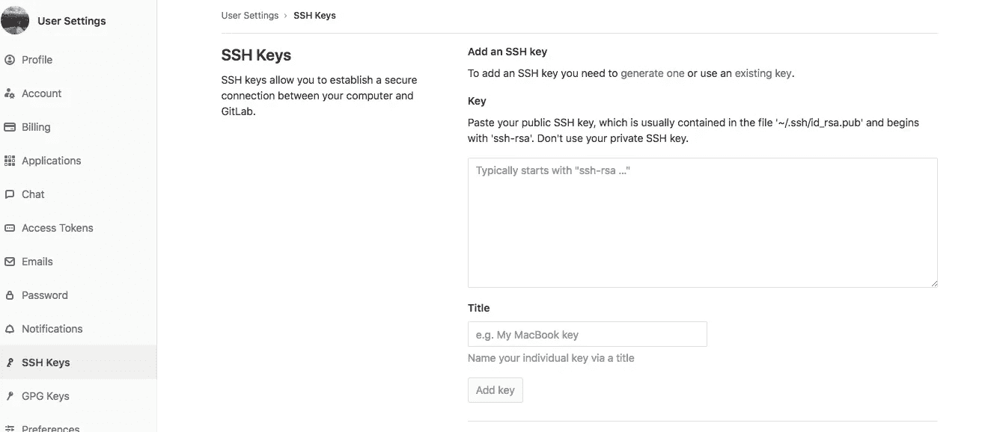
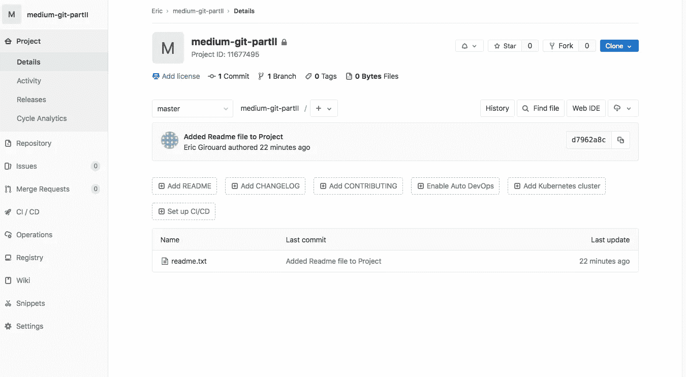
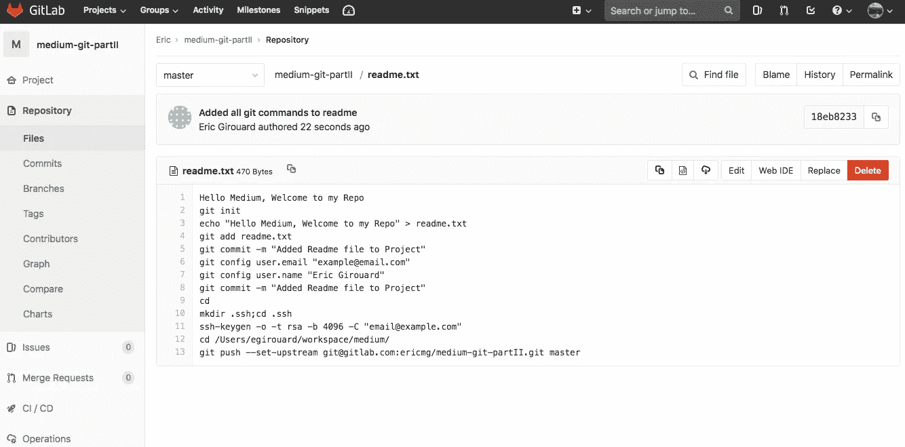

# 如何变得擅长 Git

> 原文：<https://betterprogramming.pub/how-to-get-good-at-git-96a05888ace4>

## 在命令行上使用 Git 的简单指南



对于一个正在学习 Microsoft Word 的四年级学生来说，不停地重命名文件可能是一个坚实的过程，但你是一名工程师！我们有更好的版本控制技术，但是对于新“入门”的人来说，这可能是令人生畏的。人们经常忽视或推迟接受它。

在这篇文章中，我们将完成以下壮举:

*   初始化一个空的 repo 并从头开始构建它
*   创建一个 SSH 密钥并将其添加到我们的帐户中
*   对我们的代码库进行更改，并将它们与**原点**同步



最好把你的优先顺序排好…

# 准备好我们的账户

我更喜欢 [Gitlab](https://gitlab.com/) ，因为这是我第一次接触到的东西，他们是第一个提供无限免费私有库的大公司， [Github](https://github.com/) 现在也提供这种服务。

在我们创建了一个账户之后，我们将会有一个类似这样的用户主页:[https://gitlab.com/ericmg](https://gitlab.com/ericmg)。我们将通过此 URL 将存储库连接到我们的帐户。

要创建一个新的回购协议，我们只需以 root 用户身份转到我们想要的目录，然后运行:

```
**>$ git init***Initialized empty Git repository in /Users/egirouard/workspace/medium/.git/*
```

这会产生一个名为。git，它包含了对文件进行版本控制和控制所需的所有信息。让我们创建一些文件，这样 Git 就有东西可以跟踪了:

```
**>$ echo "Hello Medium, Welcome to my Repo" > readme.txt**
```

现在目录中有了一个文件，检查我们的回购状态应该会有结果。

```
**>$** **git status**
*On branch master**No commits yet**Untracked files:
  (use "git add <file>..." to include in what will be committed)**readme.txt**nothing added to commit but untracked files present (use "git add" to track)*
```

“git status”的输出显示了我们的 repo/branch 的状态:我们在 branch **master 上，**没有 **commits** ，还有一个**未跟踪的**文件。

Git 将文件添加和更改分为三类:

> **未跟踪文件**:Git 之前未被告知跟踪的新文件。
> 
> **工作区**:已修改但未提交的文件。
> 
> **暂存区**:已被标记为在下一次提交时执行的已修改文件。

为了让 Git 开始跟踪 readme.txt 文件的变化，我们需要**添加**它:

```
**>$ git add readme.txt
>$ git status**
*On branch master**No commits yet**Changes to be committed:
  (use "git rm --cached <file>..." to unstage)**new file:   readme.txt*
```

现在， *readme.txt* 已经添加到我们的“工作区”了。要转移它，我们必须提交文件。提交伴随着一个消息，所以其他开发人员(或我们后来的自己)阅读项目时理解变更或添加背后的原因。提交也是可搜索的，所以要写强有力的、相关的消息。

然而，如果你现在尝试提交，Git 会抱怨它不知道你是谁！

```
**>$ git commit -m "Added Readme file to Project"****** Please tell me who you are.**Run**git config --global user.email "*[*you@example.com*](mailto:you@example.com)*"
  git config --global user.name "Your Name"**to set your account's default identity.
Omit --global to set the identity only in this repository.**fatal: unable to auto-detect email address (got 'egirouard@eg-macbook.(none)')*
```

提交有*作者*，提交者的名字和电子邮件。为了让 Git 正常工作，我们需要为它提供这些元数据，并为它提供连接到一个**源的方法，在本例中是**，即我们的 Gitlab 帐户。

Git 的消息很好地为您指出了正确的方向。我们看到命令直接从上面的控制台输出中运行，如果我们想为整个机器设置这些值，而不是这个单一的存储库(如果是个人计算机，这是一个好主意)，我们可以添加`— global`。

```
**>$ git config user.email "**[**example@email.com**](mailto:ericmgirouard*@gmail.com)**"**
**>$ git config user.name "Eric Girouard"**
```

现在我们可以承诺:

```
**>$ git commit -m "Added Readme file to Project"***[master (root-commit) d7962a8] Added Readme file to Project
 1 file changed, 1 insertion(+)
 create mode 100644 readme.txt*
```

在我们提交之前，我们需要向 ET 展示如何打电话回家。Git 需要一个对它的**源**的引用，这个术语是指项目最初被克隆的远程存储库。然而，如果我们像刚才那样从头创建一个项目，我们将需要为我们新生的存储库构建一个永久的家。

# 第一次推 Git

不成熟的库对于那些虔诚地开始他们从未完成的项目的开发人员来说是很棒的，但是对于我们这些想要长期了解我们的项目的人来说，我们需要一种方法来推动:进入 SSH。

通过 SSH 将你的代码推送到**源**比 HTTPS 更简单，因为你不需要用户名和密码。您可以(我们也将会)创建一个 SSH 密钥对，向 Gitlabhub 提供您的公钥，并自动推送带有验证和安全性的更改。

要创建密钥对:

```
>$ cd
>$ mkdir .ssh;cd .ssh
>$ ssh-keygen -o -t rsa -b 4096 -C "email@example.com"
```

-C 参数是可选的，它在你的键的末尾提供一个注释，如果你有多个的话，以区别于其他的。

这将创建 *id_rsa* (您的私钥)和 *id_rsa.pub* (您的公钥)。我们传递我们的公钥，保留我们的私钥——嗯，私钥。



在 Gitlab 的用户设置中，您可以将您的公钥添加到您的帐户中，从而允许我们最终推送。

```
**>$ git push --set-upstream** [**git@gitlab.com**](mailto:git@gitlab.com)**:ericmg/medium-git-partII.git master***Counting objects: 3, done.
Writing objects: 100% (3/3), 264 bytes | 264.00 KiB/s, done.
Total 3 (delta 0), reused 0 (delta 0)
remote:
remote: The private project ericmg/medium-git-partII was successfully created.
remote:
remote: To configure the remote, run:
remote:   git remote add origin* [*git@gitlab.com*](mailto:git@gitlab.com)*:ericmg/medium-git-partII.git
remote:
remote: To view the project, visit:
remote:* [*https://gitlab.com/ericmg/medium-git-partII*](https://gitlab.com/ericmg/medium-git-partII) *remote:
To gitlab.com:ericmg/medium-git-partII.git
 * [new branch]      master -> master
Branch 'master' set up to track remote branch 'master' from '*[*git@gitlab.com*](mailto:git@gitlab.com)*:ericmg/medium-git-partII.git'.*
```

让我们来分解这个命令:

*   **git push:** 这个命令的核心——我们试图使用 git 将我们的代码推送到一个新定义的原点路径
*   **— set-upstream** :告诉 git 到**原点**的路径。如果 Git 之前已经推进了你当前的分支，它会记住**的来源**在哪里
*   [**git@gitlab.com**](mailto:git@gitlab.com)**:ericmg/medium-git-partii . git:**这是指向我的帐户来源的 SSH 路径。 **git@gitlab.com:** 对每个 gitlab 用户都是一样的。 **ericmg** 是我的帐户的用户名， **medium-git-partII** 将是这个新存储库的名称，最后，每个 git 路径都以**结尾。git**
*   **master** :这是初始化时我想推送的分支的名称

推动之后，我们可以看到我们空虚的储存库新生的荣耀:



正如我所承诺的，我更新了 vim 中的 readme.txt，以包含所有上述命令，然后检查差异:

```
**>$ git diff***diff --git a/readme.txt b/readme.txt
index 8f8d054..915422b 100644
--- a/readme.txt
+++ b/readme.txt
@@ -1 +1,13 @@
 Hello Medium, Welcome to my Repo
+git init
+echo "Hello Medium, Welcome to my Repo" > readme.txt
+git add readme.txt
+git commit -m "Added Readme file to Project"
+git config user.email "*[*example@email.com*](mailto:example@email.com)*"
+git config user.name "Eric Girouard"
+git commit -m "Added Readme file to Project"
+cd
+mkdir .ssh;cd .ssh
+ssh-keygen -o -t rsa -b 4096 -C "*[*email@example.com*](mailto:email@example.com)*"
+cd /Users/egirouard/workspace/medium/
+git push --set-upstream* [*git@gitlab.com*](mailto:git@gitlab.com)*:ericmg/medium-git-partII.git master*
```

添加/提交更改( **git add)**将添加当前工作目录下的所有文件)

```
**>$ git add .**
**>$ git commit -m "Added all git commands to readme"**
*[master b8a8b82] Added all git commands to readme
 1 file changed*
**>$** **git push** *Counting objects: 3, done.
Writing objects: 100% (3/3), 260 bytes | 130.00 KiB/s, done.
Total 3 (delta 0), reused 0 (delta 0)
To gitlab.com:ericmg/medium-git-partII.git
   d7962a8..b8a8b82  master -> master*
```

注意，这次我们只是运行了没有附加参数的 **git push** ，那是因为 git 已经知道了 **origin** 在哪里，所以我们不需要每次都提供。如果我们回到我们项目的主页:



我们看到更新的自述文件！就这么简单，不管文件内容是什么。我们可以将嵌套的子目录、图像、javascript、CSS、配置文件等放入一个 repo 中，Git 同样会跟踪它们。

有了这个新的工具集，您将为未来的工程冒险做好充分的准备。现在出去做点什么吧！