# 如何用 Next.js 在 Supabase 中获得 Google OAuth

> 原文：<https://betterprogramming.pub/how-to-get-google-oauth-in-supabase-with-next-js-56220c59d5a6>

## 如何在你的 Next.js 应用中使用 Supabase 获得第三方认证


Ashim D'Silva 在 [Unsplash](https://unsplash.com?utm_source=medium&utm_medium=referral) 上拍摄的照片。

用户名-密码组合曾经是事实上的授权方法，但第三方身份验证库正在迅速普及。他们有许多优势。根据 [Synopsys](https://www.synopsys.com/blogs/software-security/5-reasons-third-party-authentication/) 的说法，其中一些包括:

*   没有额外的账户——要注册你的服务，客户需要使用他们的谷歌或脸书账户登录。因此，这减少了在你的网站上创建用户帐户的摩擦。
*   身份验证处理是一个问题——让我们解决房间里的大象:身份验证功能实现起来很痛苦。您不需要强调密码哈希和数据泄露。

过去要获得第三方认证，需要使用 [Passport](/build-a-login-system-in-node-js-f1ba2abd19a) 或者 [NextAuth](/build-a-note-taking-app-with-google-authentication-in-next-js-f0835d14034e) 。但是一个更强大的库最近出现了。

Supabase 的目标是成为 Firebase 的开源对手。这对于喜欢在项目中使用开放技术的开发人员来说至关重要。除了身份验证，它还允许您构建[数据库](https://supabase.io/docs/guides/database)和[存储桶](https://supabase.io/docs/guides/storage)。换句话说，如果你的应用程序需要数据库功能并存储媒体文件，那么 Supabase 是你武库中的一个伟大选择。

在本文中，您将学习如何使用 Supabase 的身份验证 API 构建一个登录系统。它也将有自己的仪表板页面。这将是结果:

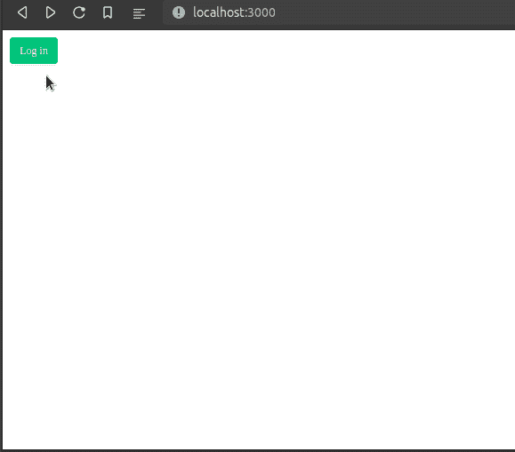

本文的结果

如果客人用户试图访问仪表板页面，应用程序会将他们踢回主页:

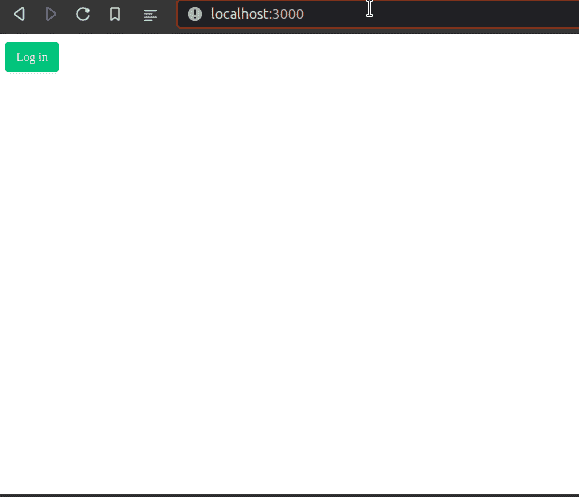

将用户重定向到主页

我们开始吧！

# 入门指南

在编写一些代码之前，我们需要首先配置我们的 Supabase 项目。

## 创建一个超级数据库项目

导航到 [Supabase 项目页面](http://app.supabase.io)并点击“新建项目”在该页面上，分配您的凭据:

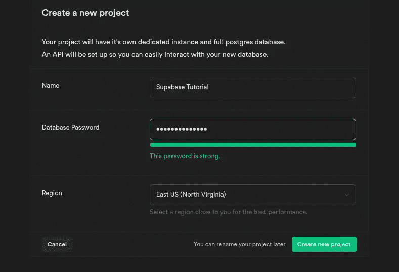

创建我们的凭证

完成后，Supabase 会将你重定向到“表格”页面。我们现在需要获得相关的 API 密钥。

为此，请单击左侧面板上的“设置”:

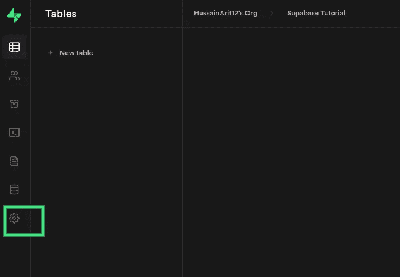

点击设置面板

在这一步之后，转到“API”部分，然后复制您的`URL`和`anon public`键:


从这里获取您的 Supabase URL 和匿名密钥

将这些粘贴到 Next.js 项目的`.env.local`文件中，如下所示:

```
NEXT_PUBLIC_SUPABASE_URL = [s](https://aypaflcjitbaxffvljgm.supabase.co)upabaseURL
NEXT_PUBLIC_SUPABASE_ANON_KEY = publicKey
```

太好了！我们现在已经完成了第一步。让我们配置我们的谷歌证书。

## Google OAuth 配置

在从[谷歌凭证页面](https://console.developers.google.com/apis/credentials)创建凭证时，确保您已经输入了您的`Supabase project’s public URL + /auth/v1/callback`，作为您的“授权重定向 URIs”的一部分

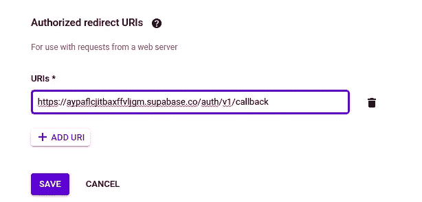

配置我们授权的重定向 URIs

最后一步，你现在必须向 Supabase 提供你的谷歌 OAuth 的`Client ID`和`Client Secret`键。

要做到这一点，回到你的 Supabase 项目，在“授权设置”页面的“启用谷歌”部分输入这些密钥:

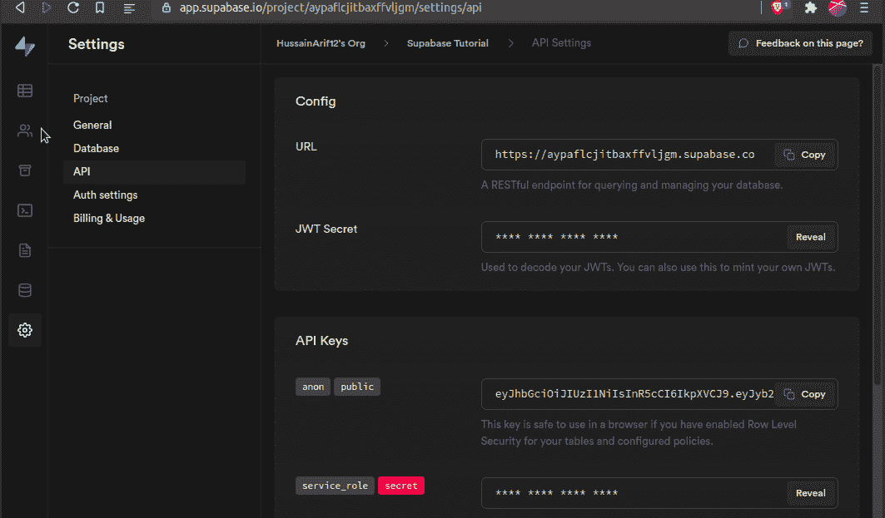

启用我们的 Google OAuth 提供商

我们完事了。在下一节中，我们将为 Next.js 项目编写一些代码。

# 编写我们的第三方 OAuth 功能

## 模块安装

对于这个应用程序，我们需要两个包:

*   `@supabase/supabase-js`:核心库。我们将用它来实现第三方 OAuth。
*   `@supabase/ui`:为我们的项目提供预构建的 UI 组件。

要获得这些，请在下一个应用程序的根目录下运行以下终端命令:

```
npm i @supabase/supabase-js @supabase/ui
```

完成后，就该组织我们项目的文件结构了。

## 项目文件夹结构

在项目的根文件夹中，创建以下文件夹:

*   `utils`:用于我们的助手功能。它还将包含我们的 Supabase 配置代码。
*   顾名思义，它将包含我们的定制组件，使我们的代码看起来更整洁。

最后，项目的结构应该是这样的:

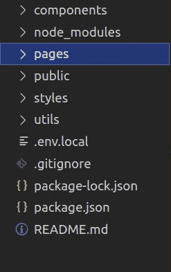

项目目录结构

我们现在需要删除一些起始代码。转到`/pages/index.js`并删除`div`标签之间的所有代码。最后，`/pages/index.js`应该是这样的:

```
import styles from "../styles/Home.module.css";export default function Home() {
  return <div className={styles.container}></div>;
}
```

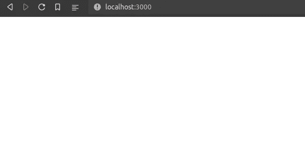

代码的输出

太好了！现在让我们用这个应用程序配置我们的 Supabase 客户机。

## 超级配置

在您的`utils`文件夹中，创建一个名为`supabaseClient.js`的文件。在这里，编写以下代码:

*   第 3-4 行:从我们的环境变量中获取我们的 Supabase `URL`和`anon public`密钥。
*   第 5 行:将这些变量传递给`createClient`函数来构建我们的 Supabase 实例。
*   第 7 行:导出这个`supabaseClient`配置，以便我们可以在项目中使用它。

完成后，现在让我们构建帮助器函数，让用户登录。

## 创建我们的登录实用程序函数

在你的`utils`文件夹中，创建一个名为`signIn.js`的文件。这个文件将包含一个功能，让用户通过他们的谷歌帐户登录。

*   第 1 行:我们的`signIn`函数将接受我们的 Supabase 实例作为参数。
*   第 2 行:使用我们的`supabaseClient`来调用`signIn`函数。我们还指定了我们的第三方提供商将是谷歌。
*   第 3 行:如果出现错误，那么将它记录到控制台。

完成后，我们现在将继续创建 Next.js 组件，该组件将在用户登录后呈现。

## 自定义身份验证组件

在您的`components`文件夹中，创建一个名为`Container.js`的文件。在这里，编写以下代码块:

*   第 1 行:`Auth`组件将帮助我们检索登录用户的数据。
*   第 6 行:`useUser`钩子将在客户端获取用户的信息。这里，我们使用对象析构来提取`user`对象。如果你想了解对象析构， [Dieter Jordens](https://medium.com/u/b3cf0bc86c7f?source=post_page-----56220c59d5a6--------------------------------) 写了一篇关于它的很好的解释文章。
*   第 8 行:检查`user`对象是否有值(即客户端是否已经登录)。
*   第 11-12 行:如果`true`，则显示用户的`full_name`属性。此外，给他们一个链接，以转到受保护的网页。这将引导他们进入`/protected`页面。
*   第 13 行:点击时，调用`signOut`函数。这将注销用户。
*   第 18 行:如果`user`的值是`null`(客户端是一个访客用户)，那么呈现`Container`组件的子组件。

现在我们已经构建了自定义的 React 组件，让我们配置我们的主页来呈现登录 UI。

## 构建我们的登录界面

在您的`/pages/index.js`中，进行以下导入:

```
import { Auth, Button } from "@supabase/ui";
import supabaseClient from "../utils/supabaseClient";
import Container from "../components/Container";
import signIn from "../utils/signIn";
```

在这段代码中，我们导入了我们的`supabaseClient`,这样我们就可以最终将我们的 Supabase 实例连接到这个项目。

第二步，导航到同一个文件中的`return`块:

```
return <div className={styles.container}></div>;
```

像这样改变它:

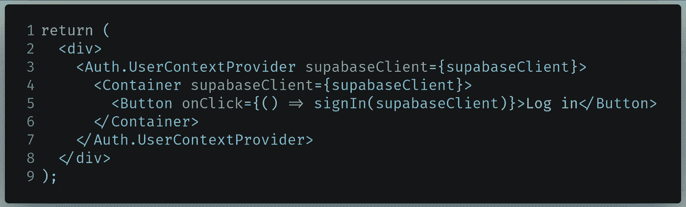

要在 pages/index.js 中编写的代码

*   第 3 行:`Auth`组件使用 [React 的上下文 API](/reacts-context-api-explained-baebcee39d2f) 发送用户和当前会话数据。这将在客户端保留用户会话，即使服务器重新启动。
*   第 4 行:渲染`Container`组件，传递我们的`supabaseClient`作为道具。
*   第 5 行:当被调用时，运行`signIn`自定义函数。

运行代码。这将是结果:

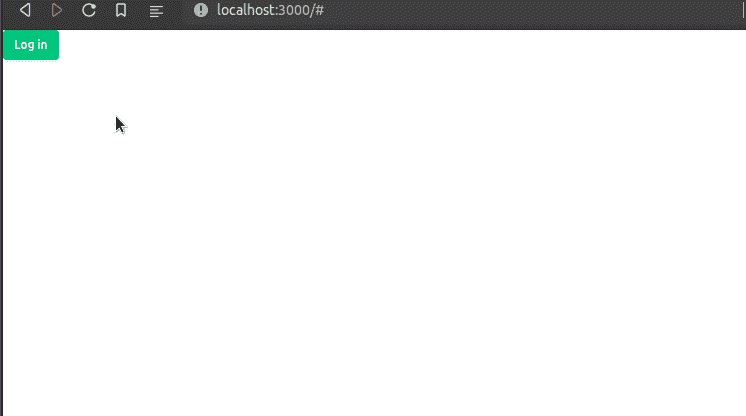

代码的输出

太神奇了！我们的代码有效。如你所见，我们能够通过我们的谷歌账户成功登录和注销。

在下一节中，我们将学习如何使用服务器端呈现来获取用户会话。

最后，你的`/pages/index.js`应该是这样的:

## 使用 Supabase OAuth 的服务器端渲染

转到您的`/pages/api`文件夹，创建一个名为`auth.js`的文件。这个文件将负责设置头和 cookies，以便 Supabase 可以通过服务器识别登录的会话。

在`/pages/api/auth.js`中，编写以下代码:

*   第 1 行:从`utils/supabaseClient.js`文件中导入我们的 Supabase 实例。
*   第 4 行:将有效负载注销到控制台。
*   第 5 行:当服务器向`/api/auth`发出请求时，设置一个 cookie 来指示用户已经登录或退出。

现在我们已经编写了处理程序，是时候使用它了。

在写一些代码之前，让我们先讨论一下我们的问题:我们希望 Next.js 监听认证事件(例如登录或注销事件)。如果事件发生，那么 Next.js 也应该相应地更改身份验证 cookies。那么我们如何让这成为可能呢？

要解决这个问题，我们可以使用 [Supabase 的](https://supabase.io/docs/reference/javascript/auth-onauthstatechange) `[onAuthStateChanged](https://supabase.io/docs/reference/javascript/auth-onauthstatechange)` [函数](https://supabase.io/docs/reference/javascript/auth-onauthstatechange)。这将在身份验证事件发生变化时通知我们。

现在让我们用代码实现它。在`/pages/index.js`中，首先导入的`useEffect`是这样的:

```
import {useEffect} from "react"
```

现在，在您的`Home`组件中，编写以下代码块:

*   第 1 行:当 Next.js 第一次将这个`Home`组件挂载到 DOM 时，这个`useEffect`处理程序中的所有代码都将运行。
*   第 2 行:运行`onAuthStateChange`函数。每当发生与身份验证相关的事件时，它都会通知我们。
*   第 4 行:每当 auth 事件发生时，对`/api/auth`路由执行一个`POST`请求。
*   第 8 行:发送`event`和`session`数据作为有效载荷。
*   第 13 行:如果`Home`组件从 DOM 中移除，取消订阅认证事件。这将防止内存泄漏。

运行代码。这将是结果:

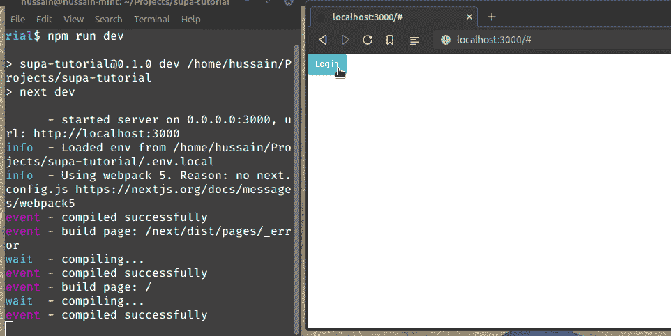

代码的输出

请注意，每当用户登录时，他们的用户数据都会被注销到控制台。但是当注销事件发生时，我们的代码显示了一个`SIGNED_OUT`事件。这意味着我们的代码有效！

在下一节中，您将学习如何在服务器端呈现的帮助下制作受保护的页面。

最后，`/pages/index.js`应该是这样的:

## 受保护的页面

在本节中，我们希望我们的代码仅在用户已经登录的情况下呈现 *页面*。否则，Next.js 应该将用户重定向到`/`(主页)，从而提示他们首先登录。**

在您的`/pages/`目录中，创建一个名为`protected.js`的文件。在这里，编写以下代码:

*   第 4 行:接收包含用户数据的`user`属性。这来自我们的`getServerSideProps`函数。
*   第 7-9 行:显示用户的电子邮件、全名和个人资料照片。
*   第 13 行:使用`getServerSideProps`从服务器获取特定于用户的数据。
*   第 14 行:使用 cookies 获取当前用户的数据。
*   第 15-20 行:检查`user`值是否不包含任何数据(客户端尚未登录)。如果是`true`，则将用户重定向回`/`页面。
*   第 24 行:否则，发送`user`数据作为道具。

运行代码。这将是结果:

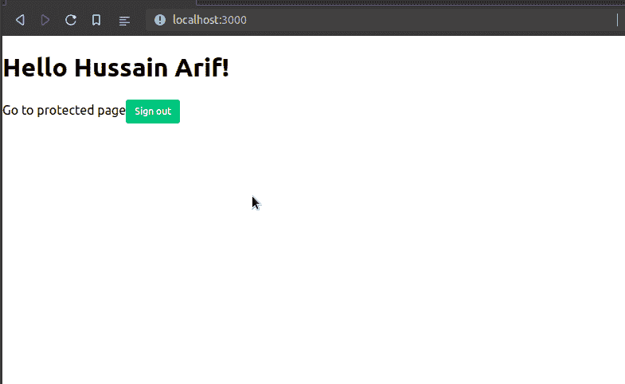

代码的输出

我们得到了一个错误，因为我们没有告诉 Next.js 我们的图像域。为此，在根目录下创建一个名为`next.config.js`的文件。

在`next.config.js`中，编写以下代码:

*   第 3 行:告诉 Next.js 我们的图像将来自`lh3.googleusercontent.com`域。

要查看这些更改的效果，请重新启动服务器。这将是代码的输出:

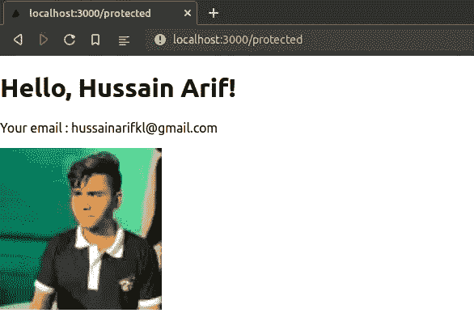

代码的输出

太神奇了！我们的代码按预期工作。让我们进一步测试一下。注销后尝试导航到`/protected`目录。

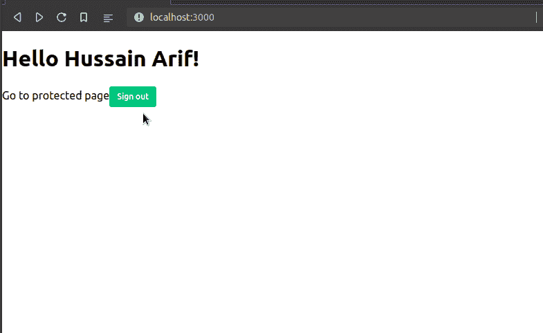

再次测试我们的代码。

如您所见，我们的代码是成功的！

# 其他资源

## GitHub 知识库

*   [本项目所有源代码](https://github.com/HussainArif12/supa-tutorial)

## 进一步阅读

*   [Supabase Google OAuth—YouTube](https://www.youtube.com/watch?v=_XM9ziOzWk4)
*   [Supabase YouTube 频道](https://www.youtube.com/c/Supabase/videos)
*   [NextJS 和 Supabase 本地 Auth — GitHub 代码示例](https://github.com/supabase/supabase/tree/master/examples/nextjs-with-supabase-auth)

# 结论

尽管 Supabase 还处于测试阶段，但它是 Firebase 平台的可靠替代品。文档很容易理解，技术非常稳定。它是开源的事实是锦上添花。您是否有使用身份验证、数据库和存储媒体文件的应用程序？那么我建议选择 Supabase 作为你的后台。

非常感谢你坚持到最后！