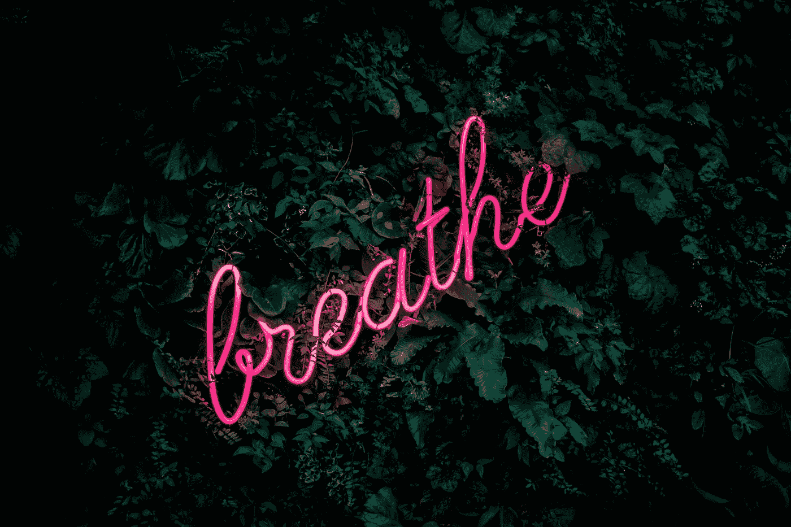

# 如何进入编码的最佳状态

> 原文：<https://betterprogramming.pub/how-to-get-in-the-perfect-mood-for-coding-21173dd084d>

## 用这些情感小贴士提高你的工作效率

法比安·米勒在 [Unsplash](https://unsplash.com?utm_source=medium&utm_medium=referral) 上的照片

坐在电脑前“只写代码”并不总是那么容易。我们也是人，有烦恼的日子和疲惫的早晨。[编程就是这样一个赢得](https://medium.com/better-programming/how-to-work-on-your-developers-frustration-and-self-doubt-7096569aa9de)的情感游戏。你必须控制自己展现你的专注能力，完成工作。

当你这么做的时候，想想你对自己的要求:

*   研究一个问题并想出解决方案。
*   管理[干原则](https://dzone.com/articles/software-design-principles-dry-and-kiss)，维护，可扩展性和简单性。
*   当你让谷歌准备好回答你当时可能有的任何愚蠢的问题时，不要分心。
*   在即将到来的最后期限的压力下工作。

编码也是一种智力游戏。你应该关心自己是否有合适的心情去面对它。这样你的日子才能富有成效。

以下是我的一些建议，可以让你达到这样的心情，并充分利用你的每一天。

# 摆脱烦恼代码

这可能是什么，尤其是在这个时期，可能会影响你更多。当你担心或者感觉不好的时候。你可能会有太多的想法在你的脑海中肆虐，而你却不能把手放在键盘上。你可能在想你所爱的人，生活状况，从内心回溯对话。

听起来很愤世嫉俗，这会扼杀你的生产力。如果你不能在工作时消除这些情绪，从长远来看，这可能会给你和老板带来一些问题。

在这种情况下，我的解决方案可能适合您，它分为两个主要步骤:

*   我会思考问题是什么，我的需求是什么。争吵之后，我需要从一个特别的人那里得到安慰吗？我需要打电话给我妈妈确定她没事吗？
*   我会花 20 分钟的时间远离代码，根据需求行动，努力满足它。所以如果我在争吵后需要安慰，我会和那个人谈谈。如果我需要和我妈妈说话，我会打电话给她，确保她没事。

这应该对你有所帮助，或者至少满足你一天内在的情感渴望。之后，你可能要考虑深入解决这个问题，以确保你下次编码时没有后顾之忧。

照片由 [Anh Nguyen](https://unsplash.com/@pwign?utm_source=medium&utm_medium=referral) 在 [Unsplash](https://unsplash.com?utm_source=medium&utm_medium=referral)

# 用音乐放松

对一些人来说，音乐在编码时创造了奇迹。他们可以一边听重金属音乐，一边专心工作。对我来说，情况并非如此。我一听很酷的歌，我的注意力就被歌词和节奏偷走了。事实上，我只能在做对我来说相当机械的重复性工作时听它。

如果音乐适合你，让你心情愉快，不受干扰，我建议你听你喜欢的任何类型的音乐，并且能坚持很长时间。然而，我仍然建议你选择一些冷静的东西，因为我发现它可以让你平静下来，让你处于处理代码行的最佳位置。

这里有一些我喜欢的很酷的技巧，从高保真到嘻哈。

【https://www.youtube.com/watch?v=5qap5aO4i9A 

[https://www.youtube.com/watch?v=InI8TdggKd0](https://www.youtube.com/watch?v=InI8TdggKd0)

[https://www.youtube.com/watch?v=f02mOEt11OQ](https://www.youtube.com/watch?v=f02mOEt11OQ)

# 避免中断

在编码的时候，你需要时刻记住你在做什么和你的下一步。分散注意力意味着忘记你的工作，随后花更多的时间来回顾你所做的一切。

我发现最大的干扰来自于让自己被谷歌带走，寻找我需要的东西或有趣的文章，或者只是外界的噪音。

在第一种情况下，唯一的解决办法是足够自律，不要在受到诱惑时开始随意上网。列一张你早上想看的东西的清单，然后等你有空的时候再回来看。你可以用[一些时间管理技巧](https://memory.ai/timely-blog/time-management-techniques)比如[番茄工作法](https://francescocirillo.com/pages/pomodoro-technique)进一步鼓励这种行为。

对于噪音隔离，作为开发人员，你能做的最好的购买是一套高质量的噪音消除耳机。它们的价格可以高达几美元，但我相信你可以找到一些便宜的好东西。

[点击这里](https://www.techradar.com/news/audio/portable-audio/best-noise-cancelling-headphones-1280490)找到一些购买完美鞋子的好建议。

# 打发无聊

你有没有发现自己只是盯着键盘感觉受阻？就像你的大脑进入了冷冻模式。这可能发生在漫长的一天打字之后。在这种情况下，我的建议是你找一个有趣的外部输入来带回创造性的输入。你能做的最好的事情就是找一对搭档。就你正在处理的任务向你的同事寻求帮助。这肯定会让你的情绪活跃起来，让你在一段时间内提高工作效率。

[NeONBRAND](https://unsplash.com/@neonbrand?utm_source=medium&utm_medium=referral) 在 [Unsplash](https://unsplash.com?utm_source=medium&utm_medium=referral) 上的照片

# 拯救你的大脑免于燃烧

有时候你就是不能再坐一秒钟去解决一个你已经纠结了四个小时的该死的问题。你甚至开始忘记最初的问题是什么，一边喃喃自语一边检查代码，一个接一个地犯愚蠢的错误。

这是休息的好时机。在这种情况下，我建议你离开键盘 20 分钟，以避免在大脑仍然满溢的情况下回到问题上的诱惑。你仍然可以在屏幕前，只是不是你的笔记本电脑。

在这种情况下，我喜欢在办公室的咖啡室(或者在家工作时在客厅)放松一下，享受一点小吃。我会看几个 YouTube 视频，然后带着全新的思维回到我的工作中。

照片由 [Unsplash](https://unsplash.com?utm_source=medium&utm_medium=referral) 上的 [NeONBRAND](https://unsplash.com/@neonbrand?utm_source=medium&utm_medium=referral) 拍摄

# 关键要点

*   为了找到编码时的最佳情绪，你必须实施一系列理想的策略。
*   如果担心某件事让你无法写代码，花 20 分钟离开键盘，试着满足你的情感需求，至少在这一天。
*   编码时听一些好音乐放松一下，因为它可能会帮助你带来积极的情绪。
*   当无聊或写作受阻时，找一对搭档吧！
*   给自己买一副好的降噪耳机，发现一种适合自己的时间管理技巧。

## 结论

编程本身就已经很难了。此外，我们总是必须找到新的方法来控制我们的思想，这是我们拥有的最重要的工具，以集中精力和富有成效。我向你提出的技巧和场景应该可以帮助你了解如何达到编码的最佳状态，以及如何处理不同的情况。

一如既往，感谢您的阅读，并在下面留下您的评论。

— *皮耶罗*

# 资源

*   [干原则](https://dzone.com/articles/software-design-principles-dry-and-kiss)。
*   [高保真嘻哈电台](https://www.youtube.com/watch?v=5qap5aO4i9A)。
*   [Lo-fi 混音一个](https://www.youtube.com/watch?v=InI8TdggKd0)。
*   [编码 lo-fi 混音](https://www.youtube.com/watch?v=f02mOEt11OQ)。
*   [时间管理技巧](https://memory.ai/timely-blog/time-management-techniques)。
*   [番茄工作法](https://francescocirillo.com/pages/pomodoro-technique)。
*   [2020 年最佳降噪耳机套装](https://www.techradar.com/news/audio/portable-audio/best-noise-cancelling-headphones-1280490)。