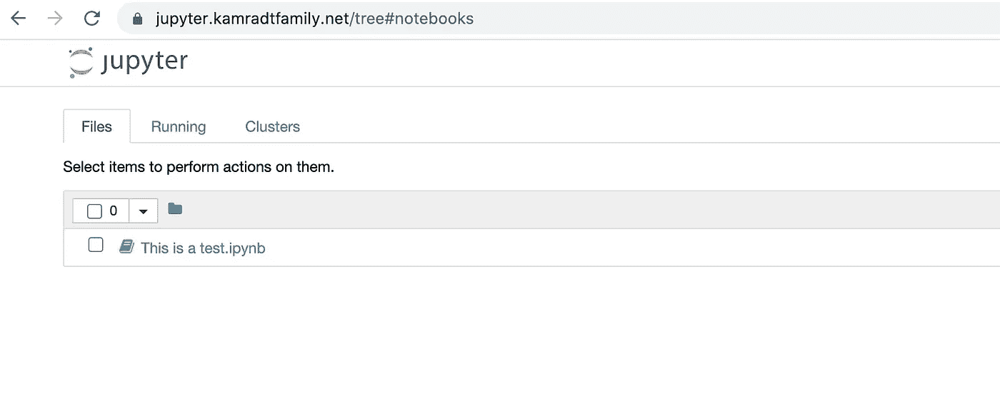

# 如何让 Jupyter 进入云端

> 原文：<https://betterprogramming.pub/how-to-get-jupyter-in-the-cloud-49f7ff5262da>

## 使用 Docker 和一个普通的云虚拟机来廉价地托管 Jupyter


图片由[贝亚特·巴赫曼](https://pixabay.com/users/spirit111-5026413/?utm_source=link-attribution&utm_medium=referral&utm_campaign=image&utm_content=2742181)从[皮克斯拜](https://pixabay.com/?utm_source=link-attribution&utm_medium=referral&utm_campaign=image&utm_content=2742181)拍摄。

我发现了 Angelica Dietzel 写的这篇很棒的[文章，这篇文章讲述了如何使用](https://medium.com/better-programming/a-step-by-step-guide-to-web-scraping-nba-data-with-python-jupyter-beautifulsoup-and-pandas-7e2d334d4195) [Jupyter](https://jupyter.org/) 从网站上收集数据，并将其与 [Pandas](https://pandas.pydata.org/) 和其他开源软件一起收集到数据集中。“数据科学家”这个词一直让我害怕。我想到了穿着白大褂的人在研究大量打印出来的数据。所以我想跳进来，消除我的隐性偏见，这篇文章是一个完美的介绍。

文章的前半部分是关于安装你需要的所有软件，这是相当彻底的。但是我讨厌在我超载的笔记本电脑上安装软件，所以我想为什么不在 Docker 中运行它呢？首先，我尝试从 python3 的基础上创建自己的 Dockerfile，并给出了安装说明。结果不太好。它启动了服务器，但是服务器什么也没做。所以我做了一些谷歌搜索，看看是否有人有我可以使用的 Docker 文件或 Docker 图像，然后它把我带到了这个页面:

[](https://github.com/jupyter/docker-stacks/) [## jupyter/docker-stack

### Jupyter Docker Stacks 是一组准备运行的 Docker 映像，包含 Jupyter 应用程序和交互式计算…

github.com](https://github.com/jupyter/docker-stacks/) 

这个`scipy-notebook`看起来包含了为这篇文章安装的所有东西。所以我创建了一个小脚本来启动它:

```
docker run -p 8888:8888 -v ${PWD}/notebooks:/home/jovyan \
       jupyter/scipy-notebook:2c80cf3537ca
```

首先，我创建了`notebooks`目录，它将把所有的输出放在那里。然后，运行上面的脚本，我得到了下面的打印输出:

```
Executing the command: jupyter notebook
[W 23:57:47.039 NotebookApp] WARNING: The notebook server is listening on all IP addresses and not using encryption. This is not recommended.
[I 23:57:47.079 NotebookApp] JupyterLab alpha preview extension loaded from /opt/conda/lib/python3.6/site-packages/jupyterlab
[I 23:57:47.079 NotebookApp] JupyterLab application directory is /opt/conda/share/jupyter/lab
[I 23:57:47.090 NotebookApp] Serving notebooks from local directory: /home/jovyan
[I 23:57:47.090 NotebookApp] 0 active kernels
[I 23:57:47.090 NotebookApp] The Jupyter Notebook is running at:
[I 23:57:47.090 NotebookApp] [http://[all](/[all) ip addresses on your system]:8888/?token=65bc64c2d0769158b6c34b3de005009c5de5ac4406833ce5
[I 23:57:47.090 NotebookApp] Use Control-C to stop this server and shut down all kernels (twice to skip confirmation).
[C 23:57:47.094 NotebookApp] 

    Copy/paste this URL into your browser when you connect for the first time,
    to login with a token:
        [http://localhost:8888/?token=65bc64c2d0769158b6c34b3de005009c5de5ac4406833ce5](http://localhost:8888/?token=65bc64c2d0769158b6c34b3de005009c5de5ac4406833ce5)
```

浏览网址调出 Jupyter 主屏幕，使我能够完成这篇文章。在我完成之后，Control-C 停止了服务器，通常的 Docker 命令删除了停止的进程。在`notebooks`目录中，我可以看到`ipynb`文件(我创建的笔记本)和一个`csv`文件，后者是本文中演示的笔记本的最终产品。

然后我想，“为什么不在云中提供呢？”它必须在一些登录屏幕的后面，这样恶意的行为者就不能用邪恶的数据填满我的服务器(我以前也遇到过这种情况)。我最近写了一篇关于使用 PHP 应用程序单点登录的文章。我可以扩展相同的设置并运行 Jupyter。

因为所有的配置都在 GitHub 上我的[PHP approd](https://github.com/rkamradt/phpappprod/tree/b4cdbeefe4a31f61f350c69c4c3d649a2c267274)存储库中，所以我需要扩展它。我还必须在 Cloudflare 上向我的 DNS 添加另一个 A 记录。我登录到 Cloudflare 并创建了一个新主机(jupyter.kamradtfamily.net ),它的 IP 地址与我之前创建的`phpdemo`主机相同，因为它们都运行在同一个虚拟机上。显然，你必须使用你自己的域名！

接下来，我需要调整`phpappprod`存储库中的`nginx.conf`和`docker-compose.yml`文件，以添加 Jupyter 服务器和虚拟主机。在`nginx.conf`中，我从用于`phpdemo`虚拟主机的服务器部分复制了一个新的服务器部分:

```
server {
    access_log /dev/stdout;
    listen 443 ssl;
    server_name jupyter.kamradtfamily.net;
    ssl_certificate /etc/certs/kamradtfamily.net.pem;
    ssl_certificate_key /etc/certs/kamradtfamily.net.key;
    ssl_protocols TLSv1 TLSv1.1 TLSv1.2;
    ssl_ciphers HIGH:!aNULL:!MD5;
    auth_request /vouch-validate; location = /vouch-validate {
      # This address is where Vouch will be listening on
      proxy_pass [http://vouch:9090/validate](http://vouch:9090/validate);
      proxy_pass_request_body off; # no need to send the POST body proxy_set_header Content-Length "";
      proxy_set_header X-Real-IP $remote_addr;
      proxy_set_header X-Forwarded-For $proxy_add_x_forwarded_for;
      proxy_set_header X-Forwarded-Proto $scheme;# these return values are passed to the [@error401](http://twitter.com/error401) call
      auth_request_set $auth_resp_jwt $upstream_http_x_vouch_jwt;
      auth_request_set $auth_resp_err $upstream_http_x_vouch_err;
      auth_request_set $auth_resp_failcount       $upstream_http_x_vouch_failcount;
    } error_page 401 = [@error401](http://twitter.com/error401);# If the user is not logged in, redirect them to Vouch's login URL
    location [@error401](http://twitter.com/error401) {
      return 302 [https://vouch.kamradtfamily.net/login?url=https://$http_host$request_uri&vouch-failcount=$auth_resp_failcount&X-Vouch-Token=$auth_resp_jwt&error=$auth_resp_err](https://vouch.kamradtfamily.net/login?url=https://$http_host$request_uri&vouch-failcount=$auth_resp_failcount&X-Vouch-Token=$auth_resp_jwt&error=$auth_resp_err);
    }
    location / {
        proxy_pass [http://jupyter:8888](http://jupyter:8888);
        proxy_set_header X-Real-IP $remote_addr;
        proxy_set_header Host $host;
        proxy_set_header X-Forwarded-For $proxy_add_x_forwarded_for;# websocket headers
        proxy_http_version 1.1;
        proxy_set_header Upgrade $http_upgrade;
        proxy_set_header Connection $connection_upgrade;proxy_buffering off;
    }
}
```

有两个地方我不得不把`phpdemo`改成`jupyter`，端口改成了`8888`。我还必须添加一些新的头，这样它就可以与 Jupyter 使用的 WebSockets 一起工作。最后，我必须在`html`块中添加一个映射，也是为了支持 WebSockets:

```
map $http_upgrade $connection_upgrade {
      default upgrade;
      ''      close;
  }
```

你必须回到我以前的[文章](https://levelup.gitconnected.com/modern-php-part-3-1f5b78b3371d)来学习所有这些是如何工作的，但是它为我提供了 Nginx 级别的单点登录和 HTTPS 终止，所以应用程序不需要担心这些。

接下来，我必须将 Jupyter 服务器添加到我的`docker-compose.yml`中。翻译 Docker 命令是一项相对简单的任务:

```
jupyter:
    image: jupyter/scipy-notebook:2c80cf3537ca
    volumes:
     - ./notebooks:/home/jovyan
    ports:
      - 8888:8888
```

服务名(jupyter)成为由同一个`docker-compose.yml`文件启动的 Nginx 进程的主机名，因此 Nginx 可以通过 [http://jupyter:8888](http://jupyter:8888.) 访问它。

一旦这些更改就绪，我就可以提交并把它们推回 GitHub，然后我需要去我的 GCP 虚拟机，那里存放着我的 PHP 演示应用程序。到了那里，我将目录更改为`phpappprod,`,其中包含存储库的一个克隆，并运行以下代码:

```
sudo docker-compose down
git pull
sudo docker-compose up
```

我没有在`docker-compose up`上使用`-d`选项，因为我想在配置出现错误时立即查看日志。当然，有一个错别字，所以我必须在我的存储库中修复它，推回到 GitHub，然后重复上面的三个命令。

您将需要一个令牌，因此当您启动`docker-compose`(如果您使用`-d`选项)时，您将需要运行`docker-compose logs`命令，您应该会看到它被打印出来:

```
jupyter_1  | [C 14:27:54.889 NotebookApp]
jupyter_1  |
jupyter_1  |     Copy/paste this URL into your browser when you connect for the first time,
jupyter_1  |     to login with a token:
jupyter_1  |         [http://localhost:8888/?token=a724f6aefa4e1800b436](http://localhost:8888/?token=a724f6aefa4e1800b436b15fb4369929f162e28fdb326e36)
```

每次重新启动服务器时，令牌都会发生变化。不过有了上面的，我就能浏览到 https://jupyter.kamradtfamily.net[/？token=a724f6aefa4e1800b436](http://localhost:8888/?token=a724f6aefa4e1800b436b15fb4369929f162e28fdb326e36) ，用 [Okta](https://www.okta.com/) 提供的单点登录登录，我得到这个:



我自己在云中运行的 Jupyter 实例！我复制了我在本地实例上完成的笔记本步骤，以确保它能够工作。

因为我运行的是最底层的虚拟机，而且我只有一个 10G 的驱动器，所以我几乎没有空间来容纳所有这些应用程序，包括 PHP 演示应用程序使用的 MariaDB。因此，如果我真的想要一些用于大型数据集的东西，我将不得不在其他地方设置它。我只是将它添加到这个虚拟机，以便我可以利用内置的单点登录。如果我能把它和与 Jupyter 服务器共存的 MariaDB 连接起来，那将会很有趣。PHP 演示程序列出了葡萄酒和奶酪的搭配。也许我能找到一些关联。当然，到目前为止，数据库中只有两个条目，所以这不算大数据。

在线使用 Jupyter 还有许多其他选择。只要谷歌一下“云端的 jupyter”，你就会找到很多文章。许多是完整的系统，但这些可能会花你一点钱。我这里呈现的选项只是玩玩，但是完全免费，你可以拿去试驾一下，了解一下功能再出去花钱。

# 附言

我可以让笔记本读取 MariaDB，但是我必须在 GCP 虚拟机上使用以下命令将`pymysql`模块添加到容器中:

```
phpappprod$ sudo docker-compose exec jupyter /bin/sh 
$ python3 -m pip install PyMySQL
```

这里有一篇关于如何读写 MariaDB/MySQL 的文章:

 [## 熊猫数据帧-写入和读取 MySQL 表| Pythontic.com

### 来自 python pandas dataframe 实例的数据可以写入 MySQL 数据库表。数据可以从 MySQL 加载…

pythontic.com](https://pythontic.com/pandas/serialization/mysql) 

引用的 GitHub repos:

[](https://github.com/jupyter/docker-stacks/) [## jupyter/docker-stack

### Jupyter Docker Stacks 是一组准备运行的 Docker 映像，包含 Jupyter 应用程序和交互式计算…

github.com](https://github.com/jupyter/docker-stacks/)  [## rkamradt/PHP pprod

### phpapp GitHub 产品版的部署脚本是超过 5000 万开发者的家园，他们一起工作…

github.com](https://github.com/rkamradt/phpappprod/tree/b4cdbeefe4a31f61f350c69c4c3d649a2c267274) [](https://github.com/rkamradt/vjupyter) [## rkamradt/vjupyter

### 此时您不能执行该操作。您已使用另一个标签页或窗口登录。您已在另一个选项卡中注销，或者…

github.com](https://github.com/rkamradt/vjupyter) 

提到的其他文章:

[](https://medium.com/better-programming/a-step-by-step-guide-to-web-scraping-nba-data-with-python-jupyter-beautifulsoup-and-pandas-7e2d334d4195) [## 用 Python，Jupyter，BeautifulSoup 和 Pandas 对 NBA 数据进行网络搜集的分步指南

### 球不会说谎。数据也是如此。

medium.com](https://medium.com/better-programming/a-step-by-step-guide-to-web-scraping-nba-data-with-python-jupyter-beautifulsoup-and-pandas-7e2d334d4195) [](https://levelup.gitconnected.com/modern-php-part-3-1f5b78b3371d) [## 现代 PHP(第 3 部分)

### 所有 web 应用程序的单点登录。

levelup.gitconnected.com](https://levelup.gitconnected.com/modern-php-part-3-1f5b78b3371d)