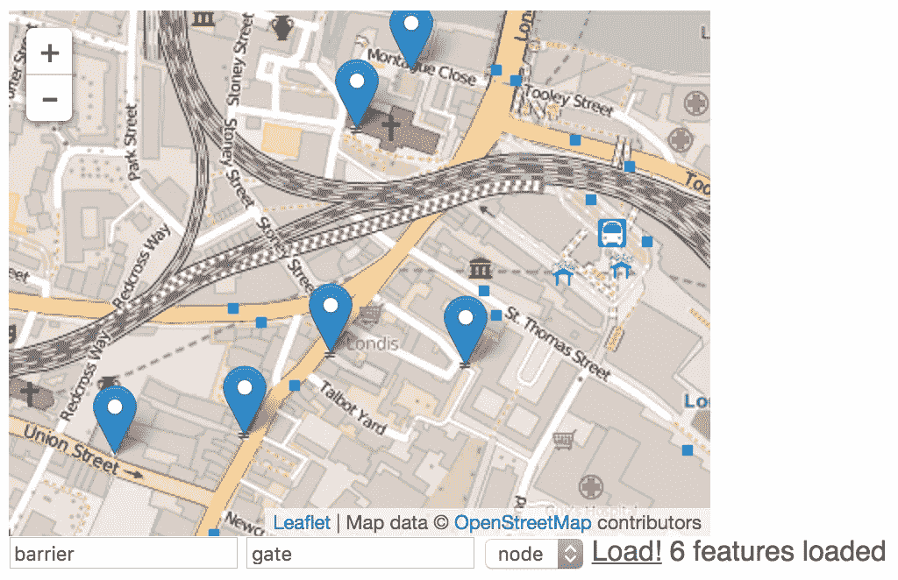
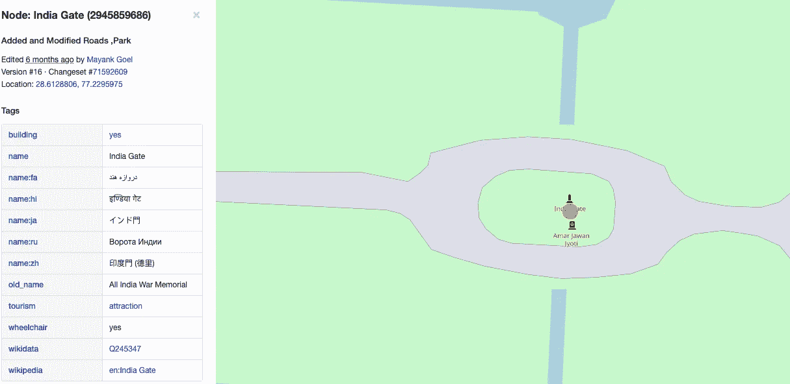
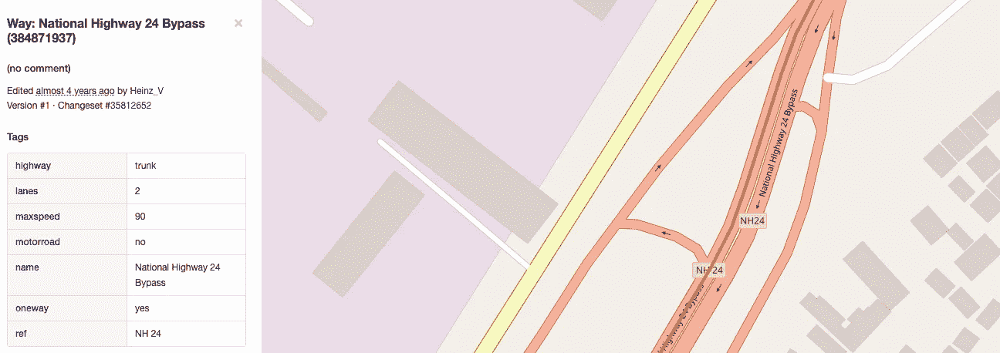
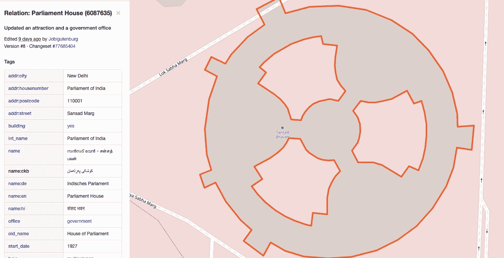
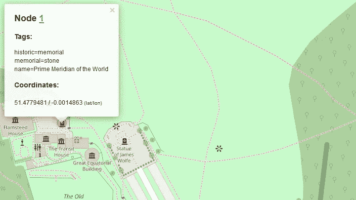

# 如何使用 Python 获取开放的街道地图数据

> 原文：<https://betterprogramming.pub/how-to-get-open-street-and-map-data-using-python-2b777bf5af14>

## 当你的应用需要了解我们周围的世界时



您是否曾经参与过一个项目，需要一些真实世界的地理位置数据，例如，有多少条高速公路穿过这个特定的城市，或者在这个特定的地方有多少家餐馆？

OpenStreetMap 是一个很棒的开源世界地图，它可以让我们对这些和类似的问题有所了解。这个数据集中隐藏了很多数据，充满了有用的标签和地理信息。

# OpenStreetData 模型

让我们看看 OSM 是如何构成的。

在 OSM 数据模型中，我们有三个基本组件，分别是[节点](https://wiki.openstreetmap.org/wiki/Node)、[方式](https://wiki.openstreetmap.org/wiki/Way)和[关系](https://wiki.openstreetmap.org/wiki/Relation)，它们都有一个 ID。许多元素都带有[标签](https://wiki.openstreetmap.org/wiki/Tags)，这些标签描述了表示为键值对的特定特性。

简单来说，*节点*是地图上的点(在纬度和经度上)，就像下一张有据可查的德里印度门的图片。



另一种方式是节点的有序列表，它可以对应于一条街道或一所房子的轮廓。这里有一个印度 NH 24 的例子。



最后一个数据元素是一个*关系*，它也是一个有序列表，包含节点、路径甚至其他关系。

它用于建模对象之间的逻辑或地理关系。例如，这可以用于大型结构，如印度议会，它包含多个多边形来描述建筑。



# 使用天桥 API

现在我们来看看如何从 OSM 加载数据。[天桥 API](https://wiki.openstreetmap.org/wiki/Overpass_API) 使用定制的[查询语言](https://wiki.openstreetmap.org/wiki/Overpass_API/Overpass_QL)来定义查询。

这需要一些时间来适应，但幸运的是有[马丁·雷弗](https://github.com/tyrasd)的[天桥涡轮](http://overpass-turbo.eu/)，它可以直接在浏览器中交互式地评估我们的查询。

假设您想要查询咖啡馆的节点，那么您的查询如下所示:

```
node["amenity"="cafe"]({{bbox}}); out;
```

其中查询源代码中的每条语句都以分号结束。该查询首先指定我们想要查询的组件，在本例中是一个节点。

我们在查询中应用了一个按标签过滤的方法，寻找所有键值对为`"amenity"="cafe"`的节点。在[文档](https://wiki.openstreetmap.org/wiki/Overpass_API/Overpass_QL#By_tag_.28has-kv.29)中可以找到不同的标签过滤选项。

有各种各样的标签可供选择，其中一个常见的关键字是 [amenity](https://wiki.openstreetmap.org/wiki/Key:amenity) ，它涵盖了各种社区设施，如咖啡馆、餐厅，或者只是一张长椅。为了对 OSM 其他可能的标签有一个大概的了解，看看 [OSM 地图功能](https://wiki.openstreetmap.org/wiki/Map_Features)或 [taginfo](https://taginfo.openstreetmap.org/) 。

另一个过滤器是边界框过滤器，其中`{{bbox}}`对应于边界框，我们希望在该边界框中进行搜索，并且仅在天桥 Turbo 中工作。

否则，您可以通过纬度和经度中的`(south, west, north, east)`指定一个边界框，如下所示:

```
node["amenity"="pub"]
  (53.2987342,-6.3870259,53.4105416,-6.1148829); 
out;
```

你可以试试天桥涡轮。正如我们之前在 OSM 数据模型中看到的，也有可能拥有相同属性的方法和关系。

我们也可以通过使用一个 [union](https://wiki.openstreetmap.org/wiki/Overpass_API/Overpass_QL#Union) block 语句来获得这些信息，该语句收集一对括号内的语句序列的所有输出，如下所示:

```
( node["amenity"="cafe"]({{bbox}});
  way["amenity"="cafe"]({{bbox}});
  relation["amenity"="cafe"]({{bbox}});
);
out;
```

下一种过滤查询的方法是通过元素 id 过滤[。下面是查询`node(1); out;`的例子，它给出了经度接近于零的世界](https://wiki.openstreetmap.org/wiki/Overpass_API/Overpass_QL#By_element_id)的[本初子午线。](https://www.openstreetmap.org/node/1)



另一种过滤查询的方式是按地区来过滤[，可以指定为`area["ISO3166-1"="GB"][admin_level=2];`，这样我们就得到了英国的地区。](https://wiki.openstreetmap.org/wiki/Overpass_API/Overpass_QL#By_area_.28area.29)

我们现在可以使用它作为查询的过滤器，方法是将`(area)`添加到语句中，如下所示:

```
area["ISO3166-1"="GB"][admin_level=2];
node["place"="city"](area);
out;
```

该查询返回英国的所有城市。也可以使用关系或方式作为区域。在这种情况下，区域 ID 需要从一个现有的 OSM 路径中派生出来，方法是将`2400000000`添加到它的 OSM ID 中，或者在有关系的情况下，添加`3600000000`。

请注意，并不是所有的路/关系都有一个区域对应物(即那些标有`area=no`的路/关系，以及大多数没有定义`name=*`的多多边形将不属于区域)。

如果我们将[英国](https://www.openstreetmap.org/relation/62149)的关系应用到前面的例子中，我们将得到:

```
area(3600062149);
node["place"="city"](area);
out;
```

最后，我们可以指定查询数据的输出，这是由 [out action](https://wiki.openstreetmap.org/wiki/Overpass_API/Overpass_QL#Print_.28out.29) 配置的。到目前为止，我们将输出指定为`out;`，但是可以添加各种附加值。

第一组值可以控制输出信息的详细程度或详细程度，如[文档](https://wiki.openstreetmap.org/wiki/Overpass_API/Overpass_QL#Print_.28out.29)中描述的`ids`、`skel`、`body`(默认值)、`tags`、`meta`和`count`。

此外，我们可以为地理编码信息添加修饰符。`geom`为每个对象添加完整的几何图形。当返回没有关联坐标的关系或路径，并且您想要获得它们的节点和路径的坐标时，这很重要。

例如，查询`rel["ISO3166-1"="GB"][admin_level=2]; out geom;`不会返回任何坐标。值`bb`仅将边界框添加到每个路径和关系，而`center`仅添加同一边界框的中心。

排序顺序可通过`asc`和`qt`进行配置，分别按对象 ID 或四块索引排序，后者明显更快。最后，通过添加一个整数值，您可以设置要返回的最大元素数。

结合目前所学，最终可以查询到德国所有 Biergarten 的位置。

```
area["ISO3166-1"="DE"][admin_level=2];( node["amenity"="biergarten"](area);
  way["amenity"="biergarten"](area);
  rel["amenity"="biergarten"](area);
);
out center;
```

# 使用 Python 访问

要用 Python 访问 over float API，使用[over pay](https://github.com/DinoTools/python-overpy)包作为包装器。在这里，您可以看到我们如何用 overpy 包来翻译前面的示例:

```
import overpyapi = overpy.Overpass()
r = api.query("""
area["ISO3166-1"="DE"][admin_level=2];
(node["amenity"="biergarten"](area);
 way["amenity"="biergarten"](area);
 rel["amenity"="biergarten"](area);
);
out center;
""")coords  = []
coords += [(float(node.lon), float(node.lat)) 
           for node in r.nodes]
coords += [(float(way.center_lon), float(way.center_lat)) 
           for way in r.ways]
coords += [(float(rel.center_lon), float(rel.center_lat)) 
           for rel in r.relations]
```

overpy 的一个优点是它从响应中检测内容类型(即 XML、JSON)。更多信息请看他们的[文档](https://python-overpy.readthedocs.io/en/latest/)。