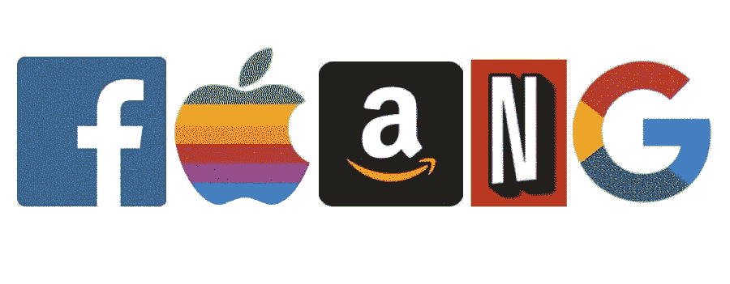
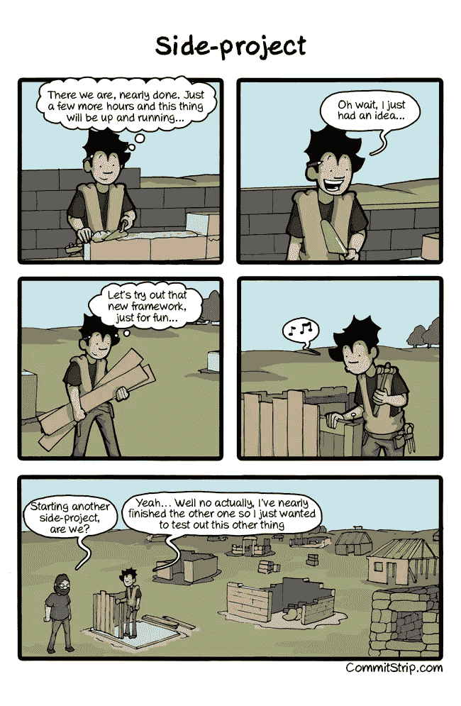

# 没有经验如何获得软件工程面试

> 原文：<https://betterprogramming.pub/how-to-get-software-engineering-interviews-with-no-experience-6e62739e2d37>

## 入门级职位，需要 2-3 年的经验

获得你的第一份技术工作，无论是作为软件工程师还是数据科学家，都感觉不可能。

你读到的所有入门级职位的工作描述似乎都要求至少 2-3 年的经验。你究竟应该如何获得初级职位的经验？

尤其是如果你没有实习经历或者没有软件工程背景的话。

我们许多人都去过那里。九个月来，我们寄出了数百份简历，参加了数十场见面会，感觉自己连面试的机会都没有，更别提工作了。

然而，我们的朋友似乎都在某个大型科技公司找到了工作，薪水高达六位数。

怎么会？

事实是，你永远不知道什么能让你在科技行业找到第一份工作。说到找工作，我们每个人都有不同的技能。我们中的一些人擅长从头到尾开发自己的应用程序，一些人擅长编写教程，一些人擅长制作 YouTube 视频，还有一些人是社交名媛，擅长与人见面。

你的技能、时机和努力都会帮助你在科技行业找到第一份工作。即使需要一年时间(我们已经看到了)，也不要气馁。我们见过没有技术背景的人用一些博客文章来引起大型科技公司的注意。可能花了九个月，但他们得到了这份工作！

所以，无论你是刚刚开始寻找你的第一份技术工作，还是已经工作了几个月，我们希望这篇文章能给你一些如何引起注意的想法，并激励你继续努力！

# 不要只关注 FAANG

想找一份技术类的工作，最难的一点是大部分工作似乎都在 FAANG 公司。所有这些公司似乎都在寻找实习生或至少有 3 年工作经验的候选人。

[这就是为什么记住除了 FAANGs](https://www.coriers.com/10-jobs-that-arent-at-amazon-facebook-or-google-in-seattle-may-2019/) 还有其他公司是很重要的。例如，医院、保险公司、银行和制造商也是涉足科技的好地方。与初创企业(只要你有报酬)和其他公司一样。是的，我们中的许多人都希望在 FAANG 工作时获得声望和影响力。这样我们可以向家人和朋友吹嘘我们的工作，我们知道你在亚马逊工作。但是去别的公司工作也可以。

此外，一旦你有了 2-3 年的工作经验，大多数科技公司都会向你发出面试请求。所以，等待你的时间，确保你跟上你的[数据结构，和技术面试印章](https://medium.com/better-programming/the-software-engineering-study-guide-bac25b8b61eb)，只是为时机的到来做好准备。

你永远不知道你可能会喜欢为不同的公司工作。想想吧。像宜家、福特和联邦快递这样的公司不是我们所认为的“科技”公司。然而，所有这些公司都有非常复杂的业务流程，需要聪明的工程师来解决。你经常会在这些公司从头开始开发框架。你可能没有足够的影响力，或者无法使用所有炫酷的新工具，但是你仍然可以学习成为一名优秀的工程师。总会有取舍，但也总会有很多东西要学。

# 创建项目/网站/应用程序

如果你有一个[应用或者网站的想法，比如一个游戏或者一个 SaaS 产品](https://medium.com/better-programming/10-great-programming-projects-to-improve-your-resume-and-learn-to-program-74b14d3e9e16)，那么为什么不考虑开发它呢？建立一个网站并部署到网上，让其他人也能看到，这表明你能做的不仅仅是谈论面试问题。最终，展示实用技能会让你受益匪浅。

我们不是指一个普通的老静态网站。我们真正的意思是开发一个网站。

花点时间想想一个基本的社交媒体网站，它需要建立数据库、用户账户、认证、cookies 和内容交付。为了能够部署看似简单的功能，您需要掌握许多不同的方面。

一次拿一块。不要试图一夜之间设计出来。真正想通流程。这通常也是为设计面试学习的好方法。你突然需要更深入地思考，而不仅仅是你在大学 142 课程中用 C++开发的披萨程序。

考虑所有高层次的方面，以及低层次的设计特征。它既能帮助你为面试而学习，又能给你一些有趣的事情去做。

如果你有很多小项目，那么在 Github 上创建一个文件夹。有些公司想看看你过去的工作。这在你被雇佣之前要容易得多，因为一旦你被雇佣，你通常会忙得没有时间做兼职项目，而且你很可能无法分享你所做的代码。

# 开始写博客

开个博客。无论是在 Wordpress，Medium，还是你自己在 AWS 上托管的 Django 网站。无论您决定使用什么样的内容交付系统都不太重要。关键是创造内容。

这不会总是炫耀你所有的技术技能，但它可以增加另一个谈话点。这表明你有兴趣和激情！

你也可以用博客文章来练习面试。选择与科技面试中的标准主题一致的话题。这里有三个可能的话题！

1.  分解数据结构或算法的工作原理
2.  走过如何设计推特或优步
3.  通过一个 Leetcode 问题进行讨论

这在将来你需要展示你不仅仅是工程方面的技能时会有所帮助。

# 即使你是一个内向的人，也要参加聚会

我们建议，不管你的个性如何，你都要去参加偶尔的聚会(即使你有工作)。从聚会中受益最多的人往往是外向的人，但这并不意味着内向的人完全不能受益。参加聚会有很多好处，包括寻找未来的工作，会见未来的创业伙伴，或者只是了解其他公司在做什么。

不过，你确实需要尝试与其他人交谈(令人震惊)。

不要只是去参加聚会，独自站在角落里，声称去聚会没有意义。

如果你没有努力和一些人交谈，那是你的错。不要以为每个人都会给你一份工作。事实上，可能有很多人也在那里找工作。相反，去吧，聊聊天，认识新的人，如果你有机会和招聘经理谈话，那么一定要收到电子邮件。

也就是说，我们已经看到人们得到他们的第一份工作，首先写一两篇博客，然后去会面，并把博客作为一个话题。你开发的项目和应用也是如此。所以，如果你没有给他们公平的机会，不要觉得聚会不起作用。

# 向朋友或家人伸出援手

有很多公司都提供推荐服务。从个人经验来看，当有人推荐你时，亚马逊会更容易联系到你，而不是直接把你的简历扔进他们的申请系统。

不要不好意思求推荐。注意我们说，朋友和家人。作为一个被完全陌生的人要求推荐的人，我们真的觉得推荐不认识的人很尴尬。

相反，找那些了解你、你的职业道德和你的个性的人。他们会更愿意帮助你。也就是说，他们只能帮助你获得面试机会。例如，在亚马逊，他们不在乎谁推荐你。他们关心你是否能通过面试。所以确保你的[学习](https://medium.com/better-programming/the-software-engineering-study-guide-bac25b8b61eb)。

# 立刻做所有的事情

在我们获得你的第一个咨询客户的建议中，我们曾经使用过[迪士尼营销策略的例子。将所有这些行动融合到一个策略中的概念将会产生最大的影响。你想把你的投资组合和项目写在博客上，这样当你去参加一个聚会时，你就可以分享它并获得一个面试机会。](https://medium.com/better-programming/how-to-get-your-first-consulting-client-as-a-data-scientist-or-engineer-2878c1becea8)

我们不能保证面试，但我们见过没有技术背景的人通过做一切事情获得面试！例如，我们曾经在一次聚会上做了一次演讲，会后一位已经找了一段时间工作的数据科学家走过来，请我们去喝咖啡。我们最终发现他们的背景是英语而不是编程。考虑到我们有一个博客，我们要求他们为我们写一些帖子，我们会补偿他们。几个月后，他们找到我们，告诉我们他们如何去参加另一个会议，并与一位招聘经理分享了这篇博文。然后经理给了他们一次面试机会，最终他们得到了一份工作。注意，这个人必须经历几个步骤。他们去了两个不同的聚会，在那里他们与我们以及招聘经理进行了互动，并写了博客。许多小行动的力量累积起来，达到了他们想要的结果！

# 不断申请，不断与人接触

当感觉没有人回应你时，继续申请工作会变得很困难。但是，你不能放弃。总是在不同的公司找工作，到处找角色，因为你永远不知道什么会留下来。可能是医院，可能是亚马逊。然而，如果你不申请，那么你将永远不会被面试。

# 不要失去希望！

我们真的希望这些建议能帮助你在科技行业找到第一份工作，不管是什么职位。最重要的是，不要失去希望。记录你申请的地方，你参加的聚会，你遇到的人，确保你联系到他们。在一天结束的时候，不要失去希望，当你向你遇到的人伸出援手时，保持积极的态度。

不要失去希望！

获得你的第一份技术工作很难。

这可能会令人沮丧。

压力会很大。

但是永远不要失去希望！