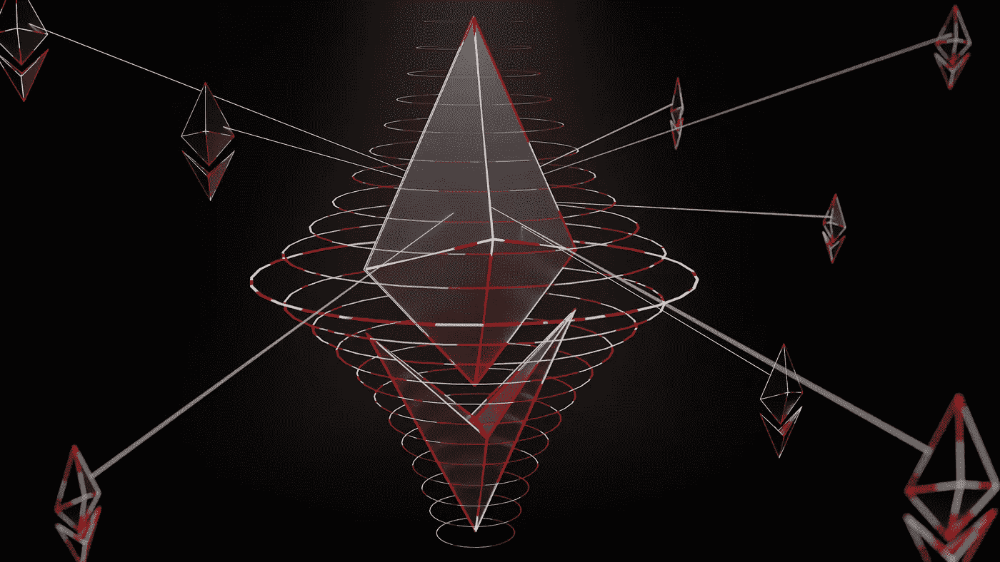
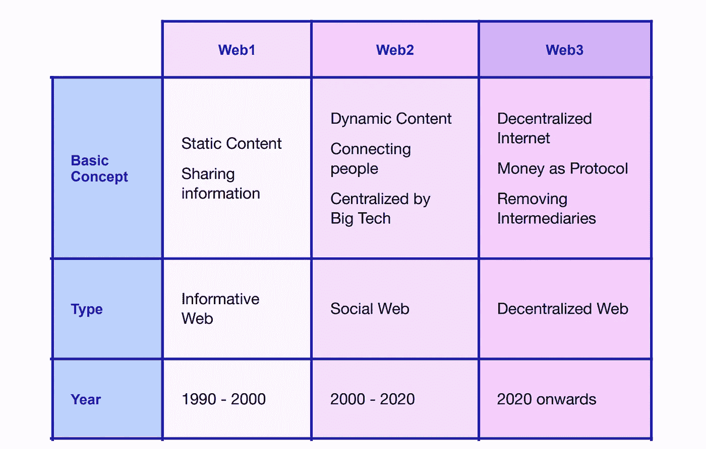
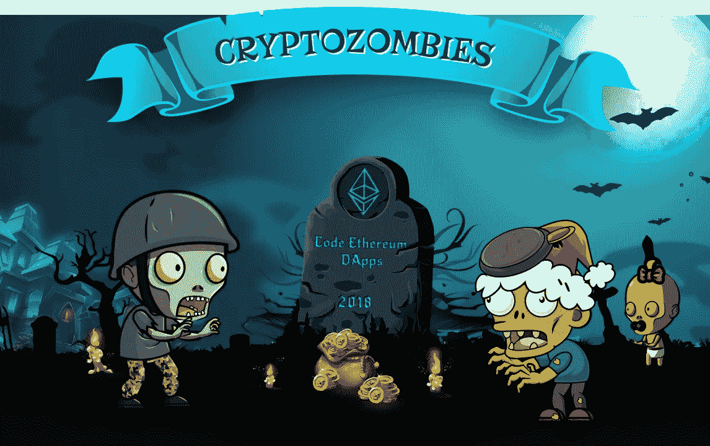
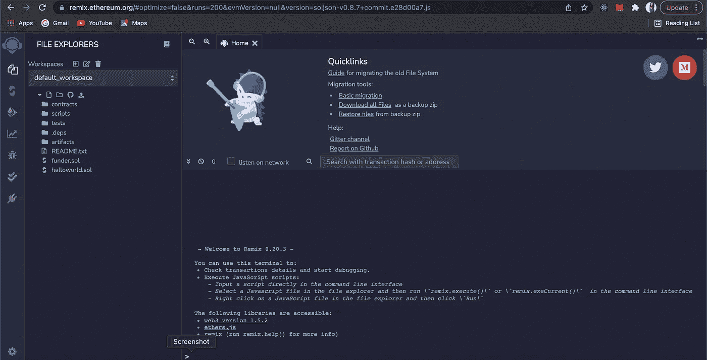
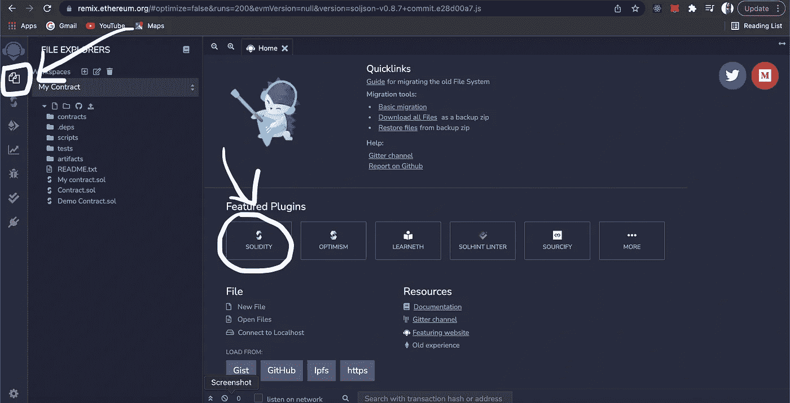
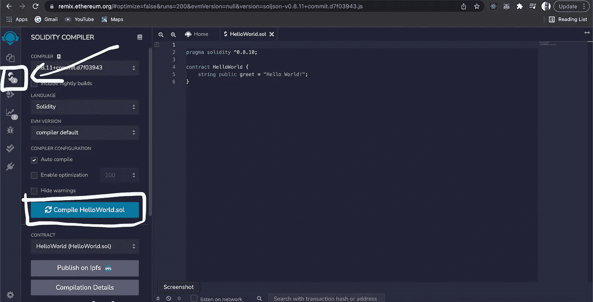
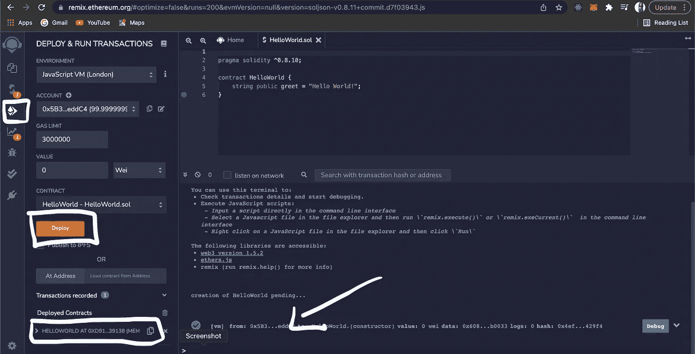
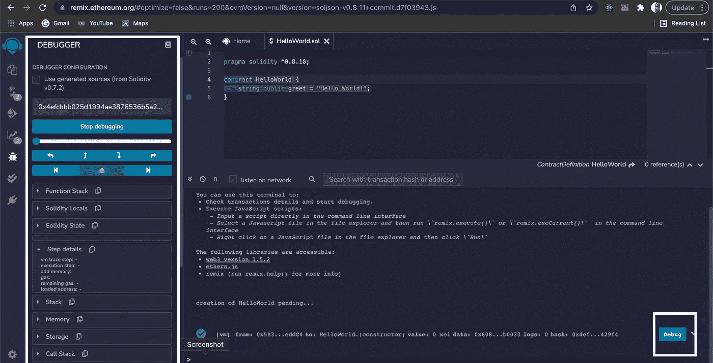
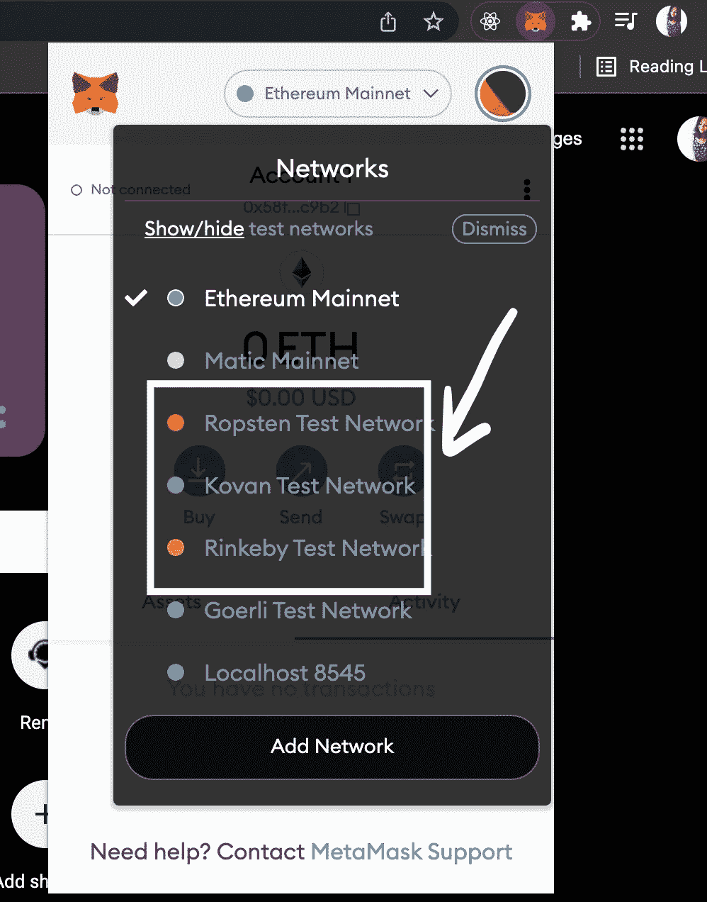

# Web.3.0 开发人员如何入门？

> 原文：<https://betterprogramming.pub/how-to-get-started-as-a-web-3-0-dev-f189747f59e2>

## 当关于 Web3 的讨论开始升温时，谁不想染指它呢？

由 [Unsplash](https://unsplash.com/@theshubhamdhage?utm_source=unsplash&utm_medium=referral&utm_content=creditCopyText) 上的 [Shubham Dhage](https://unsplash.com/@theshubhamdhage?utm_source=unsplash&utm_medium=referral&utm_content=creditCopyText) 拍摄的照片

当我写这篇文章的时候，我觉得有点傻，因为我还在试图解决这个问题，但是相信我，我会尽力帮助新的学习者。

首先，我们来了解一下什么是 Web.3.0？

Web 3.0 是一项由区块链推动的去中心化技术。众所周知，区块链技术提供了一种高效、安全的数据存储方式，从而增强了数据的完整性。web.2.0 的集中控制、数据所有权和隐私问题导致了 web.3.0 的出现。

显然，我们已经到达了一个重要的转折点，对吗？让我们看看我们是如何走到这一步的:

一个 Web3 开发者需要知道以太坊是做什么的！

在我们进入以太坊之前，我们需要了解区块链是什么，因为它是以太坊诞生的基础。了解区块链的[基本面真的很重要。](https://www.youtube.com/watch?v=qOVAbKKSH10)

## 什么是以太坊？

以太坊通常被称为继比特币之后第二受欢迎的加密货币。它是一个软件平台，为开发者提供了构建新应用的机会。以太坊通常是去中心化的，在这里，任何可以访问互联网的人都可以使用以太坊上的产品和服务。它通过强大的分散式应用程序将人们直接联系起来。 [*通过 Vitalik Buterin*](https://www.youtube.com/watch?v=gjwr-7PgpN8) 了解更多以太坊的信息

## 了解元掩码或任何其他加密钱包

Metamask 是一个浏览器扩展，用作以太坊钱包。这个钱包也用于与分散式应用程序或 dapps 进行交互。任何加密用户都将拥有这一基本技能，但作为开发人员，他们应该比普通加密用户知道得更多。它实际上是开发人员的一个很好的工具。

*   [元掩码文档](https://docs.metamask.io/guide/)
*   [设置元掩码钱包](https://www.youtube.com/watch?v=MfkqgXNPiHg)
*   [面向开发者的元掩码:一步一步构建第一个 Web3 应用](https://www.youtube.com/watch?v=9kdVAeZ7knk)

## **什么是智能合约**？

智能合约是一段代码，可以以确定的方式自动执行。智能合同代码通常在区块链上存储和执行。它们也能够存储、发送和接收资金。聪明的合同可以写得很扎实。要成为一名 Web3 开发人员，你需要知道如何构建自己的智能合约，当然，这是 solidity 发挥作用的时候。

## **现在首先让我们了解一下什么是扎实！**

Solidity 是一种面向对象的高级编程语言，用于创建区块链上自动化交易的智能合约，它旨在针对以太坊虚拟机(EVM)。除了静态类型，Solidity 还支持继承、库和复杂的用户定义类型。Solidity 类似于最常见的编程语言之一，javascript。因此，如果你有使用 javascript 的经验，扎实是很容易学会的。

回到编程，我不是粉丝。但是你应该对计算机科学的基础有很好的理解。如果扎实不是你要学的第一门语言，那就更好了。相信我，这是一个你不想犯的错误，即使你一开始就犯了，以后你可能会遇到麻烦。

*因此，如果你有兴趣探索更多关于 Solidity 编程及其概念的知识:* [Solidity Docs](https://solidity.readthedocs.org/en/latest/) 是你要去的地方。

以下是我找到的几门免费的可靠性课程:

*   [16 hrs+区块链的稳固性——freecodecamp](https://youtu.be/M576WGiDBdQ)
*   [坚固全程——吃块](https://www.youtube.com/watch?v=p3C7jljTXaA&feature=emb_title)
*   [2 小时硕士 Solidity 全课程— Dapp 大学](https://www.youtube.com/watch?v=YJ-D1RMI0T0&t=17s)

## 通过创造僵尸可以学到扎实有多酷？

来自 Cryptozombies 的屏幕截图

这是一个游戏化的编程课程，让你学习区块链的所有技术方面，同时创建自己的密码收集游戏。通过创建自己的区块链游戏，您可以在 solidity 中创建智能合约。[查看隐型僵尸，完全免费。](https://cryptozombies.io/)

## 现在我将带您了解如何开始使用 solidity 编程

首先，让我们从混音开始:

Remix 是一个基于浏览器的 IDE，允许你编写、编译和部署智能合约。除了整个合约开发过程，Remix 还充当了学习以太坊的虚拟游乐场。

让我们试试混合智能合约。

*   使用您的任何浏览器，打开 Remix IDE 并选择新建文件。选择“实体”作为环境。

*   在代码部分，输入智能协定，然后单击编译器窗口下的编译来编译它。

*   单击部署和运行事务下的部署按钮来执行代码。

*   一旦部署了代码，单击契约下拉列表中的方法调用来运行程序。

*   要进行调试，请在控制台中单击与方法调用对应的调试按钮。您也可以在 [https://etherscan.io](https://etherscan.io/) 上验证您的智能合约

## **现在让我们看看测试网是怎么回事！**

您应该知道，测试是智能合约开发中最重要的方面。正如我们所知，智能合同是不可逆的，这基本上意味着它们一旦部署就不能被编辑或撤回。

为了在 mainnet 上部署智能合约，我们需要支付一笔燃气费，这是一笔实实在在的钱。为了避免这种情况，您可以在将智能合约部署到 mainnet 之前，在 testnet 上测试它们。

目前使用的测试网有四种:

*   **Rinkeby** :一个为运行 Geth 客户端的用户提供的权威证明测试网。
*   Kovan :一个为那些运行 OpenEthereum 客户端的用户提供的权威证明测试网。
*   Ropsten: 一个工作验证测试网。这意味着它是以太坊最好的对等表示。
*   Goerli :一个基于社区的项目的跨客户端权威验证测试网。这个测试网是面向所有客户的。

## 了解安全帽！

[Hardhat](https://hardhat.org/) 是专为开发设计的下一代以太坊工具。它允许您部署合同、运行测试和调试代码。

官方标志

这个环境以不同类型的插件为特征，这意味着开发者可以选择他们想在开发过程中包含哪些插件。

它配有:

*   极度的灵活性
*   你可以自带工具。
*   完全可扩展
*   插件生态系统
*   快速迭代
*   以打字打的文件

通过这些初学者教程开始探索 Hardhat:

*   [文档](https://hardhat.org/getting-started/)
*   [安全帽 YouTube 教程](https://www.youtube.com/watch?v=9Qpi80dQsGU)

让我们结束这一切。希望这篇帖子对你有帮助。

我知道开始学习 Web3.0 和区块链开发可能会有问题，我理解这一点，因为我自己也经历过。然而，如果你专心致志，愿意花时间学习，你就能做到。