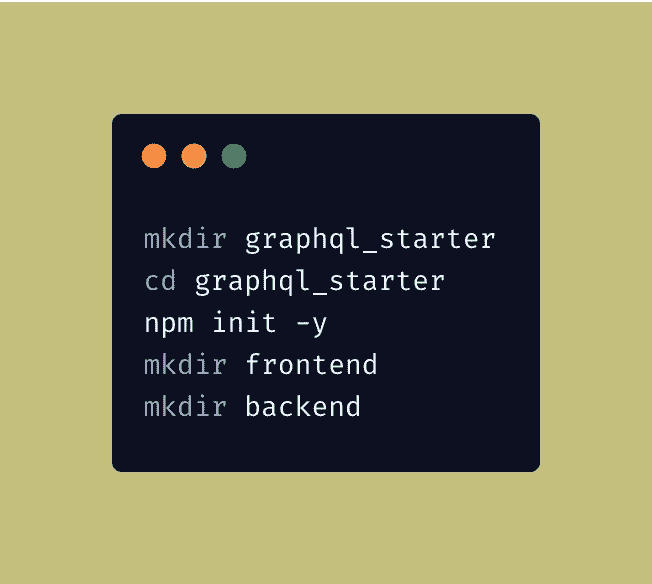
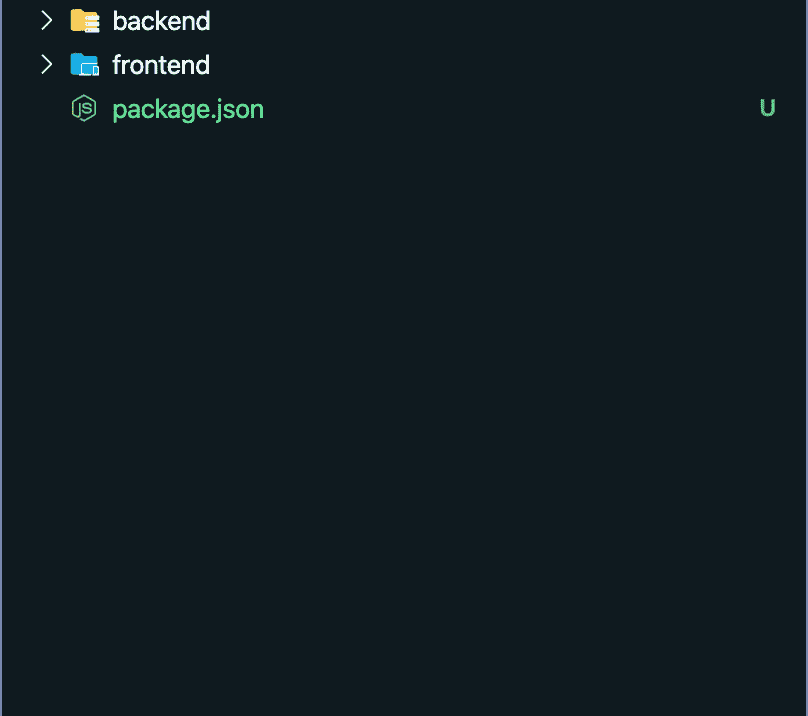
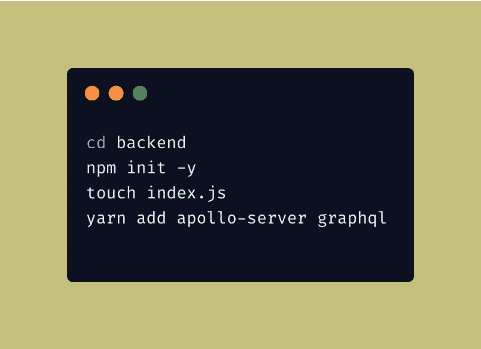
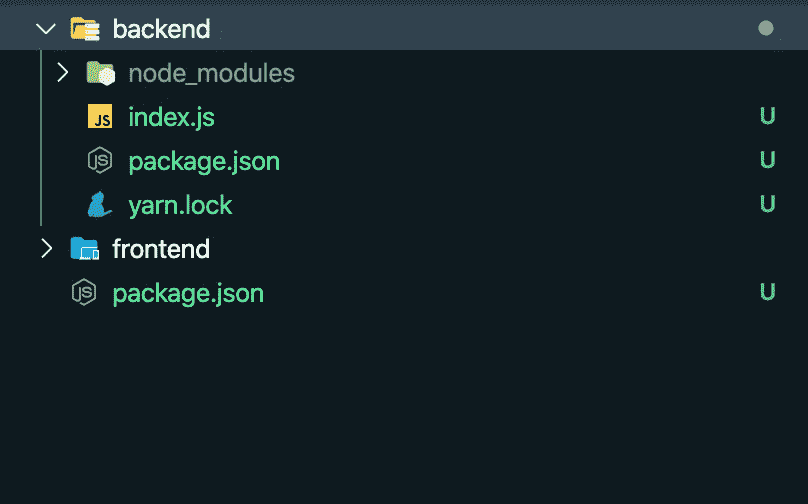
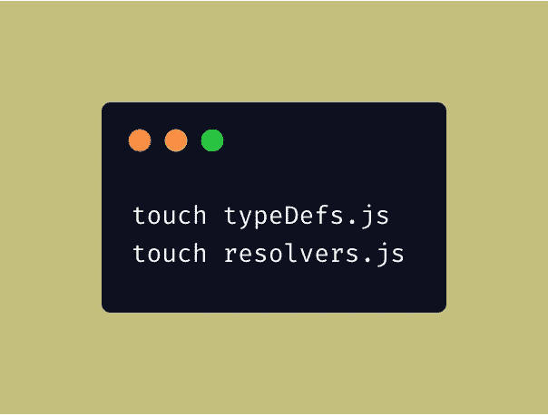
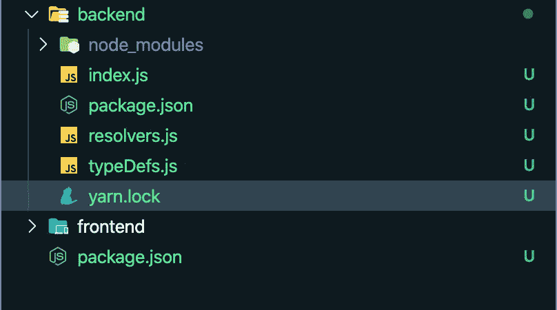
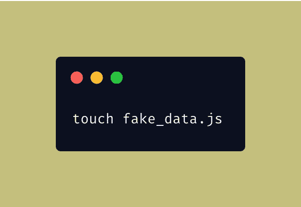
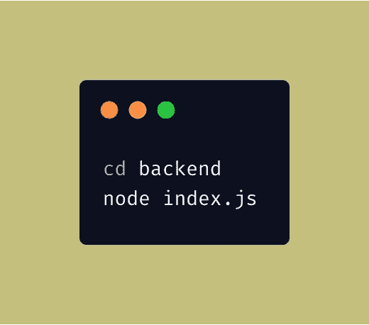
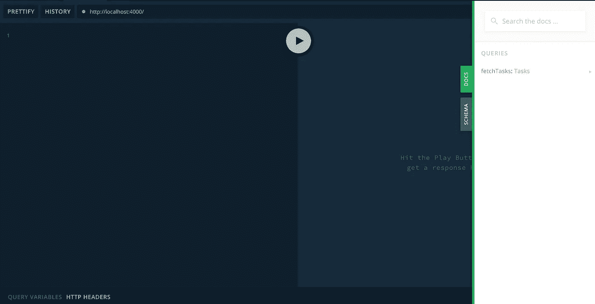
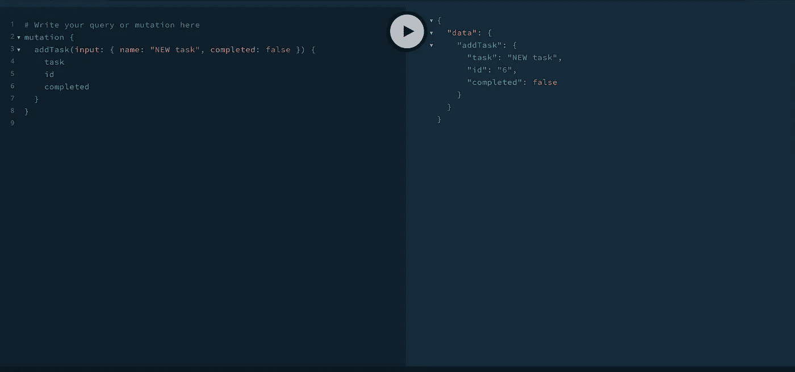

# 如何开始使用 GraphQL、React、Apollo 客户机和 Apollo 服务器应用程序(第 1 部分)

> 原文：<https://betterprogramming.pub/how-to-get-started-with-a-graphql-react-apollo-client-and-apollo-server-app-403dab1a7801>

## 构建后端服务器

卡斯帕·卡米尔·鲁宾在 [Unsplash](https://unsplash.com/s/photos/app?utm_source=unsplash&utm_medium=referral&utm_content=creditCopyText) 上的照片

这是一个由两部分组成的系列。在第一部分中，我们将了解什么是 GraphQL 以及它的一些优点。我们将使用 GraphQL 构建一个后端。

在第二部分中，我们将学习使用 [Apollo Client](https://www.apollographql.com/docs/react/v3.0-beta) 将 GraphQL 后端集成到 React 前端服务中。

GraphQL 已经存在了相当长的一段时间，我们经常认为 GraphQL 是一个复杂的东西，但实际上，GraphQL 只是服务器和客户端之间如何通过 HTTP 交换数据的规范。

它本质上是 API 的查询语言，定义了可以从服务器获取什么数据。现在，这不同于你可能在标准 API 中使用的任何东西，在标准 API 中，你有一个特定的端点来获取特定的数据。

例如，在中型 API 的情况下，我们可能有一个名为`/api/allarticles/:userId`的 API，它返回特定用户的所有文章。

现在，这种构建 API 的方式被称为 REST APIs，我们使用这种技术构建 API 已经有一段时间了。在此之前，我们有 SOAP，其中我们曾经有一个 XML 数据结构。

现在，让 GraphQL 与众不同的是它如何改进 REST 的思想。在 REST 的情况下，我们点击一个 URL 并获取一些数据。在 GraphQL 的情况下，我们可以明确地询问我们正在寻找什么，并且只获取我们想要构建特定页面的任何内容的特定子集。

# 入门指南

现在，在这个简单的介绍之后，让我们开始演示吧。在这个演示中，我们将重点关注使用 Apollo 客户端构建一个小型 React 应用程序。Apollo Client 是一个 GraphQL 客户端库，可用于所有主要的前端 JavaScript 框架。

我们将使用 [Apollo 服务器](https://www.apollographql.com/docs/apollo-server/)来构建我们的后端。本教程的所有代码都可以在 GitHub 上[获得。因此，让我们开始构建一个简单的应用程序。](https://github.com/thakursachin467/graphql-starter)

这个演示将着重于构建一个简单的应用程序，从前端的 Apollo 客户端开始，用 React.js 和 Apollo Server 构建一个轻量级的 GraphQL 后端。

让我们从建立一个简单的文件夹结构开始。为了简化本入门指南，我们将后端和前端放在同一个文件夹中。那么，我们开始吧。

基本项目设置命令

基本文件夹结构

现在，在设置了文件夹结构之后，我们将首先构建我们的后端，然后继续构建 React 前端来展示我们的数据。

# 用 Apollo GraphQL 构建后端服务

基本后端设置命令

我们后端服务的文件夹结构

现在，既然我们已经完成了初始文件夹，让我们开始写一些代码，了解一些关于 Apollo 服务器的事情。让我们直接进入我们的`index.js`文件，用基本的、最小的配置初始化我们的服务器。

索引. js

在我们继续下一步之前，让我们先分析一下到目前为止我们所写的 12 行代码，看看我们在做什么。大部分代码非常简单，除了我们看到的所谓的`typeDefs`和`resolvers`。让我们先来探究一下`typeDefs`和`resolvers`到底是什么。

每个 GraphQL 服务器都需要定义客户端可以访问的数据，并且可以通过模式来完成，这些模式存储在我们的`typeDefs`文件中。

这个模式可以有三个根操作。这三个操作是`Query`、`Mutation`和`subscription`。所有这些都有特定的目的。

`Query`通常用于获取数据库中已经存在的数据，`Mutation`用于创建或更新任何数据，`Subscription`用于监听 GraphQL 服务器生成的事件。

订阅依赖于使用发布和订阅原语来生成通知订阅的事件。

现在，我们完成了对`Query`、`Mutation`和`Subscription`的基本介绍。类似地，`resolver`本质上是一个函数或方法，它为模式中的一个字段解析一个值。

他们执行所有的任务来获取数据、创建数据、运行业务逻辑来解析客户端请求的字段。让我们来看一些例子，看看如何一起使用它们来创建我们的 GraphQL 服务器。

现在，让我们继续我们的示例应用程序。我个人更喜欢将我的`resolvers`和`typeDefs`分开，所以让我们为`resolvers`和`typeDefs`创建文件。

创建 typeDefs 和解析程序文件

创建文件后，让我们看看我们的新文件夹结构，然后我们可以开始使用`typeDefs`，因为`typeDefs`本质上就像是我们客户端的接口，基于此，我们的客户端可以向服务器请求数据。

所以，让我们从创建第一个`typeDefs`开始。

添加 typeDefs 和 resolvers 文件后的新文件夹结构

正如我前面所说的，`typeDefs`是客户端连接到我们的后端服务并请求数据的方式。让我们看看如何定义它。

typeDefs.js

在上面的例子中，我们定义了一个简单的`Query`，它帮助我们从后端获取一些数据，在我们的例子中，它是`sayHello`，它返回一种由`sayHello`查询本身定义的`String`。只需确保您对查询进行了命名，以便它们是自我声明的。

在这里，我们的`Query`名字清楚地表明了它将要做什么。由于我们已经定义了我们的`typeDefs`，我们还必须针对这个查询定义我们的`resolver`函数，它将实际解析或计算一个值。

GraphQL 做到这一点的方法是将每个`typeDefs`名称映射到每个`resolver`函数名称。在我们的例子中，我们必须用相同的名称定义`resolver`。所以，我们也这么做吧。

resolvers.js

这里，我们在`Query`中定义了`sayHello`函数，它解析为某个值。在我们这里，`hello random person`。只要确保您的`resolver`函数和`typeDefs`的返回类型匹配，否则您的查询将导致返回`null`。

现在，既然我们已经创建了我们的`typeDefs`和`resolvers`文件，我们只需要对我们的`index.js`文件做一点修改，我们就可以开始了。我们必须将我们的`resolvers`和`typeDefs`文件导入到我们的`index.js`文件中，并使用它们。

索引. js

既然我们已经介绍完了，让我们构建一个简单的待办事项列表，开始使用 GraphQL 进行 CRUD 操作。

现在，在这里，我们将不使用数据库，我们将在后端服务中以`json`对象的形式使用一个假数据库，我们可以操纵它来执行 CRUD 操作。因此，让我们创建我们的假 JSON 文件。

创建 fake_data.js 文件

我们将有三个突变来更新、创建和删除伪 JSON 文件中的数据，还有一个查询用于与数据交互和获取数据。

现在，让我们创建第一个`Query`来从我们的后端服务获取数据。姑且称之为`fetchTasks`。

我们定义了获取任务`Query`，它的返回类型为`Tasks`。现在，让我们为新添加的查询编写一个解析器函数。

我们的查询将总是返回第一个任务。在更新此行为之前，让我们先运行服务器。

运行我们的服务器

让我们导航到`http://localhost:4000/`。

当我们导航到 [http://localhost:4000/](http://localhost:4000/) 时，迎接我们的是这个 GUI。这被称为 GraphQL 操场，我们可以在这里运行我们的查询。让我们运行我们的第一个`Query`。

运行我们的第一个查询

运行第一个查询后，我们看到了结果。它从我们的后端获取数据，这些数据在我们的伪 JSON 文件中。现在，让我们给我们的函数添加一些逻辑，并从我们的客户端接受一些数据作为过滤器。

在上面的例子中，我们已经定义了与数据交互的变异和查询。我们看到的一个新东西是数据类型前面的`!`标记，这意味着这个字段是强制的，我们不能在后端执行查询或变异。

让我们为解析器添加一些逻辑，这样我们就可以与数据进行交互。解析器文件中的每个解析器函数都接收四个函数参数，并且几乎所有的 GraphQL 服务器都在解析器中接收这四个函数参数。

*   `root` —先前/父类型的结果。
*   `args` —客户端向字段提供的参数。例如，在我们的`typeDefs`中，我们有`addTask(input:addTaskInput)`，所以在这种情况下`args`将是`{input:{name:"some name",completed:false}}`。
*   `context` —提供给所有解析器的`Mutable`对象。这基本上包含身份验证、授权状态以及在解析查询时应该考虑的任何其他内容。您可以访问您的`request`对象，因此您可以应用任何中间件，并通过上下文向解析器提供该信息。
*   `info` —与查询相关的特定于字段的信息。该参数仅在高级情况下使用，但它包含有关查询执行状态的信息，包括字段名、从根到字段的路径等。

在这里，我们将主要关注`args`来访问我们的客户或游乐场发送的字段。

我们刚刚添加了一些简单的逻辑来与我们的假数据库进行交互。现在让我们看看如何通过我们的操场进行互动。

GraphQL 游乐场

我们在这里看到所有的突变和查询。让我们运行一些突变和查询，看看它是否有效。

运行 addTask 查询

我们已经用最少的配置完成了服务器的构建。

在本文的第二部分中，我们将使用 React 和 Apollo Client 来构建我们的前端客户端，并利用我们刚刚构建的 API。