# 如何开始使用 GraphQL、React、Apollo 客户机和 Apollo 服务器应用程序(第 2 部分)

> 原文：<https://betterprogramming.pub/how-to-get-started-with-a-graphql-react-apollo-client-and-apollo-server-app-part-2-ac864ff9d46e>

## 构建前端客户端

由[迪恩·普](https://unsplash.com/@wezlar11?utm_source=unsplash&utm_medium=referral&utm_content=creditCopyText)在 [Unsplash](https://unsplash.com/s/photos/front-end?utm_source=unsplash&utm_medium=referral&utm_content=creditCopyText) 上拍摄的照片

这篇博客是由两部分组成的系列文章的一部分。在第一部分[中，我们创建了后端服务器](https://medium.com/better-programming/how-to-get-started-with-a-graphql-react-apollo-client-and-apollo-server-app-403dab1a7801)。此外，你可以在 [GitHub](https://github.com/thakursachin467/graphql-starter) 上找到整个教程的代码。

在本博客系列的前一部分中，我们讨论了为什么 GraphQL 很棒，以及它如何帮助我们最小化我们下载的数据，并通过只请求我们需要的数据来使它最小化。让我们开始构建一个轻量级前端，看看我们如何使用 [Apollo Client](https://www.apollographql.com/docs/react/v3.0-beta/) 使我们的 React 应用程序更加高效。

# **设置 React-Apollo 客户端**

这里我们将使用`create-react-app`来创建我们的启动代码。`create-react-app`是开始建立 React 项目的好方法。它由 React 团队构建和维护，因此我们可以期待 React 应用程序的顶级配置。你可以在 GitHub 上查看`[create-react-app](https://github.com/facebook/create-react-app)` [。](https://github.com/facebook/create-react-app)

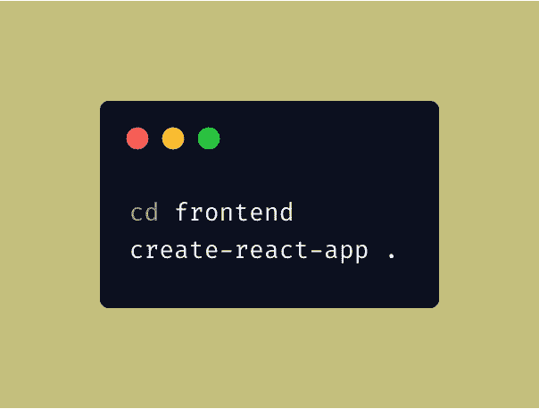

正在生成 React starter 代码

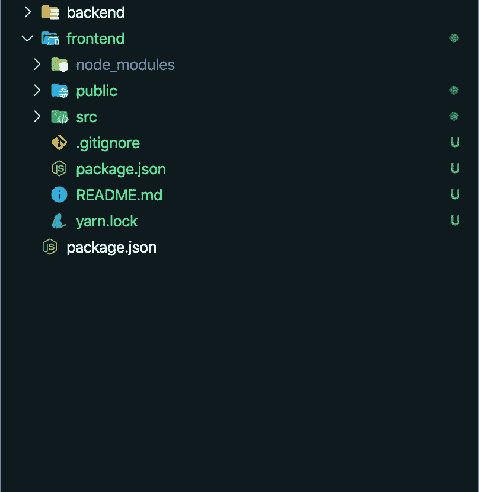

前端文件夹结构

现在我们有了基本的 React 启动代码，让我们从添加 Apollo 客户端依赖项开始。

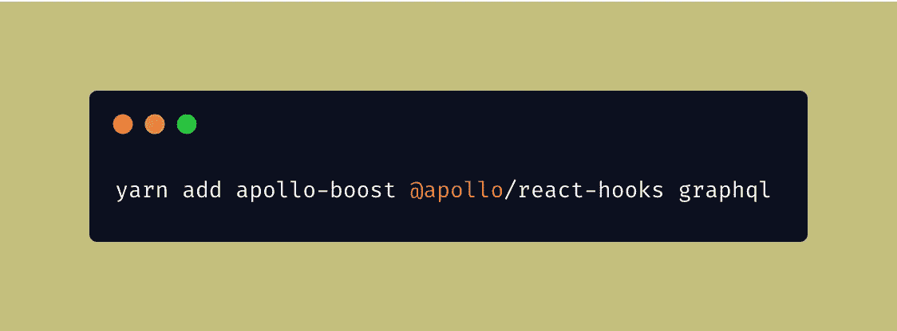

向我们的客户端添加 Apollo 依赖项

*   `apollo-boost`:包含设置 Apollo 客户端所需的一切的包
*   `@apollo/react-hooks` : React 基于钩子的视图层集成
*   `graphql`:也解析您的 GraphQL 查询

既然我们已经添加了基本的依赖项，现在我们开始设置 Apollo 客户机与服务器交互。让我们从创建我们的`apollo-client.js`文件开始。

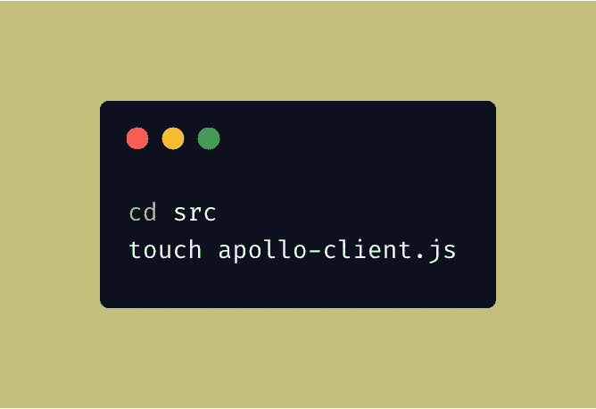

创建我们的阿波罗档案

现在让我们创建我们的 Apollo 客户机，这样我们就可以开始与我们的后端服务进行交互。

客户端给了我们很多方法，但是我们主要使用其中的两个，它们是`mutate`和`query`。

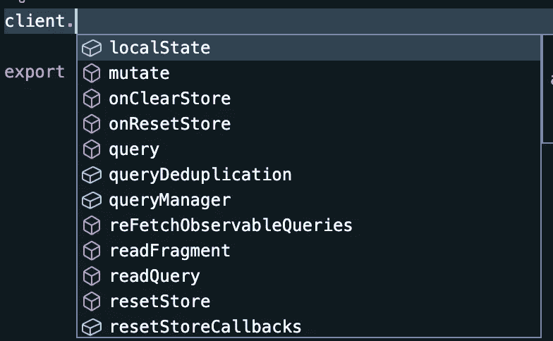

客户端中可用的方法

顾名思义，`mutate`是用来在我们的服务器上执行变异的。我们也可以使用其他方法，比如`localState`。Apollo 客户端还帮助我们维护 React 应用程序的状态，因此我们不需要 Redux 或任何其他状态管理包。我们还可以使用 Apollo 客户端包的内置缓存。

我们需要让我们的 React 应用程序访问我们的客户端可以用来构建接口的数据。为此，我们需要使用`ApolloProvider`包装整个应用程序。`ApolloProvider`类似 React 的`[Context.Provider](https://reactjs.org/docs/context.html#contextprovider)`。如果您以前使用过 React，您可能知道 React 上下文。它包装您的 React 应用程序并将客户端放在上下文中，这允许您从组件树中的任何位置访问它。在`App.js`中，让我们用一个`ApolloProvider`包装我们的 React 应用程序。

现在我们已经用`ApolloProvide`包装了整个应用程序，我们可以在应用程序的任何地方执行`Query`和`Mutation`，并访问数据。让我们看看我们能做些什么。让我们为我们的任务创建一个新文件，并在其中写入我们所有的查询。

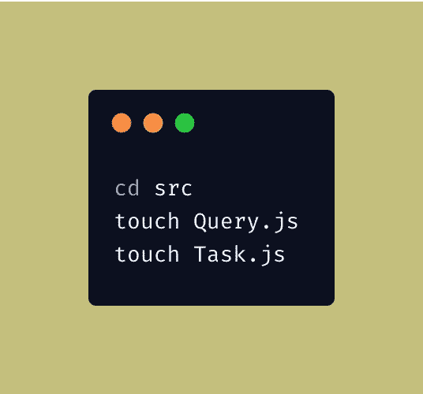

创建查询和任务文件

既然我们已经设置了 Apollo 客户端并用`ApolloProvider`包装了整个应用程序，我们就可以开始用`useQuery`钩子请求数据了。`useQuery`是一个从`@apollo/react-hooks`导出的钩子，它利用[钩子 API](https://reactjs.org/docs/hooks-intro.html) 与您的 UI 共享 GraphQL 数据。所以让我们开始吧。

首先，让我们创建包装在`gql`函数中的 GraphQL 查询。

现在我们可以在`useQuery`钩子中使用这些查询。当我们的组件渲染并且`useQuery`钩子运行时，将返回一个包含`loading`、`error`和`data`属性的结果对象。Apollo 客户端为我们跟踪错误和加载状态，这将反映在`loading`和`error`属性中。一旦我们的查询结果返回，它将被附加到`data`属性。我们可以处理来自`object`的应用程序的所有状态，这些状态是从我们的`useQuery`钩子返回的。

让我们用`useQuery`钩子创建我们的第一个组件，并获取我们的任务。

现在我们只需要将新添加的组件添加到我们的`App.js`中，这样我们就可以看到结果了。就这么办吧。

让我们启动我们的后端和前端服务，看看结果。

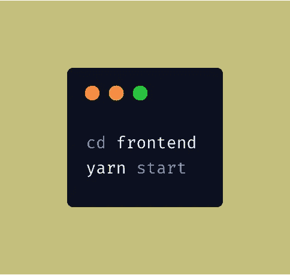

正在启动前端服务器

启动我们的后端服务

我们去`[http://localhost:3000/](http://localhost:3000/)`看看我们的 app 是什么样子的。

[http://localhost:3000/](http://localhost:3000/)

这看起来不太好，但是你明白了。我们已经设置了 Apollo 客户端，并且能够从数据库中获取数据。但是我们有一个小问题。在头版，我们是过度抓取。我们只是使用任务名称，但是我们获取所有的`id`,不管它们是否完成。这可不好。

过度抓取意味着我们在网络呼叫期间使用了更多的用户数据，我们希望节省网络带宽。在我们的例子中，几乎没有，但是对于一个大的应用程序，节省带宽意味着我们的应用程序加载更快，响应更快。这就是我们提高应用程序速度所需要的。

所以让我们解决它。我们删除了所有不必要的字段，并使我们的`queries`轻量级，以节省一些带宽。我们可以通过更新`GET_TASKS`查询来实现。

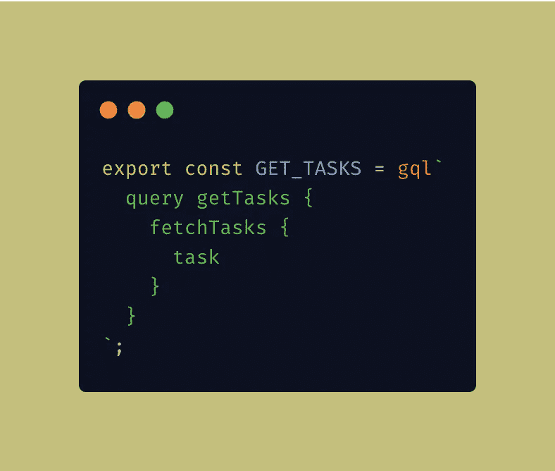

从查询中删除不必要的数据

这样做之后，如果我们回到我们的应用程序，我们会发现什么都没有改变。这就是 GraphQL 的强大之处。您可以只要求您正在使用的数据，并节省一些网络带宽。

现在让我们继续前进。我们的第二个查询将是`Mutation`，向我们的后端服务添加一些数据。让我们在`src`文件夹中创建一个新组件，将任务添加到我们的后端。

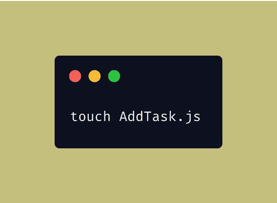

创建新组件以添加任务

我们创建组件是为了在后端创建`Task`。让我们把它添加到我们的`App.js`文件中，看看它看起来怎么样。

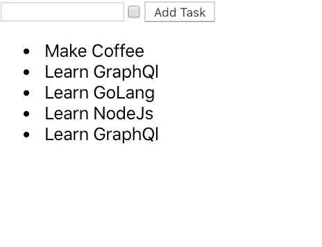

[http://localhost:3000/](http://localhost:3000/)

现在我们看到了我们的新组件。我们来添加一些任务，看看是否有效。我们添加了一个名为 Add New Task 的新任务，但只是在刷新页面之后，因为这时会发生数据的重新提取。我们可以很容易地解决这个问题，但我们应该感到高兴，因为现在我们能够在后端服务上与查询和变异进行交互。我们可以通过只请求我们的前端服务所需的数据来非常高效地做到这一点。

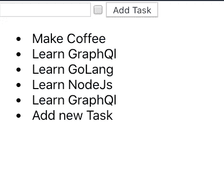

[http://localhost:3000/](http://localhost:3000/)

# 再蚀刻

Apollo Client 给我们的另一个真正有用的方法叫做`refetch`。顾名思义，如果我们觉得数据可能被更新了，我们可以再次获取一些数据。让我们看看如何使用这种方法。要使用它，我们可能需要对代码进行一些重构。但是首先，让我们看看这个方法在哪里。

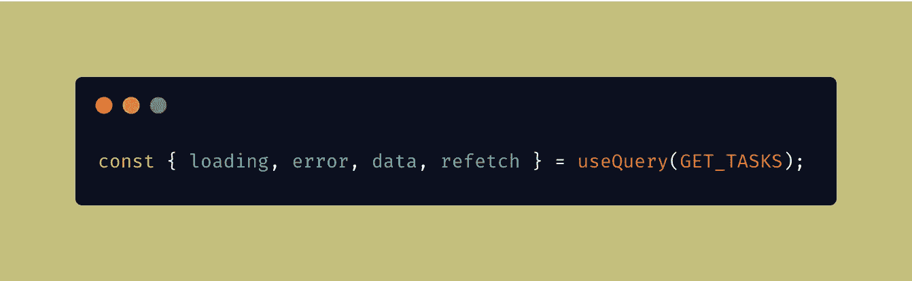

从 useQuery 中引用方法

无论我们在哪里使用`useQuery`，我们都可以使用`refetch`方法。重新提取使您能够刷新查询结果以响应特定的操作。在我们的例子中，每当我们添加新任务时，我们可以使用`refetch`方法来获取额外的任务。因此，让我们做一些重构，将状态向上移动一级，这样我们就可以将这个方法传递给`AddTask`组件来使用它。让我们创建另一个名为`TaskContainer`的组件，并在其中移动我们的`AddTask`和`Task`组件。

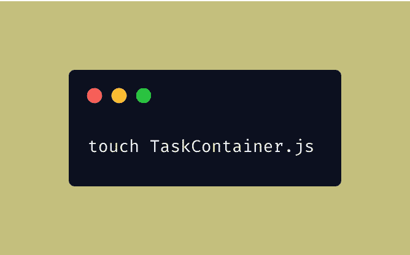

任务容器. js

现在我们已经将`Task`组件的状态向上移动了一级，我们可以将这个状态作为`props`传递给我们的`Task`组件。

我们没有改变我们的任务组件，除了现在没有本地状态，我们有来自`props`的状态。在我们的`App.js`文件中，我们只需要导入我们新创建的组件，重构就快完成了。

让我们看看如何使用我们的`refetch`方法。如您所知，我们已经将该方法传递给了`AddTask`组件，因此我们可以通过`props`访问该方法。让我们进入我们的`AddTask.js`文件，看看我们想做什么。每当我们添加一个新任务时，我们都希望重新提取所有的任务，所以在成功添加新任务后，我们可以在我们的`onSubmit` 调用中添加`refetch`方法。让我们看看那是什么样子。

# 投票

当我们回到浏览器并添加一个新任务时，我们不必刷新页面；我们在那里看到我们新添加的任务。我知道我们可以不通过网络调用用很多方法来实现，但是在这里我想展示我们从 Apollo Client 得到的方法，这些方法可以在很多其他情况下帮助我们。

除了`refetch`之外，我们还获得了轮询，在轮询中，我们可以指定在多少时间间隔之后我们希望特定的查询触发并从后端服务获取数据。轮询通过以指定的时间间隔定期执行查询来提供与服务器的近乎实时的同步。让我们看一个投票的小例子。

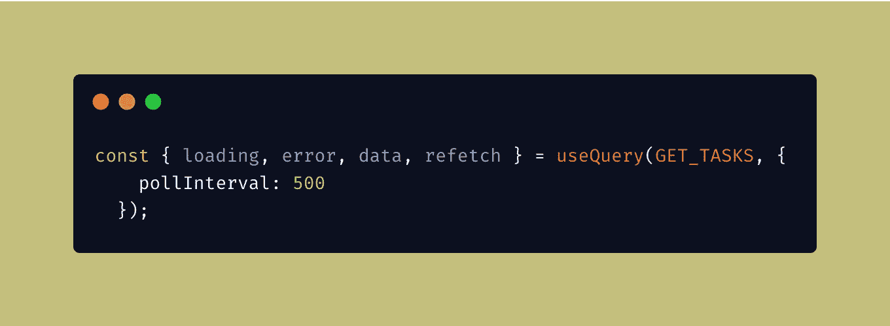

投票

通过将轮询指定为 500，我们将每隔 0.5 秒从后端服务获取任务。这些小方法在某些情况下会很方便，并且很有用。

# 提取策略

Apollo 客户端最重要的一点是它为我们提供了内置的缓存。我们可以通过指定`fetchPolicy`来指定如何从我们的后端获取数据。当您构建高响应性和快速的应用程序时，这非常有用。

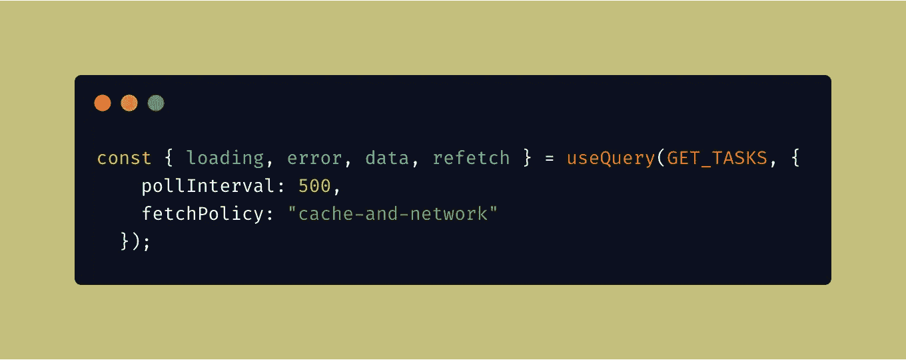

获取策略 Apollo 客户端

这允许您指定何时从服务器获取结果，以及何时从本地缓存加载数据。fetch 策略告诉 Apollo 是优先从服务器获取最新数据还是从缓存获取更快的响应。如何根据您的用例定义您的获取策略完全由您决定。

# 结论

用 GraphQL 创建一个应用程序可以给你带来很多好处。有很多很棒的库可以做到这一点，但是到目前为止，Apollo Client 是最好的库之一，它提供了很多有用的方法，在某些情况下非常有用。用 GraphQL 构建服务可以给你带来很多好处，比如节省带宽。客户对数据有更多的控制权，包括他们想要什么数据，什么数据对构建某些组件有用，什么不有用。