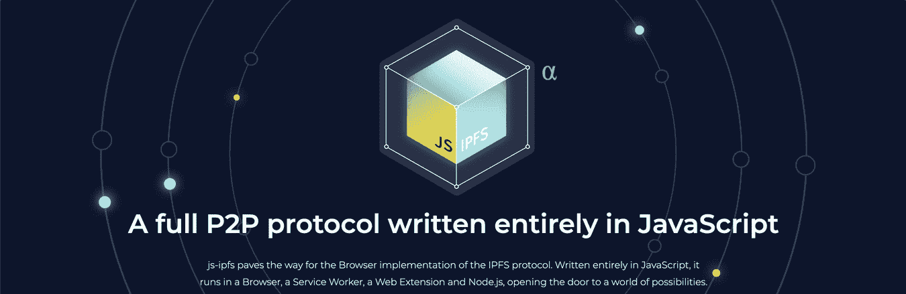
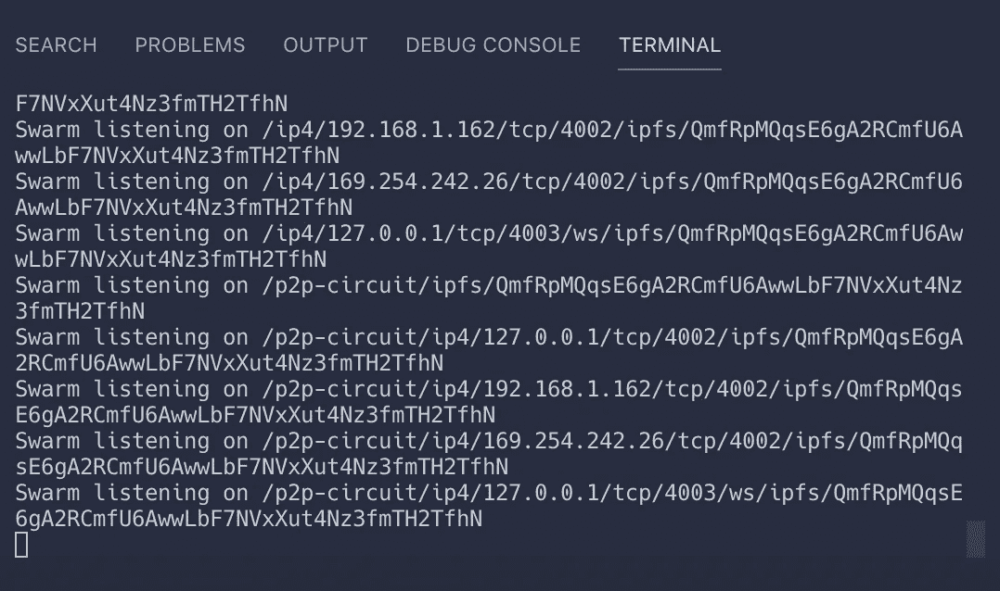
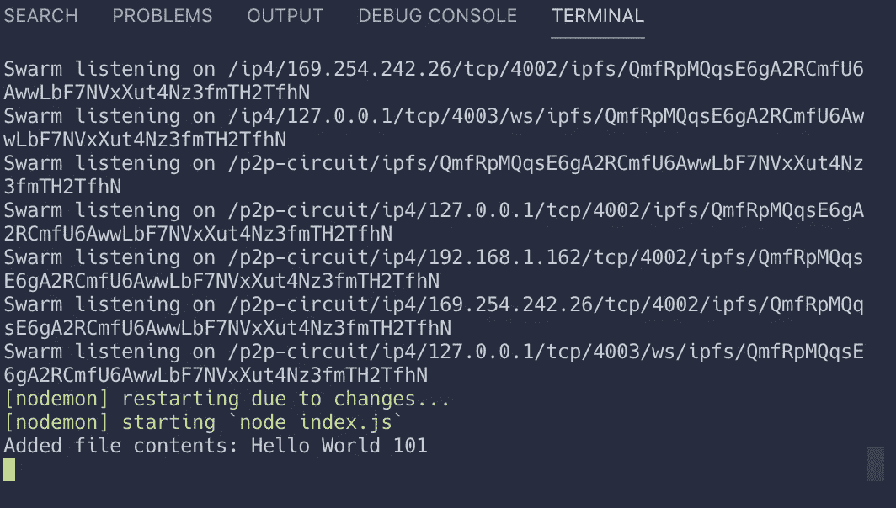
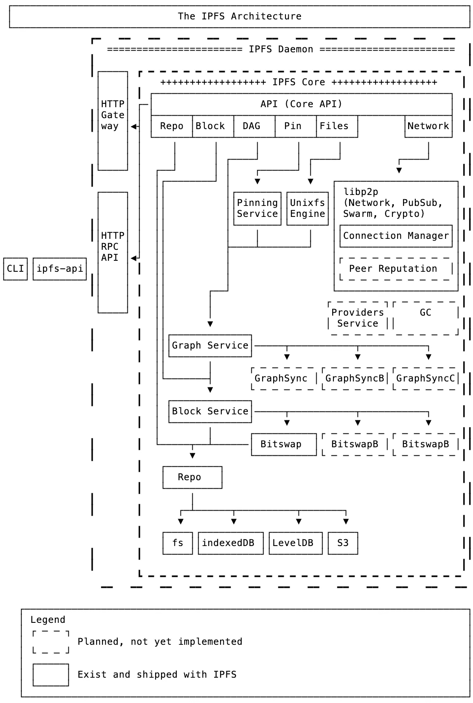
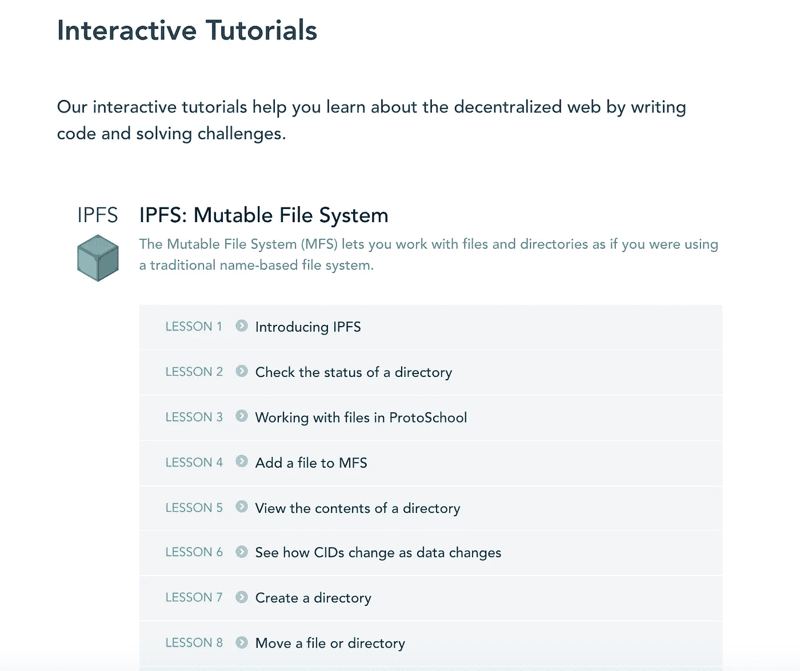

# 如何开始使用 IPFS 和节点

> 原文：<https://betterprogramming.pub/how-to-get-started-with-ipfs-and-node-fa04baec6b3a>

## 了解什么是[星际文件系统](https://en.wikipedia.org/wiki/InterPlanetary_File_System)以及如何用它存储数据



在 Node.js 和浏览器上运行 IPFS—[https://js.ipfs.io/](https://js.ipfs.io/)

IPFS ( [星际文件系统](https://github.com/ipfs/faq/issues/76))是一种新的超媒体分发协议，通过内容和身份来解决。IPFS 支持创建完全分布式的应用程序。它的目标是让网络更快、更安全、更开放。

IPFS 是一个分布式文件系统，它试图用相同的文件系统连接所有的计算设备。在某些方面，这类似于网络的最初目标，但 IPFS 实际上更类似于单个 BitTorrent 群交换 git 对象。你可以在文章[IPFS——内容寻址、版本控制、P2P 文件系统](https://github.com/ipfs/ipfs/blob/master/papers/ipfs-cap2pfs/ipfs-p2p-file-system.pdf?raw=true)中了解更多关于它的起源。

IPFS 正在成为互联网的一个重要的新子系统。如果构建得当，它可以补充或取代 HTTP。它可以补充或取代甚至更多。听起来很疯狂。它*是*疯了。

# IPFS 的现状


请注意，IPFS 是一项正在进行中的工作。这是一个雄心勃勃的计划，旨在让互联网更加自由、开放和安全，并拥有更高的性能。它建立在许多经过战斗考验的分布式系统的好主意之上。

# 入门指南

首先，我们需要安装 Node.js 和一个文本编辑器。

## 先决条件

*   文本编辑器/IDE
*   节点—请前往[官方节点网站](https://nodejs.org/en/)获取安装说明

现在我们已经安装了节点，让我们开始做饭。首先创建一个新的节点项目。

```
npm init -y
```

现在我们有了让我们安装节点模块的`package.json`文件。继续安装`ipfs`节点模块。

```
npm install ipfs
```

干得好！接下来，我们需要创建一个`index.js`文件，在其中放置我们的应用程序逻辑。

```
touch index.js
```

在`index.js`内部放置以下逻辑。

我们简单地导入了`IPFS`模块，最初我们的节点应用程序带有`main()`函数。

现在我们已经编写了样板代码，是时候实现 IPFS 代码本身了。

让我们产生一个 IPFS 节点。它看起来会像这样:

如果您使用 Node 运行这段代码，您应该会看到控制台用有关 IPFS 的消息向您发出警告:

```
node index.js
```



产卵 IPFS 节点

太棒了。这意味着一切都在按预期工作。如果您没有看到这个，请尝试再次安装`ipfs`包。

既然我们产生了一个 IPFS 节点，让我们把它投入使用。首先向 IPFS 节点添加一个文件。一旦我们添加了节点，我们就可以使用`cat`调用取回文件。

瞧啊。检查控制台上的`fileBuffer`。



就是这样！您刚刚从分布式网站添加并检索了一个文件。在这里找到源代码[。](https://github.com/indreklasn/ipfs-node-example)

 [## indreklasn/ipfs-节点-示例

### 此时您不能执行该操作。您已使用另一个标签页或窗口登录。您已在另一个选项卡中注销，或者…

github.com](https://github.com/indreklasn/ipfs-node-example) 

我们在这里仅仅触及了表面——如果你想了解更多，这里有一个完整的例子库。

[](https://github.com/ipfs/js-ipfs/tree/master/examples) [## ipfs/js-ipfs

### 在这个文件夹和 ProtoSchool 上，您可以找到各种示例来帮助您开始使用 js-ipfs。

github.com](https://github.com/ipfs/js-ipfs/tree/master/examples) 

# 了解 IPFS 堆栈

在这一部分，你会发现 IPFS 建筑不同部分的解释以及`js-ipfs`如何实现它们。



来源:[https://github . com/ipfs/js-ipfs/tree/master/examples # understanding-the-ipfs-stack](https://github.com/ipfs/js-ipfs/tree/master/examples#understanding-the-ipfs-stack)

# 快速小结

IPFS 是一种协议，它:

*   定义内容寻址文件系统
*   协调内容交付
*   结合了 Kademlia + BitTorrent + Git

IPFS 是一个文件系统，它:

*   有目录和文件
*   可挂载文件系统(通过 FUSE)

IPFS 是一张网:

*   可以用来查看像 web 这样的文档
*   可通过 HTTP 在`https://ipfs.io/<path>`访问的文件
*   浏览器或扩展可以学习直接使用`ipfs://` URL 或`dweb:/ipfs/` URI 方案
*   哈希寻址的内容保证了真实性

IPFS 是模块化的:

*   任何网络协议上的连接层
*   路由层
*   使用路由层 DHT (kademlia/coral)
*   使用基于路径的命名服务
*   使用 BitTorrent 启发的块交换

IPFS 使用加密技术:

*   加密哈希内容寻址
*   块级重复数据消除
*   文件完整性+版本控制
*   文件系统级加密+签名支持

IPFS 是 p2p:

*   全球点对点文件传输
*   完全分散的架构
*   没有中心故障点

IPFS 是一个 CDN:

*   在本地文件系统中添加一个文件，现在它对全世界都可用了
*   缓存友好(内容哈希命名)
*   基于 BitTorrent 的带宽分配

IPFS 有一个名字服务:

*   IPNS，一个受 SFS 启发的名字系统
*   基于 PKI 的全局命名空间
*   用来建立信任链
*   与其他 NSE 兼容
*   可以映射 DNS，。洋葱，。衔等交给 IPNS

# IPFS 是如何运作的

要了解更多关于 IPFS 是如何工作的，看一看[论文](https://github.com/ipfs/ipfs#ipfs-papers)或[演讲](https://github.com/ipfs/ipfs#ipfs-talks)。你也可以以书面形式探索[的规格](https://github.com/ipfs/specs)。

# 从这里去哪里

IPFS 能做的还有很多。如果你好奇想学，我建议你去浏览一下[这个免费的互动教程](https://proto.school/#/tutorials)。交互式教程通过编写代码和解决挑战来帮助你了解去中心化的网络。

[](https://proto.school/#/tutorials) [## 原型学校

### ProtoSchool 是一个教育社区，它通过在线教程和…

原始学校](https://proto.school/#/tutorials) [](https://medium.com/better-programming/2020-programming-trend-predictions-a5d6b70bec26) [## 2020 年编程趋势预测

### 预测 2020 年将出现哪些编程技术

medium.com](https://medium.com/better-programming/2020-programming-trend-predictions-a5d6b70bec26) 

免费 [IPFS 互动教程](https://proto.school/#/tutorials)

如果你想让你的 JavaScript 游戏更上一层楼，我建议你抓住“ [*你不知道的 JS*](https://www.amazon.com/gp/product/B07FK9VBD7/ref=as_li_ss_tl?ie=UTF8&keywords=you%20don%27t%20know%20js&qid=1565034043&ref_=sr_1_8&s=gateway&sr=8-8&linkCode=ll2&tag=thegeniusde07-20&linkId=a47ad7fb54700cdd883f11d015ac1dcb&language=en_US) ”系列丛书。我发现它很容易理解，也很有用。将阅读与构建结合起来，[这里有一个可以构建的有趣应用列表](https://medium.com/better-programming/the-secret-to-being-a-top-developer-is-building-things-heres-a-list-of-fun-apps-to-build-aac61ac0736c)。

[](https://medium.com/better-programming/the-secret-to-being-a-top-developer-is-building-things-heres-a-list-of-fun-apps-to-build-aac61ac0736c) [## 成为顶级开发人员的秘诀是构建东西！这里有一个有趣的应用程序列表！

medium.com](https://medium.com/better-programming/the-secret-to-being-a-top-developer-is-building-things-heres-a-list-of-fun-apps-to-build-aac61ac0736c) 

感谢您的阅读，并保持敬畏！