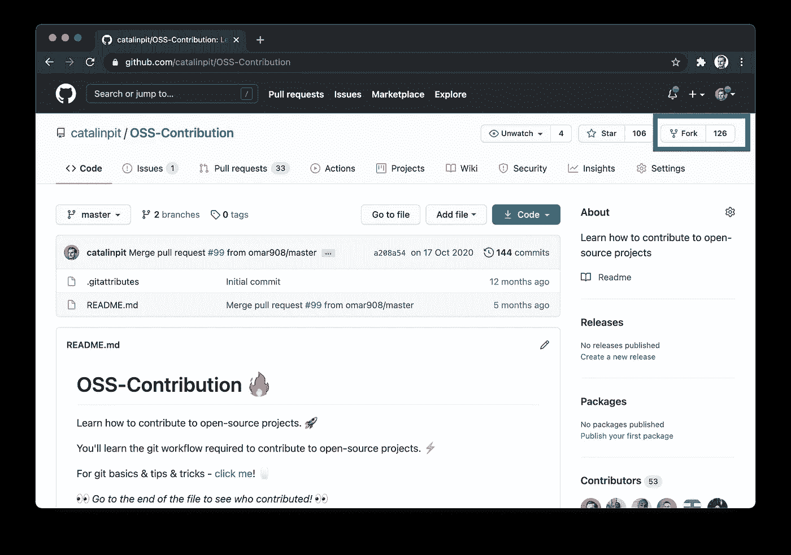
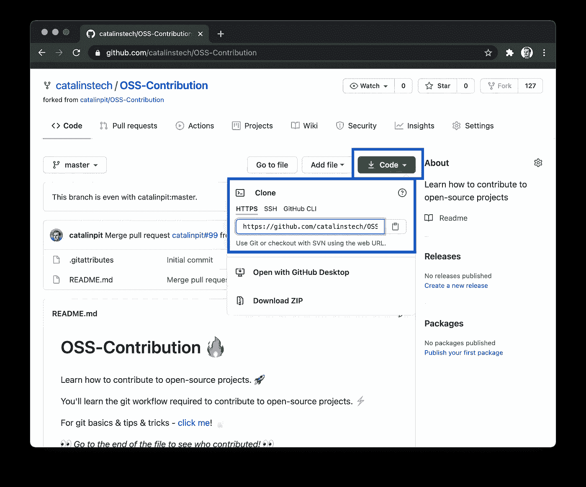
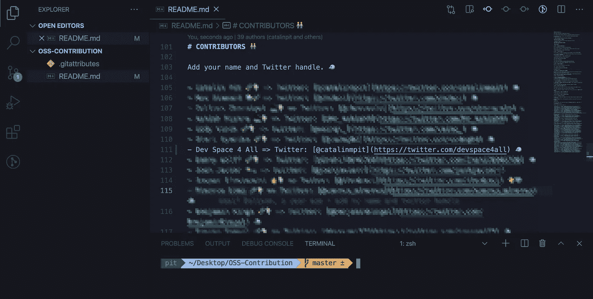
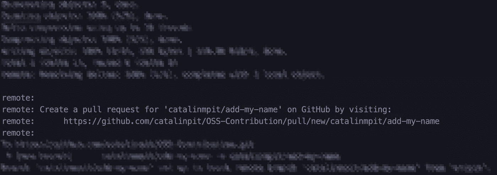
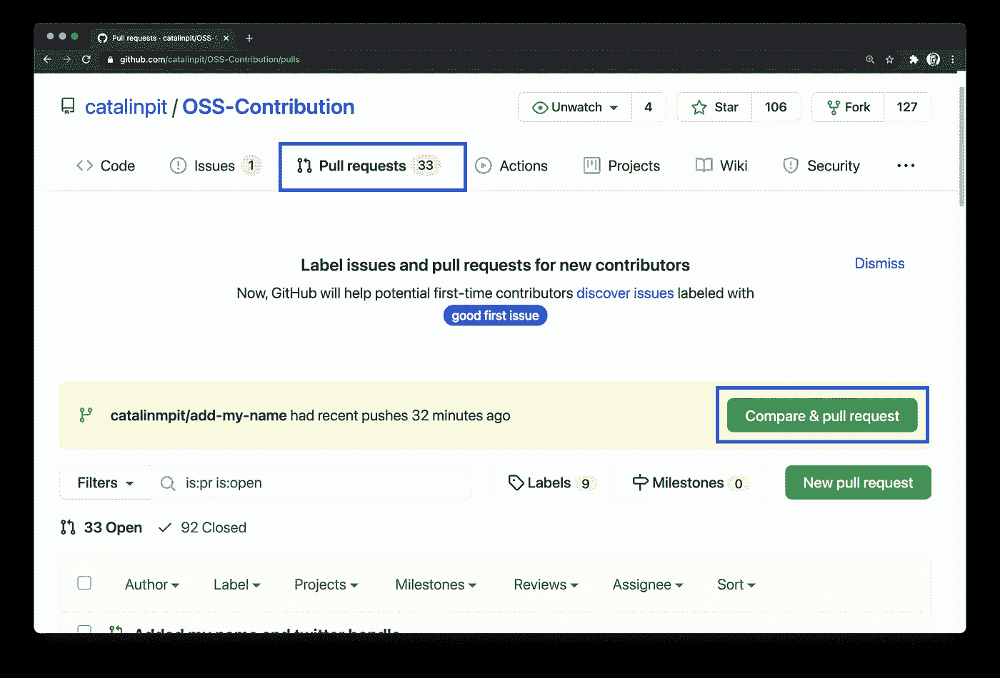
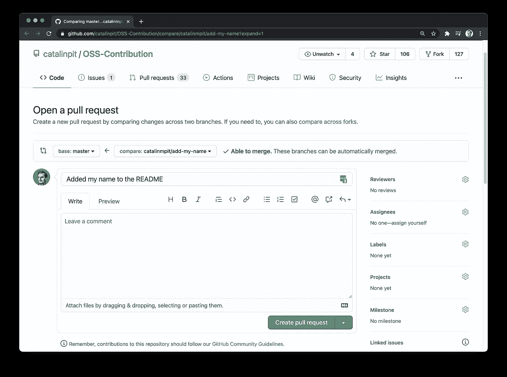

# 如何开始开源贡献

> 原文：<https://betterprogramming.pub/how-to-get-started-with-open-source-contribution-7e7479835f9b>

## *了解如何为开源项目做出贡献*


照片由[詹姆斯·哈里逊](https://unsplash.com/@jstrippa?utm_source=medium&utm_medium=referral)在 [Unsplash](https://unsplash.com?utm_source=medium&utm_medium=referral) 上拍摄

为开源项目做贡献是提高编程技能和为社区做贡献的好方法。此外，重要的是要注意，为开源项目做贡献不仅仅是编码。你可以通过其他方式做出贡献。例如，您可以:

*   组织代码
*   编写或改进文档
*   设计材料
*   审查代码

在继续之前，我建议您阅读行为准则和捐款指南。请在开始投稿前仔细阅读，因为它们解释了对你的期望。他们还描述了投稿所需的工作流程。开源指南有一篇关于这个主题的很棒的文章:[你的行为准则](https://opensource.guide/code-of-conduct/)。

你准备好做出你的第一次贡献了吗？我们开始吧！

# 1.找到一个项目

找到一个可以参与的项目是一项艰巨的任务。我建议你从小做起，先挑一个小项目。为什么？在一个小项目中，事情进展得更快，你更有可能得到你的第一份贡献。但是如果你喜欢冒险，你可以从一个更大的项目开始！

进一步说，有一些有用的网站，你可以用来找到适合初学者的项目和问题。以下是一个不完整的列表:

*   好的第一期 —这个网站很棒，因为它只包含适合第一次投稿的问题，也就是说，适合初学者。您可以通过编程语言和存储库来过滤项目。
*   [好的第一期](http://goodfirstissue.dev) —这个和上面的网站差不多。好的第一期从流行的开源项目中挑选容易的内容，并帮助你对开源做出你的第一份贡献。
*   [待价而沽](http://up-for-grabs.net) —这个网站列出了专门为新贡献者策划任务的项目。
*   [探索 GitHub](github.com/explore) —这是 GitHub 本身的探索页面。你可以找到很多项目，但你必须手动搜索适合初学者的问题。

这些网站找个项目应该绰绰有余。如果没有，你可以选择一个你日常使用的工具，如果它是开源的，你可以为之做出贡献。

# 2.基本 Git 工作流程

本文假设您对 Git 有基本的了解。您将使用的 Git 工作流如下:

1.  将存储库分支到您的 GitHub 帐户。
2.  在您的机器上克隆项目。
3.  在进行更改之前创建一个分支。
4.  做出你的改变。
5.  提交并推动您的更改。
6.  打开一个拉取请求。

上面的工作流程是最基础的，对开源项目有贡献就够了。值得注意的是，还有其他变体。但是，您将在教程中使用它。

# 3.放弃这个项目

让我们假设你找到了一个完美的项目来贡献。在本教程中，我将使用我不久前创建的[OSS-贡献](https://github.com/catalinpit/OSS-Contribution)库。



图 1

转到存储库页面，单击 Fork 按钮，如上面的图 1 所示。

**为什么先分叉不直接克隆？**当你分叉一个项目时，你在你的账户里做一个它的拷贝。因此，您可以在不影响原始存储库的情况下处理它。分叉会创建一个单独的副本，而克隆会将项目下载到您的机器上。此外，如果只是克隆存储库，则不能对其进行更改。只有经过授权的人才能进行更改。通过分叉项目，您可以进行更改并提交拉请求。

分叉完成后，它会将您重定向到项目的副本。现在是时候进入下一步了。

# 4.克隆项目

现在从你的账户克隆这个项目。转到存储库页面查找链接。



图 2

要找到分叉的存储库 URL，单击绿色代码按钮并复制 URL，如图 2 所示。

复制链接后，转到您的终端并运行以下命令(用您的命令替换 URL):

```
git clone [https://github.com/catalinstech/OSS-Contribution.git](https://github.com/catalinstech/OSS-Contribution.git)
```

等待存储库下载，然后在您喜欢的代码编辑器中打开它。

# 5.创建分支

在对代码库进行任何更改之前，创建一个新的分支是很重要的。分支允许人们在项目中工作而不会相互冲突。此外，每个分支都是独立于其他分支的，因此您的分支的更改在另一个分支中是不可见的(除非它们被合并)。

简而言之，您的分支保存了您对项目所做的更改。另外，阅读每个项目的分支命名约定。所有项目都指定了您应该如何命名您的分支。一些例子是:

*   `your_name/issue_fix`例如，catalinpit/add-name-768
*   `issue_number-issue`例如 ET182-Fix-broken-navbar

接下来，您可以创建一个新分支并切换到它，如下所示:

```
git branch <your_branch_name>git checkout <your_branch_name>
```

或者，您可以在一个命令中执行相同的操作，如下所示:

```
git checkout -b <your_branch_name>
```

现在您已经创建了一个新的分支，您已经准备好进行更改了！继续下一部分。

# 6.更改



图 3

下一步是在存储库中进行更改。我不能建议你做什么改变，因为这取决于每个库。

然而，使用我的 GitHub 示例存储库，我在`README`文件中添加了一个新的 Twitter 帐户。现在您需要提交并推动您的更改，这将在下一步中进行。

# 7.发布您的更改

第一步是将您的所有更改添加到临时区域。基本上，`add`命令会在下一次提交时包含来自特定文件的更新。它用有史以来最简单的术语指定了“发送到 GitHub”的内容。

运行以下命令之一:

```
git add .// orgit add README.md (your file name might differ)
```

`git add .`将您的所有更改添加到临时区域。例如，如果您更改了十个文件，它会添加所有这些文件。另一方面，您可以通过指定文件名来手工选择更改，如上面的第二个版本所示。它只包括您指定的文件。

## 提交您的更改

您已经将更新包含在临时区域中，但是现在您也必须提交它们。提交文件意味着将您的更新保存到本地存储库。可以把它想象成修改后保存一个 Word 文档。

```
git commit -m "Added my name to the README"
```

您可以在上面看到`git commit`命令的运行。`-m`旗代表“信息”，它允许你总结你的变化。这意味着你应该描述你在项目中做了什么。尽量使提交消息简洁明了。同时，这并不意味着你应该写一部小说。

## 推动你的改变

最后一步是*将变更推*到远程存储库。在您推送您的更改之前，它们只在您的本地存储库中可用。也就是说，除了你自己，没有人能看到它们。

要推送您的更改，请运行以下命令:

```
git push -u origin <your-branch-name>
```

您现在几乎完成了！下一步也是最后一步是创建一个拉请求，您将在下一步中看到。

# 8.打开拉取请求



图 4

假设您遵循了步骤 7 中的所有步骤。发布您的更改。您应该在终端中获得一个链接来打开一个拉请求。图 4(上图)展示了您应该在终端中看到的内容。

如果由于某种原因没有得到相同的输出，可以转到`repository URL > Pull requests tab > click on the Compare & pull request`。请参见下面的图 5。



图 5

无论您选择哪个选项，都会打开一个新窗口，您可以在其中创建拉取请求。图 6 说明了这一点。

尽管如此，还是要小心！在提交拉动请求之前，请确保您阅读了贡献指南。至少，添加一个描述性的标题和描述。



图 6

单击绿色的“创建拉动式请求”按钮，您就完成了。你要做的就是等公关评论。干得好！

## 为什么需要公关？

通过打开一个 pull 请求，您允许其他人看到您对代码库所做的更改。此外，它允许其他成员进行代码审查，这反过来可能会帮助您提高技能和代码。这样你就能得到有价值的反馈。

此外，由于各种原因，有些更改可能不会被批准，例如:

*   糟糕的代码质量
*   实施效率低下，以及许多其他问题

通过创建拉请求，您可以保护代码库免受不必要的添加。如果没有拉请求，每个人都可以将他们想要的合并到`main`分支。因此，代码质量会受到影响。

总之，拉请求帮助并允许开发人员:

*   维护高质量的代码库
*   避免引入(太多)bug(因为 PRs 也会出现这种情况)
*   获得对代码的反馈
*   提高他们的技能和代码

# 结论

很好地学习了最基本的 Git 工作流程，您可以用它来为 OSS 做出贡献。另外，如果您阅读了这篇文章，那么您的第一篇开源文章做得很好！

*如果你对 JavaScript 教程感兴趣，我推荐* [*前端大师*](https://catalins.tech/frontend-masters-membership-is-it-worth-it) *！*

*如果你想用技术写作赚钱，就去查查* [*那些付钱让你写*](https://catalins.tech/websites-that-pay-you-to-write-technical-articles) *技术文章的网站吧！*

*如果你想学习 JavaScript，我推荐这些* [*5 个资源作为初学者*](https://catalins.tech/5-best-resources-to-learn-javascript-as-a-beginner) *！*

*谈判你的工资是必不可少的——学习* [*作为一名开发者如何谈判你的工资*](https://catalins.tech/how-to-negotiate-your-salary-as-a-developer) *！*

*用* [*Git 别名*](https://catalins.tech/git-aliases-what-are-they-and-how-to-use-them) *加速你的开发。*

*如果你想以开发者的身份* [*开博*](https://catalins.tech/how-to-start-your-blog-as-a-developer) *，我推荐你阅读《* [*如何以开发者的身份开博*](https://catalins.tech/how-to-start-your-blog-as-a-developer) *》一文！*

你是否很难跟上科技领域的最新消息？参见 [*作为开发者保持最新状态的一种方法*](https://catalins.tech/one-way-to-stay-up-to-date-as-developer) *！*

*学习* [*如何在 JavaScript 中使用 Async/Await*](https://catalins.tech/how-to-use-asyncawait-in-javascript)*！*

GitHub 简介目前风靡一时。了解 [*如何创建 GitHub 个人资料页面*](https://catalins.tech/how-to-create-a-kickass-github-profile-page) *！*

*查看这 7 个* [*资源，帮你通过求职面试*](https://catalins.tech/7-github-repositories-to-help-you-crush-your-job-interviews) *！*

*查看*[*JavaScript ECMAScript 2021 es 2021*](https://catalins.tech/javascript-es2021-you-need-to-see-these-ecmascript-2021-features)*即将推出的新功能！*

*你是初学程序员吗？查看这些* [*编程项目思路适合初学者*](https://catalins.tech/10-programming-project-ideas-for-beginners) *！*

你是在学习编码还是打算做编码？查看 [*免费学习编程的最佳去处*](https://catalins.tech/20-best-places-to-learn-programming-for-free) *！*

[*借助这 9 款浏览器扩展，提高您的开发人员工作效率*](https://catalins.tech/my-9-must-have-browser-extensions-for-increased-developer-productivity) *！*

*如果你是 Node.js 的开发者，我建议你查看 Node.js* *中的这些* [*4 种创造性的设计模式！*](https://catalins.tech/the-4-creational-design-patterns-in-nodejs-you-should-know)

*查看这些惊人的*[*JavaScript ECMAScript 2020 特性*](https://catalins.tech/javascript-es2020-the-features-you-should-know) *！*