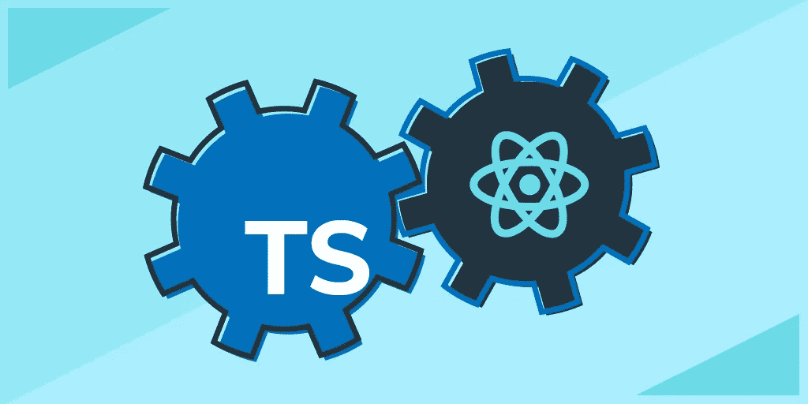
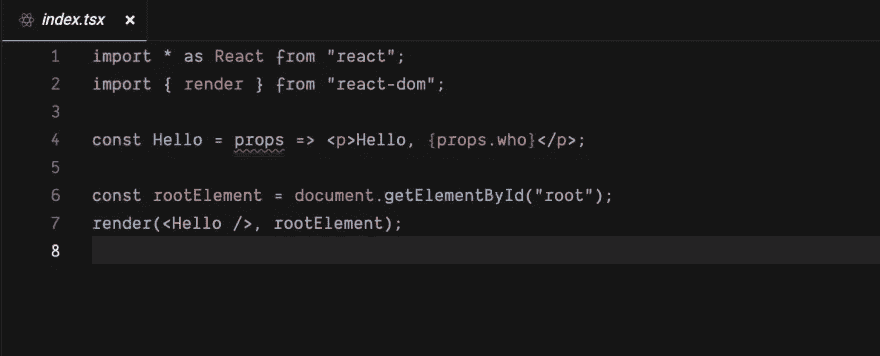
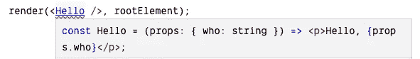
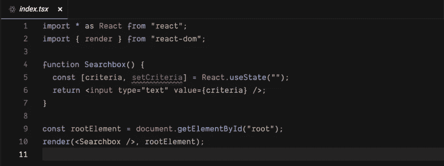
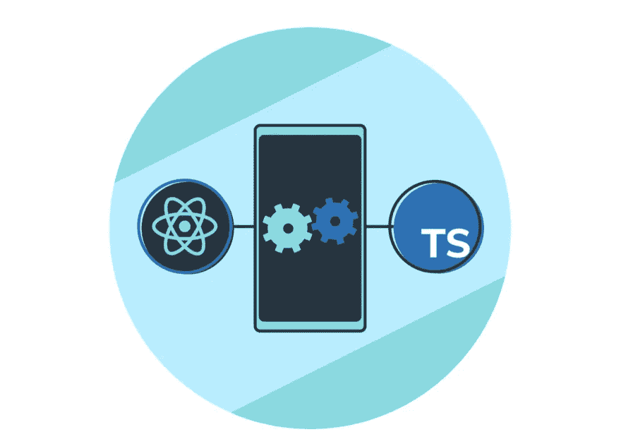

# 如何开始使用 React 和 TypeScript

> 原文：<https://betterprogramming.pub/how-to-get-started-with-react-and-typescript-9cdeaa367c0c>

## 立即构建您的第一个前端应用程序



图片来源:作者

如果您是 React 开发人员，您可能听说过 TypeScript，它是 Javascript 的静态类型超集，可以制作更快、更健壮的 React 应用程序。TypeScript 和 React 一起工作来减轻 React 的一些缺点。TypeScript 的复杂类型系统有一点学习曲线，所以今天我们想带您了解入门所需的一切。

今天我们将讨论:

*   带 React 的 TypeScript 概述
*   如何在 React 项目中使用 TypeScript
*   使用 TypeScript 创建 React 项目

# 带 React 的 TypeScript 概述

TypeScript 是 JavaScript 的超集，因此 JavaScript 的任何特性在 TypeScript 中都是可用的。但是 TypeScript 将 JavaScript 向前推进了一步，添加了一个强大的类型系统来支持代码重构、导航功能、类型检查等等。这种强大的静态类型语言本身很棒，但它也为 React 开发人员做了很多工作。事实上，许多采用 TypeScript 的 React 开发人员说他们无法想象没有它的工作。

为了在 React 中使用 TypeScript，我们需要了解 TypeScript 对我们的 JavaScript 代码做了什么。虽然需要一门完整的 TypeScript 课程来帮助您快速入门，但是让我们看看 TypeScript 为 JavaScript 代码增加了什么:

*   **类型注释:**允许我们给变量分配类型
*   **类型推断:**推断变量的数据类型
*   **`**never**`**类型:**用于表示一种永远不会出现的值的类型**
*   ****`**unknown**`**类型:**允许我们减少`any`的使用，创建更强类型的代码****
*   ******交集类型:**允许我们将现有的类型与它所基于的类型的所有成员组合成一个新的类型****
*   ******联合类型:**允许我们使用管道`|`字符组合一个新的类型形式****
*   ****用泛型使类型可重用****
*   ******强类型数组******
*   ******强类型元组******
*   ****还有更多****

# ****将 TypeScript 与 React 一起使用的好处****

****您可能还在想，“但是为什么我应该在 React 项目中使用 TypeScript 呢？”让我们来分解一下 TypeScript 的好处，展示一下它是如何让前端 React 开发变得更容易的。****

****代码建议: TypeScript 在您键入时提供建议和选项。这可以节省很多精力，并且让新开发人员更容易使用您的源代码。这些代码建议可以防止浪费时间，方便团队交流，并使您的代码库更加一致。****

******可读性和有效性:**由于 TypeScript 是一个静态类型化的系统，您可以向变量、函数和属性添加类型，从而使您的代码更易于阅读。TypeScript 还用于消除 React 的 `PropTypes`，这使得 React 开发更容易。****

******尽早捕捉错误和智能感知:**TypeScript 最受欢迎的特性之一是它能够在错误出现时立即突出显示。在运行代码之前，TypeScript 会向您显示错误，从而节省了在早期修复 bug 或错误的时间。****

******精确的代码维护和重构:**随着 React 应用程序代码库的增长，阅读、共享或维护会变得非常困难。浏览这些代码库可能会很乏味，重构代码也有风险。TypeScript 实际上帮助您重构代码并防止输入错误，使维护和更新变得容易得多，而无需改变它的任何行为。****

******改进 JavaScript 的使用:** TypeScript 与 JavaScript 完全集成，并使用 JavaScript 开发人员可用的最新特性。用 TypeScript 构建的 React 项目编译成可以在任何浏览器上运行的 JavaScript 版本。****

********

****图片来源:作者****

# ****如何将 TypeScript 与 React 一起使用****

****现在，您已经了解了什么是 TypeScript 以及为什么应该使用它，让我们更深入地了解使用 TypeScript 进行 React 开发。我将向您展示 TypeScript 提供的四个最佳特性，但是请记住，它可以从 React 做更多的事情。****

## ****1.强类型函数组件道具****

****将 TypeScript 与 React 一起使用的最大好处之一是能够使用强类型组件属性。这意味着您可以更快地知道组件传递了什么，以防止您的应用程序出错。为了向您展示这是如何做到的，让我们用一个简单的道具创建一个 React `Hello`组件。****

****看看下面的代码。****

********

****这里，`props`还没有被赋予类型，因此 TypeScript 将指定`any`类型。为了解决这个问题，我们对道具使用类型注释。这可以用常规函数和箭头函数来完成。****

****注意:在 React 中，函数组件是接受一个`props`参数来返回 JSX 的函数。****

****我们必须在代码中为 props 添加一个类型注释。这将定义一个`who`道具。这就使得`Hello`的道具类型化很强。****

```
**const Hello = (props: { who: string }) => (
  <p>Hello, {props.who}</p>
);**
```

****然而，在消耗`Hello`时仍然存在错误。****

********

****我们通过将字符串`”Mary”`传递给`Hello`来解决这个问题。****

```
**render(<Hello who="Mary" />, rootElement);
We then shorted the `Hello` component by destructuring the `props` parameter const Hello = ({ who }: { who: string }) => (
  <p>Hello, {who}</p>
);**
```

****我们还可以重构我们的`Hello`组件，使其成为一个常规函数，而不是一个箭头函数。****

```
**function Hello({ who }: Props) {
 return <p>Hello, {who}</p>;
}**
```

## ****2.功能组件的强类型上下文****

****React context 是一个允许同一个树中的几个组件共享数据的工具。这很省力，因为您不必通过 props 沿着树向下传递数据。上下文通常用于提供主题信息，例如颜色值，以便所有组件都可以访问它。让我们看看 TypeScript 如何通过推断上下文的类型来简化这一过程。****

****TypeScript 提供了强大的推断工具，即使没有指定类型信息，编译器也可以推断出类型信息。这对于强类型上下文非常有用。****

****我们首先使用 React 的`createContext`函数创建一个主题。****

```
**const defaultTheme = "white";
const ThemeContext = React.createContext(defaultTheme);**
```

****现在我们有了主题，我们创建一个提供者组件。****

****这些都是做什么的？主题值保存在状态中，因此如果它发生变化，子主题可以访问新的主题。我们还使用 React 的`useEffect`钩子来获取当前主题并更新`theme`状态值。****

****然后，我们可以创建一个自定义挂钩，允许我们的函数组件使用上下文，如下所示:****

```
**const useTheme = () => React.useContext(ThemeContext);**
```

****我们可以使用组件树中的`ThemeProvider`组件。为了让`Header`访问上下文，我们使用了`useTheme`钩子。****

```
**const Header = () => {
    const theme = useTheme();
    return (
        <div style={{backgroundColor: theme}}>Hello!</div>
    );
}**
```

****如果我们在创建时提供一个合理的缺省值，那么 React 上下文的类型就会被正确地推断出来。您可以将这个基本概念扩展到更复杂的强类型上下文或强类型类组件。****

## ****3.强类型 React 事件处理程序****

****在 React 中，交互组件用于处理事件，但是我们如何在强类型的函数组件中实现事件处理程序呢？让我们学习如何并看看 TypeScript 类型推断如何帮助我们。****

****首先，看下面的代码:****

********

****这个应用程序包含一个`input`应该允许用户输入搜索标准，但现在，用户不能输入任何东西。我们需要内联添加一个`onChange`事件处理程序来更新`criteria`状态。注意，IntelliSense 是在`e`参数上提供的。****

****在 React 中，`onChange`事件处理程序与 JavaScript 属性`onchange`是相同的，但是是驼峰式大小写。****

```
**<input
  type="text"
  value={criteria}
  onChange={e => setCriteria(e.currentTarget.value)}
/>**
```

****TypeScript 已推断出类型，使内联事件处理程序成为强类型。现在，有了这个事件处理程序，用户可以在`input`中输入标准。如果我们想创建一个命名的事件处理函数，我们必须将鼠标悬停在事件处理函数属性上，以了解函数的参数类型应该是什么。全拜 TypeScript 所赐！****

## ****4.函数组件中的强类型引用****

****React 的功能组件对于编写现代 React 应用程序至关重要。React 挂钩使得用 React 组件编写整个应用程序成为可能。使用 TypeScript，我们可以获得对函数组件中元素的强类型引用。我们来看看是怎么做的。****

****我们可以使用`useRef`钩子来访问一个元素的所有属性和方法，这个元素用于强制调用方法。看看这个例子:****

```
**const element = React.useRef(null);
// can access all the properties and methods of `element` via `element.current`...
return (
  <SomeComponent ref={element} />
);**
```

****目前，如果严格模式打开，TypeScript 将把`input.current`的类型推断为`null`，否则推断为`any`。然后，我们可以通过在`useRef`钩子中传递一个泛型类型参数来定义返回元素的类型，如下所示:****

```
**const element = React.useRef<ElementType>(null);**
```

****记住:严格模式是一个反应工具，我们可以用它来突出应用程序中的潜在问题。它对我们的代码进行检查。****

****这也可以通过使用`createRef`的类组件来完成。我们可以显式定义被动泛型类型参数返回的元素类型。这确保了引用是强类型的。****

```
**React.createRef<ElementType>();**
```

****TypeScript 可以为 React 做更多事情。一般的经验法则是尽可能使所有东西都是强类型的。这可以应用到强类型事件、类道具、类状态、带有`useState`的组件状态等等。****

********

# ****使用 TypeScript 创建 React 项目****

****使用 TypeScript 创建 React 项目有两种常见方法:使用 Create React App 或手动创建。今天，我将向您展示如何使用 Create React App 制作一个基本的 React-TypeScript 项目。****

## ****第一步。收集技术要求****

****要使用 TypeScript 设置新的 React 应用程序，您需要以下工具:****

*   ****Node.js 和 npm，你可以从[Nodejs.org](https://nodejs.org/en/download/)下载。您至少需要 5.2 版。****
*   ****代码编辑器。我推荐 Visual Studio 代码，可以从 [Code 下载。VisualStudio](https://code.visualstudio.com/)****
*   ****[创建反应 Ap](https://create-react-app.dev/docs/getting-started/) p (CRA)****

## ****第二步。设置用 TypeScript 反应****

****Create React App (CRA)是一个命令行工具，用于快速构建 React 应用程序。您可以使用`npx` 命令下载 npm 包形式的 CRA。如果您使用 create-react-app v2.1 或更高版本创建新的 React 应用程序，则 TypeScript 已经内置。因此，要用 TypeScript 建立一个新项目，只需使用`--typescript`作为参数。****

```
**npx create-react-app hello-tsx --typescript**
```

****这将创建一个名为 *my-app* 的项目，但是您可以更改名称。需要注意的是，包含 JSX 的文件应该是一个`.tsx`文件，只包含 TypeScript 代码的文件应该是一个`.ts`文件。****

****应用程序的根 HTML 文件在`public`文件夹中。它叫`index.html`。React 应用程序通过以下代码行注入到`index.html`中:****

```
**ReactDOM.render(<App />, document.getElementById('root'));**
```

****这意味着根 React 组件被称为`App`，在`App.tsx`中定义。如果您想将 TypeScript 添加到现有的 create-react-app 项目中，您需要安装 TypeScript 和任何所需的类型。查看[这个链接](https://create-react-app.dev/docs/adding-typescript/)看看是怎么做的。****

****在启动服务器之前，您需要将您的文件重命名为`.tsx`或`.ts`。这将生成`tsconfig.json`文件。****

## ****第三步。运行应用程序****

****现在您已经准备好了应用程序，您可以在开发模式下运行它。找到项目的根文件夹，在终端中运行`start` npm 脚本。****

```
**cd my-app
npm start**
```

****您的根文件夹必须与您的应用程序同名，并且包含`package.json`文件。现在，您的 React 应用程序已经准备好与 TypeScript 一起使用了！****

****现在，您已经知道了使用 TypeScript 设置 React 应用程序的基础。请记住，您也可以使用 Babel 和 Webpack 等工具手动创建项目。****

# ****向其他 React 开发人员学习****

****现在，您对什么是 TypeScript 以及它能为您的 React 项目提供什么有了基本的了解。TypeScript 可以为 React 做更多事情。它带来的轻松和简单远远超过了实现这一目标的学习曲线。****

****通过探索那些使用带有 React 的 TypeScript 的项目、文档和思考来学习。以下是值得关注的声音。****

*   ****[带有 React 和 webpack 指南的正式打字稿](https://www.typescriptlang.org/docs/handbook/react-&-webpack.html)****
*   ****[与类型脚本反应:Joe Previte 的最佳实践](https://www.sitepoint.com/react-with-typescript-best-practices/)****
*   ****[GitHub 的 TypeScript 和 React 的启动模板](https://github.com/microsoft/TypeScript-React-Starter)****