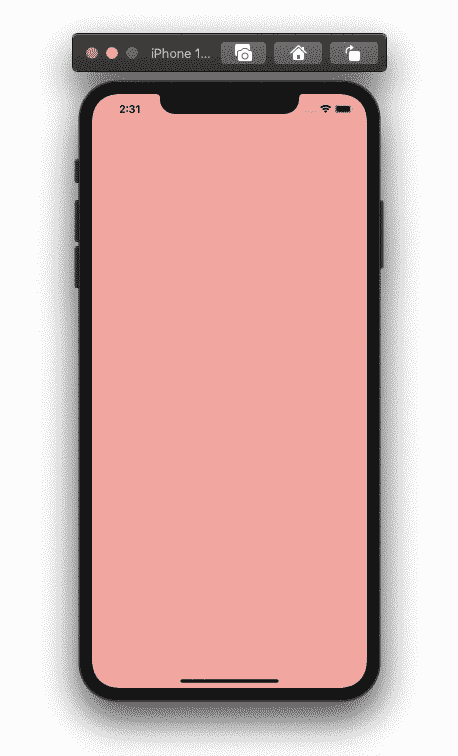

# 如何在 SwiftUI 中获取用户的滑动方向

> 原文：<https://betterprogramming.pub/how-to-get-users-swipe-direction-in-swiftui-b482a6a8771b>

## 使用拖动手势的位置来获取推送的方向

由[大卫·格兰穆金](https://unsplash.com/@davidgrdm?utm_source=medium&utm_medium=referral)在 [Unsplash](https://unsplash.com?utm_source=medium&utm_medium=referral) 拍摄的照片。

# 简单用户界面

对于 UI，让我们有一个`ZStack`包含一个颜色和文本，当滑动方向改变时，它也会改变。`Color`结构可以表现为一个视图。正因为如此，我们可以直接在我们的`ZStack`里面加上`Color.red`:

创建两个变量—一个用于颜色，一个用于文本。在我们的`ZStack`中，添加我们的`color`变量和一个接受方向字符串变量的`Text`视图。使用`.edgesIgnoringSafeArea(.all)`用我们选择的颜色覆盖整个屏幕:

# 拖拽手势

再创建两个变量。第一个变量用于保存拖动的开始位置，而第二个变量是一个布尔值，用于检测滑动动作的开始。给我们的`ZStack`加一个`DragGesture`。我们将同时需要`.onChanged`和`.onEnded`:

在`.onChanged`中，将我们的`startPos`变量赋给手势位置值。现在，我们的`startPos`将存储在我们的`ZStack`上检测到的每个拖动手势事件的位置:

在`.onEnded`内部，计算我们的`startPos` x 坐标值和结束手势 x 坐标值之差的绝对值。然后，计算 y 坐标的相同值。现在，我们需要添加以下四个条件:

*   如果开始位置的 y 坐标值小于结束手势的 y 坐标值，并且如果 y 坐标之间的距离大于 x 坐标之间的距离，则滑动方向是向下的。
*   如果开始位置的 y 坐标值大于结束手势的 y 坐标值，并且如果 y 坐标之间的距离大于 x 坐标之间的距离，则滑动方向向上。
*   如果开始位置的 x 坐标值大于结束手势的 x 坐标值，并且如果 x 坐标之间的距离大于 y 坐标之间的距离，则滑动方向为左。
*   最后，如果开始位置的 x 坐标值小于结束手势的 x 坐标值，并且如果 x 坐标之间的距离大于 y 坐标之间的距离，则滑动方向是正确的。

SwiftUI 中的滑动方向

全部完成！感谢您的阅读。