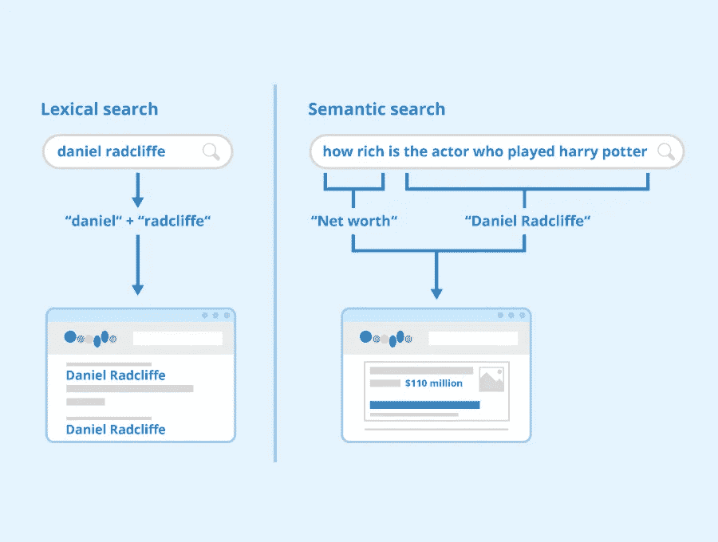
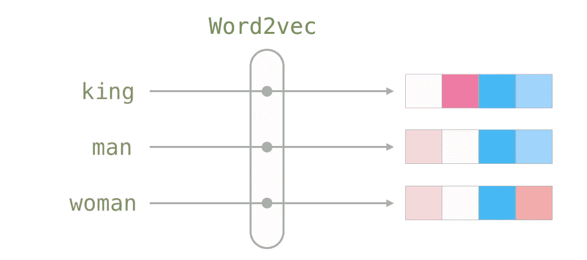
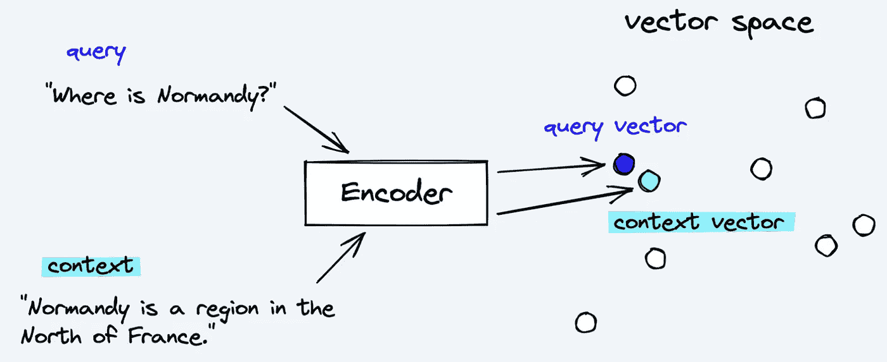
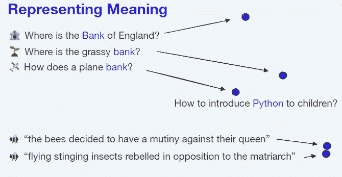
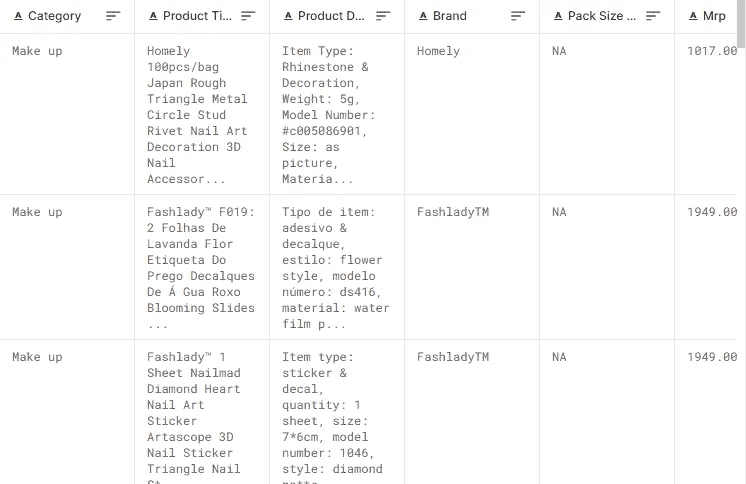
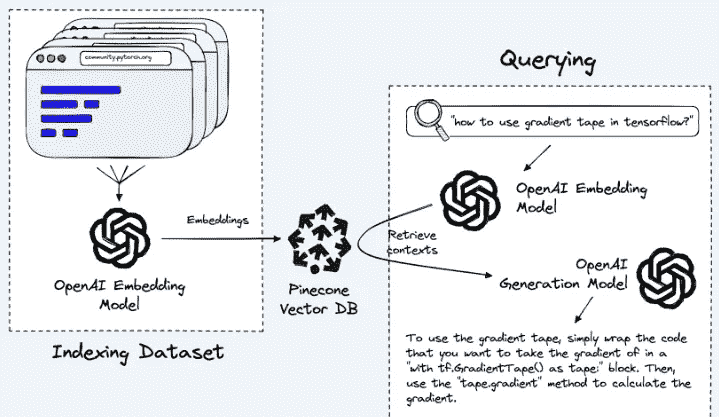

# 使用 GPT 3 优化你的聊天机器人的对话智能

> 原文：<https://betterprogramming.pub/how-to-give-your-chatbot-the-power-of-neural-search-with-openai-ebcff5194170>

## 用 OpenAI 赋予你的聊天机器人语义搜索的能力


图片由作者提供，通过稳定扩散生成。原始提示:“关于向量嵌入和语义搜索的示例”

几周前，OpenAI 推出了它的最新产品——[chat GPT](https://openai.com/blog/chatgpt/)，由于其强大的自然语言理解能力和以对话方式无缝回答任何问题或任务的能力，它席卷了整个世界。它所拥有的知识的深度和广度令人震惊，它的持续发展肯定会对对话式人工智能的未来产生重大影响。

然而，它远非完美。它有自己的局限性，正如作者所指出的:

*   ChatGPT 仍然易受幻觉和虚构的影响，有时会写出听似合理但不正确或无意义的答案。
*   该模型频繁使用过多的动词和重复的短语，例如不断提醒用户这是由 OpenAI 训练的语言模型。这些问题源于训练数据中存在的偏差。
*   它的知识库是静态的，最新的新闻和信息需要更新和重新培训，这需要大量额外的计算。由于该模型于 2022 年初完成训练，其训练数据仅包含截至 2021 年的信息。


有趣的是，向 ChatGPT 询问最新事件会告诉你，它只知道截至 2021 年的信息。自我意识很强吗？

因此，在本文中，我将向您展示如何克服这些挑战，并扩展这些 GPT 模型或任何聊天机器人应用程序的知识库。

我们可以通过使用语义搜索将聊天机器人与特定领域的知识库嵌入相集成来实现这一点。

## 承认

如果没有 OpenAI 和 Pinecone 举办的名为“超越语义搜索的 T2”的精彩网络研讨会，这篇文章是不可能发表的。许多解释性的图片和代码都来自他们的公共[回购](https://github.com/pinecone-io/examples/tree/master/integrations/openai/beyond_search_webinar)，所以大声喊出来，Pinecone & OpenAI 免费分享他们有用的知识&专长！

## 嵌入？语义…什么？

我知道你在想什么，但是请耐心听我解释这些复杂的话题。语义(或神经)搜索是一种用于机器学习和 NLP 的数据搜索方法，广泛应用于推荐系统和信息检索领域。

但是语义到底是什么呢？嗯，指的是对意义本身的哲学研究(另一个时间的话题 lol)。

它本质上是一种技术，允许你搜索带有*含义的文本，*而不仅仅是关键字匹配。



**图:** [语义搜索](https://www.seobility.net/en/wiki/Semantic_Search) —作者:Seobility—License:[CC BY-SA 4.0](https://www.seobility.net/en/wiki/Creative_Commons_License_BY-SA_4.0)

**语义搜索**允许计算机理解单词和短语的含义和上下文，以便为用户的查询提供更准确和相关的结果。

事实上，它为整个互联网本身奠定了基础。今天的搜索引擎是建立在语义搜索之上的，自 2013 年以来，谷歌已经逐渐发展成为一个 100%语义搜索引擎。

> 如果相似性搜索是一家市值 1.65 万亿美元的公司——世界上第五大最有价值的公司——成功的核心，那么它很有可能值得我们进一步了解——詹姆斯·布里格斯

但是它是如何工作的呢？机器如何理解“意义”，一个我们人类自己都难以理解的概念？这就是嵌入的用武之地！

**嵌入**简而言之，是将文本表示为一列实数值，称为向量。它是语义空间中文本的数学表示，基本上是一种将自然语言映射为计算机可以理解的数字的方法。一般来说，使用嵌入的目标是创建一种表示，它捕获数据的固有结构，同时还允许机器学习算法进行简单的操作和分析。

嵌入首先被引入来表示单词，并被称为**单词嵌入** ( [word2vec](https://code.google.com/archive/p/word2vec/) )。这种技术已经发展到可以表示整个句子、主题、文档和其他语言单位。



**图** : [图文并茂 word 2 vec—作者:Jay Alammar](https://jalammar.github.io/illustrated-word2vec/)



嵌入是将文本编码成向量的结果。**来源** : [超越语义搜索网上研讨会](https://www.youtube.com/watch?v=HtI9easWtAA)

语义空间被称为“语义的”,因为它捕获了单词或短语的含义，并且它被称为“空间”,因为向量被排列在多维坐标系统中，其中语义相似的单词/短语在欧几里得空间中彼此更靠近。



意义密切相关的文本将在嵌入空间内更紧密地聚集在一起。

通过将单词或短语表示为这个空间中的向量，计算机可以有趣地执行数学运算，如加法和减法，以比较和操纵它们的含义。这可以实现更准确和高效的自然语言处理，从而提高各种基于语言的任务的性能。

为了说明计算机如何通过对文本进行数学运算来提取语义信息，我们可以使用 NLP 中著名的“King-Queen”示例:

> [国王]—[男人]+[女人]~ =[女王]

这意味着，如果你从单词“king”中减去单词“man”的嵌入，再加上单词“woman”的嵌入，结果将是一个与单词“queen”非常相似的嵌入。这是可能的，因为语义空间捕捉单词之间的含义和关系，允许对它们的嵌入执行数学运算，以操纵和比较它们的含义。

## 你为什么要在乎？

在这个人工智能时代，将语义搜索技术集成到您的聊天机器人中对于有效和准确地响应用户查询至关重要。语义搜索是一种令人难以置信的强大技术，它允许计算机理解口语或书面语的含义和上下文，使它们能够为用户查询提供更相关和更有帮助的结果。

此外，您可以使用您现有的知识库作为您的虚拟代理的真实的基础来源。在我的项目页面上，我已经描述了【RingCentral 的聊天机器人如何利用语义搜索作为其默认的后备意图，并且结果非常好！通过将语义搜索整合到您的聊天机器人中，您可以提高其性能并使其更加用户友好，从而帮助它更好地满足您客户的需求。

我希望这能对什么是嵌入以及如何在语义搜索中使用嵌入给出一个直观的想法和视角。现在我们已经解决了这个问题，开始构建我们的智能语义搜索聊天机器人吧！

# 入门指南

除了 Dall-E 和 GPT-3，你知道 OpenAI 还提供了一个[嵌入式 API](https://beta.openai.com/docs/guides/embeddings) 吗？事实上，他们刚刚发布了嵌入式端点的[更新版本！](https://openai.com/blog/new-and-improved-embedding-model/)

让我们通过学习如何在我们的对话助手中利用语义搜索来探索它。

本指南的主要目的是演示如何使用嵌入来扩展你的机器人的知识。目前有两种主要方法可以将您的知识库扩展到 GPT 模型:

1.  微调——我已经在之前的[帖子](/how-to-finetune-gpt-3-finetuning-our-virtual-mental-health-assistant-641c1f3b1ef3)中解释过了。直截了当的方法，但是除了最初的快速工程之外，您无法控制模型响应。
2.  嵌入——扩展模型特定领域知识的更好方法，允许对生成的模型输出有更多的灵活性和控制。

# 数据集

为了证明这一点，我们将创建一个有用的电子商务聊天助手。实现这一目标的第一步是准备将用作机器人知识库的数据。

在这个任务中，我选择了 PromptCloud 的[亚马逊印度产品数据集来模拟我们的代理将使用的特定领域知识库。下载](https://data.world/promptcloud/product-listing-from-amazon-india) [CSV 文件](https://drive.google.com/file/d/1bGqFXD0ft98Q985A8eJ23m-bR6mcDnuC/view?usp=sharing)并上传到您的 Google Drive，这样我们就可以浏览我们的 [Colab 笔记本](https://colab.research.google.com/drive/1Vr1JOV57zt5JXQbDwPSfdEk6c4L5Zot6?usp=sharing)中的数据。



查看数据，我们看到它有各种产品列，但我们最感兴趣的是产品标题、产品描述、类别、品牌、价格和可用性。

我们可以使用这些列作为我们的文本数据源来创建我们的嵌入。但是在此之前，我们需要连接所需的列，以便将所有文本放在一个地方，并将其添加到名为“text”的新列中

```
data['text'] = "Category: " + data.Category + "; Product Title: " + data["Product Title"] + "; Product Description: " + data["Product Description"] + "; Brand: " + data.Brand + "; Price: " + data.Price + "; Stock Availability: " + data["Stock Availibility"]
```

这是 OpenAI 嵌入所需的数据格式。现在我们可以开始创建它们了。

# 创建嵌入

要选择嵌入的大小，这取决于您的用例的特定需求。

成本更高的更大、更复杂的模型将能够生成粒度更高的语义空间，允许更精确和细微地表示文本之间的意义和关系。

对于这个演示，我使用了“巴贝奇”模型，它的矢量嵌入有 2048 个维度。我们可以使用`openai` Python 包来创建嵌入，你所需要的只是你的 OpenAI API 密钥。

```
openai.api_key = "<API_KEY>"

size = 'babbage'

from openai.embeddings_utils import get_embedding

data['embeddings'] = data.text.apply(lambda x: get_embedding(x, engine=f'text-search-{size}-doc-001'))
data.head()
```

就这样，我们现在有了我们的嵌入！让我们导出包含嵌入的数据集，并将其下载为一个 parquet 文件。点击阅读更多关于使用拼花文件格式[的好处。](https://towardsdatascience.com/a-parquet-file-is-all-you-need-962df86886bb#:~:text=In%20Parquet%2C%20files%20are%20compressed,scanned%20and%20extracted%20much%20faster.)

# 选择矢量数据库

现在我们有了文本嵌入，我们需要在使用它们之前能够存储它们。输入向量数据库。

**矢量数据库**是一种为存储和查询矢量而优化的数据库。那么，如何选择向量数据库呢？

有两种选择—使用自托管开源矢量数据库或托管云数据库。Hackernoon 在[上有一篇很棒的文章，介绍了矢量数据库的前景](https://hackernoon.com/navigating-the-vector-database-landscape)。但是他们错过了一个重要的竞争者——Redis。是的，Redis 有自己的[矢量数据库产品](https://redis.com/blog/rediscover-redis-for-vector-similarity-search/)，你可能会考虑它，因为你的组织很可能已经在使用 Redis 了。

对于这个演示，我使用了 [Pinecone.io](https://pinecone.io) ，因为它易于使用，并且只需使用一个 API 键就可以在笔记本上快速启动。前往 Pinecone 获取您的免费 API 密钥，然后我们可以继续创建和索引我们的矢量数据库。

```
index_name = 'amzn-semantic-search'

if not index_name in pinecone.list_indexes():
    pinecone.create_index(
        index_name, dimension=len(df['embeddings'].tolist()[0]),
        metric='cosine'
    )

index = pinecone.Index(index_name)
```

注意，我们使用“余弦相似度”作为相似文本的评分标准。然后，我们可以指定一个批量大小，将我们的嵌入批量插入到我们新创建的松果索引中。

```
from tqdm.auto import tqdm

batch_size = 32

for i in tqdm(range(0, len(df), batch_size)):
    i_end = min(i+batch_size, len(df))
    df_slice = df.iloc[i:i_end]
    to_upsert = [
        (
            row['id'],
            row['embeddings'].tolist(),
            {
                'Category': row['Category'],
                'Price': row['Price'],
                'Brand': row['Brand'],
                'Stock Availibility': row['Stock Availibility'],
                'Image Urls': row['Image Urls'],
                'n_tokens': row['n_tokens']
            }
        ) for _, row in df_slice.iterrows()
    ]
    index.upsert(vectors=to_upsert)
```

还要注意，除了嵌入之外，我们还可以在我们的行中包含额外的元数据，以便实现更健壮的搜索和过滤。恭喜你，你已经索引了你的第一个向量数据库！

我们现在可以使用它来搜索我们想要的关于数据集的任何内容。向向量数据库查询任何文本都将从嵌入的数据集中返回语义最相似的行。然后，我们可以将搜索结果用作对话助手的上下文。



奇迹发生的地方

# 灵光一现。

像 GPT-3 这样的生成模型已经在人工智能/人工智能领域引起了很多关注，然而，它们在对话式人工智能领域的采用仍然相对有限。

这可以归因于人们对 LLM 及其在生产就绪的面向客户的环境中的使用的怀疑，担心这些模型会产生不可预测的输出。

这些担忧是有道理的，然而，当前聊天机器人的意图驱动开发范式被打破了。如今的组织根本没有时间和数据来使用意图构建实际有效的智能聊天机器人。Botpress 的首席执行官发表了一篇关于这个主题的深刻文章，标题是— [聊天机器人会不负众望吗？](https://stackoverflow.blog/2022/04/13/will-chatbots-ever-live-up-to-the-hype/)(答案是肯定的)

> 这不是今天的聊天机器人所提供的。相反，它们被美化为问答机器人，对查询进行分类，并发出固定的回应。然而，人工智能几个领域的最新进展为生产更好的东西提供了机会——[西尔万·佩龙](https://ca.linkedin.com/in/slvnperron?original_referer=https%3A%2F%2Fwww.google.com%2F)

我在这里打破这个神话，向你展示如何完全有可能以一种安全的方式使用这些大型模型，尽可能地降低风险。

秘密就在“语境”里！代替在生产中直接使用生成模型，将它们与嵌入式知识库相结合被证明是减轻 LLM 危险的正确解决方案和方法。

通过将您现有的知识库定义为真理的基础来源，就有可能将生成模型所知道的信息精选为上下文，并且它永远不会偏离它所提供的上下文之外！(当然，除非我们希望如此)。我们可以使用同样的技术，通过提供额外的上下文来扩展你的机器人的知识。这项研究绝不是新的，它被称为基于信息检索的问答。

这里有一个示例提示，您可以使用它来确保对话代理只遵循它所提供的上下文。问它你知识库之外的任何东西，它都会告诉你它没有这些信息—

```
The following is a chat conversation between an AI ecommerce assistant and a user. 
Write a paragraph, addressing the user's question and use the context below to obtain relevant information. 
If the question absolutely cannot be answered based on the context, say you don't know.

Context: <search results from vector db goes here>
Chat: <chat transcript goes here>
```

## 结果是:


该模型能够从其知识库中正确识别产品的价格和可用性


问机器人问题或其数据之外的产品，它会告诉你它没有

在我看来，结果棒极了！

当然，它并不完美，但是生成模型只提供了来自用户查询的顶级语义匹配，并且它很好地理解了返回的上下文并给出了有用的回复。

你可以问它任何与产品相关的信息，它会做出适当的回应；然而，问它领域之外的问题会导致它无法回答请求，相反，它会温和地试图将对话引向其编程的目的。

本质上，GPT 对话代理所做的不是直接回答用户的问题本身，而是我们的嵌入式知识库充当一个“甲骨文”，我们的模型将只使用甲骨文的结果来生成输出。我们基本上在聊天机器人中内置了一个搜索引擎。很酷吧。

在这里，你可以随意使用聊天机器人——[https://amagastyas-amazon-bot.streamlit.app/](https://amagastyas-amazon-bot.streamlit.app/)，并在下面的评论中让我知道任何有趣的/错误的回复！

## 限制

在目前的状态下，聊天对话的语义搜索框架并不完美，仍然需要更多的研究才能完善。由于检索上下文的方式，机器人在给定时间只能进行关于一个特定主题的对话。在正在进行的聊天中问它一个不同主题的问题，将导致它被之前的上下文混淆，并且它将不再产生准确的结果，尽管它听起来非常有说服力！我设计的解决方案是在询问新的话题问题之前重置聊天。

目前的解决方案非常幼稚，所以如果有人找到了更好的解决方案，请告诉我！演示应用程序的代码链接到[这里](https://github.com/amoghagastya/semantic-search-demo)。

# 结论

正如我们所见，将 OpenAI 的神经搜索或任何语义搜索技术整合到您的聊天机器人中，可以极大地提高其查找相关信息的能力，并对用户查询提供准确的响应。使用知识库作为 LLMs 的基本信息源可以确保安全性，并为机器人提供关于特定领域任务的急需知识。通过使用预先训练的模型或与 OpenAI API 集成，您可以利用机器学习的力量来增强您的聊天机器人的搜索能力，并克服大型语言模型中的一些现有挑战。

在你的聊天机器人项目中实现神经搜索技术非常简单，而且结果会令人印象深刻。所以为什么不试一试，看看它如何提高你的聊天机器人的性能？你可能会感到惊讶。

## 资源和参考资料

*   超越语义搜索—【https://www.youtube.com/watch?v=HtI9easWtAA 
*   OpenAI 嵌入—[https://open ai . com/blog/introducing-text-and-code-embedding/](https://openai.com/blog/introducing-text-and-code-embeddings/)
*   试探性的 Colab 笔记本—[https://Colab . research . Google . com/drive/1 VR 1 jov 57 ZT 5 jxqbdwpsfdek 6 C4 l5 zot 6？usp =共享](https://colab.research.google.com/drive/1Vr1JOV57zt5JXQbDwPSfdEk6c4L5Zot6?usp=sharing)
*   OpenAI 和松果集成文档—【https://www.pinecone.io/docs/integrations/openai/ 
*   松果:语义搜索—【https://www.pinecone.io/learn/semantic-search/ 
*   杰伊·阿拉玛的插图文字 2 vec—[https://jalammar.github.io/illustrated-word2vec/](https://jalammar.github.io/illustrated-word2vec/)
*   ML 嵌入速成班—[https://developers . Google . com/machine-learning/速成班/嵌入/视频讲座](https://developers.google.com/machine-learning/crash-course/embeddings/video-lecture)
*   语义搜索:搜索能力—[https://www.seobility.net/en/wiki/Semantic_Search](https://www.seobility.net/en/wiki/Semantic_Search)
*   斯坦福基于 IR 的质量保证注释—[https://web.stanford.edu/~jurafsky/slp3/old_oct19/25.pdf](https://web.stanford.edu/~jurafsky/slp3/old_oct19/25.pdf)

我就说到这里，下次再见！


在 LinkedIn 上关注我，如果你有任何疑问，请随时联系我。

[](/how-to-finetune-gpt-3-finetuning-our-virtual-mental-health-assistant-641c1f3b1ef3) [## 微调 GPT-3 使用 Python 创建一个虚拟精神健康助理机器人

### 关于如何使用 Python 微调 GPT-3 的教程。

better 编程. pub](/how-to-finetune-gpt-3-finetuning-our-virtual-mental-health-assistant-641c1f3b1ef3) [](/how-to-integrate-dialogflow-with-gpt-3-creating-a-personal-virtual-mental-health-assistant-from-fee7d363993a) [## 如何将 Dialogflow 与 GPT-3 集成

### 从头开始创建虚拟精神健康助手

better 编程. pub](/how-to-integrate-dialogflow-with-gpt-3-creating-a-personal-virtual-mental-health-assistant-from-fee7d363993a)