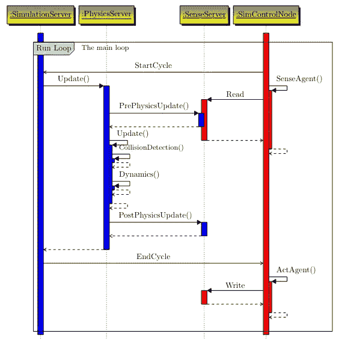

# 如何在编码前图形化设计你的应用程序

> 原文：<https://betterprogramming.pub/how-to-graphically-design-your-app-before-coding-it-d10ad21619f3>

## 编程和编码之间非常重要的区别


照片由[阿克塞尔·鲁芬尼](https://unsplash.com/es/@4xel?utm_source=medium&utm_medium=referral)在 [Unsplash](https://unsplash.com?utm_source=medium&utm_medium=referral) 拍摄

我最近写了一篇关于[为什么我要转到 Emacs 做我的主要编辑](/emacs-or-vs-code-why-and-how-im-slowly-switching-to-gnu-emacs-ea33c0837ac4)的文章。这篇文章收到了一条评论，这条评论积极地触发了我写这篇文章。评论者解释说，编程和编码之间有很大的区别，基于文本的编辑器，如 Emacs 或 Vim，阻碍了开发人员在该领域的进步。

我还没有探索评论者建议的可视化编程系统(Smalltalk)，但我已经思考了编程和编码的区别。事实上，我一直将我的开发工作流程分成两步，甚至没有注意到:

1.  用尽可能多的技术细节图形化地设计我想要实现的特性。
2.  根据你的大脑已经构思和看到的图片(你的图形设计)对特征进行编码。

虽然这是大多数开发人员做的事情(至少从我的经验来看),但我想分享一个我一直在使用的工具(实际上是一个包),我发现它非常有效、快速且易于导出。

这个工具就是`pgf-umlsd`。

# 什么是`pgf-umlsd`？

`pgf-umlsd`是一个用于绘制 UML 序列图的 LaTeX 包。对于那些还没有听说过(不太可能)或者使用过 LaTeX 的人来说，我在这里[讲机器学习笔记的时候已经提到了。](/my-current-ml-setup-why-it-helps-with-productivity-c69f88fc3079)

你猜怎么着，我发现 LaTeX 在产品设计和技术特性描述方面也很棒，这要归功于上面提到的包。如果您从未使用过 LaTeX，不要担心，本教程将介绍一些基础知识，帮助您使用`pgf-umlsd`构建第一个序列图。

让我们看看一个奇特的序列图是什么样子的:



来自[https://ctan . mirror . garr . it/mirrors/ctan/graphics/PGF/contrib/PGF-um LSD/PGF-um LSD-manual . pdf](https://ctan.mirror.garr.it/mirrors/ctan/graphics/pgf/contrib/pgf-umlsd/pgf-umlsd-manual.pdf)

它看起来很漂亮，但也有点嵌套，难以理解。然而，一旦你开始在你自己的序列图上设计一个特性实现，你会觉得这是你做过的最干净的可视化。

我不太了解如何根据最佳实践使用序列图，但是快速阅读一下维基百科页面和一些参考资料会有所帮助。

序列图通常用于非常具体地表示用户和服务器之间的任务。不过，我发现它们在设计更高级的流程和任务时也很有用。

此外，通过使用 LaTeX，创建这些图的过程比移动鼠标和拖动组件要快得多。

# 使用乳胶包

## 乳胶入门

你首先需要的是一个 LaTeX 编辑器，最好是一个实时编译器，因为它可以让事情变得更快，特别是对于那些不熟悉这个软件的人。我目前正在使用我构建的在线实时 LaTeX 编辑器的 alpha 版本，该编辑器集成了区块链来管理文档，但是，它还没有准备好公开。我会推荐 Gummi 这样的 app，有实时编译器。

其次，我想给从未使用过 LaTeX 的读者一些基本的编辑背景。您可能认为它是某种标记语言(尽管它绝对不是)。您可以导入包(就像我们对 pgf-umlsd 所做的那样)，内置的包前面有一个反斜杠。

例如，添加 200px 的垂直间距，我们做`\vspace{200px}`。其他真正重要的概念是`\begin`和`\end`。可以把它看作是一个带有预定义类的 HTML div 的开始。例如，如果我想做一个项目符号列表，我会这样做:

```
\begin{itemize}
    \item first item
    \item second item
\end{itemize}
```

## 使用 pgf-umlsd

现在要做的第一件事是打开 LaTeX 编辑器，开始文档，并使用 pgf-umlsd 包，如下所示:

```
\documentclass{article}
\usepackage{pgf-umlsd}
\usepackage{graphicx}
\usetikzlibrary{positioning,fit,calc}
\tikzset{block/.style={draw, thick, text width=3cm, minimum height=1.5cm, align=center},line/.style={-latex}}\begin{document}
Hello World!
\end{document}
```

现在，您应该看到编辑器的输出是一个“hello world”文档。

现在，这个软件包是如何工作的？这非常简单，您可以在下面看到:

1.  序列图以`\begin{sequencediagram}`开始，以`\end{sequencediagram}`结束。
2.  添加新的参与者，给每个参与者分配一个变量和一个值。例如，创建一个将`server`作为变量并将`Server`作为值的线程:`\newthread{server}{Server}`。如果你愿意，也可以用颜色:`\newthread[red]{server}{Server}`。您可能还想创建一个实例:`\newinst{database}{Database}`
3.  在添加的参与者之间开始一些通话。基本调用语法如下:
    `\begin{call}{client}{payload}{server}{response}\end{call}`。

这是一个你可以直接粘贴到你的空 LaTeX 编辑器中的例子，一个真正基本的序列图:

```
\documentclass{article}\title{ Test sequence diagram }
\date{June 9, 2022
\author{Your name}\usepackage{pgf-umlsd}
\usepackage{graphicx}
\usetikzlibrary{positioning,fit,calc}
\tikzset{block/.style={draw, thick, text width=3cm, minimum height=1.5cm, align=center},line/.style={-latex}}\begin{document}\maketitle\begin{sequencediagram}
    \newthread[blue]{client}{User}
    \newthread[red]{server}{Server1}
    \newinst{database}{Database}
    \begin{call}{client}{request}{server}{resource}
        \begin{call}{server}{query}{database}{raw}
        \end{call}
    \end{call}
\end{sequencediagram}
\end{document}
```

对于一些更复杂的图，这里有例子[这里有](https://ctan.mirror.garr.it/mirrors/ctan/graphics/pgf/contrib/pgf-umlsd/pgf-umlsd-manual.pdf)。

# 为什么使用这种方法？

除了本文前面提到的原因，序列图可能是我最喜欢的一种图，因为它们更倾向于关注事件的顺序，而不是事件的内容。此外，这种方法使用 LaTeX 的事实允许您创建令人惊叹的专业文档和提案。

*感谢阅读！*