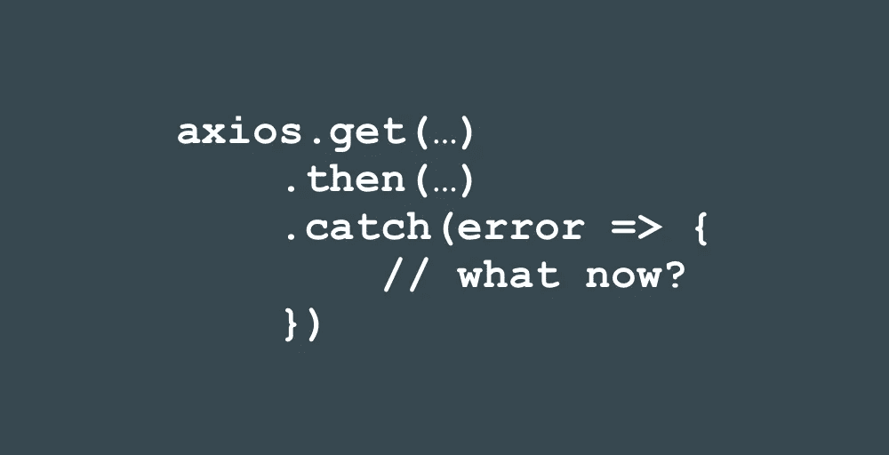
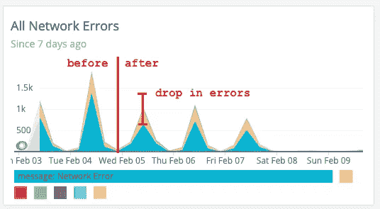

# 如何使用 Axios 处理 Web 应用程序中的 API 错误

> 原文：<https://betterprogramming.pub/how-to-handle-api-errors-in-your-web-app-using-axios-b32b6c41fd35>

## 我只是控制台。记录它。这就够好了，对吧？

作者照片。

每当你用 axios 进行后端 API 调用时，你必须考虑如何处理你的承诺的`.catch()`块。现在，您可能认为您的 API 是高度可用的，它将全天候运行。您可能认为用户工作流非常清晰，您的 JavaScript 是合理的，并且您有单元测试。因此，当您在使用`axios`发出请求时盯着 catch 块时，您可能会想，“嗯...我就`console.log`吧。那很好。”

但是，在发出 API 请求时，有太多超出您控制范围的事情可能会抛出错误——您可能甚至不知道它们正在发生！

本文主要处理您在浏览器中看到的错误。在后端，事情也会变得很滑稽。看看[你可能在后端日志中看到的三件事](https://www.intricatecloud.io/2018/12/3-things-you-might-see-in-your-logs-once-your-site-is-public/)。

下面是使用 axios 时可能出现的三种错误，以及如何处理它们。

# 捕捉 Axios 错误

下面是我已经开始在几个 JS 项目中包含的一个片段:

每个条件都意味着捕捉不同类型的错误。

# 检查错误。响应

如果您的错误对象包含一个`response`字段，这意味着您的服务器响应了一个 4xx/5xx 错误。通常，这是我们最熟悉也最容易处理的错误。

做类似“如果你的 API 返回 404，显示 404 未找到页面/错误消息”的事情如果您的后端返回 5xx 或根本不返回任何内容，则显示不同的错误消息。您可能认为您构造良好的后端不会抛出错误，但这只是一个时间问题——而不是如果。

# 检查错误。请求

第二类错误是您没有响应，但是有一个`request`字段附加到错误上。这是什么时候发生的？当浏览器能够发出请求，但出于某种原因，它看不到响应时，就会发生这种情况。

如果出现以下情况，就会发生这种情况:

*   你处在一个不稳定的网络中(想象一下一个地下地铁或一栋大楼的无线网络)。
*   您的后端正挂在每个请求上，没有及时返回响应。
*   您正在提出跨域请求，但您无权提出请求。
*   您正在进行跨域请求，并且获得了授权，但是后端 API 返回了一个错误。

这个错误的一个更常见的版本有一个无用的“网络错误”消息。我们有一个前端和一个后端 API 托管在不同的域上，所以每个后端 API 调用都是一个跨域请求。

由于浏览器中 JS 的安全限制，如果你发出一个 API 请求，但由于糟糕的网络而失败，你将看到的唯一错误是“网络错误”，这是非常无用的。它可以表示从“您的设备没有互联网连接”到“您的选项返回 5xx”(如果您提出 CORS 请求)的任何内容。“网络错误”的原因在这个堆栈溢出回答中[描述得很好。](https://stackoverflow.com/a/19325710)

# 所有其他类型的错误

如果您的错误对象上没有`response`或`request`字段，这意味着它不是 axios 错误，您的应用程序中可能有其他问题。错误消息+堆栈跟踪应该有助于您找出它的来源。

# 你如何修理它们？

## 降低用户体验

这完全取决于你的应用。对于我从事的项目，对于使用这些端点的每个特性，我们降低了用户体验。

例如，如果请求失败，而页面没有这些数据就毫无用处，那么就会出现一个更大的错误页面，并为用户提供一条出路——有时只是一个“刷新页面”按钮。

另一个例子:如果对社交媒体流中的个人资料图片的请求失败，我们可以显示一个占位符图像，并禁用个人资料图片更改，同时显示一条解释为什么“更新个人资料图片”按钮被禁用的消息。然而，作为用户，显示“422 不可处理实体”的警告是没有用的。

## 参差不齐的网络

我工作的 web 客户端是在学校网络中使用的，这绝对是非常糟糕的。你的后端的可用性几乎没有任何关系。请求有时无法离开学校网络。

为了解决这些类型的间歇性网络问题，我们添加了 [axios-retry](https://github.com/softonic/axios-retry) 。这解决了我们在生产中看到的大量错误。我们将此添加到我们的 axios 设置中:

我们能够看到 10%的用户(他们在蹩脚的学校网络中)看到零星的“网络错误”，在添加了失败时的自动重试后，这一比例下降到了不到 2%。

这是出现在《新遗迹》中的“网络错误”数量的截图。不到 1%的请求出错。

这引出了我的最后一点。

## 向您的前端添加错误报告

拥有前端错误/事件报告很有帮助，这样您就可以在用户告诉您之前知道生产中发生了什么。在我的日常工作中，我们使用新的 Relic 浏览器从前端发送错误事件。因此，每当我们捕捉到一个异常，我们就记录错误消息以及堆栈跟踪(尽管这对于缩小的包有时是无用的)和一些关于当前会话的元数据，以便我们可以尝试重新创建它。

填补这一空白的其他工具还有[哨兵+浏览器 SDK](https://github.com/getsentry/sentry-javascript/tree/master/packages/browser) 、[滚动条](https://docs.rollbar.com/docs/browser-js)，以及 GitHub 上列出的一大堆其他有用的工具[。](https://github.com/cheeaun/javascript-error-logging)

# 包扎

如果你没有得到任何其他的东西，做一件事:现在去你的代码库，回顾你是如何处理 axios 的错误的。

*   检查您是否正在进行自动重试，如果不是，请考虑添加`axios-retry`。
*   检查您是否捕捉到了错误，并让用户知道发生了一些事情。`axios.get(...).catch(console.log)`还不够好。

那么，你如何处理你的错误呢？请在评论中告诉我。