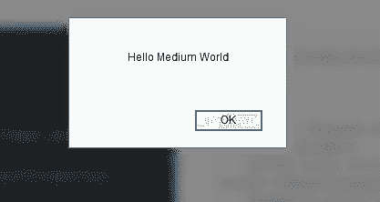

# 如何使用 Python 处理常见的 Selenium 问题(第 2 部分)

> 原文：<https://betterprogramming.pub/how-to-handle-common-selenium-issues-using-python-part-2-db8d6f39ef06>

## 解决您的大多数硒挑战

作者:[getPathTo(element)](https://medium.com/u/d38873cbc5aa#A154897-my-span-element)

*   [您的绝对 XPath 应该出现在控制台中。](https://medium.com/u/d38873cbc5aa#A154897-my-span-element)

## [使用相对 XPath](https://medium.com/u/d38873cbc5aa#A154897-my-span-element)

[使用`absolute_xpath`在大多数情况下是可行的，但是编写起来可能会很棘手，因为您必须遵循到根的完整路径。幸运的是，有一个更方便的解决方案，那就是使用相对 XPath。](https://medium.com/u/d38873cbc5aa#A154897-my-span-element)

[在我们的例子中，我们可以看到 `div`标签有一个静态 ID。因此，我们可以使用与该元素相关的 XPath:](https://medium.com/u/d38873cbc5aa#A154897-my-span-element)

```
relative_xpath = '//*[@id="my-div"]/span'
```

[字符“/”用于建议一个直接子(后代)元素，而“//”用于选择更深的后代(直接或非直接子)。](https://medium.com/u/d38873cbc5aa#A154897-my-span-element)

[在示例中，我们可以看到通过 id 选择元素相当于使用括号语法过滤元素。在括号内，我们指定 id(前面有“@”表示它是一个属性)等于某个值(“my-div”)。](https://medium.com/u/d38873cbc5aa#A154897-my-span-element)

## [使用 XPath 函数](https://medium.com/u/d38873cbc5aa#A154897-my-span-element)

[正如我们在相对路径中看到的，我们可以使用像 `*[@id="my-div"]`这样的过滤器来选择我们的元素。然而，我们并不局限于标准操作符(=，！=，<，< =，>，> =)。我们可以使用函数来操作字符串，比如 `contains`。(您可以在](https://medium.com/u/d38873cbc5aa#A154897-my-span-element)[文档](https://developer.mozilla.org/en-US/docs/Web/XPath/Functions)中找到完整的函数列表。)

知道了这一点，我们可以使用下面的 XPath 直接选择元素:

```
element_xpath = '//span[contains(@id, "my-span-element")]'
```

我们也可以使用 `and`和 `not`关键字来组合多个函数(过滤器)来选择我们的元素:

```
element_xpath = '//*[not(contains(@id, "div")) and contains(@id, "my")]'
```

# 如何在无头模式下运行 Selenium WebDriver

假设您刚刚编写完 Selenium 脚本，并希望每周运行它。每次都会出现一个烦人的浏览器窗口，尽管你并不需要它。我想你会想把它拿掉吧？

嗯，使用选项是可能的，下面是你如何使用 Firefox:

# 如何编写自己的自定义预期条件

在 Selenium 中，`expected` conditions 是一种告诉 Selenium 等待直到满足某个条件的方式。例如，当您希望等待一个元素出现在屏幕上并被启用以便您可以单击它时:

我们可以使用`expected`条件的另一个例子是当等待某事发生时，比如进度条完全加载。

可以用 `time.sleep(seconds)`。然而，如果 `seconds`太小，我们可能会以不完整的信息或不完整的页面结束，如果太大，我们会浪费时间，如果我们扩展代码，这些时间会增加。发生这种情况的一个很好的例子是在[皮划艇](http://kayak.com)上。

```
[https://www.kayak.com/flights/PAR-TUN/2020-11-07-flexible/2020-12-14-flexible](https://www.kayak.com/flights/PAR-TUN/2020-11-07-flexible/2020-12-14-flexible)
```


问题是硒中的一切都不存在`expected`条件。要在特定情况下使用它们，您必须实现自己的`expected`条件。我们可以这样使用它们:

为了创造一个`expected`条件，我们首先要理解它的本质是什么。它实际上只是一个简单的函数，接受驱动变量(没有其他参数)，进行一些测试，如果条件满足，则返回`True`(或者元素被解释为`True`，就像非空列表或 Selenium `WebElement`或`False`。

因此，对于我们的 Kayak 示例，我们可以看到进度条元素的样式在满的时候显示 100%:

```
<div ... style="transform: translateX(100%);"></div>
```

所以我们的期望条件可以写成:

对于这个例子，我们必须使用一个全局变量来访问我们需要的定位器，因为函数必须只接受一个参数，即驱动程序。一种更干净的方法是使用一个类来代替(不使用全局变量):

方法 `__init__`是对象的构造函数，而 `__call__`只是调用实例化对象时使用的方法。在这种情况下， `progressbar_is_full_object(driver)`等同于 `progressbar_is_full_object.__call__(driver)`。基本上，你的对象将表现为一个函数。

要使用它，我们需要执行以下操作:

```
progressbar_is_full_object = progressbar_is_full((By.XPATH, progressbar_xpath))
browser_wait.until(progressbar_is_full_object)
```

如果你不太喜欢面向对象的编程，你可以使用 Python 的`functools.partial`或者 lambda 表达式给定位符作为函数的第二个参数。

现在，您可以使用自定义的`expected`条件来等待进度条变满，这样您就可以知道何时所有搜索结果都被正确显示。

# 如何使用 Selenium 滚动网页

## 如何滚动到不可见的元素

在某些情况下，根据您使用的网站或屏幕大小，您可能需要选择一个隐藏元素。如果元素没有显示在屏幕窗口的可见部分，选择它将导致抛出一个`ElementNotVisibleException`。为了避免这种情况，我们使用 JavaScript 方法`.scrollIntoView` 将元素滚动到视图中(正如您从其名称中肯定猜到的)。下面是一个现成的代码片段:

## 如何上下滚动网页(或左右滚动)

也可以向下和向上滚动到某个高度(如果需要，可以滚动到某个宽度):

P.S .只要 `y_coord`等于`None`，第二个选项(`document.body.scrollHeight`)作为 *y* 坐标。如果您不想滚动到页面底部，您可以通过用您选择的值替换 `y_coord`中的`None`来指定某个高度。

## 如何在无限加载的情况下滚动到页面底部

有时候，我们浏览的网站可能是那些随着用户不断滚动而不断扩展的网站之一，当接近页面底部时会加载更多的内容。社交媒体页面就是这类网站的具体例子。为了处理无限加载，需要循环重复滚动过程，直到不再有内容要显示，或者满足您选择的其他条件。下面你可以找到执行这个想法的代码片段:

PS:对于数据量巨大的网站，一定要指定一个停止条件，而不是到达网页底部。

# 如何处理弹出窗口和警报

在浏览网页时，我们都曾经不得不处理那些烦人的弹出窗口。幸运的是，有了 Selenium，立即关闭它们非常容易。你需要知道的是，弹出窗口有多种类型。我们将在每一部分看到特定类型的代码片段。

## 弹出窗口

这种弹出非常频繁，尤其是在比较老的网站上，基本上都是在浏览一个网站的时候显示的一个单独的[窗口](https://www.w3schools.com/jsref/met_win_open.asp)。它通常包含广告。

关闭它们非常简单。你只需要在下面的代码中用弹出窗口标题/名称替换 `YOUR_WINDOW_NAME`即可。

使用标题关闭窗口可以确保您关闭了不想要的窗口。

## JavaScript 弹出框

另一种弹出是 [JavaScript 弹出框](https://www.w3schools.com/js/js_popup.asp)，可以是 JavaScript 函数生成的警告、确认或提示。它们通常是这样的:



要关闭它们，您只需运行以下代码片段:

## 模态图像

[*模态*](https://www.w3schools.com/howto/howto_css_modal_images.asp) 是显示在当前页面顶部的对话框。

不幸的是，对于这种弹出窗口，由于每个网站实现它们的模式不同，所以没有每次都有效的代码。

然而，我可以给你一些简单的建议:

*   通常，您会发现一个包含十字图像的 HTML 元素。您可以尝试单击它或父元素。
*   您还应该检查出现的模态是否不包含在 iFrame 中。在这种情况下，您可以使用您在上一节中可能学到的关于 iFrames 的知识。

# 最后的想法

现在，所有这些答案都在你的背包里，你已经准备好面对和战胜 Selenium 可能抛给你的所有挑战。如果您能想到本文中没有提到的其他 Selenium 挑战，请不要犹豫，在回复部分与我们分享它们(有或没有解决方案)。

谢谢你坚持到现在。注意安全，在我们的下一篇文章中再见！

# 参考

[1][https://browsee . io/blog/strategies-to-handle-dynamic-web-elements-in-selenium/](https://browsee.io/blog/strategies-to-handle-dynamic-web-elements-in-selenium/)
【2】[https://www.w3schools.com/howto/howto_css_modal_images.asp](https://www.w3schools.com/howto/howto_css_modal_images.asp)
【3】[https://www.w3schools.com/js/js_popup.asp](https://www.w3schools.com/js/js_popup.asp)
【4】[https://www.w3schools.com/jsref/met_win_open.asp](https://www.w3schools.com/jsref/met_win_open.asp)