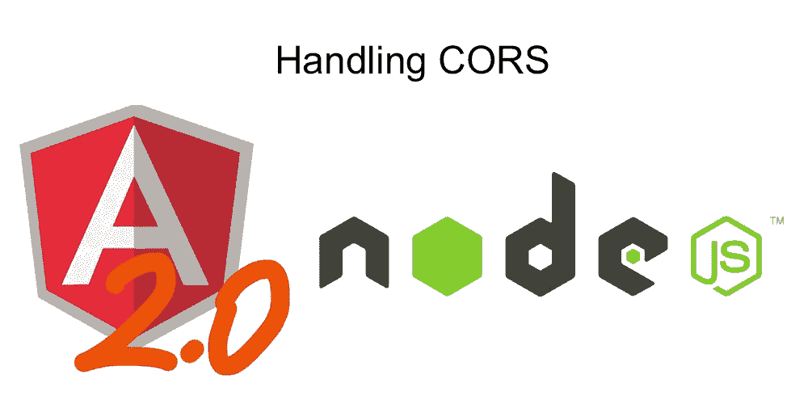

# 如何在 Angular 2 和 Node/Express 应用中处理 CORS

> 原文：<https://betterprogramming.pub/how-to-handle-cors-in-an-angular2-and-node-express-applications-eb3de412abef>

## 允许其他域访问后端资源



在许多应用程序中，前端和后端驻留在一个点上，即可能有许多使用 [Express](https://expressjs.com/) 服务前端的 [Node.js](https://nodejs.org/) 应用程序。带有[玉石](https://jade.tilab.com/) / [车把](https://handlebarsjs.com/)或其他框架的 js。但是，有时您可能希望将前端托管在其他地方，以隔离后端。或者，您可能希望允许多个域访问 Node.js 后端。在这种情况下，您必须启用 CORS。

[**跨来源资源共享**(**)**](https://en.wikipedia.org/wiki/Cross-origin_resource_sharing#cite_note-mozhacks_cors-1)**是一种机制，允许从资源来源域之外的另一个[域](https://en.wikipedia.org/wiki/Domain_name)请求[网页](https://en.wikipedia.org/wiki/Web_page)上的受限资源(如字体)。**

**长话短说，CORS 允许其他域访问您想要公开的后端资源以及 API/REST 调用。**

**对于[角度 2](https://angular.io/) 应用，有多种起始模板可供选择。然后是 Angular 2 应用程序的 angular-cli ,尽管它目前仍处于测试阶段，但已被许多人使用。这些模板允许您拥有自己的 Angular 应用程序独立服务器。因此，当您构建 Angular 2 和 Node.js 应用程序时，您的前端和后端将位于不同的域中，并且在开发过程中，可能位于不同的端口上。例如 http://localhost:4200 可能是你的 Angular 2 应用的地址，而 [http://localhost:300](http://localhost:300) 0 可能是你的 Node.js API 服务器。**

**现在你可能会想，“哦，得了吧，阿桑，这些我都知道！只要告诉我如何做 CORS 的东西。”**

**开始了。**

**在 Node.js 端，非常简单。Express.js 有一个很棒的 CORS NPM 包，它是一个中间件。因此，使用 npm 在您的项目中安装软件包:**

```
cd /path-to-your-project
npm install cors --save
```

**然后，在你的主 Node.js 文件中，通常是`app.js`，需要这个模块，并使用如下配置:**

**上述代码将在 Node.js 和 Express.js 应用程序上启用 CORS。**

**现在你需要准备你的 Angular 应用程序来为 CORS 工作。到目前为止，还没有一个官方的方法来做到这一点。[角 2 github 库](https://github.com/angular/angular)上有一个[拉请求](https://github.com/angular/angular/issues/4231)，但是我觉得还没有合并。**

**所以事情是这样的。要启用 CORS，您可以扩展`BrowserXhr` 类(考虑到您正在为 Angular 2 编写 Typescript ),并将其包含在引导过程中。在 Angular 2 项目中创建一个名为`cust-ext-browser-xhr.ts`的文件，并粘贴以下代码:**

**现在，在引导应用程序组件的主文件中，导入我们的自定义浏览器 xhr 模块，并在引导过程中使用它:**

***注:以下代码用于角度 2。对于角度 4+，进一步向下滚动。***

***对于角度 4+，使用下面的代码片段:***

**就是这样！这就是我们在 Angular 2 和 Node.js/Express.js 应用中使 CORS 工作所需的全部内容。我在 Node.js 应用程序中使用 [Passport.js](http://passportjs.org/) 进行身份验证，这是一个非常灵活且易于使用的框架。**

**编码快乐！:)**