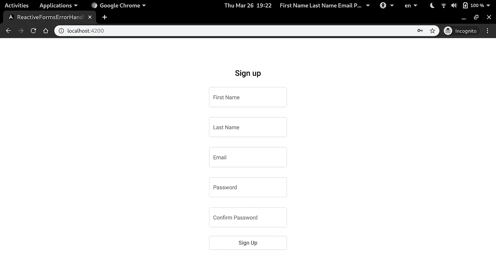
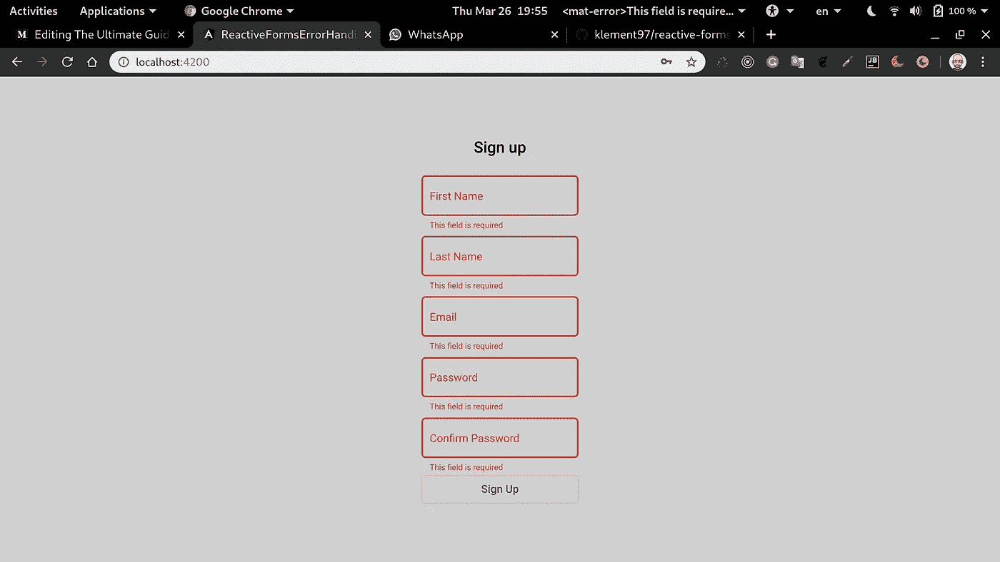
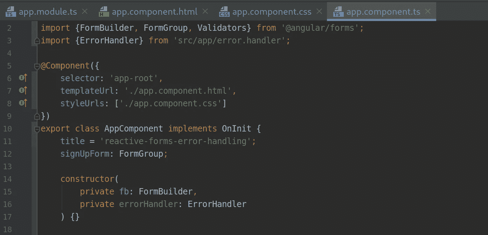
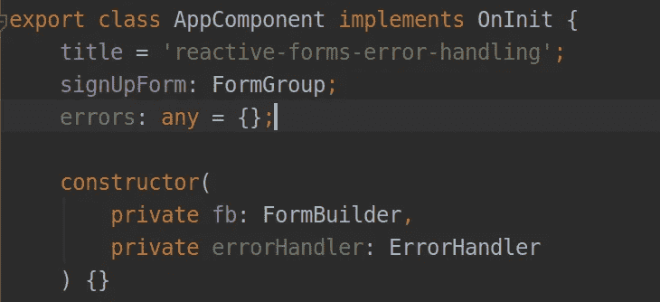
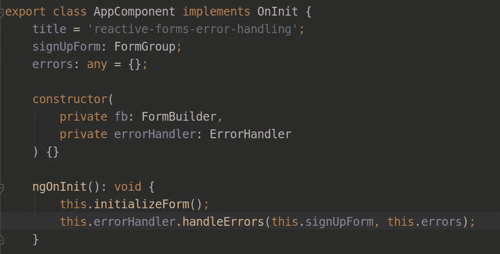
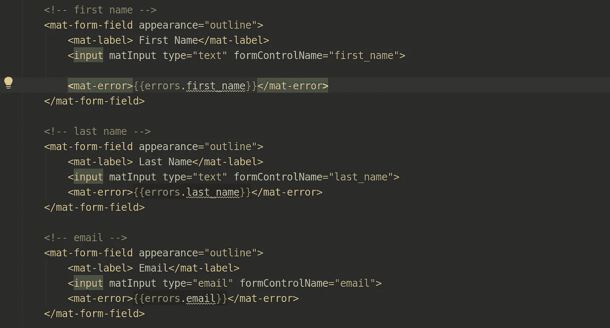

# 3 行代码可以处理角反应形式的错误

> 原文：<https://betterprogramming.pub/how-to-handle-errors-of-angular-reactive-forms-with-three-lines-of-code-3caaa1eb8324>

## 擦干你的表格


Emile Guillemot 在 [Unsplash](https://unsplash.com/s/photos/future?utm_source=unsplash&utm_medium=referral&utm_content=creditCopyText) 上拍摄的照片

Angular 是一个伟大的框架，它提供了一些伟大的工具。这些工具之一就是`ReactiveForms`。在本文中，我想向您介绍一种更简单的方法来处理反应式表单中的错误，并避免意大利面条式代码。为了节省时间，我将直接跳到实现。

我们要构建的是一个标准的注册表单，如下所示。我将使用 Angular v9，你可以在这里找到源代码。



正如你所看到的，我有一个非常简单的注册表单，用有棱角的材料设计。表单的`ts`代码如下——我添加了一些`Validators`来得到一些错误:

我看过很多来自不同项目的代码，有一点没有改变，那就是表单上的错误处理。让我告诉你我的意思:

对于每一个可能发生的错误，您需要编写另一个`mat-error`标记，检查错误是否存在，并为其设置一个适当的消息。这必须重复进行。当你有一个注册表单时，这可能不是问题，但是如果你有几十个表单，你需要每次都写相同的代码，这很累。

# 让我们考虑一下

我们是程序员，不是抄袭者。我们必须写出漂亮干净的代码。这就是为什么我决定花点时间考虑一下。

我开玩笑的。当然，我们必须写出漂亮干净的代码，这是事实，但这不是我决定思考什么可以做得更好的原因。事实上，当我的团队领导指派我在 20 多个表单上实现错误处理，每个表单平均有 10 个字段和许多错误案例时，我就决定必须做出一些改变。错误必须出现在与错误相关的每个字段的下方，服务器错误也必须以同样的方式处理。

因此，错误必须如下所示:



我已经开始研究一些全局函数，并取得了一些成功——但是它们也将我的代码耦合到了每个组件上。我想要一些分离的东西，一些可以在任何其他项目中复制和粘贴的东西，并且像魔法一样工作。所以我最终创建了一个可注入类，并将其命名为`ErrorHandler`(非常有创意的名字)。

你可以点击查看课程[。](https://gist.github.com/klement97/58ab606031c4fe4a2a04b6ed8c2e9d92)

深入研究这个类的内容需要很长时间，所以我将只讨论如何轻松地使用它，正如我所说的，只用三行代码。无论如何，如果有人有任何改进的想法，我会很高兴——请联系我。我的目标是对它做更多的工作，并将它转换成一个 npm 包。

# 主要思想

这个类背后的思想是，对于我们拥有的每个表单，我们也创建了一个错误对象。我们从表单中取出所有控件名，并将它们作为键分配给 error 对象，每个表单控件的错误消息作为值分配给这些键。

如果这还不够清楚，我想下面的代码会:

# 履行

从我的[要点](https://gist.github.com/klement97/58ab606031c4fe4a2a04b6ed8c2e9d92)中取出代码，在你的项目中创建一个文件并粘贴它。文件在哪里并不重要。您只需要在模块中导入反应式表单。


导入并将其注入到组件的构造函数中，如下所示:



创建一个空对象来保存组件中的错误:



从`onInit()`中的类调用`handleErrors()`方法，但是在你初始化你的表单之后:



`handleError()`方法有两个参数——第一个是表单，第二个是保存错误的本地空对象。

现在转到你的模板，为每个`formControl`只写一个这样的 mat-error 标记:



所以，在`mat-error`里面，这是你唯一需要写的:

```
<mat-error>{{errors.theFormControlName}}</mat-error>
```

现在，您不必在整个应用程序中编写重复的代码，并且在有错误的字段下方可以看到错误——太好了！

此外，有一个叫做`organizeServerErrors`的方法来处理从服务器发送的验证错误，这个方法被明确地写来处理我的 Django Rest 后端发送给我的错误。所以如果你要使用它，你需要做一些工作来改变你后端的错误格式。

无论如何，在所需的表单控件上调用`setErrors()`并将错误类型添加到类中的错误案例中就足够了，如下所示:

```
***// where your error comes from the server***
this.signUpForm.get('email').**setErrors({emailInUse: true});*****// error.handler.ts***
...
} else if (errors.pattern) {
    this.message = 'Invalid value';
} else if (errors.passwordMismatch) {
    this.message = 'Passwords do not match';
} ***else if (errors.*emailInUse*) {
    this.message = 'There is an account with that email';
}*** else {
    this.message = '';
}
```

# 结论

我们都厌倦了一遍又一遍地写同样的东西。这个类提供了角反馈形式的误差处理的中心解决方案。

目前，我正在处理表单数组的实现，表单数组中也包含其他表单组。目标很简单:用一个方法调用来处理所有错误。

如果你想和我一起工作或者给我任何关于类代码的建议，我会很高兴收到你的来信！

感谢阅读！