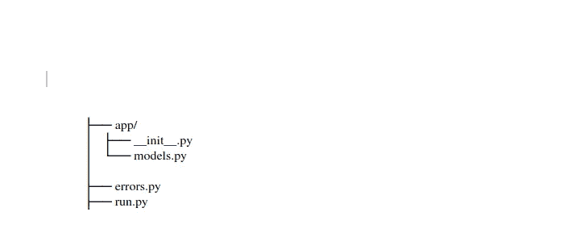
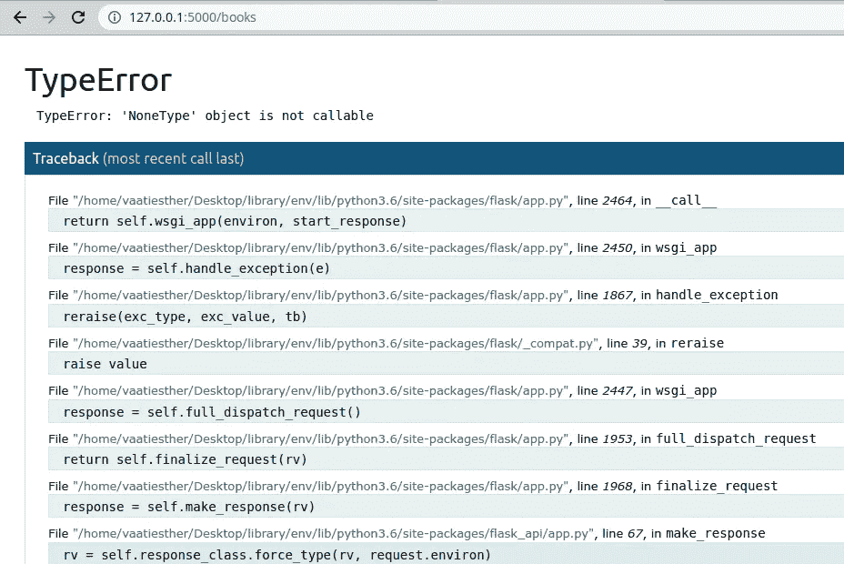

# 如何处理 Flask 中的异常

> 原文：<https://betterprogramming.pub/how-to-handle-exceptions-in-flask-b1d9c151875b>

## 更好的警报处理有助于更好的编程


克里斯·里德在 [Unsplash](https://unsplash.com/s/photos/coding-flask?utm_source=unsplash&utm_medium=referral&utm_content=creditCopyText) 上拍摄的照片

# **什么是 Python 异常？**

本教程将向您介绍异常以及如何在 Flask 中处理异常。本教程结束时，您将能够为您的代码创建自定义异常。

运行程序，输入字符串而不是数字作为输入。如果你运行这个程序，只要输入是一个整数，它就会工作。如果你输入一个字符串而不是一个数字，你会得到一个`ValueError`，如下所示。

```
Please enter a number between 1 and 10: fur
Traceback (most recent call last):
File “main.py”, line 9, in <module>
number = int(input(‘Please enter a number between 1 and 10: ‘))
ValueError: invalid literal for int() with base 10: ‘b’
```

上面的程序计算用户输入的数字的平方。但是假设用户输入一个字符串或一个特殊字符，如果程序不检查输入是否是一个有效的整数，程序将抛出一个异常。

因此，重要的是在错误发生的地方捕获错误，而不是等待整个程序崩溃。我们将包含`try` / `except`子句来捕捉程序中可能出现的任何错误。该程序将如下所示:

在 Python 中，我们使用`try`和`except`块来捕捉和处理异常。`try`语句后的代码是 Python 作为程序的正常部分执行的。在`except`语句之后，代码是程序对前面 try 子句中任何异常的响应。

# 为什么在 Flask 中处理异常很重要？

*   **实现程序的平稳运行:**在每一个可能的方面处理异常可以让你的代码平稳运行，不管有什么错误
*   **安全目的:**从安全角度处理异常也有助于保护您的程序，因为您不太可能将您的代码配置泄露或暴露给随机的人

## 烧瓶支架 API 示例

您将使用 Flask API 来实现您自己的可浏览 API。

您将为库存储开发一个 REST API。API 将能够:

*   添加新的图书条目
*   查看图书馆中所有可用的书籍

## 先决条件

该项目将使用以下依赖项

*   计算机编程语言
*   瓶
*   烧瓶化学
*   烧瓶 API

1.  创建新项目。

```
mkdir library
```

2.创建并激活虚拟环境。

```
cd library
python3.6 -m venv env
source env/bin/activate
```

3.安装所有依赖项。

```
(env)$ pip install flask
(env)$ pip install flask-sqlalchemy
(env)$ pip install flask-api
(env)$ pip freeze > requirements.txt
```

4.创建文件和文件夹以匹配如下所示的目录结构:



目录

## 数据库配置

您将使用 SQLite 数据库和 Flask-SQLAlchemy。SQLAlchemy 是一个 Flask 扩展，为 SQLAlchemy 提供支持。

定义数据库的配置。

在`app/__init__.py`文件中，添加以下内容:

**型号**

将以下内容添加到`models.py`文件中:

接下来，定义启动应用程序的入口点。在`run.py`文件中，添加以下代码:

`db.create.all()`首次运行应用程序时，会创建数据库表格。设置`debug = true`对于调试应用程序很重要，但不建议在生产中使用。

在终端中运行以下命令:

```
(env)$ python run.py
```

让我们定义第一条路由，看看如何处理异常。在`run.py`文件中，添加以下内容:

现在再次运行应用程序:

```
python run.py
```

在浏览器上导航到`[http://localhost:5000/books/](http://localhost:5000/books/)`，您应该会看到一个空的图书列表，因为您还没有添加任何图书条目。添加几个图书条目，并刷新页面。

**处理异常**

POST 请求需要来自用户的数据。然而，如果没有任何输入数据要发送，这个程序可能会出错。代码将抛出一个错误，如堆栈跟踪所示。



堆栈跟踪错误

因此，如果 POST 请求中没有数据，您将需要引发一个异常。Flask 带有内置异常，您可以引发这些异常。也可以使用`APIException`的子类。如果 POST 请求中没有数据，我们将使用`APIException`类引发一个异常。

1.  在 app 目录中创建一个文件`error.py`，并添加下面的代码。

2.编辑 POST 请求以引发`InvalidParameter`异常。

3.现在，当您在没有数据的情况下执行 POST 请求时，响应将如下所示:

```
HTTP 404 NOT FOUND
Content-Type: application/json
{
“message”: “Invalid parameters”
}
```

## 自定义错误

有时，如果一条路线不存在，您可能希望返回 404 错误—例如，一本书的 ID 号是这样的:`[http://127.0.0.1:5000/books](http://127.0.0.1:5000/books)/20000`可能存在**。**如果用户试图访问此类 URL，则会执行一个路由，并返回如下 404 错误:

```
Not Found
The requested URL was not found on the server. If you entered the URL manually, please check your spelling and try again.
```

每当找不到页面时，就会显示 404 错误；每当用户导航到一个不存在的页面时，拥有一个定制的错误页面是非常重要的。

您可以创建一个定制的 404 页面来处理这种错误。您需要在`__init__.py`文件中创建一个 404 模板文件和一个 404 函数。

1.  在`app`目录下的`templates`文件夹中创建一个名为`404.html`的新文件，并添加以下内容:

```

<h1>Page Not Found</h1>
<p>Woops, that page doesn’t exist! (404)</p>
<p>Take me back <a href=”{{ url_for(‘index’) }}”>HOME</a>

```

2.接下来，将错误处理程序包装添加到`__init__.py`文件中。

3.不要忘记渲染模板的导入。

```
from flask import request, render_template
```

4.现在，当用户导航到不存在的页面时，他们会看到以下消息:

> 找不到页面
> 
> Woops，那个页面不存在！(404)
> 
> 带我回[家](http://127.0.0.1:5000/books)

# 结论

希望本文已经帮助您理解了如何处理异常。你可以在 Flask [文档](http://flask.pocoo.org/docs/0.12/patterns/apierrors/l)网站上找到更多信息。