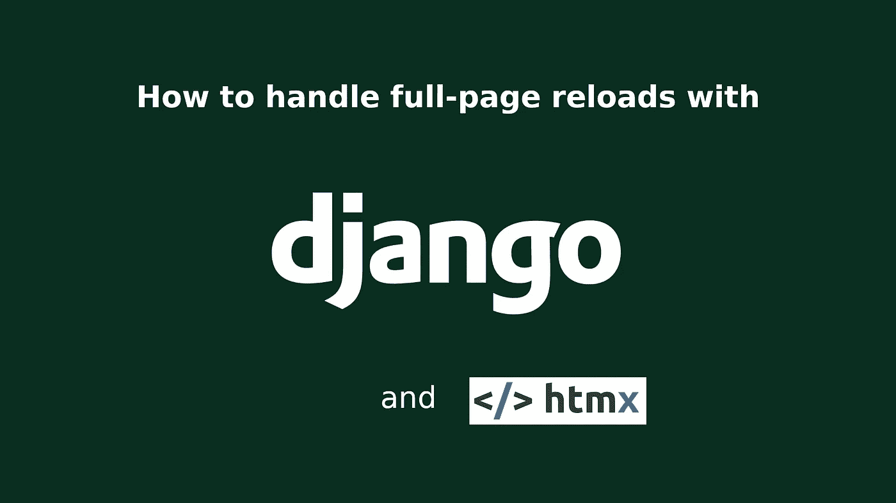

# 如何用 Django 和 HTMX 处理整页重载

> 原文：<https://betterprogramming.pub/how-to-handle-full-page-reloads-with-django-and-htmx-a9a7ef2e4b1c>

## 探索用例场景。



将 HTMX 与 Django 一起使用时，您可能会遇到的一个常见问题是在使用`hx-target`属性和`hx-push-url`属性时处理整页重载。在处理这个问题时，我们可以使用几个选项。

*   **选项一**是给每个模板添加一个定制的事件监听器，用`hx-push-url`把它的 URL 推送到浏览器的历史中。
*   **选项二**是扩展 Django 的默认`TemplateResponseMixin`来处理 HTMX 请求。
*   **选项三**包括创建一个定制的中间件类并使用`process_template_request`方法。

# 先决条件

本文假设您已经开始了一个新的 Django 项目，在静态文件中包含了 HTMX，并安装了 [django-htmx](https://github.com/adamchainz/django-htmx) 应用程序。

# 选项一

如果您只需要处理整个项目中一个或两个视图的整页重新加载，选项一是理想的，因为它不遵循 DRY 原则。

这个选项非常简单。当加载模板时，它将获得属于所提供的 URL 的视图，并在所提供的目标内呈现响应。

**注意:**这可能不是你所习惯的传统事件监听器。来自[的 htmx 文档](https://htmx.org/attributes/hx-trigger/):

> `hx-trigger`属性允许您指定什么触发 AJAX 请求。

而“加载”被描述为 htmx 支持的非标准事件。

# **选项二**

当您想在大多数视图中处理 htmx 请求，但不一定是所有视图时，这个选项是最好的。我们从创建自定义 mixin 类`HtmxResponseMixin`并继承 Django 的`[TemplateResponseMixin](https://docs.djangoproject.com/en/4.0/ref/class-based-views/mixins-simple/#templateresponsemixin)`和`[ContextMixin](https://docs.djangoproject.com/en/4.0/ref/class-based-views/mixins-simple/#contextmixin)`开始。从这里开始，我们将重写`get_template_names`和`get_context_data`方法。

在`get_template_names`中，我们需要获得请求所属的应用程序的名称。为此，我们需要在项目的 URL 中包含一个 app 名称空间。例如:

最后，我们检查对 htmx 实例的请求，并将正确的基本模板返回给响应的上下文。

## 模板设置

现在，当我们将 mixin 添加到视图中时，例如:

如果请求是由 htmx 发出的，它将呈现我们的部分模板，如果不是一个完整的页面模板将被返回。为了避免为每个页面重写内容，我们可以用一种适合 Django 的方式来设置模板。

首先，我们在模板目录中设置**base.html**。

接下来，我们在模板目录中设置**partial.html**。

然后，我们在 templates/app_namespace 目录中设置 **template_name.html** 文件。

在那里我们可以更新页面标题，添加面包屑，甚至用 Django 的消息框架包含消息。下面我们添加画布内容。

现在你可以看到我们如何使用 htmx 与我们的应用程序交互，创建一个类似 SPA 的界面。选项三通过使用定制中间件将这一概念向前推进了一步。

# 选项三

最后一个选项的工作方式与第二个相似，但是更加含蓄。我们从定义中间件类开始，默认情况下，它要求`__init__`方法接受一个`get_response`参数。

接下来是 __call__ 方法，每次发出请求时都会调用它。目前，它只需要返回一个响应对象供`[process_template_response](https://docs.djangoproject.com/en/4.0/topics/http/middleware/#process-template-response)`方法处理。这个特殊的方法是一个中间件钩子，它在一个视图完成执行后被调用。

在`process_template_response`里面，我们开始看到与选项二的相似之处。我们的应用程序仍然需要一个名称空间，但是之后，我们需要在 settings.py 文件中创建一个名为`HTMX_APPS`的新列表，并检查请求是否属于这个列表中的一个应用程序。在设置中，我们可以将我们的类添加到`MIDDLEWARE`列表中。

因此，我们的定制中间件类只影响我们明确定义的应用程序，防止其他第三方应用程序出错，比如默认的 Django 管理应用程序。

最后，我们为 responses `template_name`属性提供适当的模板，检查对 htmx 实例的请求，并将适当的基础模板传递给`context_data`。然后返回响应对象，该对象必须实现一个`render`方法。这意味着 Django 的任何默认的基于类的视图都可以很好地与这个中间件类一起工作。

模板设置遵循与选项 2 相同的方法。

# 资源

*   Github [django-htmx](https://github.com/adamchainz/django-htmx)
*   Htmx [hx 触发器](https://htmx.org/attributes/hx-trigger/)
*   django[TemplateReponseMixin](https://docs.djangoproject.com/en/4.0/ref/class-based-views/mixins-simple/#templateresponsemixin)
*   Django [ContextMixin](https://docs.djangoproject.com/en/4.0/ref/class-based-views/mixins-simple/#contextmixin)

```
In the next post I’ll be showing how we can build a highly dynamic SPA-like application using these practices.
```