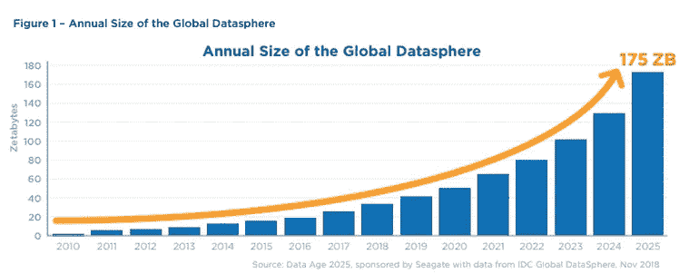

# 如何在基于 React 的应用程序中处理大量数据

> 原文：<https://betterprogramming.pub/how-to-handle-large-amounts-of-data-in-react-based-applications-8d97dd80a9f1>

## 全球数据的指数级增长影响着整个世界，包括前端开发

照片由[克里斯·劳顿](https://unsplash.com/@chrislawton?utm_source=medium&utm_medium=referral)在 [Unsplash](https://unsplash.com?utm_source=medium&utm_medium=referral) 拍摄

# 介绍

凭借在 IT 行业 20 多年的经验，我能够近距离见证我们的行业是如何发展的。在这篇文章中，我将特别关注一个方面:我们可用的数据量，这个数据量增长有多快，以及它如何影响使用 React 的前端应用程序的开发。

我很幸运，因为我为世界上最大的 IT 公司之一提供服务并获得报酬，我已经这样做了十多年了。今天，我想分享一些我作为开发人员和管理人员在这些年中获得的知识；与我们将一起探索的主题相关的知识:

*   数据结构
*   解析和准备数据
*   渲染数据
*   动态数据(单独文章)

在 React 开发和代码库的背景下，我们将在下面的一个专门章节中讨论每个主题。您将在本文末尾找到更多关于全球数据的信息，以及 IDC 及其全球数据层测量的一些引文。

注意:我们的大多数项目都在前端使用 React。然而，下面的许多例子和概念可以很容易地转移到其他技术上。

# 数据结构

我们在前端呈现的数据来自不同的来源:数据库、文件、API 等等。如果您的应用程序足够大，它可能来自其中几个的组合。

不管它来自哪里，我强烈建议当它们到达你的前端时，保持你的数据结构平坦。

具有嵌套结构的 JSON 数据对象。一大禁忌！

所有开发人员对他们的代码和开发过程中处理的数据都有一个清晰的印象。保持嵌套数据结构和它们的细节(比如上面要点中的细节——尤其是其中的几个——的精神形象比考虑*平面列表要困难得多*

平面数据结构。

在这个例子中，我们还可以在第二层看到列表属性，比如`items.orderIds`。这很好，只要它们只包含指向我们平面结构中其他对象的指针，只要我们不超过这个深度。请注意，结构的三个主要属性(`items`、`orders`和`products`)的数据也可以被分成三个完全独立的列表，而不是一个列表。

也有相反的观点:“但是我们有 TypeScript，它让我们在 ide 中自动完成，深度并不重要！”

很公平。毫无疑问，TypeScript 是一个很棒的工具，我们自己也广泛使用。但是总的来说，我个人认为，编写和维护处理平面数据结构的代码的好处大于坏处。

当您处理平面结构时，与同事讨论数据结构和相关代码也更容易。

我们的结论是:

*   保持数据结构的扁平化。

克里斯蒂娜@ wocintechchat.com 在 [Unsplash](https://unsplash.com?utm_source=medium&utm_medium=referral) 上的照片

# 解析和准备数据

当我们在 React 应用程序中接收——最好是平面结构——数据并将其存储在我们的状态中时，我们必须以某种方式将它进一步发送给我们的组件(React [钩子](https://reactjs.org/docs/hooks-intro.html)，Next.js 的[初始属性](https://nextjs.org/docs/api-reference/data-fetching/getInitialProps)等)。).但是当我们要呈现数据时，数据的格式很少是方便的。这意味着我们必须在迭代和呈现数据之前解析和准备数据。

在组件之外准备数据。

不要:

*   将原始数据发送到组件
*   操作组件内部的数据，然后
*   渲染您的组件

因为:

如果另一个组件——现在或将来——也需要被操作的数据，该怎么办？操纵过程重怎么办？还是复杂而广泛？

使**专用选择器功能**操纵从你的组件和渲染中分离出来的数据。并且确保这些函数是小的和可测试的，并且不依赖于或者具有任何状态。他们不应该读我们的状态；他们应该从我们州接收数据作为参数。
把他们分开；避免复杂。完全接受[函数式编程](https://en.wikipedia.org/wiki/Functional_programming)，为长寿命的代码库铺平道路。

我对选择器的理解是，它是一个函数，接收您的状态中的数据子集，选择性地操作这些数据，然后返回它。如果第二次调用选择器时所提供的参数是相同的，那么应该会返回完全相同的数据。

选择器是一个函数，它接收您的状态中的数据子集，有选择地操作这些数据，然后返回这些数据。

## 记忆选择器功能

这就引出了我关于这个主题的最后一点:记住这些函数调用的结果，尤其是如果操作过程很繁重的话。当这样做时，您的 React 应用程序可以获得令人难以置信的性能，即使有大量数据。我是凭经验说话的。

如今，对我们许多人来说，React 的`useMemo`和`useCallback`马上浮现在脑海中。但是即使它们很强大，有时是有用的钩子，也要小心使用它们。你真的想记住组件内部的计算结果吗？并且只从组件内部受益？

如果您的 DOM 中有同一个组件的几个实例，并且它们使用这些钩子，那么它们都将在内存中有自己的存储结果。他们不应该分享吗？

在组件之外采用这种形式的缓存，这样就可以重用、隔离测试和优化。

[Reselect](https://www.npmjs.com/package/reselect) 是一个很好的工具，还有很多其他的工具。

记忆很棒，但是花点时间想想在哪里以及如何使用它。

照片由[尼基塔·卡恰诺夫斯基](https://unsplash.com/@nkachanovskyyy?utm_source=medium&utm_medium=referral)在 [Unsplash](https://unsplash.com?utm_source=medium&utm_medium=referral) 上拍摄

# 渲染数据

然后我们到达一个点，我们必须渲染数据。大量的数据。如果是表格和/或时序数据，我们可以区分:

*   **无限滚动** —在同一视图中加载更多数据
*   **分页数据** —每页的独立视图

考虑你的观众。对于许多公司和商业用户来说，分页数据是可识别的和首选的。另一方面，如果您正在创建一个休闲或社交应用程序，或者如果您正在以任何其他形式呈现一个连续的数据流，无限渲染可能是有用的和用户友好的。

关于表格数据的另一个评论是:许多开发人员想出了创造性的解决方案来在他们的表格中呈现尽可能多的数据。小字体、用于呈现一条记录的两行或多行、可扩展的行等。有时候，这确实是最好的。但是其他时候，对于最终用户来说，它可能是压倒性的和混乱的。

我们曾经想到的一个解决方案是在行本身中呈现最少量的(元数据)。该过程包括当用户将鼠标光标悬停在该行上时，在屏幕一侧的单独视图窗格中，以及在固定位置的专用区域中显示特定记录的全部数据。这有点像赌博，但确实奏效了。尽管用户一开始并不习惯，但他们喜欢它。

## 呈现许多行

最后但并非最不重要的一点是，在一个列表中一次呈现许多行。有时这是最方便的——甚至可能是产品所有者所要求的——并且是这种情况下的最佳解决方案。

不要简单盲目地把它们扔进你的 DOM。并不是你的应用程序的每个用户都像许多开发人员那样拥有一台顶级的机器。考虑延迟加载当前不可见的行。有很好的工具可以做到这一点，例如 [react-window](https://www.npmjs.com/package/react-window) (每周下载约 50 万次)或其前身 [react-virtualized](https://www.npmjs.com/package/react-virtualized) (每周下载约 70 万次)。

# 动态数据

有时，我们的数据是高度动态的，因为它经常变化。这带来了另外一系列的挑战。我最初计划在本文中为它安排一个部分，但是我现在意识到它应该有自己的一篇文章。我计划在下周写它。

是的，这是一个承诺。

# 全局数据

资料来源:IDC 数据时代 2025 研究

最后，正如介绍中所承诺的，关于全球数据的一些最后的话。

**世界上有大量的数据。**
每时每刻都有更多数据生成，速度非常快。

国际数据公司(IDC)“为信息技术、电信和消费技术市场提供市场情报、咨询服务和活动的全球领先提供商”，正在通过他们的全球数据圈测量不间断地研究这种增长。引用他们 2020 年 5 月的一份出版物中的一句话来说明这个速度:

> “未来三年创建的数据量将超过过去 30 年创建的数据量(…)”

我相信这是一个后果难以预料的预言。

感谢您的宝贵时间！

杰勒德