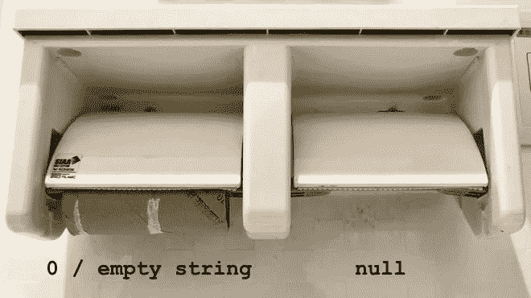
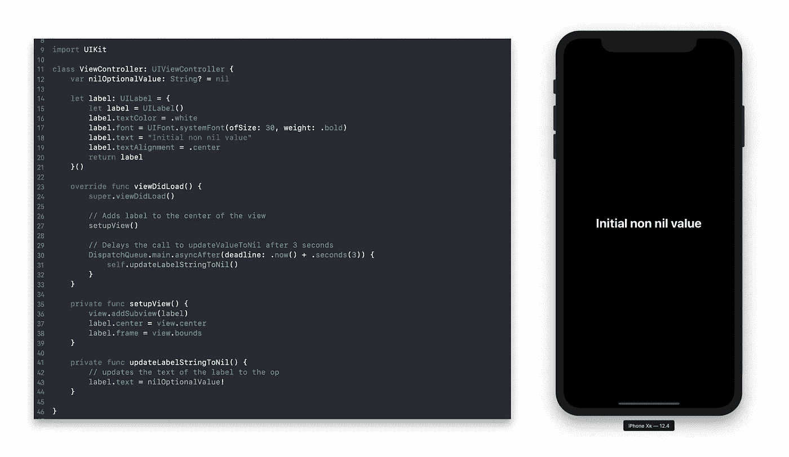
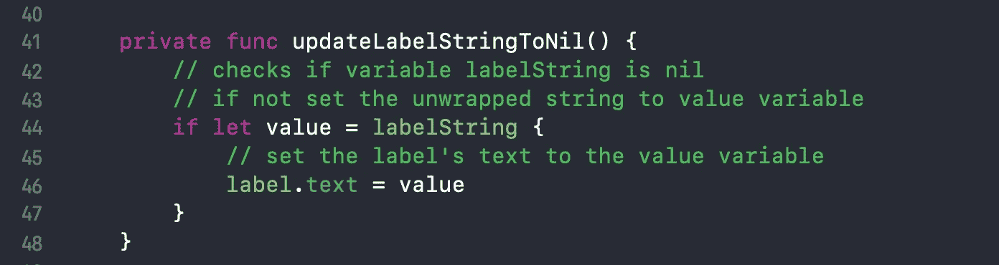
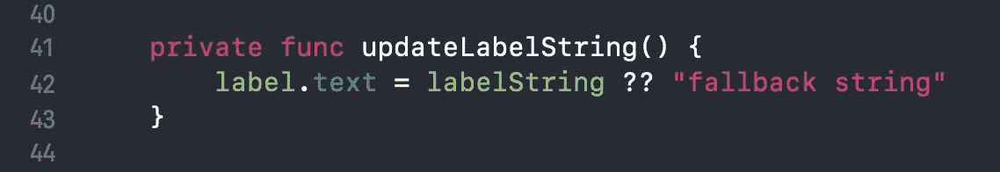

# 如何在 Swift 中处理期权

> 原文：<https://betterprogramming.pub/how-to-handle-optionals-in-swift-a5528ba28772>

## 修复了一个错误，当*展开一个可选值崩溃*


照片由[汉娜·约书亚](https://unsplash.com/@hannahjoshua?utm_source=medium&utm_medium=referral)在 [Unsplash](https://unsplash.com?utm_source=medium&utm_medium=referral) 上拍摄

当我开始用 Xcode 开发 iOS 应用程序时，我经常遇到这个错误:

> **致命错误:展开可选值时意外发现零**

这个致命的错误真的令人沮丧，阻碍了我学习 Swift 的进度。

# 什么是可选的，为什么它会导致我的应用程序崩溃？

简单地说，`Optional`是在 Swift 中使用`nil`值的一种方式。`nil`什么都不是，不同于零(`0`)或空字符串(`""`)。这可以用下图来解释。



null 和 nil 是一样的

空辊仍然是一个值`0`，但是辊原来所在的位置是空的或者没有值。`Null`或`nil`为空点。

为什么你希望你的应用程序中有一个`nil`值？有时这是不可避免的，而其他时候你会故意想要一个空位。例如，一个社交媒体应用程序用户可能不选择在他们的个人资料上显示他们的生日，所以当他们的个人资料被加载时，`Date`值可能是可选的。

# 简单的例子

这很简单`UIViewController`在中间有一个标签。



三秒钟后`viewDidLoad`被调用，`label`的文本被更新为变量`nilOptionalValue`，应用程序崩溃并出现以下错误:


致命错误:展开可选值时意外发现零

这里发生了什么事？

*   变量`nilOptionalValue`是用类型`Optional<String>`创建的。它的值为`nil`，什么都没有，等于零。
*   当稍后在`updateLabelStringToNil()`功能中使用时，通过使用`nilOptionalValue**!**`中的`!`将其“展开”
*   找不到值，应用程序崩溃。

`!`是对编译器的承诺。它说，*“这个值是可选的，但是我知道那里有一个值，我想使用它。”* 当你违背诺言，系统找不到一个价值，它不知道如何处理，它崩溃了。

为什么叫解包？这是我开始时感到困惑的事情。这是因为`Optional`是 Swift 中的一个通用类型，它包装了另一个像`String`一样的值。

```
var labelString: Optional<String>// same thing as var labelString: String?
```

每当你在像`String`这样的类型后面使用`?`时，你都是在用一个可选的。

那么变量名后面的`!`呢？

```
var labelString: String! 
```

这被称为隐式展开。这是对编译器的承诺，变量`labelString`没有值，但在你使用它之前会有。因此，你可以像对待任何其他的`**String**`一样对待它，而不需要以后打开它。

# 好的，但是你如何解决这个致命的错误呢？

有许多方法可以解决这个问题。下面列举几个。

## 1.通过用非可选值初始化变量来避免`Optional`值

```
var labelString: String = "I am a non optional String"// same as writing var labelString = "I am a non optional String"
```

这样，变量将总是有一个值。稍后，您可以使用预期的值来更新变量，例如，从异步网络请求返回的用户名。

您也可以用空值初始化它:

```
// Empty string value
var labelString = ""// empty string array value
var labelStrings: [String] = []// empty Int value
var numberOfLabels = 0
```

然而，我不建议这样做，因为它可能会产生难以调试的意想不到的后果。例如，如果`labelString`是一个空字符串，并且在标签中使用之前没有更新，标签就不会出现，因为它的文本是空的。这可能会导致很多混乱，浪费调试时间。

## 2.将变量初始化为可选变量，检查它是否有值——如果它确实使用它

```
var labelString: String?// same asvar labelString: String? = nil
```

上面的`labelString`变量是一个`Optional<String>`，你可以用一个`if let`语句安全地解开`labelString`。



如果`labelString`为`nil`，则无任何反应。

也可以用`guard let`。


## **3。使用零聚结**

零合并为可选项增加了一个后备值。`??`是修复`fatal error`崩溃的最简单和最安全的方法之一，但是，同样，代价是可能会增加以后花费在调试上的时间。



# 结论

还有许多其他方法来处理期权。希望这能给你足够的上下文来修复崩溃的错误并打开你的进程，但是你不应该就此打住。继续重构，查看下面的参考资料来加强你对 Swift 语言的理解。

## 资源

[苹果可选文档](https://developer.apple.com/documentation/swift/optional)

[简单解释了 Swift 期权](https://hackernoon.com/swift-optionals-explained-simply-e109a4297298)