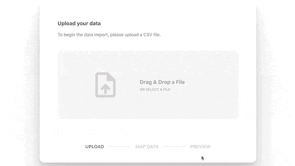

# 如何为您的 Web 应用程序处理电子表格上传

> 原文：<https://betterprogramming.pub/how-to-handle-spreadsheet-uploads-for-your-web-app-70dc266323c3>

## 管理 web 应用程序的电子表格导入、映射和验证


照片由[斯科特·格雷厄姆](https://unsplash.com/@homajob?utm_source=medium&utm_medium=referral)在 [Unsplash](https://unsplash.com?utm_source=medium&utm_medium=referral) 上拍摄。

说到数据，电子表格非常有用，用途广泛。如果您的 web 应用程序处理任何类型的数据——从销售渠道到损益表——您可能已经处理过导入 CSV 文件的问题。

CSV 上传遇到的第一个问题是数据的格式。例如:

*   如果列的名称与您想要的不同(例如，列名为`Name`而不是`FullName`)该怎么办？
*   如果数据的格式不同(即日期格式为`MM-DD-YYYY`而不是`YYYY-DD-MM`)会怎样？
*   如果一些数据无效(例如无效的电话号码，如`123-456-789`)怎么办？


来源: [unDraw](https://undraw.co/)

由于这些可能性，您将意识到您需要某种类型的列映射和验证能力，以便只导入您的 web 应用程序可以理解的有效数据。

对于这个例子，我将使用新的 [gluestick 库](https://github.com/hotgluexyz/gluestick)，它有两个部分:

*   [gluestick-elements](https://www.npmjs.com/package/gluestick-elements) :一组 React 组件，可以轻松地为用户构建直观的导入+验证体验。
*   [gluestick-api](https://hub.docker.com/r/hotglue/gluestick-api) :一个 Dockerized Python API，处理对导入的 CSV 数据的解析、验证和映射。它还允许你将数据直接发送到云服务，如 S3 自动气象站。

如果你喜欢，请随意阅读[胶水棒文档](https://docs.gluestick.xyz/)或[加入他们的松弛部分](https://bit.ly/2KBGGq1)以获取更多信息。为了给你一些参考，最终结果如下所示(一个互动演示是在 CodeSandbox 上提供的[):](https://1c1dl.csb.app/)



最终的映射流程

事不宜迟，让我们开始吧！

# 后端

在我们开始设置前端之前，让 gluestick-api 在本地机器上运行。在这样做之前，确保你已经安装并运行了 Python 和 [Docker](https://www.docker.com/) 。

对于这个例子，我们将使用 gluestick CLI 开始。但是如果你想手动操作，你可以[遵循文档](https://docs.gluestick.xyz/quickstart/installation#install-gluestick-api)。

## 安装 CLI

让我们从安装 CLI 开始，它可以在 [PyPi](https://pypi.org/project/gluestick/) 上获得:

```
$ pip install gluestick
```

## 安装 Docker 映像

现在我们可以获取最新版本的 gluestick-api 并创建默认配置。我建议在一个唯一的目录中执行此操作。

```
$ mkdir mygluestick-project$ cd mygluestick-project$ gluestick installCreated default gluestick-api configuration.
Pulling the gluestick-api Docker image...
Using default tag: latest
latest: Pulling from hotglue/gluestick-api
Digest: sha256:6d1a0fdbd884e252a5e6f7abf8f227366b7a1be4fd2ddae4cbd37fe4f217bbcf
Status: Image is up to date for hotglue/gluestick-api:latest
docker.io/hotglue/gluestick-api:latest
Latest gluestick-api Docker image pulled.
```

从这里，您现在可以为您的数据配置一个[目标，比如 AWS S3，但是我们现在将跳过这一部分。](https://docs.gluestick.xyz/gluestick-api/configuration#configure-a-target)

## 启动 API

现在让我们运行 API。默认情况下，它从端口`5000`开始，但是您可以使用`--port=$PORT`选项更改端口:

```
$ gluestick runStarting gluestick-api...
[2021-04-07 20:30:22 +0000] [1] [INFO] Starting gunicorn 20.1.0
[2021-04-07 20:30:22 +0000] [1] [INFO] Listening at: [http://0.0.0.0:5000](http://0.0.0.0:5000) (1)
[2021-04-07 20:30:22 +0000] [1] [INFO] Using worker: sync
[2021-04-07 20:30:22 +0000] [9] [INFO] Booting worker with pid: 9
```

就是这样！现在，我们可以继续配置前端了。

# 前端

现在我们可以在 React 应用程序中配置`gluestick-elements`库了。

如果你想继续，这个例子的代码可以在 [CodeSandbox](https://codesandbox.io/s/gluestick-demo-1c1dl) 上找到:

## 安装软件包

让我们通过 npm 安装软件包:

```
npm install --save gluestick-elements
```

## 元素‌Add

现在我们可以将 React 元素添加到我们的项目中了！下面是一个带有`[GlueStick](https://docs.gluestick.xyz/gluestick-elements/gluestick)` [组件](https://docs.gluestick.xyz/gluestick-elements/gluestick)的简单例子:

## 测试元素

现在一切都在运行，我们可以测试整个流程了！如果你需要一些测试数据，你可以下载一个[样本](https://cdn.statically.io/gh/hotgluexyz/recipes/master/src/sync-output/Lead-20210128T125258.csv)T4。


最终的映射流程

gluestick 将执行以下操作:

1.  解析输入 CSV 文件并确定可用的列。
2.  挑选最匹配的列名作为建议的映射，并运行任何验证。
3.  向用户显示任何无效行，并告诉他们有效信息占数据的百分比。
4.  向用户预览最终数据。
5.  将数据发送到最终目的地(S3、谷歌云存储等)。).

# 结论

这就是全部了！下一步是[定制您想要的文件的模式](https://docs.gluestick.xyz/gluestick-elements/schema)和[配置您想要的任何目标](https://docs.gluestick.xyz/gluestick-api/configuration#configure-a-target)。

如果你对 gluestick 感兴趣，我推荐你看看[的文档](https://docs.gluestick.xyz/)。

我非常乐意回答下面的任何问题。感谢阅读！