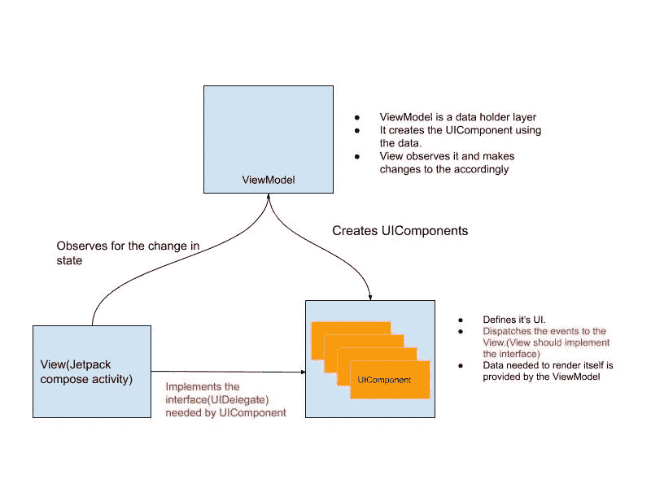

# 如何使用基于组件的架构和 Jetpack Compose 处理用户交互

> 原文：<https://betterprogramming.pub/how-to-handle-user-interactions-with-component-based-architecture-and-jetpack-compose-196e8cdd1aee>

## 使 UIComponents 与 ComposeActivity 交互

由[马腾·戴克斯](https://unsplash.com/@maartendeckers?utm_source=medium&utm_medium=referral)在 [Unsplash](https://unsplash.com?utm_source=medium&utm_medium=referral) 上拍摄。

在我的上一篇文章中，我们使用 Jetpack Compose 创建了可重用的 UIComponents:

 [## 在 Android Jetpack Compose 中创建基于组件的架构

### 用不同的方式思考你的 UI 和它的后续类

medium.com](https://medium.com/better-programming/create-a-component-based-architecture-in-android-jetpack-compose-96980c191351) 

它的功能有限，因为 UIComponents 只能显示在屏幕上。本文将讨论没有被处理的用户交互，比如点击事件。

# 什么是互动？

它是 UIComponents 上的一个事件(例如,`MovieUI`组件上的一个点击事件)。

UIComponent 上的交互将由包含 UIComponents 的`ComposeActivity`类处理。例如，`HomeScreen`中的`MovieView` 上的点击事件由`HomeScreen Activity`处理。

# 我们在建造什么？

我们有`HomeScreen`和`MovieDetailScreen` *。*两者都包含电影(`MovieView` ) *。*点击`MovieView`会导致导航到所点击电影的`MovieDetailScreen` 。

这需要遵循架构中的变化(红色部分):

*   我们的视图模型(表示层)保持不变。
*   `UIComponent`通过一个接口将事件传播到`ComposeActivity`(`UIDelegate`——解释如下)。
*   `ComposeActivity`通过实现上面的接口来处理事件。

# 让我们来建造它吧

1.  首先，我们需要更改 UIComponent。我们将它转换为类型`UIDelegate`的通用接口。`composableView()`函数现在接受泛型`UIDelegate`。

什么是`UIDelegate`？它是一个负责将 UI 事件/交互从`UIComponent`发送到`View` (activity)的接口。下面用一个例子来解释。

MovieView 现在应该可以发送点击事件了。如上所述，交互是通过`UIDelegate`来处理的。为此，`MovieUIDelegate`接口被创建为具有接收电影点击的能力。

这个`UIDelegate`作为参数传递给`Composable`函数**。**

MovieView 将 click 事件传递给 MovieUIDelegate。

**2** 。因此，`MovieListUIComponent`负责将`MovieUIDelegate`传递给`MovieView`。这是一个介于`MovieView`和`ComposeActivity`之间的中间人。

对处理 click 事件进行了更改的 MovieListUIComponent。

**3。**`View`(Jetpack Compose activity)应该实现`MovieUIDelegate`来处理事件。点击电影打开该电影的`MovieDetailScreen` 。

由`ComposeActivity`实现的`UIDelegate`被传递给组件，同时将其呈现在屏幕上。

您可以从这里获得完整的代码:

 [## AnupAmmanavar/电影浏览

### 此时您不能执行该操作。您已使用另一个标签页或窗口登录。您已在另一个选项卡中注销，或者…

github.com](https://github.com/AnupAmmanavar/MovieBrowsing/tree/master/jetpackui/src/main/java/com/kinley/jetpackui/jetcompose) 

在`ComposeActivity`处理多个组件的情况下，这是通常的情况，它需要实现其视图中包含的所有 UIComponents 的所有`UIDelegates`。

# 结论

就是这样！我们已经创建了一个向外部世界发送事件的 UIComponent。现在，这些事件被发送到`ComposeActivity`。在下面的文章中，我们将看到 UIComponent 如何与表示层交互。此外，我们将看到 UIComponents 之间的交互。