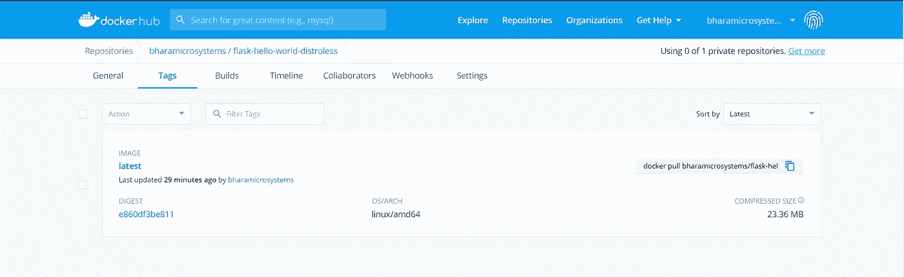
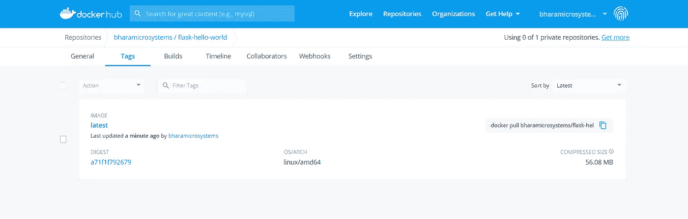

# 如何用 Distroless Docker 镜像来加固你的容器

> 原文：<https://betterprogramming.pub/how-to-harden-your-containers-with-distroless-docker-images-c2abd7c71fdb>

## 在 Kubernetes 上使用 distroless 图像来保护您的容器


照片由[迈克尔·泽兹奇](https://unsplash.com/@lazycreekimages?utm_source=unsplash&utm_medium=referral&utm_content=creditCopyText)在 [Unsplash](https://unsplash.com/s/photos/quantum?utm_source=unsplash&utm_medium=referral&utm_content=creditCopyText) 上拍摄

容器改变了我们看待技术基础设施的方式。这是我们运行应用程序方式的一次巨大飞跃。容器编排和云一起，为我们提供了近乎无限规模的无缝扩展能力。

根据定义，容器应该包含应用程序及其运行时依赖项。然而，实际上，它们包含的远不止这些。一个标准的容器基础映像包含一个包管理器、shells 和其他程序，您可以在标准的 Linux 发行版中找到它们。

虽然所有这些方面对于构建容器图像都是必要的，但它们不一定构成图像的一部分。例如，一旦你安装了包，你就不再需要容器中的`apt`。

它不仅用不必要的包和程序来膨胀你的容器，而且也给网络罪犯提供了攻击特定程序漏洞的机会。

您应该始终知道容器运行时内存在什么，并且应该精确地限制它只包含您的应用程序所必需的依赖项。

你不应该安装任何不需要的东西。一些领先的科技巨头，如谷歌，已经在生产中运行容器多年，已经采用了这种方法。

谷歌现在通过提供[发行版图片](https://github.com/GoogleContainerTools/distroless)向全世界开源了这一功能。他们构建这些映像只是为了包含您的应用程序及其依赖项，并且他们缺少常规 Linux 发行版的所有功能，包括 shells。

这意味着，虽然您可以按常规方式运行您的应用程序，但您不能在它运行时将其附加到容器。这是一个重大的安全改进，因为您现在已经关闭了黑客通过 shell 进入您的容器的大门。

# 分发基础映像

Google 为大多数领先的编程语言和平台提供了发行版基础映像。

以下基本映像是正式发布的版本:

*   [gcr.io/distroless/static-debian10](https://github.com/GoogleContainerTools/distroless/blob/master/base/README.md)
*   【gcr.io/distroless/base-debian10 
*   [gcr.io/distroless/java-debian10](https://github.com/GoogleContainerTools/distroless/blob/master/java/README.md)
*   [gcr.io/distroless/cc-debian10](https://github.com/GoogleContainerTools/distroless/blob/master/cc/README.md)

以下基本映像是实验性的，尚未推荐用于生产:

*   [gcr.io/distroless/python2.7-debian10](https://github.com/GoogleContainerTools/distroless/blob/master/experimental/python2.7/README.md)
*   [gcr.io/distroless/python3-debian10](https://github.com/GoogleContainerTools/distroless/blob/master/experimental/python3/README.md)
*   [gcr.io/distroless/nodejs](https://github.com/GoogleContainerTools/distroless/blob/master/experimental/nodejs/README.md)
*   [gcr.io/distroless/java/jetty-debian10](https://github.com/GoogleContainerTools/distroless/blob/master/java/jetty/README.md)
*   [gcr.io/distroless/dotnet](https://github.com/GoogleContainerTools/distroless/blob/master/experimental/dotnet/README.md)

# 构建分布式图像

Google 在内部使用 Bazel 构建容器图像，但是我们可以使用 Docker 做同样的事情。关于使用发行版映像的一个有争议的问题是:当我们有一个发行版映像时，如何使用 Docker 文件构建我们的应用程序？

通常，Docker 文件从一个操作系统基础映像开始，随后需要执行多个步骤来创建适当的运行时版本。这包括包的安装，你需要像`apt`或`yum`这样的包管理器来完成这个任务。

有两种方法可以做到:

1.  在 Docker 之外构建您的应用程序，并使用 Docker 文件中的`ADD`或`COPY`指令将二进制包复制到容器中。
2.  使用多阶段 Docker 构件。这是 Docker 17.05 及以后版本的一个新特性，允许你将你的构建分成几个阶段。第一阶段可以从标准操作系统基础映像开始，帮助您构建应用程序；第二阶段可以简单地从第一阶段获取构建的文件，并使用发行版的基本映像。

为了理解它是如何工作的，让我们使用多阶段构建过程来做一个实践练习。

# 先决条件

您需要具备以下条件:

*   Docker 版本≥17.05，用于构建容器映像
*   可选的 Kubernetes 群集，用于实践练习的第二部分。如果想在 docker 中运行容器，可以使用等效的 Docker 命令。

# GitHub 知识库

对于动手练习，将这个库分支到你的 GitHub 账户中。克隆分叉的 GitHub 库并将`cd`放入其中。

该存储库包含一个 Python Flask 应用程序，它以“Hello World！”当你调用 API 的时候。

`app.py`文件如下所示:

`Dockerfile`包含两个阶段:

构建阶段:

*   从基础图像开始`python:2.7-slim`
*   将应用程序复制到`/app`目录
*   升级`pip`并安装要求

无发行阶段:

*   从`gcr.io/distroless/python2.7`基础图像开始
*   将应用程序从构建阶段的`/app`目录复制到当前阶段的`/app`目录
*   将 python `site-packages`从构建阶段复制到当前阶段的`site-packages`目录
*   将工作目录设置为`/app`，将 python 路径设置为`site-packages`目录，并暴露`5000`端口
*   将`app.py`作为`CMD`步骤运行

因为发行版映像不包含外壳，所以您应该总是在 vectors 中包含`CMD`指令。如果你不这样做，Docker 会假设它是一个 shell `CMD`并试图像那样执行它，这是行不通的。

建立形象:

登录到您的 Docker 注册表，并将映像推送到其中:

```
$ docker login
$ docker push <your_docker_repo>/flask-hello-world-distroless:latest
```

登录 Docker Hub(或您的容器注册中心)，您应该看到容器映像是可用的:



如果看压缩后的大小，正好是 23.36 MB。太好了。如果您使用如下所示的标准 slim 发行版，它的大小为 56 MB。



你已经减少了一半以上的集装箱占地面积。太神奇了！

# 在 Kubernetes 中运行容器

为了测试构建是否有效，让我们在 Kubernetes 集群中运行容器。如果您没有 Kubernetes，您可以运行等效的 Docker 命令来完成相同的活动，因为 Kubectl 和 Docker 命令是相似的。

我在存储库中创建了一个`kubernetes.yaml`文件，其中包含一个部署和一个负载平衡器服务，该服务使用我们构建的容器映像。

这是一个非常简单的设置。负载平衡器监听端口`80`并映射到目标端口`5000`。pod 监听 flask 应用程序的默认`5000`端口。

应用 yaml 的时间:

```
$ kubectl apply -f kubernetes.yaml
deployment.apps/flask-deployment created
service/flask-service created
```

让我们利用所有资源来看看我们创造了什么:

我们看到有两个`Pods`，一个`Deployment`，一个`LoadBalancer`，一个`Service`，一个`EXTERNAL-IP`，还有一个`ReplicaSet`。

让我们访问应用程序。

```
$ curl [http://35.184.113.120](http://35.184.113.120)
Hello World!
```

我们得到`Hello World!`作为响应。这表明 Flask 应用程序工作正常。

# 对应用程序的外壳访问

正如我在介绍中所描述的，distroless 容器缺少外壳，因此不可能附加到容器上。然而，让我们试着在容器中执行来亲眼看看。

```
$ kubectl exec -it flask-deployment-576496558b-hnbxt /bin/bash
OCI runtime exec failed: exec failed: container_linux.go:349: starting container process caused "exec: \"/bin/bash\": stat /bin/bash: no such file or directory": unknown
command terminated with exit code 126
```

我们无法连接到容器上。

伐木怎么样？我们应该获取日志，因为这样我们就失去了调试应用程序的方法。

让我们试着得到日志。

```
$ kubectl logs flask-deployment-576496558b-hnbxt
 * Running on [http://0.0.0.0:5000/](http://0.0.0.0:5000/)
 * Restarting with reloader
10.128.0.4 - - [31/May/2020 13:40:27] "GET / HTTP/1.1" 200 -
10.128.0.3 - - [31/May/2020 13:42:01] "GET / HTTP/1.1" 200 -
```

而且日志都有！

# 结论

无分布图像是保护容器的一种令人信服的方式。由于映像很小，并且只包含您的应用程序和依赖项，因此它为您的应用程序提供了最小的攻击面。它在更大程度上提高了您的安全性，并且是强化您的容器的一个好方法。

感谢阅读！我希望你喜欢这篇文章。