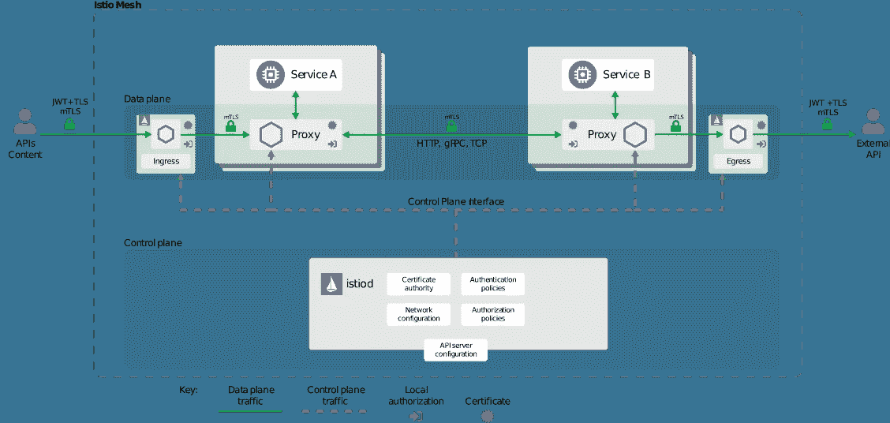
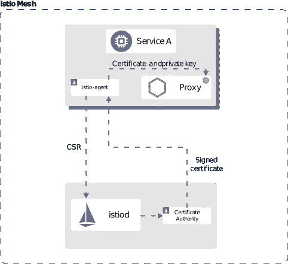

# 如何使用 Istio 强化 Kubernetes 上的微服务

> 原文：<https://betterprogramming.pub/how-to-harden-your-microservices-on-kubernetes-using-istio-29c23dd90670>

## Istio 如何为您的微服务实现安全性

图片由[卡蒂](http://xilophotography)在[西洛摄影](http://xilophotography.com)

在生产中运行[微服务](https://en.wikipedia.org/wiki/Microservices)有很多好处。其中一些是独立的可伸缩性、敏捷性、变更范围的缩小、频繁的部署和可重用性。然而，他们也有自己的一系列挑战。

对于 monolith，安全性的概念围绕着保护单个应用程序。然而，一个典型的企业级微服务应用可能包含数百个相互交互的微服务。

Kubernetes 为托管和编排您的微服务提供了一个出色的平台。但是，默认情况下，微服务之间的所有交互都是不安全的。它们通过明文 HTTP 进行通信，这可能不足以满足您的安全需求。

要在微服务上应用您将在典型企业整体架构上使用的相同原则，您需要确保以下几点:

*   微服务之间的所有通信都经过加密，以防止中间人攻击
*   服务之间存在访问控制，因此只有正确的微服务才能相互连接
*   捕获、记录和审核遥测数据，以了解流量行为并主动检测入侵

[Istio](https://istio.io/) 提供了开箱即用的特性，安装和管理的简单性使开发人员、系统管理员和安全团队能够适当地保护他们的微服务应用，而不会互相影响。

借助 Istio，您可以实施强大的身份和访问管理、透明的 TLS 和加密、身份验证和授权以及审计日志记录，所有这些都使用单一控制平面。

这个故事是对“[如何在 Kubernetes](https://medium.com/better-programming/how-to-visualise-your-istio-service-mesh-on-kubernetes-209c7b439a41) 上可视化您的 Istio 服务网格”的跟进今天，我们来讨论使用 Istio 来强化您在 Kubernetes 上运行的微服务。

本文假设您对 Kubernetes 和 Istio 有基本的了解。如果没有，我建议您查看“[如何使用 Istio](https://medium.com/better-programming/how-to-manage-microservices-on-kubernetes-with-istio-c25e97a60a59) 管理 Kubernetes 上的微服务”以获得快速介绍。

# Istio 安全性的工作原理

如果您正在阅读本系列，您应该知道 Istio 会自动在您的 pods 中注入 sidecar 代理，并修改您的 Kubernetes 集群的 IP 表，只允许通过代理进行连接。

默认情况下，此设置启用 TLS 加密。您不需要为您的微服务做任何特殊的配置，因为 Envoy 代理通过 TLS 相互通信。

虽然默认设置允许基本的安全性并防止中间人攻击，但通过实施策略来进一步强化您的微服务是有意义的。然而，在深入研究这些特性之前，让我们先来看看安全性如何在 Istio 上工作的高级概述。

Istio 包含以下用于加强安全性的组件:

*   用于管理密钥和证书的认证机构
*   配置 API 服务器，向特使代理分发认证策略、授权策略和安全命名信息
*   sidecar 代理通过提供策略执行点来帮助保护网格。这是根据提供给它的策略进行操作的组件。
*   特使代理扩展允许遥测数据收集和审计

[Istio security](https://istio.io/docs/concepts/security/arch-sec.svg)

# Istio 如何管理身份和证书

Istio 需要识别每个微服务，以便在其上应用策略。Istio 通过 X509 TLS 证书建立身份，每个 Envoy 代理都使用这些证书。

Envoy 代理包含 Istio 代理，它与 istiod 进行对话，为每个微服务提供并轮换证书和私钥。这允许额外的安全性，因为您不需要担心轮换证书。

如果某个密钥被破解，Istio 会很快用新密钥替换它，从而大幅减少攻击面。

Istio 使用以下步骤来实施它。

1.  特使使用特使秘密发现服务(SDS) API 发送证书和私钥请求
2.  Istio 代理通过为代理生成 CSR 和私钥来响应这个请求，然后将 CSR 及其凭证发送给 Istio
3.  istiod 托管的证书颁发机构(CA)验证请求凭据并签署 CSR 以生成证书
4.  然后，istio 代理下载证书，并通过 SDS API 将其发送给特使代理

该过程定期重复，以提供证书和私钥轮换。

[Istio 证书管理](https://istio.io/docs/concepts/security/id-prov.svg)

# Istio 认证

Istio 提供两种类型的身份验证:

*   **对等认证** — Istio 在两个微服务相互交互时应用这种认证。Istio 使用相互 TLS 进行对等身份验证。
*   **请求认证** — Istio 允许最终用户和系统使用请求认证与 Istio 微服务进行交互。它使用 [JSON Web 令牌](https://jwt.io/) (JWT)来实现这一点。您还可以将 Istio 与任何使用 [OAuth、](https://oauth.net/)的定制身份验证提供者挂钩，例如 [OpenID Connect](https://openid.net/connect/) 和 [Google Auth](https://www.google.com/landing/2step/) 。

Istio 使用`PeerAuthentication`策略来确定认证和加密要求的级别。默认情况下，Istio 以`PERMISSIVE`模式验证客户端。这意味着除了允许来自对等体的 TLS 流量之外，它还接受来自源的明文流量。

最近引入 Istio 的组织可能需要它，因为他们正在将其工作负载迁移到 Istio。

这消除了由于各种原因升级源以使用 Istio 的运营商的大量开销。这为组织提供了无缝的入职体验。

一旦你拥有了整个企业，或者你是从零开始，你应该关闭`PERMISSIVE`模式，启用`STRICT` mutual TLS only 模式。这不仅可以防止中间人攻击，还可以确保通过您的网络的所有流量都是加密的。

如果需要，您可以通过在`DISABLE`模式下运行 Istio 认证来关闭微服务之间的相互 TLS。这是不推荐的，除非您提供定制的安全解决方案，否则您不应该使用它。

您可以在全局级别、名称空间级别或工作负载级别实施`PeerAuthentication`策略。您的具体用例决定了您希望如何应用它。

下面的 YAML 在`foo`命名空间层应用`STRICT` `PeerAuthentication`策略。

# Istio 授权

现在让我们进入下一个阶段。到目前为止，我们已经确保 Istio 中的微服务之间的通信是加密的，并且服务了解他们的客户是谁。

但是，如果您希望确保只有正确的微服务相互接口，该怎么办呢？例如，如果您有一个前端微服务、一个业务层微服务和一个后端，您不会希望允许前端微服务直接与后端进行通信。相反，您会希望通过业务层路由这种通信。

您可以使用`AuthorizationPolicy`资源来启用微服务之间的授权，并使用以下内容来建立适当的流量通道:

*   `selector`字段指定策略目标
*   `action`字段指定是将请求`allow`还是`deny`
*   `rules`部分使用`from`、`to`和`when`属性定义何时应用`action`

让我们看一个例子来进一步理解。

下面是一个微服务的典型实现，它允许来自 OAuth 场景中经过 Google 认证的源的请求。

YAML 档案:

*   选择所有标有`app: httpbin`和`version: v1`的目标
*   当提供的`JWT`的发布者声明具有值`[https://accounts.google.com](https://accounts.google.com)`时，允许来自使用服务帐户`cluster.local/ns/default/sa/sleep`的容器和来自`dev`名称空间中的所有容器的请求仅指向目标的`GET`方法

让我们看一些更简单的东西。只允许从`foo`名称空间到`httpbin:v1`微服务的所有请求怎么样？

如果你仔细观察 YAML，它实现了一个`DENY`动作。不要搞混了，因为来源是`notNamespaces`。这意味着该策略拒绝所有请求，除非它来自`foo`名称空间。

拒绝策略优先于允许策略。它首先评估拒绝策略，以确保无论允许策略如何，与拒绝策略匹配的请求都会被拒绝，因此在设计策略时请记住这一点。

让我们看一个不同的场景。如何只允许对`products`应用程序的`GET`和`HEAD`方法的请求？

由于 Istio Envoy 代理在第 7 层上工作，您还可以在主机名、URL 路径和 HTTP 头等方面进行匹配。下面的例子允许对`products`微服务的路径`/test/*`和`*/info`的所有请求。

Istio 提供了许多实施授权策略的方法，上面的列表并不详尽。

# 结论

感谢您通读。我希望你喜欢这篇文章。

在下一部分“[使用 Istio](https://medium.com/better-programming/enable-mutual-tls-authentication-between-your-kubernetes-workloads-using-istio-65338c8adf82) 在您的 Kubernetes 工作负载之间启用相互 TLS 认证”中，我们将通过实际操作演示深入探讨 Istio 认证，下一篇文章再见！