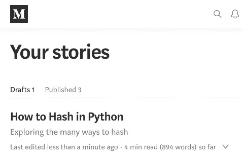

# 如何在 Python 中散列

> 原文：<https://betterprogramming.pub/how-to-hash-in-python-8bf181806141>

## 加密、解密、校验和等


照片由[文森特·索罗门](https://unsplash.com/@vincentiu?utm_source=medium&utm_medium=referral)在 [Unsplash](https://unsplash.com?utm_source=medium&utm_medium=referral) 拍摄

哈希是大多数编程语言的关键部分。大量的数据可以在一个固定的缓冲区中表示。键值结构使用散列来存储引用。

哈希用于保护。哈希可以是确定性的，也可以是不确定性的。数据的微小变化或非常相似的情况下，哈希可能会有很大的不同。

本文将回顾 Python 中最常见的数据散列方法。

# 1.内置散列法

Python 提供了内置的`.hash()`函数，如下所示。

```
>>> hash("test")
2314058222102390712
```

以上是在 Python 2.7 运行的，我们试试 Python 3.7。

```
>>> hash("test")
5946494221830395164
```

对于每个新的 Python 调用，结果都是不同的。Python 从未保证过`.hash()`是确定性的。

在 Python 2.x 中，它在大多数情况下是确定的，但并不总是如此。Python 3.x 在`.hash()`中加入了随机性，以提高安全性。字典、集合和列表的默认排序顺序由内置哈希支持。

我有一个[完整的项目](https://github.com/neuml/py27hash)，涵盖了 Python 3.x 中的 Python 2.x 哈希。一般来说，不应该依赖`.hash()`进行任何跨 Python 调用。

# 2.总和检查（checksum 的复数形式）

校验和用于验证文件中的数据。ZIP 文件使用校验和来确保文件在解压缩时不会损坏。与 Python 的内置哈希不同，它是确定性的。相同的数据每次都会返回相同的结果。

下面是一个使用 [zlib](https://www.zlib.net/) 的 alder32 和 crc32 的例子。Alder32 通常是更好的选择，因为它比 crc32 快得多，而且几乎和 crc32 一样可靠。

```
>>> import zlib
>>> zlib.adler32(b"test")
73204161
>>> zlib.crc32(b"test")
3632233996
```

对于小型数据库，adler32 可以用作简单的 ID 哈希。但是随着数据的增长，冲突将很快成为一个问题。

# 3.安全散列

安全散列和消息摘要已经发展了多年。从 MD5 到 SHA1 到 SHA256 再到 SHA512。

每种方法的大小都会增加，从而提高安全性并降低哈希冲突的风险。冲突是指两个不同的数据数组解析为相同的哈希。

哈希可以获取大量任意数据并构建内容摘要。开源软件为他们的软件包建立摘要，帮助用户知道他们可以相信文件没有被篡改。对文件的小改动会导致一个非常不同的散列。

看看两个 MD5 散列在改变一个字符后有多大的不同。

```
>>> import hashlib
>>> hashlib.md5(b"test1").hexdigest()
'5a105e8b9d40e1329780d62ea2265d8a'
>>> hashlib.md5(b"test2").hexdigest()
'ad0234829205b9033196ba818f7a872b'
```

让我们来看看一些常见的安全哈希算法。

## MD5–16 字节/128 位

MD5 散列是 16 字节或 128 位长。请参见下面的示例，注意十六进制摘要将每个字节表示为十六进制字符串(即前导 09 是一个字节)。MD5 散列不再常用。

```
>>> import hashlib
>>> hashlib.md5(b"test").hexdigest()
'098f6bcd4621d373cade4e832627b4f6'
>>> len(hashlib.md5(b"test").digest())
16
```

## SHA1–20 字节/160 位

SHA1 散列是 20 字节或 160 位长。SHA1 哈希也不再常用。

```
>>> import hashlib
>>> hashlib.sha1(b"test").hexdigest()
'a94a8fe5ccb19ba61c4c0873d391e987982fbbd3'
>>> len(hashlib.sha1(b"test").digest())
20
```

## sha 256–32 字节/256 位

SHA256 哈希是 32 字节或 256 位长。SHA256 哈希是常用的。

```
>>> import hashlib
>>> hashlib.sha256(b"test").hexdigest()
'9f86d081884c7d659a2feaa0c55ad015a3bf4f1b2b0b822cd15d6c15b0f00a08'
>>> len(hashlib.sha256(b"test").digest())
32
```

## sha 512–64 字节/512 位

SHA512 哈希的长度为 64 字节或 512 位。SHA512 哈希是常用的。

```
>>> import hashlib
>>> hashlib.sha512(b"test").hexdigest()
'ee26b0dd4af7e749aa1a8ee3c10ae9923f618980772e473f8819a5d4940e0db27ac185f8a0e1d5f84f88bc887fd67b143732c304cc5fa9ad8e6f57f50028a8ff'
>>> len(hashlib.sha512(b"test").digest())
64
```

# 4.近似重复检测

到目前为止，当数据发生变化时，上述所有方法都会生成明显不同的散列。

散列函数的一个很好的特性是通过对数据的微小改变来生成明显不同的散列，尤其是对于消息摘要。想象一下，如果有人篡改了一个文件，而散列只是略有不同，那就不好了。

但是如果目标是找到*相似的*内容呢？重复或近似重复检测有助于减少存储的数据量。

一些用例需要识别微妙的数据差异，如剽窃检测。下面的例子将安装 [Simhash](https://github.com/leonsim/simhash) Python 库来演示。

```
pip install simhash
```

安装完成后，将运行以下代码。

请注意，对于接近的数据，哈希是多么相似。但是对于不同的数据来说，就差得多了。

# 5.感知哈希

我们要讨论的最后一种哈希是感知哈希。这种哈希方法用于检测图像和视频中的差异。

这方面的一个例子是检测视频中的近似重复帧。可以使用算法来消除视频中重复内容的存储，或者确定图像是否足够接近以将其视为重复，从而节省空间。

下面的例子显示了两个近似重复的图像，以及它们的感知哈希有多接近。 [ImageHash](https://github.com/JohannesBuchner/imagehash) Python 库用于演示。

```
pip install ImageHash
```

使用了以下图像:



原象


修改后的图像—删除了“迄今为止 4 分钟阅读(894 个单词)”

请注意，底部的图像几乎是相同的，除了它删除了右下角的文本。如果使用像 MD5 这样的安全散列，散列将与设计的显著不同。让我们看看。

正如所料，散列是完全不同的。现在让我们试试 ImageHash。

哈希值不同，但非常接近。结尾只有一个字节不一样。ImageHash 允许减去两个散列来得到差值。

在某些情况下，可能希望这是一个副本，或者检测图像中的细微差异可能很重要。感知哈希为开发人员提供了检测这一点的选项。

# **结论**

本文介绍了在 Python 中散列数据的许多不同方法。根据不同的用例，这些方法为构建散列提供了许多选项。希望这有助于当前或未来的项目。