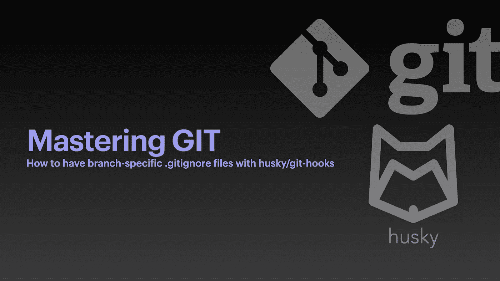

# 如何拥有分支机构？用 Husky/git-hooks 忽略文件

> 原文：<https://betterprogramming.pub/how-to-have-branch-specific-gitignore-files-with-husky-git-hooks-4ca04d7e78cf>

## 掌握 Git



# 介绍

我敢肯定，几乎每个开发人员都遇到过 [**Git**](https://git-scm.com) 并且你们中的大多数人可能对它又爱又恨。我记得当我第一次开始使用 Git 时，我非常讨厌它——它既不能像预期的那样工作，也不能(或不能)像预期的那样使用它。

从那以后很多事情都变了，而且不止一次，Git 已经救了我的命！

我们的团队正在维护一个相当大的 [Monorepo](https://en.wikipedia.org/wiki/Monorepo) ，它有多个不同的暂存环境——全部通过 [Git 分支](https://git-scm.com/docs/git-branch)控制。因此，我们需要*忽略*某些不属于我们正在推进的特定分支的代码。或者换句话说

> 我们不想分支特定的`.gitignore`文件

我经常被问到我们是如何做到这一点的，最近在互联网上的研究表明，关于分支机构特定环境的信息和/或教程并不多。显然，有多种方法能够达到相同的结果，但是通过 husky 使用 Git 挂钩似乎是最快、最可靠的解决方案。

# 设置

此示例使用具有以下依赖关系的存储库:

*   [纱版莓](https://yarnpkg.com/getting-started/install) `v3.2.0`
*   [Git](https://git-scm.com/downloads) 版本`2.34.1` *(全球安装或作为你的软件包的一部分)*
*   [husky](https://typicode.github.io/husky/) `v8.0.1` *(快速设置*[*git-hooks*](https://git-scm.com/book/en/v2/Customizing-Git-Git-Hooks)*)*

我假设您熟悉 Yarn，并且已经建立了一个存储库。此外，我假设您对 Git 有基本的了解——尤其是在提交方面，您应该知道如何创建分支。

## 1.安装 husky

设置[哈士奇](https://typicode.github.io/husky/#/?id=install)真的很简单，只需要几个步骤。显然，你可以只用 Git 钩子实现完全相同的行为，但是我发现 husky 是一个更快更简单的解决方案。

哈士奇配备了自动安装功能，运行良好，但我发现这并不是真正必要的。此外，它还创建了一个样本预提交挂钩，该挂钩(如果您使用 Yarn)将阻止您提交到您刚刚安装了 husky 的分支。

我推荐手动安装，因为它非常简单，您可以完全控制每一个步骤以及 Git 挂钩的实际创建。

为此，只需运行(确保您的项目在您的`package.json`中设置为`private: true`)

```
yarn add -D husky && yarn husky install
```

在您的项目根目录中。如果一切顺利，您将看到提示

> husky —安装了 Git 挂钩

还有一个文件夹`.husky`在你的项目大纲里。


的。husky 文件夹将包含相关的 Git 钩子和。gitignore 文件。

## 2.通过 husky 创建一个 Git 挂钩

有一整个系列的 Git 挂钩[可用，但由于我们对不同分支有不同的`.gitignore`文件感兴趣，我们正在寻找后结帐挂钩。每当我们成功切换分支时，这个钩子就会被执行。为了让这个钩子工作，我们只需运行:](https://git-scm.com/book/en/v2/Customizing-Git-Git-Hooks)

```
yarn husky add .husky/post-checkout 'echo "Hello Git Hook"'
```

这将在你的`.husky`文件夹中创建一个名为`post-checkout`的文件。

使用`git add . & git commit -m "Created post-checkout hook"`提交您刚刚做出的更改。

签出任何其他分支(如果您没有分支，您可能希望通过运行`git checkout -b husky`来创建一个分支——任何分支名称都可以)并签回当前分支，您应该会看到

> 你好 Git Hook

这是您的命令行。

恭喜你！您刚刚创建了您的第一个 Git 挂钩！

# 创建结账后工作流程，使其具有不同的。git 忽略每个分支的文件

在我们继续之前，我们需要创建一个包含特定于分支的`.gitignore`文件的文件夹。我选择把它们放在`.husky/gitignores`里面，但是显然，你可以把它们放在任何你想放的地方。

根据您的包管理器和您的存储库的结构，您已经有了一个全局的`.gitignore`。如果你已经建立了你的项目与纱浆果，你一定会有一个与标准纱忽略。

基本上，我们将把`.gitignore`文件分割成这个全局文件，它包含一般设置——对于每个分支都是一样的，而分支特定忽略了仅对特定分支有效的设置。

后者我们以`.gitignore_<branch_name>`为后缀。对于本教程，让我们假设我们有两个分支称为`main`和`husky`，其中主要有标准纱忽略和分支哈士奇需要一些额外的文件/文件夹忽略。

我们通过运行(在 Linux/Mac 上)来设置它

```
mkdir .husky/gitignores
```

如果您的 repo 中已经有一个`.gitignore`(您应该有)，那么将这个文件复制到我们刚刚创建的文件夹中

```
cp .gitignore .husky/gitignores
```

现在让我们为我们的哈士奇分公司创建特定的`.gitignore_husky`

```
touch .husky/gitignores/.gitignore_husky
```

你可以像对待一个普通的`.gitignore`文件一样对待这个文件，你可以把任何你想忽略的 husky 分支放入其中。这个文件的内容将被追加到全局`.gitignore`中。

快好了！现在，将下面的代码复制并粘贴到我们之前通过 husky 命令创建的`post-commit`文件中

提交更改后，当切换分支时，一个新的包含来自`.gitignore_husky`的内容的`.gitignore`将出现在您的根目录中！

> **注意**:记住如果你想要更新全局`.gitignore`，你将不得不在`.husky/gitignores/.gitignore`中编辑它，因为你的库的根目录中的文件将在你每次改变分支时被覆盖！

在我的回购根中创建的`.gitignore`看起来像

```
# GENERAL IGNORES
# ------------------------------
# Attention! Do not change things here, things will get overridden
# on the next checkout. Changes need to be done in .husky/.gitignore# Yarn
.yarn/*
!.yarn/patches
!.yarn/plugins
!.yarn/releases
!.yarn/sdks
!.yarn/versions
!.yarn/cache# Environment specific
.DS_Store# Branch ::: husky
# -------------------------------
ignorethisfile.txt# Comments also work
morefiles.test# Folders
!./test
```

# 摘要

*   **第一步:** `yarn add -D husky && yarn husky install`
*   **第二步:** `yarn husky add .husky/post-checkout`
*   **第三步:** `mkdir .husky/gitignores && cp .gitignore .husky/gitignores`
*   **第四步:** `touch .husky/gitignores/.gitignore_husky`
*   **第五步:**将[要点内容](https://gist.github.com/Poolshark/52e9ee27ddad34faff282f9b1f716bc9)(向下滚动本页)复制粘贴到`.husky/post--checkout`