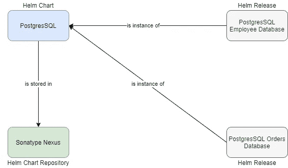
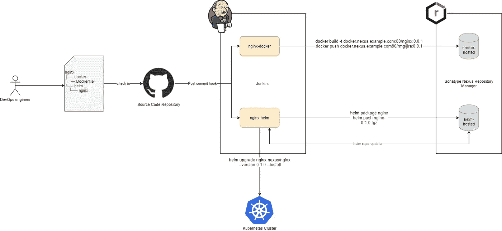
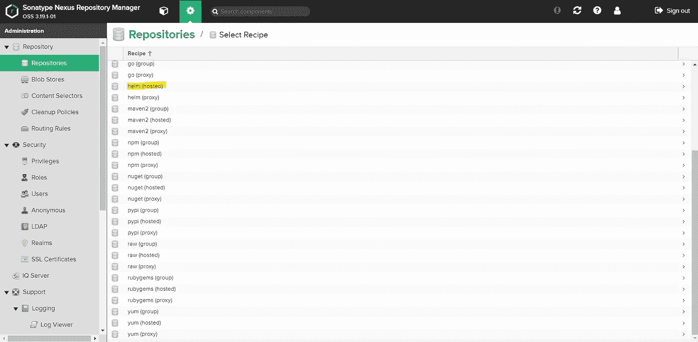
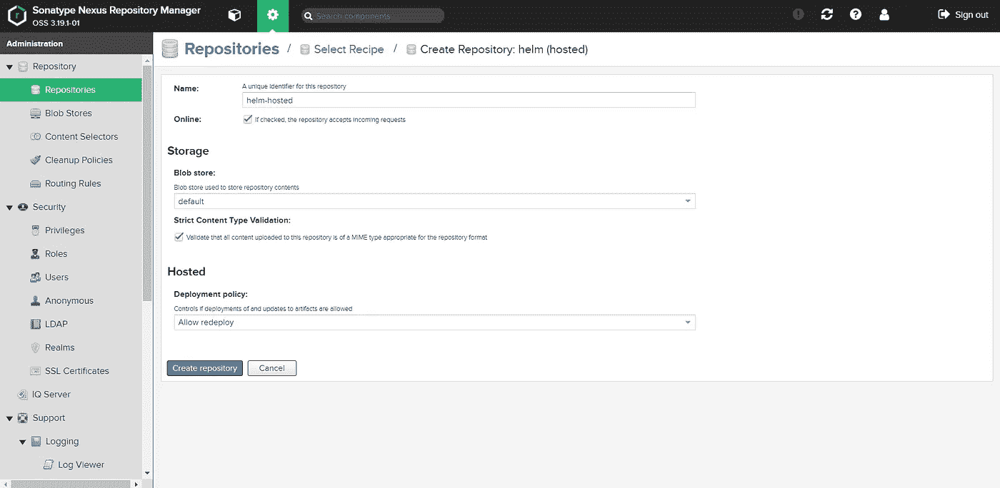
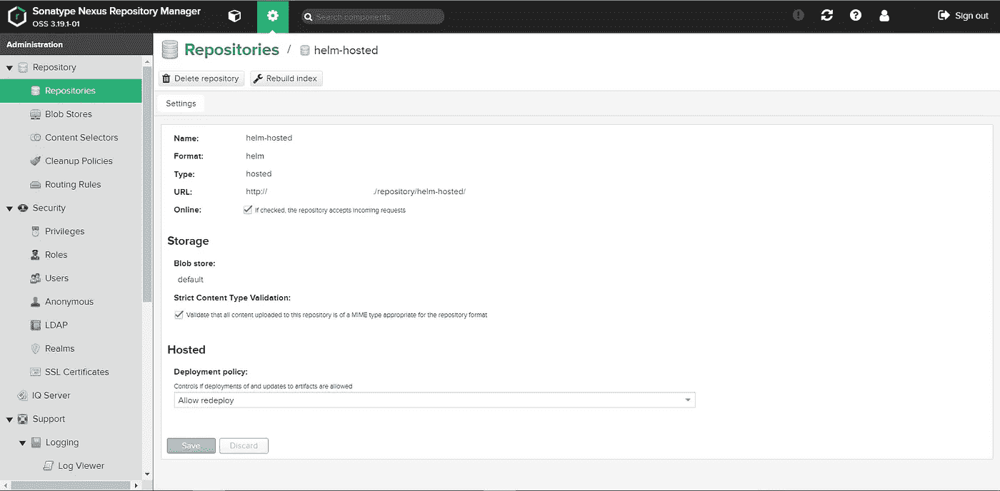
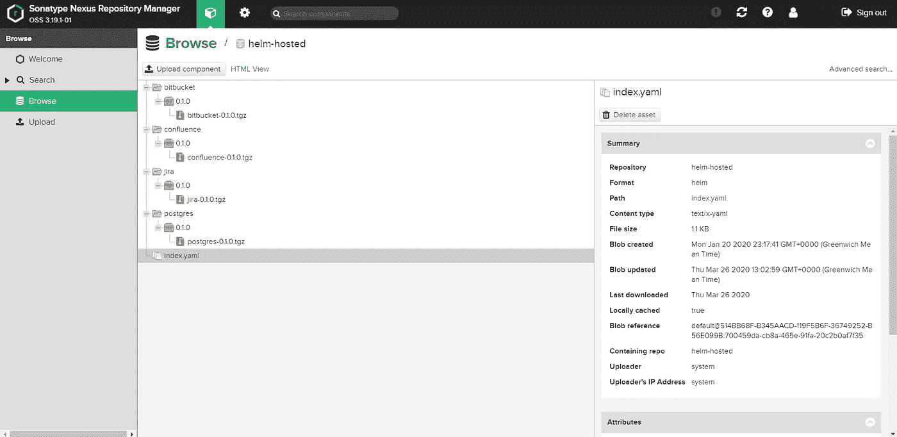

# 如何用 Sonatype Nexus 掌舵

> 原文：<https://betterprogramming.pub/how-to-helm-with-sonatype-nexus-c49c98324a19>

## 使用 Sonatype Nexus 作为 CI/CD 的导航库


弗兰克·艾弗特在 [Unsplash](https://unsplash.com?utm_source=medium&utm_medium=referral) 上拍摄的照片

[Helm](https://helm.sh/) 是 Kubernetes 第一个也是最受欢迎的包管理器。它允许 DevOps 团队对 Kubernetes 应用程序进行版本控制、分发和管理。

虽然人们可以接受标准的 kubectl 命令和 Kubernetes 清单 YAML 文件，但当组织在微服务架构上工作时——有数百个容器相互交互——有必要对 Kubernetes 清单进行版本化和管理。

Helm 现在正成为管理 Kubernetes 应用程序的标准，也是任何使用 Kubernetes 的人的必要技能。

# 为什么是赫尔姆？

显而易见的问题是:我们为什么需要赫尔姆？让我们找出答案。

## **Helm 让模板应用变得简单**

Docker 图像形成 Docker 容器的模板。您可以使用一个 Docker 图像来创建多个容器。

对于 Kubernetes 来说，情况并非如此。您不能轻易重用清单文件。例如，如果您必须部署两个 PostgreSQL 实例，您必须复制您的清单文件。

Helm 使用图表和变量帮助您管理它。您只需要创建一个通用的 PostgreSQL 图表，并使用变量以发布的形式部署不同的实例。

## **Helm 使 Kubernetes 应用程序的版本控制成为可能**

开发人员最初使用 YAML 文件创建 Kubernetes 清单，然后存储在源代码库中。

这种方法的问题是清单没有语义版本。源代码库并不是发布版本的合适地方。您应该始终将您的发布版本作为软件包。Helm 通过将您的应用程序打包在 Helm chart 中解决了这个问题，这使得在 Helm 存储库中存储多个版本的图表成为可能，并且您可以快速部署或回滚一个版本，而无需从源代码进行构建。

## **Helm 使重复使用和共享成为可能**

对于 Docker 图片，你可以在 DockerHub 上分享你的图片——这在 Kubernetes 上是不可能的。有了像 [Kubernetes charts](https://github.com/helm/charts) 这样的公共舵手库，现在这是可能的。公共舵库允许重用 Kubernetes 应用程序，使供应商能够为消费者提供标准舵图，并使他们的生活变得简单。

## **Helm 使部署 Kubernetes 应用程序变得简洁**

有了 Helm，你可以运行简单的命令，比如`helm install`和`helm del`，来安装和删除发布。

你不必担心找到清单文件和运行`kubectl delete`。有了 Helm，一切都充满活力。

## **Helm 使依赖管理成为可能**

让我们以一个灯堆为例。Apache 对 MySQL 有明显的依赖性。没有 MySQL 就不应该安装 Apache。

使用 Helm，您可以在 Apache 图表上添加 MySQL 的依赖项来实现这一点，这是您无法用纯 Kubernetes 清单实现的。

## **Helm 帮助执行标准**

Helm 允许图表开发人员从标准模板开始，他们可以根据自己的应用需求定制模板。

标准模板将使他们能够满足使用 Kubernetes 开发应用程序的最低标准。Helm 生成的 manifest 模板是有一定质量的，开发者从中学习。

# 掌舵的三大概念

在上一节中，我已经介绍了许多行话——让我们看看它们是什么意思。

## 舵图

图表是一个舵包。如果你理解 Linux，掌舵图就相当于 Kubernetes 的 RPM 或 DEB。Helm chart 将您的 Kubernetes 清单包装成带有图表版本和所有所需依赖项的动态模板，这允许您标准化和分发您的应用程序。

## 舵释放

Helm release 是 Kubernetes 集群上 Helm 图表的一个实例。舵图作为发布的模板，而发布是实际运行的舵应用程序。

您可以使用同一个舵图创建多个版本。例如，您想要安装两个独立的 PostgreSQL 实例，您可以使用 PostgreSQL Helm 图表创建两个具有不同变量的版本。

## 赫尔姆仓库

掌舵仓库存储掌舵图表，就像 Yum 仓库存储 rpm 一样。任何需要在 Kubernetes 上安装应用程序的人都可以使用简单的 Helm 命令从 Helm 库下载应用程序。

Helm 存储库可以在任何 web 服务器上运行，因此，托管一个服务器很简单。传统的方法包括在`charts`目录中创建一个`index.yaml`文件，这个文件是在 web 服务器的`public`文件夹中创建的，当您将图表推入存储库时，手动更新这个文件。以下是网络服务器目录结构的示例:

```
charts/
  |
  |- index.yaml
  |
  |- alpine-0.1.2.tgz
  |
  |- alpine-0.1.2.tgz.prov
```

然而，目前成熟的组织使用某种形式的工件库管理器，例如 [Sonatype Nexus](https://www.sonatype.com/) ，它与他们的 CI/CD 管道集成。



掌舵的三大概念

# 带 Docker 和 Helm 的 CI/CD

带有 Docker 和 Helm 的典型持续集成和持续部署(CI/CD)管道如下所示:



DevOps 工程师创建 Docker 文件和所需的依赖项(以及应用程序的舵图),并将其推送到源代码库。

源代码存储库有一个到诸如 Jenkins 之类的 CI/CD 工具的提交后挂钩，它:

*   使用 Docker 文件构建 Docker 映像，并将其推送到 Sonatype Nexus 中的 Docker 存储库
*   打包舵图并将其推送到 Sonatype Nexus 中的舵库

然后，它使用`helm repo update`用 Nexus 的最新包更新索引，并触发 Kubernetes 运行`helm upgrade --install`来升级现有版本或根据 Nexus 中可用的最新图表安装新版本。

# 在 Sonatype Nexus 上托管舵库

Nexus 使组织和管理存储库变得容易，因为它们为各种技术提供了对多种类型存储库的支持，如 Maven、Yum、Go、Python、npm、Docker 等。

对于已经使用 Sonatype Nexus 的组织来说，在 Nexus 中托管他们的头盔库是有意义的。

Sonatype 并不正式支持头盔库。然而，已经有社区在努力构建托管 Helm 存储库的能力。

一个这样的项目是[这里的](https://github.com/sonatype-nexus-community/nexus-repository-helm)。

我将演示如何使用该项目使 Nexus 能够存储舵图。

## 在 nexus 上安装 nexus-repository-helm 插件

识别您的 Nexus 安装版本，并使用[该](https://github.com/sonatype-nexus-community/nexus-repository-helm#compatibility-with-nexus-repository-manager-3-versions)表使用插件的正确版本。然后，运行以下命令来生成插件 Jar 文件。

```
git clone [https://github.com/sonatype-nexus-community/nexus-repository-helm.git](https://github.com/sonatype-nexus-community/nexus-repository-helm.git)
cd nexus-repository-helm
git checkout <plugin_version> #e.g. git checkout 0.0.13
mvn clean package
```

在`<nexus_dir>/system/org/sonatype/nexus/plugins/nexus-repository-helm/<plugin_version>/nexus-repository-helm-<plugin_version>.jar`将生成的 Jar 从`nexus-repository-helm/target`目录复制到 Nexus plugins 目录。

编辑`features.xml`文件，将插件包含在 Nexus 配置中。

如果你使用的是 Nexus 3.21 及更新版本，编辑`<nexus_dir>/system/org/sonatype/nexus/assemblies/nexus-cma-feature/3.x.y/nexus-cma-feature-3.x.y-features.xml`。

对于旧的 OSS 版本，编辑`<nexus_dir>/system/com/sonatype/nexus/assemblies/nexus-oss-feature/3.x.y/nexus-oss-feature-3.x.y-features.xml`。

对于旧的专业版，编辑`<nexus_dir>/system/com/sonatype/nexus/assemblies/nexus-pro-feature/3.x.y/nexus-pro-feature-3.x.y-features.xml`。

将以下标有`+`的行添加到文件中。保存文件，并重启 Nexus。

如果一切正常，那么 Helm(托管)和 Helm(代理)将会出现在存储库配方中。

## 创建 Helm 托管的存储库

在 Nexus 上创建一个名为`helm-hosted`的舵手库，使用舵手(托管)配方。



选择配方



创建存储库



Helm 托管的存储库

# 测试设置

既然我们已经成功地在 Nexus 上配置了`helm-hosted`存储库，那么是时候在您的 Kubernetes 集群上测试它了。

## 访问 Helm 存储库

使用以下命令将 Nexus 存储库添加到您的 Helm 配置中:

```
helm repo add nexus http://<username>:<password>@<nexus_url>/repository/helm-hosted/
```

然后，您可以使用 Helm 访问 Nexus 存储库。

## 将舵图推向 Nexus

为了将你的头盔图推送到 Nexus，我们首先打包图表，然后使用 curl 将图表上传到`helm-hosted`库。

```
helm package <chart_dir>
curl -v -F file=@chart.tgz -u <username>:<password> http://<nexusurl>/service/rest/v1/components?repository==helm-hosted
```

浏览`helm-hosted`存储库，查看您上传的资产。



资产已上传

检查一下`index.yaml`文件，你会发现它已经自动更新了。

## 从 Nexus 安装舵图

要从 Nexus 安装您的 Helm 图表，您需要使用`helm repo update`用 Nexus 上的最新软件包更新您的本地回购指数，然后运行`helm install`从图表创建一个新版本。

```
helm repo update
helm install --name <release-name> nexusrepo/<chart> --version <version>
```

如果一切顺利，Helm 将从 Nexus 下载图表并安装到您的 Kubernetes 集群上

# 进一步阅读

感谢您的阅读。我希望你喜欢这篇文章。如果您有兴趣了解更多信息，请查看以下文章，您可能会感兴趣:

[](https://medium.com/better-programming/demystifying-kubernetes-objects-understanding-the-what-why-and-how-18b42c9ca9c2) [## 揭开 Kubernetes 物件的神秘面纱

### 理解什么、为什么和如何

medium.com](https://medium.com/better-programming/demystifying-kubernetes-objects-understanding-the-what-why-and-how-18b42c9ca9c2)  [## 在基于虚拟机的 K8S 集群中使用 Azure Kubernetes 提供程序

### 建立 kubernetes 集群有多种方式，一些组织希望从头开始…

medium.com](https://medium.com/@bharatmicrosystems/using-the-azure-kubernetes-provider-in-a-vm-based-k8s-cluster-fdf941b86d69)