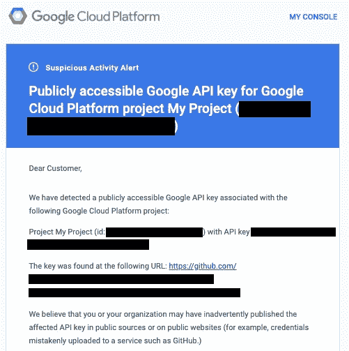
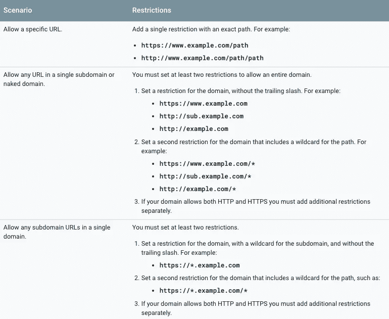
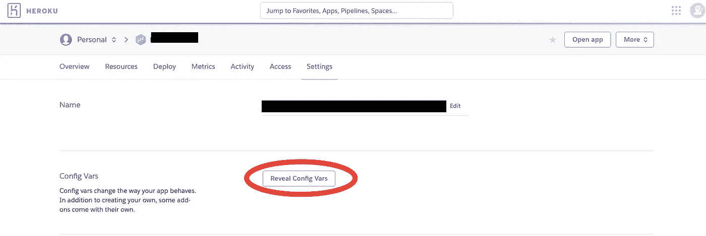
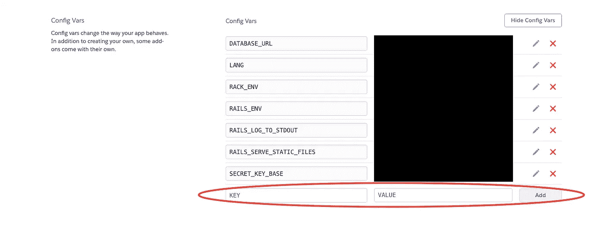
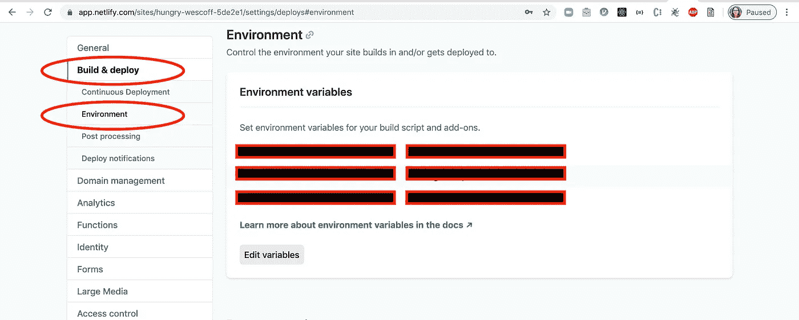

# 如何隐藏你的 API 键

> 原文：<https://betterprogramming.pub/how-to-hide-your-api-keys-c2b952bc07e6>

## 通过保护您的 API 密钥来防止盗窃


[迈卡·威廉姆斯](https://unsplash.com/@mr_williams_photography?utm_source=unsplash&utm_medium=referral&utm_content=creditCopyText)在 [Unsplash](https://unsplash.com/search/photos/safe?utm_source=unsplash&utm_medium=referral&utm_content=creditCopyText) 上拍照

最近，在使用 Google Cloud API 进行一个项目时，我收到了来自 Google 的提醒:



谷歌提醒我，我的 API 密匙正在世界的某个地方游荡。

是的，我上传了我的 API 密匙到我的 GitHub——一个初学者的错误。不幸的是，我并不是唯一对此一无所知的人，因为[去年有人从她的 GitHub 上偷走了 AWS API 密匙，这位熨斗学校的校友被罚款 7000 美元](https://medium.com/@morgannegagne/a-very-expensive-aws-mistake-56a3334ed9ad)。互联网上到处都是这种[故事](https://www.quora.com/My-AWS-account-was-hacked-and-I-have-a-50-000-bill-how-can-I-reduce-the-amount-I-need-to-pay)！有一些软件在网络上爬行(尤其是通过 GitHub ),渴望找到零散的 API 密钥。那么，我们如何保持安全呢？

在这篇博文中，我介绍了在 React、Rails、Heroku 和 Netlify 上隐藏 API 密钥。

# 我已经把我的 API 密匙推到 Github 了，现在怎么办？

嗯，首先，不要慌。你应该尽快修改 API 密匙，或者像 Malcolm Laing 在评论中建议的那样:

> 如果在某个时候您将 API 密钥提交给了 git repo，那么您应该删除它的所有痕迹。您可以通过使用 git rebase 并删除添加键的提交来实现这一点。

# HTML:对 API 键设置限制

像 Google Cloud 和 AWS 这样的服务使得对 API 密匙的使用设置限制成为可能。



不同限制场景的谷歌备忘单

例如，密钥可能只在给定的 URL 中使用(因此窃取它没有任何作用)。**当您的 API 密钥用在前端或 HTML 文件中时，这一点尤其重要——似乎没有令人满意的方法来加密它。**设定每日/总资金使用限额也不是一个坏主意，即使其他安全措施已经到位。

# 前端:隐藏你的钥匙(反应)

除了保护 API 密钥，我们还可以隐藏它。按照下面的步骤在 React 应用程序中完成。

**重要！如果您使用 create-react-app 创建了 React 应用程序，请注意，您的 env 变量将成为构建的一部分，这意味着它们将对检查您的文件的任何人公开。在开发阶段，您仍然可以遵循下面的步骤，这样您的 API 密钥就不会进入 github。然后，在部署您的页面之前，删除`.env`文件并使用平台的密钥管理系统(参见下面的 Heroku 和 Netlify)。**

1.  **创建一个名为。env 放在项目目录的根目录下。**

这是应用程序的树形图:

```
- your_project_folder
  - node_modules
  - public
  - src
  - .env         **<-- create it here**
  - .gitignore
  - package-lock.json
  - package.json
```

**2。在里面。env 文件，将** `**REACT_APP_**` **添加到您选择的 API 键名前，并分配给它。**

`REACT_APP_`实际上是`create-react-app`用来识别这些变量的工具。

```
// .envAPI_KEY=your_api_key            **<-- nope, this won't work**
REACT_APP_API_KEY=your_api_key  **<-- yes!**// Example:
// REACT_APP_GOOGLE_API_KEY=123456
```

**3。添加。env 文件到您的。gitignore 文件。**

你不希望这个文件被提交到 gitHub！

```
// .gitignore

# api keys
.env       **<-- add this line**

# dependencies
/node_modules
...
```

在你存了钱之后。gitignore，运行`$ git status`来确保。env 不在要提交的更改列表中。

**4。通过** `**process.env**` **对象访问 API 键。**

要检查您是否可以访问您的 API 密钥，请转到您的`App.js`文件，并在`require`语句下方的顶部添加`console.log`。保存文件并重新加载页面后，如果控制台日志没有显示您的 API 密钥，请尝试重新启动 react 服务器。当然，确保在提交代码之前删除`console.log`行。

```
// src/App.jsimport React, { Component } from 'react';
import './App.css';console.log(process.env.REACT_APP_GOOGLE_API_KEY)class App extends Component {
...}
```

此外，请注意，虽然网络爬虫很可能不会获得您的 API 密钥，但这种解决方案不会隐藏您的 API 密钥。正如 Malcolm Laing 在评论中指出的，密钥可能会出现在你的网络请求中。因此，如果您希望完全屏蔽您的密钥，您应该创建一个后端来代理您的请求，并将 API 密钥存储在那里。

然而，这种解决方案也可能不是最佳的，因为您如何保护对代理请求的后端的访问呢？还是要将这个后端端点公开？”正如google_api_key: '123456'

**4。将这些键作为环境变量添加。**

可以在您的应用程序中轻松访问它们，就像这样:

```
GOOGLE_API_KEY = ENV['google_api_key']
```

# 部署:隐藏 Heroku 上的 API 密钥

太好了，你的应用程序正在工作！你已经部署了，但是因为。gitignore。env 文件没有到达 Heroku。转到应用程序的[设置](https://dashboard.heroku.com/apps/[APP-NAME]/settings)并选择此选项:



点击后，你将有可能把你所有的秘密告诉 Heroku:



# 部署:在 Netlify 上隐藏 API 密钥

为了在网络生活中使用你的秘密，去**设置>构建&部署>环境>环境变量**。在这里，添加你的变量，就像你在。环境文件。



就是这样！注意安全。