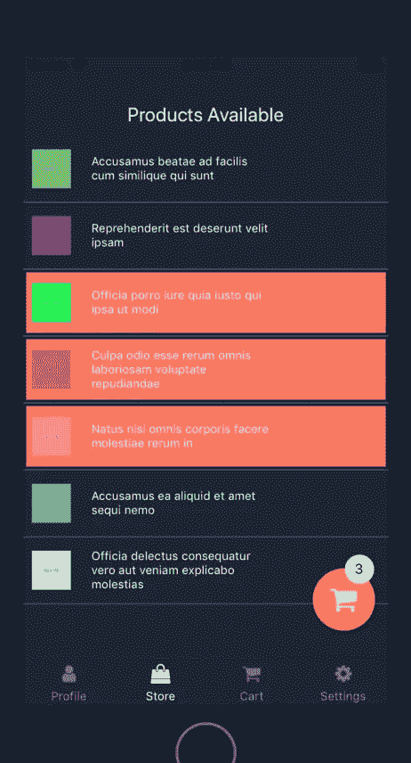
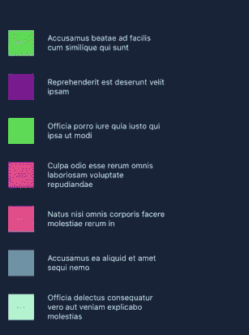
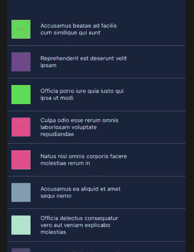
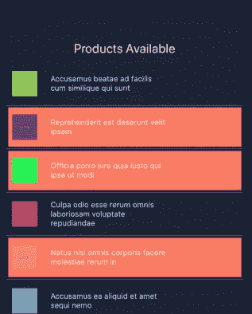

# 如何突出显示和多选平面列表组件中的项目

> 原文：<https://betterprogramming.pub/how-to-highlight-and-multi-select-items-in-a-flatlist-component-react-native-1ca416dec4bc>

## 操纵平面列表中的项目


马克斯·尼尔森在 [Unsplash](https://unsplash.com/photos/taiuG8CPKAQ) 拍摄的照片

如果您正在使用 [React native](http://www.reactnative.com/) 处理来自 API 或表单字段的各种客户端数据和细节的列表，那么您可能听说过一个`Flatlist`组件。基本上，`Flatlist`是一个核心组件，用于高效显示变化数据的垂直滚动列表。它是 0.43 版本之后 React native 中出现的一个组件。它取代了`ListView`组件，增强了开发者更容易处理列表的能力。



## 什么是 Flatlist？我们如何用它来显示动态或静态列表？

`FlatList`是一个简单的组件，引入它是为了消除`ListView`组件的限制。处理一个`Flatlist`需要的基本道具是`data` 和`renderItem` **。**为了简单起见，`data` 只是一个普通的数组，而`renderItem` 呈现这个数据数组并向开发者提供类似`index`等的元数据。

```
<FlatList   
  data={this.state.dataSource}
  renderItem={({item}) => <Text>{item.key}</Text>
 />
```

## 使用 FlatList 显示项目列表

如果您是 React Native 的新手，我建议您通读这篇文章，并尝试学习基本结构。然后回来，这样你可以更好地理解`FlatList`

[](https://medium.com/@sudhirKr/react-native-navigating-between-the-screens-and-code-structure-for-beginners-6b815ee8f79) [## 反应导航初学者(高级版-3)

### 几个月前我开始和 react native 一起工作，我必须说这是一个从全职…

medium.com](https://medium.com/@sudhirKr/react-native-navigating-between-the-screens-and-code-structure-for-beginners-6b815ee8f79) 

下面是如何使用`FlatList`从一个虚拟 API 获取数据并使用它显示一个带有图像的项目列表的逐步指南。

第一步是从 react-native 库中导入`Flatlist`组件。

```
import { FlatList } from "react-native";
```

现在，我们已经导入了组件，是时候在`render` 函数中使用这个组件了。

```
<FlatList 
  data={this.state.dataSource}
  ItemSeparatorComponent={this.FlatListItemSeparator}
  renderItem={item => this.renderItem(item)} 
  keyExtractor={item => item.id.toString()}
/>
```

## 思考要点

1.  `data` prop 从`{this.state.dataSource}` 获取数据，并为我们提供一个对象数组。
2.  `ItemSeparatorComponent` 在列表中显示时，有助于分隔列表项目。
3.  `renderItem`方法是`FlatList`中最重要的部分。它以一种可以按照数据&设计要求开发的方式呈现数组数据。
4.  由于我们在这里处理的是一个数组，`keyExtractor` prop 提供了需要一个唯一的键来根据需要单独处理列表项。
5.  还有一个更重要的道具叫做`extraData` ，我将在本文后面描述它。

现在你对`Flatlist`的工作原理有了基本的了解。是时候用代码实现这些知识和逻辑了。由于我们使用来自 API 的数据，我会添加一个指示器来显示加载器，直到数据加载到后端。是时候获取数据并将其呈现在列表中了。如果你想了解更多关于从 API 获取数据的信息，你可以阅读这篇文章。



不带项目分隔符呈现的列表

到目前为止，我们已经处理了`data` 和`renderItem` 方法。现在是时候探索剩下的方法了。

```
FlatListItemSeparator = () => <View style={styles.line} />;
```



用项目分隔符呈现的列表

您可以根据您的设计提供样式，并更改此样式类。如果您想使用我版本的样式，您可以在本文末尾找到我使用的代码。

现在,`key extractor`方法基本上是针对商品的唯一 ID。最好使用上面的确切代码来处理任何警告。

## 现在有趣的部分来了

有时，您需要选择列表中的多个项目并高亮显示它们。在营销应用或待办事项列表中尤其如此，你需要从列表中的数百个项目中进行选择。下面是从各种其他项目中选择一个项目的代码。

```
selectItem = data => {
  data.item.isSelect = !data.item.isSelect;
  data.item.selectedClass = data.item.isSelect
   ? styles.selected: styles.list;

const index = this.state.dataSource.findIndex(
   item => data.item.id === item.id
);this.state.dataSource[index] = data.item;
 this.setState({
   dataSource: this.state.dataSource
 });
};
```



列表中的选定项目

这里我们看到的是一个屏幕，其中选中的项目以亮色突出显示，而列表中的其他项目被设置为默认样式。为了更清楚地理解逻辑，让我们来看看 fetch 组件。

```
.then(responseJson => {
 responseJson = responseJson.map(item => {
   item.isSelect = false;
   item.selectedClass = styles.list;
   return item;
 });
```

这里我们将`item.isSelect` 指定为`false` ，而`selectedClass` 被指定为默认的样式类`list.`，这背后的原因是现在我们列表中的每一个项目都将拥有这两个属性，它们可以用来唯一地获取项目并操作它。现在在我们的`selectItem()`函数中，我们添加了一个渲染条件如下:

```
selectItem = data => {
  data.item.isSelect = !data.item.isSelect;
  data.item.selectedClass = data.item.isSelect
   ? styles.selected: styles.list;
```

接下来，当我们点击我们的`FlatList`中的任何项目时，`selectItem` 函数被渲染，它将该项目的样式更改为一个突出显示的类，比如这里的 selected class，其余的列表项目具有来自类列表的默认样式。

## 重要的部分来了

FlatList 有一个名为`extraData` 的道具，只要使用状态有任何变化，它就会重新渲染`FlatList`。该功能重新呈现我们的`selectItem` 和`renderItem` 功能，并突出显示所选项目。否则，只有一个项目将被选中，因为`FlatList`在组件加载开始时被渲染，并且即使状态和数据改变状态也保持不变。

## `extraData`

这是一个标记属性，用于告诉列表重新呈现(因为它实现了`PureComponent`)。

```
extraData={this.state}
```

你所要做的就是将它添加到`FlatList`组件中，这样我们就完成了列表中多个项目的高亮显示。

希望本文对您有所帮助，增强您轻松应对这一需求的能力。如果你想用它作为例子，我在这里分享完整的代码片段。


带有选定和未选定项目的屏幕

## **完整代码在此**

## **谢谢。不断学习分享！**

在此与我联系:

[https://www.instagram.com/navigatorkumar/](https://www.instagram.com/navigatorkumar/)