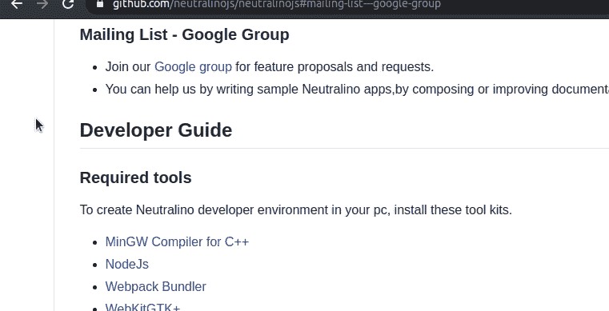
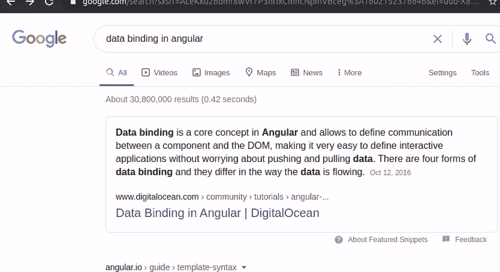

# 如何使用文本片段突出显示网站上的文本

> 原文：<https://betterprogramming.pub/how-to-highlight-text-on-websites-using-text-fragments-9c5b54a6de43>

## 想尝试一个未来的超链接，而不是老式的？


[亚伦·伯顿](https://unsplash.com/@aaronburden?utm_source=unsplash&utm_medium=referral&utm_content=creditCopyText)在 [Unsplash](https://unsplash.com/s/photos/highlight?utm_source=unsplash&utm_medium=referral&utm_content=creditCopyText) 上拍照。

我们经常在网页中使用超链接来添加到另一个网页的导航链接。使用众所周知的 native HTML anchor 标记可以很容易地在网页上呈现超链接。此外，anchor 标签提供了一些有用的本地特性，比如允许我们为给定的 URI 更改目标窗口。例如，我们可以很容易地设置一个新的标签作为目标窗口。此外，我们可以使用 JavaScript 来达到同样的目的。如果使用 JavaScript，也可以创建弹出窗口来加载 URI。

考虑一下上面提到的两个场景的例子。

使用 HTML 锚定标签导航到外部网页:

```
<a href="https://en.wikipedia.org/wiki/Website" target="_blank">Read more...</a>
```

使用 JavaScript 的相同行为:

```
<span style="cursor: pointer" onclick="window.open('https://en.wikipedia.org/wiki/Website')">Read more...</span>
```

# 缺失的特征

假设有一个包含大量文本的网页，您需要在其中一个网站中添加对它的引用。毫无疑问，您可以简单地添加一个 HTML 超链接。但是你怎么能引用网页上文本的特定部分呢？如果特定的页面支持直接导航到标题，就很幸运了，如下例所示:



支持直接导航到标题的网页。作者的屏幕录制。

然而，并不是每个网页都有这种实现。即使它存在，我们也不能引导用户找到段落中的具体文本。因此，需要一种新的标准特征来使用 URI 突出显示网页的特定文本。W3C 已经将这一要求确定为所有浏览器的有效特性，并将照常实现一个通用的[规范](https://wicg.github.io/scroll-to-text-fragment/)。

# 文本片段

URI 片段是指在特定的 URI 中后跟散列符号(`#`)的一串字符。文本片段是新引入的标准方法，使用类似于`#:~:text=foo`的 URI 片段格式来滚动和突出显示网页上的特定文本，如下所示:

```
#:~:text=[prefix-,]textStart[,textEnd][,-suffix]
          context  |-------match-----|  context
```

如果使用文本片段，主 URI 将如下所示:

```
http://example.com/#:~:text=foo,bar
```

这些参数使用逗号(`,`)字符分隔。基本上，`textStart`和`textEnd`参数通过范围搜索来帮助搜索特定的文本。重要的是，也许还会有重复的文本。因此，`-prefix`和`-suffix`参数通过帮助浏览器找到预期文本的位置来给出上下文信息。

考虑下面的例子:

```
http://example.com/#:~:text=Example
```

该 URI 将引导您进入网站，滚动并高亮显示第一次出现的`Example`:

```
http://example.com/#:~:text=This%20domain,use
```

这将突出显示“这个域是供使用的”，但它不会突出显示“这个域很好”之类的短语，因为匹配标准明确表示结尾应该是“使用”

```
http://example.com/#:~:text=use-,this%20domain,-in
```

“你可以在文学作品中使用本域名”中的“本域名”将与上面的 URI 一起突出显示。但是如果“这个域”在诸如“…实际上链接这个域…”的句子中出现过，浏览器将不会突出显示这些部分，因为给定的上下文不在那里。

此外，可以使用多个文本片段来突出显示网页的多个部分。下面的例子将突出两个词:

```
http://example.com/#:~:text=Example&text=documents
```

# 浏览器支持

也许你已经注意到，谷歌搜索使用这一功能，根据你进入第一个搜索结果时输入的关键字，突出显示最相关的答案。



使用文本片段的谷歌搜索。作者的屏幕录制。

文本片段规范是一个新增加的特性。最新的基于 Chromium 的浏览器支持它。如果你使用的谷歌浏览器版本高于 80，你可以使用文本片段功能。

目前还没有好的浏览器支持，我认为其他浏览器会很快实现文本片段规范，因为它对每个人都非常有用。谷歌 Chrome 甚至有一个[扩展](https://chrome.google.com/webstore/detail/link-to-text-fragment/pbcodcjpfjdpcineamnnmbkkmkdpajjg?hl=en)，允许你通过简单的右键点击生成带有文本片段的 URI。