# 如何使用 AWS Fargate 托管无服务器的 Spring Boot Web 应用程序

> 原文：<https://betterprogramming.pub/how-to-host-a-serverless-springboot-web-application-using-aws-fargate-a3669d9eebd5>

## 您不必再管理 EC2 实例了

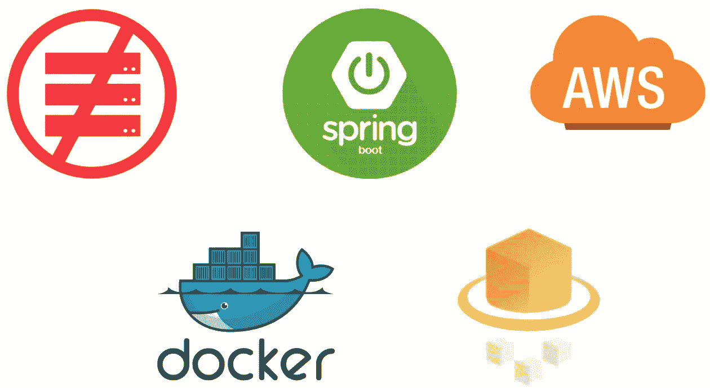

您知道如何托管您的 Spring Boot 应用程序，而不用担心创建和维护底层 EC2 实例，以及如何能够足够快地自动伸缩以服务任何负载吗？你可以用 AWS Fargate 来做这个。

让我们来看看。本文分为两部分:

1.  创建 Springboot 应用程序的 docker 图像，并将其上传到 [AWS ECR](https://aws.amazon.com/ecr/) (弹性容器注册中心)。
2.  使用 [AWS Fargate](https://docs.aws.amazon.com/AmazonECS/latest/userguide/what-is-fargate.html) 服务您的 web 应用程序。

# 先决条件

*   AWS 帐户
*   AWS CLI
*   一点知识
*   码头工人
*   专家
*   Java 8

## 第 1 部分:创建 Springboot 应用程序的 docker 图像，并将其上传到 AWS ECR(弹性容器注册中心)

首先，让我们为您现有的 Spring Boot 应用程序创建一个 Docker 文件。对于本文，我已经创建了一个示例 Spring Boot web 应用程序:[spring boot-docker-container-demo](https://github.com/neyold/springboot-docker-container-demo)，docker 文件如下:

**关于 Dockerfile 的一些事情**

Docker 文件使用 *openjdk:8-jdk-alpine* 作为基础映像。

基本映像没有 ECS 运行状况检查所需的 curl 程序。它是通过 apk 命令安装的。

现在，cd 进入项目目录…

```
**$** mvn clean install
**$** mvn package
**$** docker build -t serverlessdemo .
**$** docker images  **# this will show all the docker images & image IDs**
```

您可以在本地机器上运行 docker 映像:

```
**$** docker run -e EXTERNAL_PARAM=external-param1 serverlessdemo
```

您可以找到您的 docker 容器 IP，并在浏览器中试用它:

```
**$** docker ps  **# get all running container IDs**
**$** docker inspect **<demo's container ID>****# find the IP address of the container from the output**
```

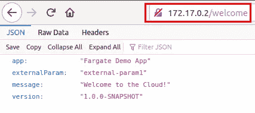

图像:浏览器输出

现在，让我们创建一个 AWS 弹性容器存储库。

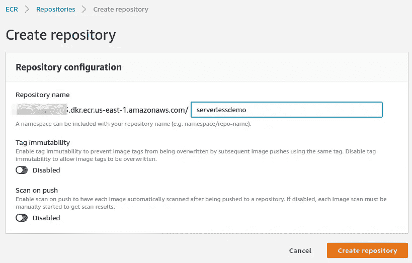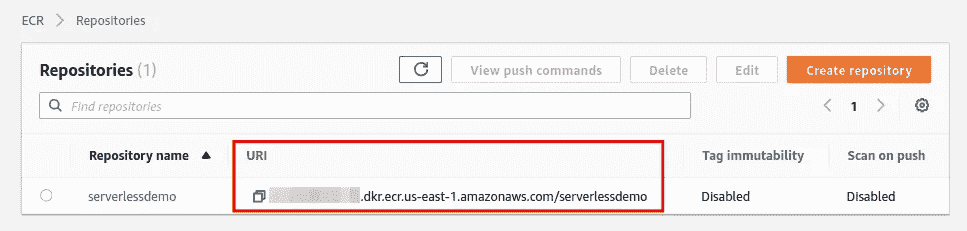

要访问存储库，您必须安装 AWS CLI 并用 API 密钥对其进行配置。参见[本](https://docs.aws.amazon.com/cli/latest/userguide/cli-chap-welcome.html)。

```
**# Login to your ECR repo using docker****$** aws ecr get-login-password --region us-east-1 | docker login --username AWS --password-stdin **<Repo URI>**
```

有关如何登录您的回购的完整指南，请参考[本](https://docs.aws.amazon.com/AmazonECR/latest/userguide/Registries.html#registry_auth)。

现在，标记您的图像，并将其推送到您的回购。

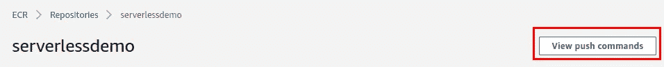

```
**$** docker image tag serverlessdemo **<Repo URI>
$** docker push **<Repo URI>**
```

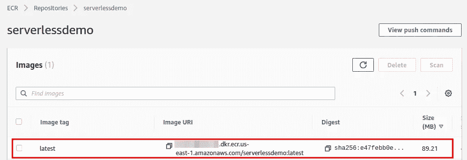

太好了，现在您已经将 docker 图像存储在 AWS ECR 中了！

## 第 2 部分:使用 AWS Fargate 服务您的 web 应用程序

让我们开始吧。

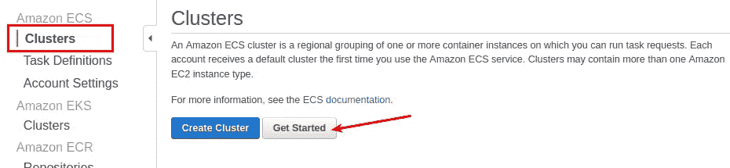

您可以分四步启动集群…

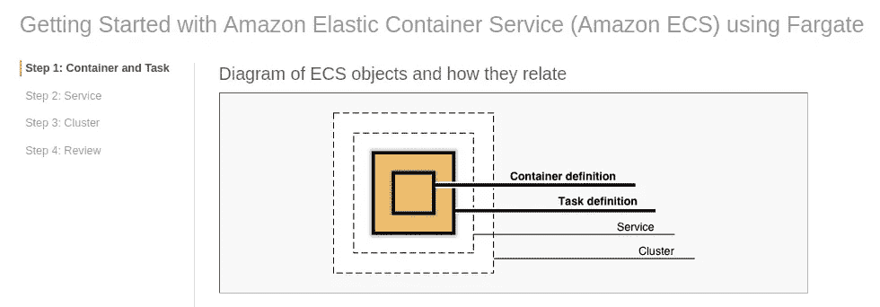

**第一步:**

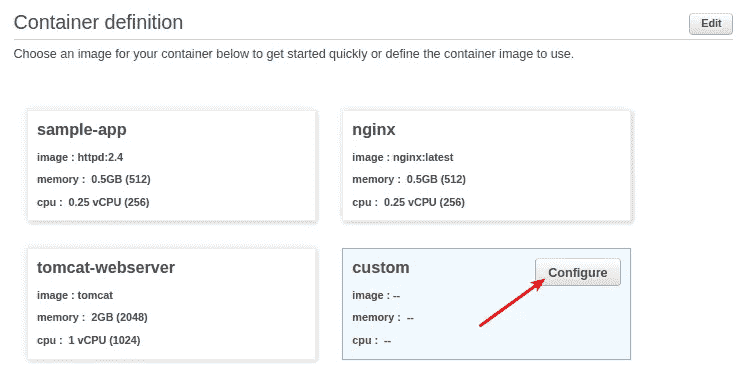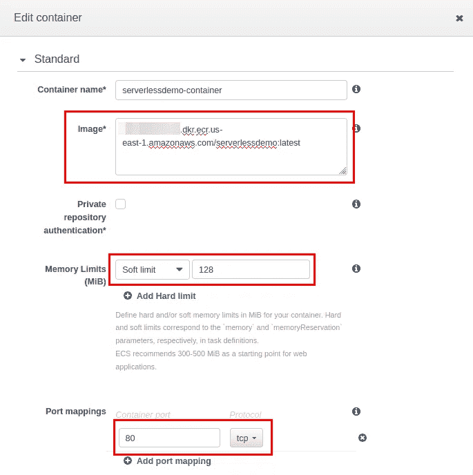

图:标准容器配置

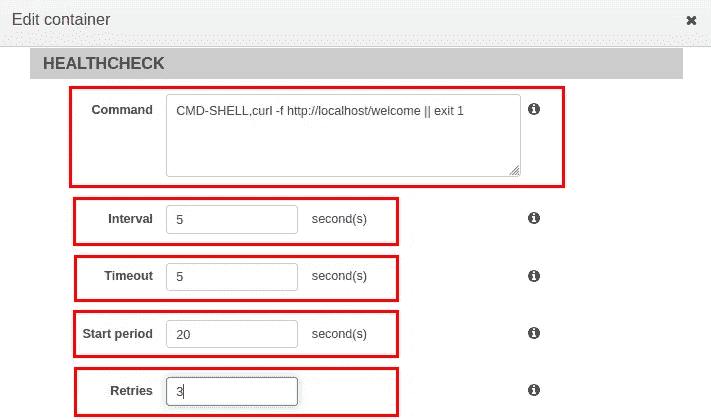

图像:高级->运行状况检查

```
Command: CMD-SHELL,curl -f [http://localhost/welcome](http://localhost/welcome) || exit 1
Interval: 5
Timeout: 5
Start period: 20  **# Because Spring Boot takes ~20 sec to start up**
Retries: 3
```


图像:高级->环境

```
CPU Units: 256  **# 256 units represents 0.25 vCPU**
EXTERNAL_PARAM - container_param_1
```

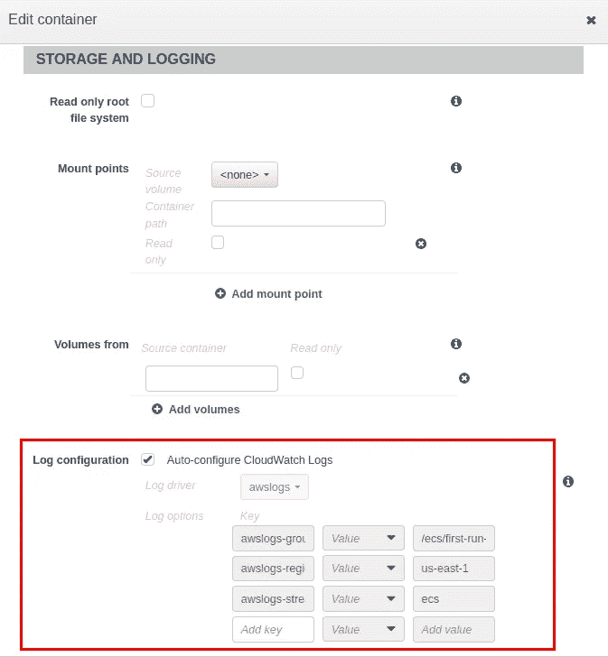

图像:高级->日志记录

**第二步:**

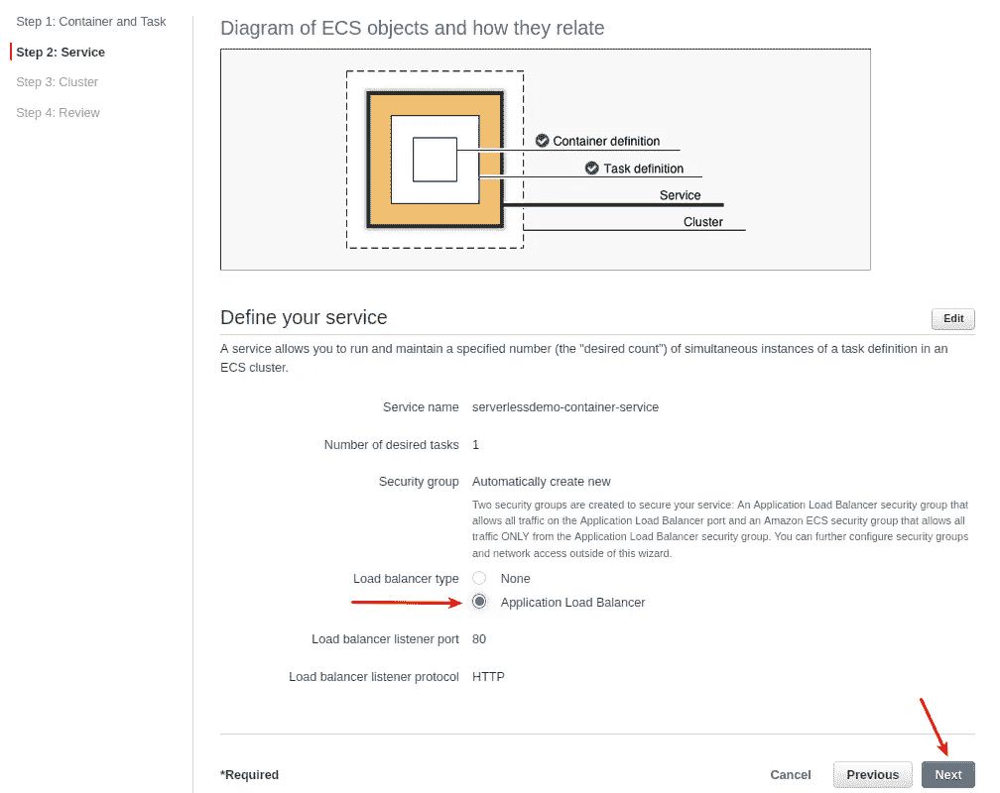

**第三步:给它起个名字**

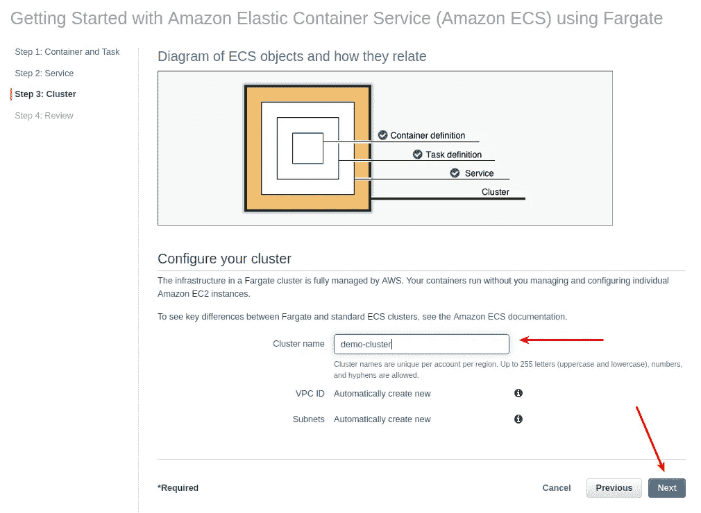

**第四步:审核并创建**


现在，您的 ECS 集群已经启动并运行了！

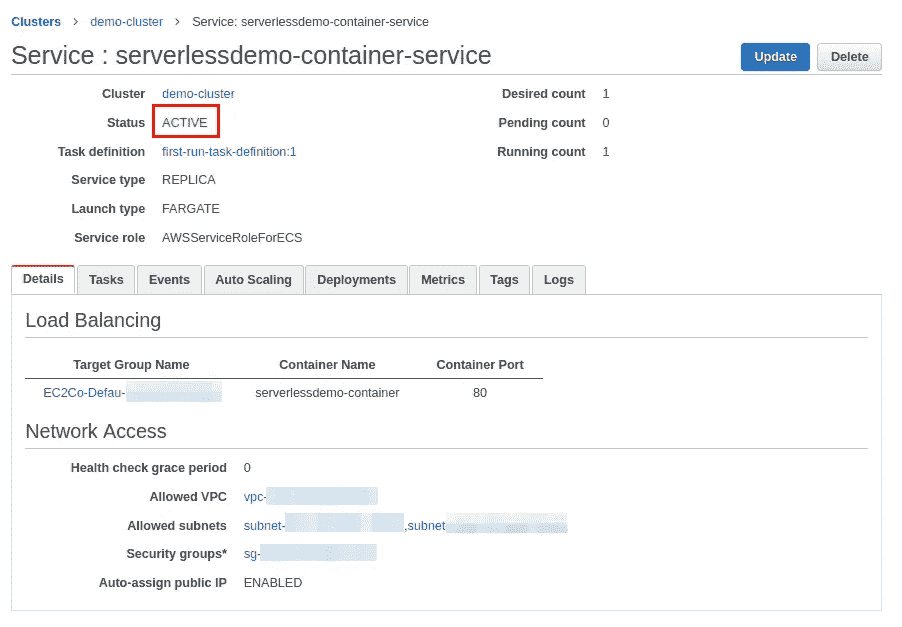

图:服务状态

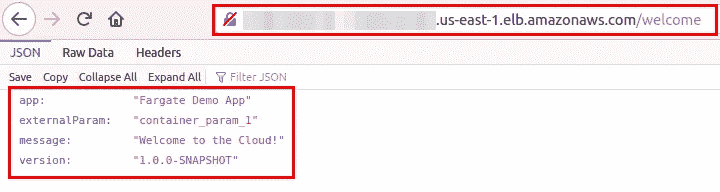

图:负载平衡器 URL 的浏览器输出

可以看看 AWS CloudWatch 里的应用日志。

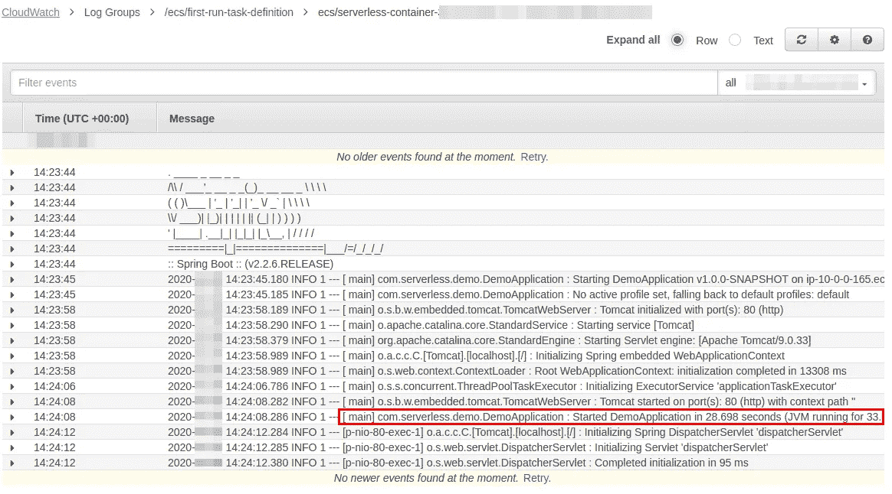

图片:云观察日志

根据运行状况检查策略，如果检测到故障，此容器将自动被新容器替换。

但这还不是全部。您可以配置自动缩放功能来增加或减少容器的数量。

好，我们也这么做吧！

首先，你必须点击更新服务。

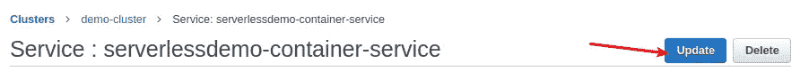

然后，直接跳到第 3 步。

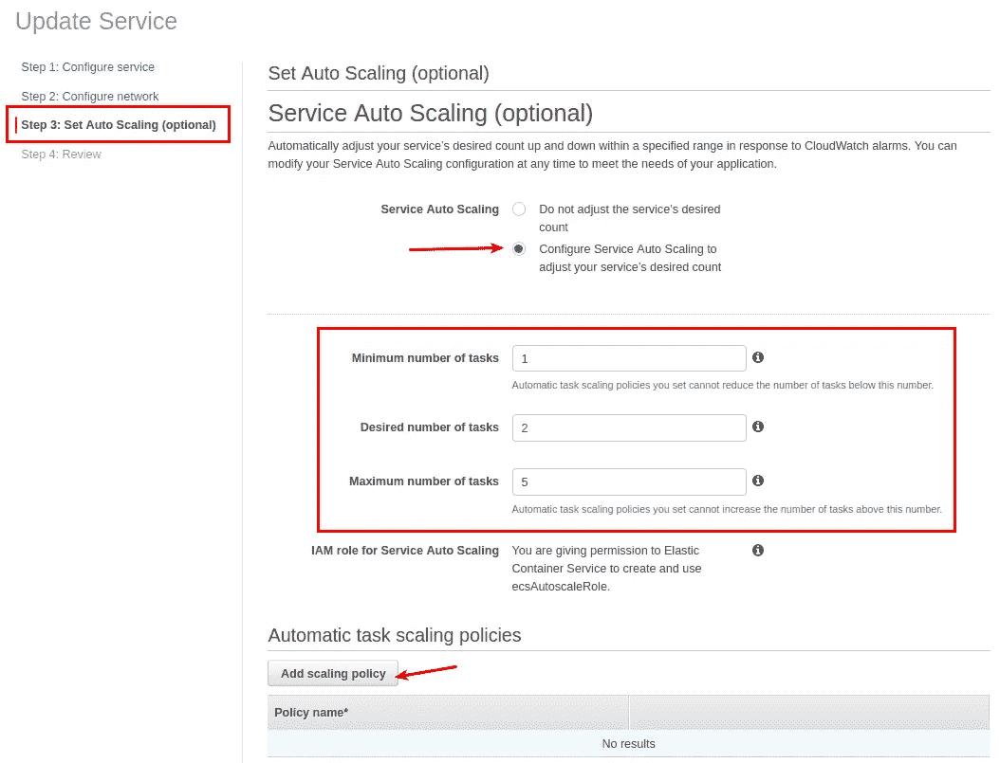

您可以在此配置最小、所需和最大任务数。任务代表一个容器。

缩放策略非常重要。您可以尝试这些配置，并为您的使用案例提供最佳值。在给定时间，可以有多个有效的扩展策略。

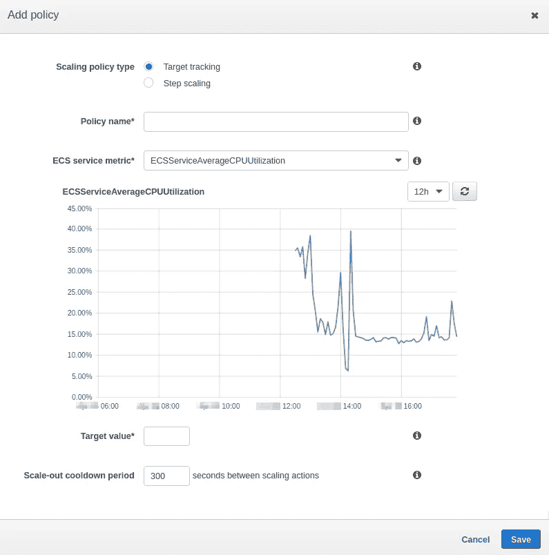

试用 ECS 将帮助您找出一些您可以使用的很酷的新技巧。

ECS 采用现收现付的模式。您只需为使用的 vCPUs 和内存数量付费。一旦您完成了试验，记得删除服务和负载平衡器，并停止任务。

谢谢大家！