# 如何用谷歌域名和 Firebase 托管来托管你的 Angular 应用

> 原文：<https://betterprogramming.pub/how-to-host-your-angular-application-with-google-domains-and-firebase-hosting-697291f69df>

## 近乎免费的托管服务

[Brandi Redd](https://unsplash.com/@brandi1?utm_source=unsplash&utm_medium=referral&utm_content=creditCopyText) 在 [Unsplash](https://unsplash.com/s/photos/angular-website?utm_source=unsplash&utm_medium=referral&utm_content=creditCopyText) 上拍摄的照片

假设你有一个有棱角的项目，你想开始与人分享。也许这是你的个人网站，也许是一个博客。

你想要一个专业的网站，所以你需要一个专业领域。你去谷歌域名网站购买域名。现在怎么办？

那么，如果我告诉你可以用另一个谷歌产品免费托管你的网站，会怎么样？(*如果流量不大就免费。)

用 [Firebase 托管](https://firebase.google.com/docs/hosting)托管您的项目！

# 入门指南

首先，在[控制台](https://console.firebase.google.com/u/1/)中设置您的 Firebase 项目。创建新项目。

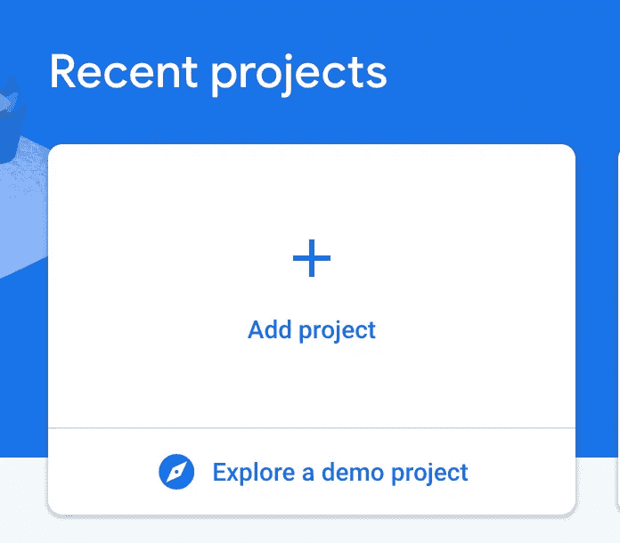

您不需要分析，如果您愿意，可以在以后启用它。给你的项目起一个好名字，然后创建你的项目！

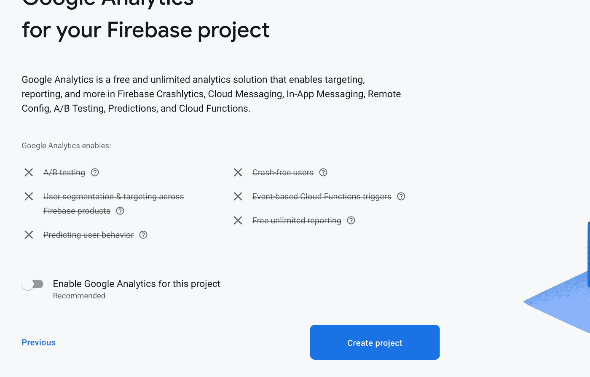

现在，您已经进入了项目的 Firebase 控制台。转到托管。点击*开始*。

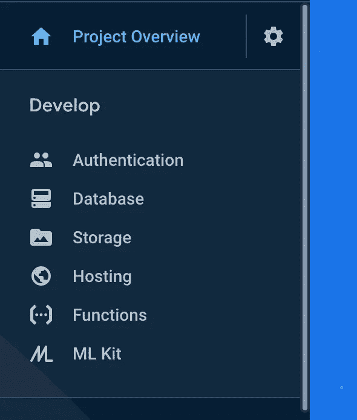

按照提示的步骤操作。在终端上的项目目录中，运行`npm install -g firebase-tools` *。关于 JavaScript SDK 的其他步骤你不需要看。*

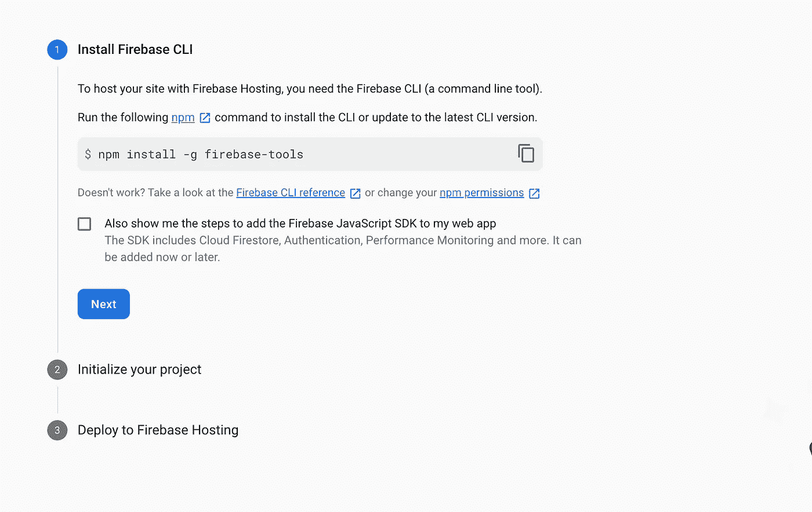

在你的项目目录中运行`firebase login`和`firebase init`。注意并阅读下面关于`init`命令的内容。

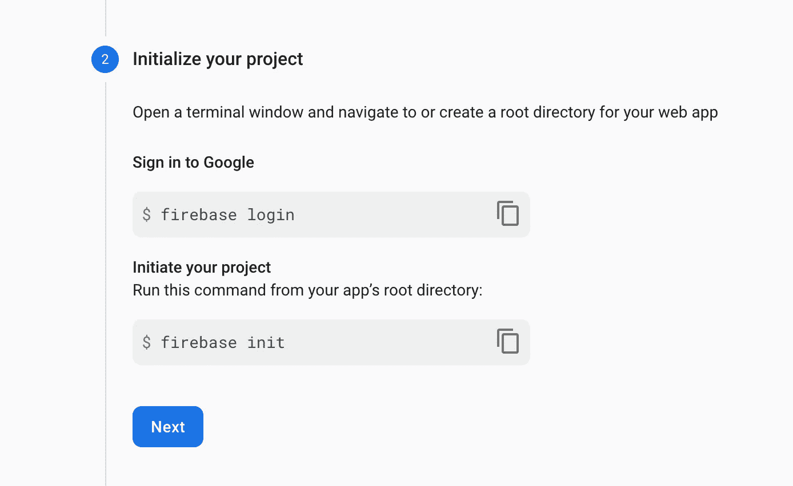

`init`命令行界面有点混乱，所以请仔细阅读。你只需要托管。

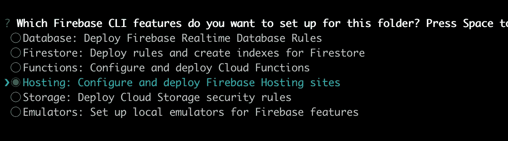

将您的 Firebase 添加到项目中。

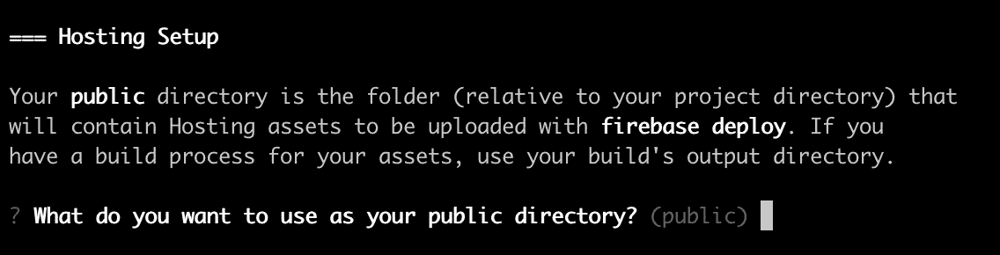

当你看到这个目录提示时，只需按回车键，我们稍后会编辑它。然后，当它询问您是否要配置为单页应用程序时，点击 *N(否)*。

太好了。因此，我们应该有一个 Firebase 就绪的 Angular 项目。我们来部署一下。

我们需要做一些配置更改。你应该有一个名为`firebase.json`的文件。你需要让它看起来像这样:

做出这一更改后，运行`ng-build -—prod`。

运行`ng build`之后，您应该有一个类似于下面的`dist`文件夹:

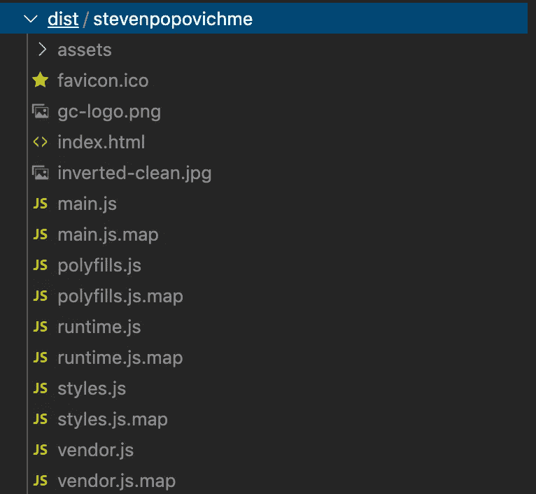

如果`dist`文件夹与您的`firebase.json`中的文件夹匹配，您可以运行`firebase deploy`。

如果一切顺利，您应该能够进入 Firebase 控制台并查看部署。大概是这样的:

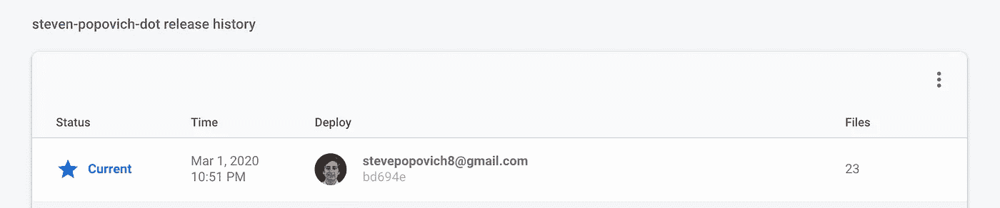

那么，让我们看看我们的网站。在发布历史的上方，您应该会看到一个如下所示的 URL:

的。com 网站应该有你的角应用！

这是最棘手的部分，如果这对你不起作用，请在评论中告诉我。

# 奖金专业小费

我编辑了我的`package.json`,得到这个命令:

然后你只需运行`npm run deploy`，你的网站将会重建，所做的更改将会立即被推送到 Firebase。

照片由 [Pero Kalimero](https://unsplash.com/@pericakalimerica?utm_source=unsplash&utm_medium=referral&utm_content=creditCopyText) 在 [Unsplash](https://unsplash.com/s/photos/cloud?utm_source=unsplash&utm_medium=referral&utm_content=creditCopyText) 上拍摄

好的，我们在云端有一个网站。但是我们不想让人们去那个丑陋的 Firebase 网址。因此，让我们把我们的网站与一个自定义的谷歌域名连接起来。

你可能注意到了，在 Firebase 主机中，有一个大的`Add custom domain`按钮。点击它，并输入您的谷歌域名。

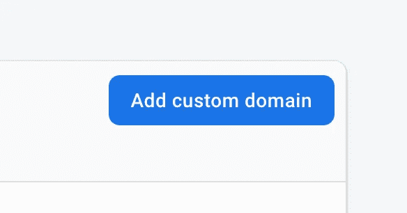

我已经加了我的域，不能轻易截图，但是你会到达`Go live`步骤。你会得到两个 IP 号码，格式如下:`XXX.XXX.X.XXX`。

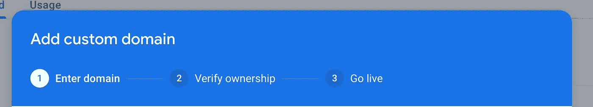

现在你需要去你的管理谷歌域名页面。转到 *DNS* 并滚动到`Custom resource records`。

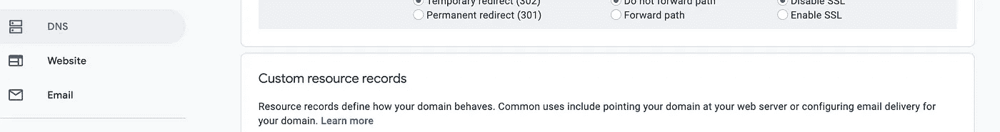

我们将插入 Firebase 中的这些数字，如下所示:

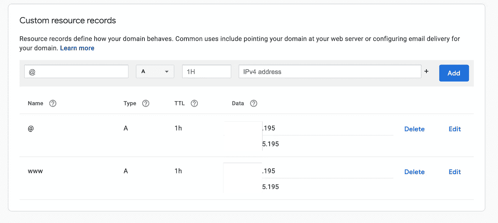

我不确定知识产权是独一无二的还是需要隐藏

这两个数字应该在两行中。这些都是谷歌域名需要做的改变。回到你的 Firebase 控制台…

你需要注意的最后一件事是在`yourdomain.com`和`www.yourdomain.com`之间的人。

我们将设置`www.yourdomain.com`重定向到`yourdomain.com`并且`yourdomain.com`将拥有实际的站点。您可以根据需要进行配置。

您的配置应该如下所示:

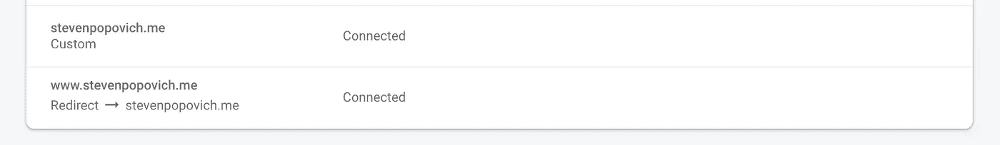

底部站点的配置应该如下所示:

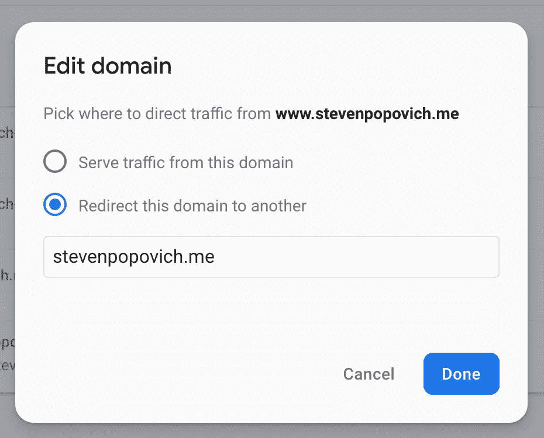

就是这样！它可能需要 12 到 48 个小时的时间在自定义域上运行，但是你应该已经准备好了。

感谢阅读！如果您有任何问题或需要帮助，请在下面回复。