# 如何免费托管你的个人网站

> 原文：<https://betterprogramming.pub/how-to-host-your-personal-website-for-free-3101c4ab2e49>

## 通过 AWS S3 和 Cloudflare 的魔力

图片来自[https://unsplash.com/@kevnbhagat](https://unsplash.com/@kevnbhagat)

随着 web 在过去五年左右的时间里快速发展，过去被认为是标准的开发操作实践现在已经过时了。

要建立一个在线网站，过去的标准是查看付费共享 cPanel 托管服务，如 NameCheap 或 GoDaddy。虽然共享主机仍然是将你的网站推向生产的有效解决方案，但更直观的解决方案已经浮出水面。我将解释我部署[我的个人网站](http://joey.dev)的方法，在那里我每个月实际上只需支付 0 美元来保持我的网站在线。

## 首要任务—先决条件:

您将需要有静态文件(HTML/CSS/JS)到您的网站。本指南仅适用于使用静态文件集的网站。

您还需要一个自定义域。域名通常平均每年运行 15 美元左右，这取决于你正在寻找的 TLD 扩展。绝对值得为个人品牌化投资。

你还需要在 [Cloudflare](https://www.cloudflare.com/) 和[亚马逊网络服务](https://aws.amazon.com/)上创建一个账户。如果你不熟悉这些服务，没关系——我会解释你在这两个平台上需要采取的每个步骤。让我们开始吧。

## 设置 AWS S3 时段:

登录 AWS 控制台后，前往 [S3 管理控制台](https://console.aws.amazon.com/s3/home)。

继续点击*创建存储桶*按钮。将出现一个模式，询问您正在创建的存储桶的详细信息。

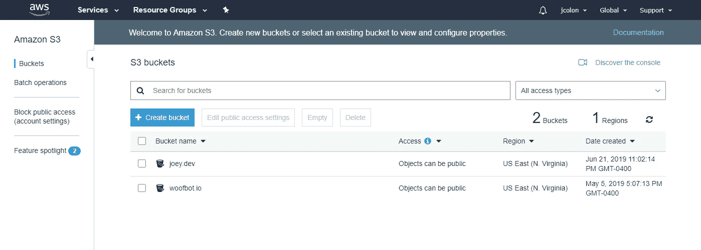

AWS S3 管理控制台

对于您的 *Bucket Name* ，请确保您输入的域名准确无误。对于本教程的例子，我将使用域`**tutorial.joey.dev**`。对于这个地区，我选择了地理上离我最近的地方，*美国东部(北弗吉尼亚)*。也可以随意挑选离你最近的。当您准备好继续时，请单击“下一步”。

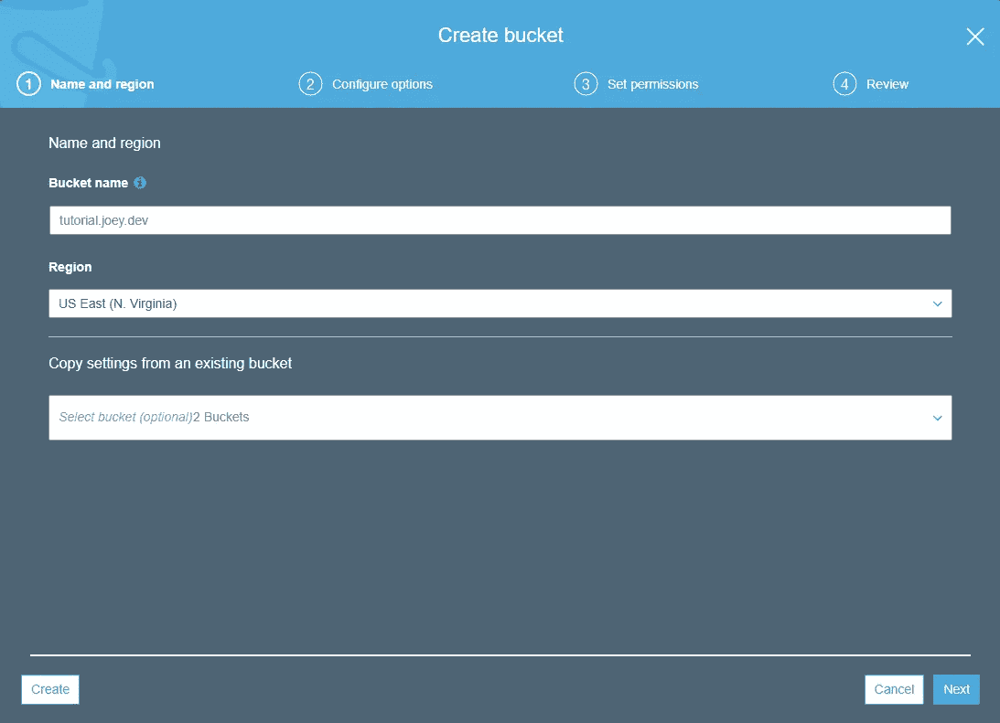

AWS S3 创建存储桶—第一步

完成第二步后，单击下一步。在第三步，确保取消选中*阻止所有公共访问*选项，以及其他复选框。我们不需要利用 S3 日志传送，所以也禁用该选项。单击下一步。

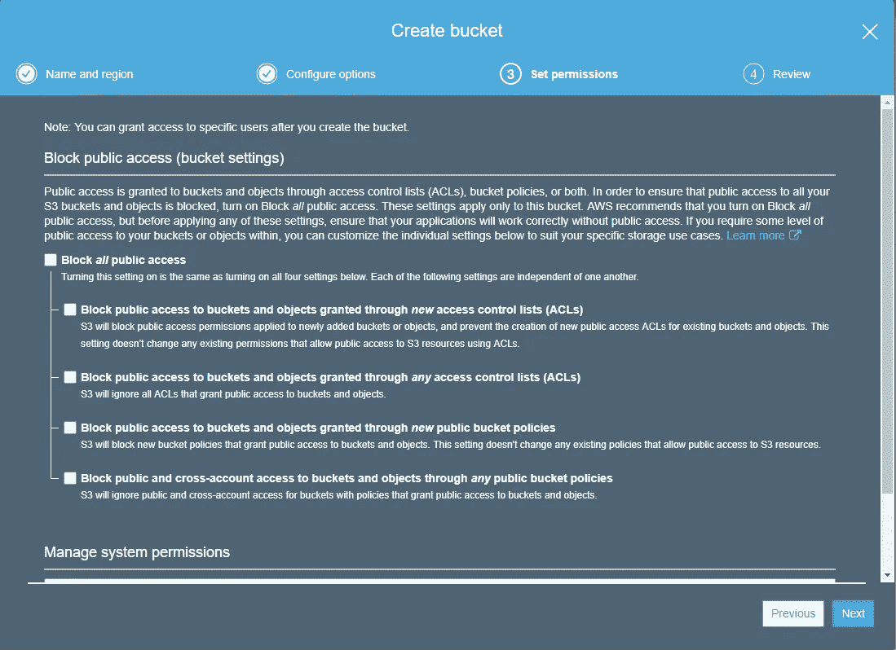

AWS S3 创建存储桶—第三步

第四步，点击*创建存储桶*按钮。创建存储桶后，您应该会在 S3 管理控制台页面的存储桶列表中看到新的存储桶。单击您新创建的 bucket，您应该会看到类似如下的内容:

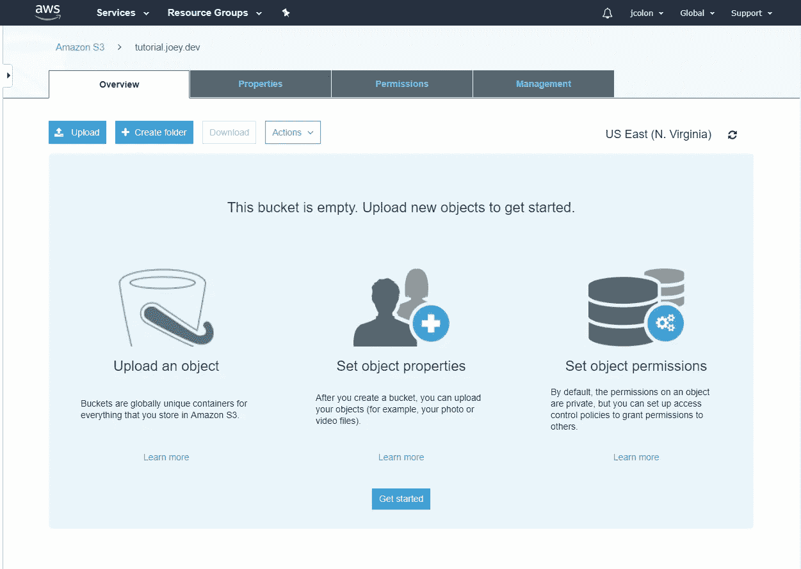

AWS S3 —新创建的 S3 铲斗

点击靠近屏幕顶部的*属性*标签，然后点击第一排卡片上的*静态网站托管*。点击*使用此桶托管网站*选项。对于索引文档，继续输入`index.html`并点击保存。

确保你记下他们给你的终点。

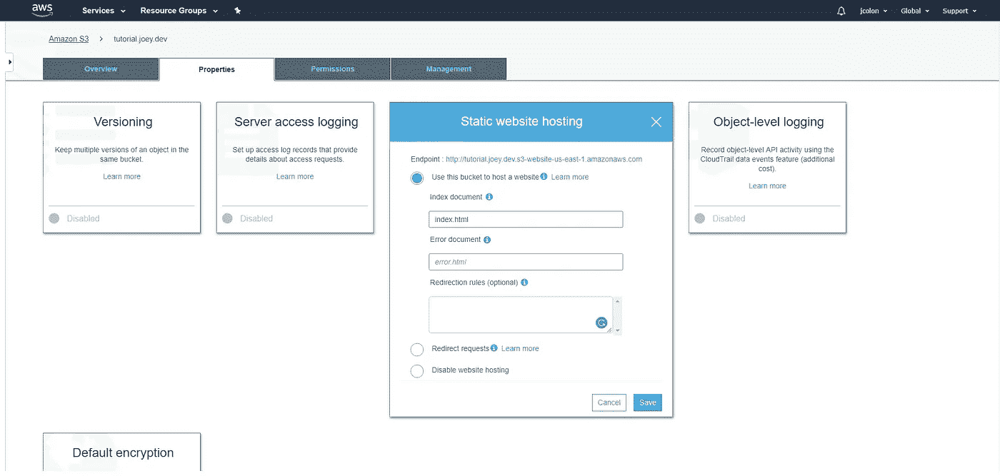

AWS S3 —静态网站托管配置

厉害！现在 AWS 方面的最后一部分是将静态站点的文件上传到新的 bucket。点击*总览*选项卡，然后点击*上传*按钮。你会看到下面的模式。继续上传你网站的文件。

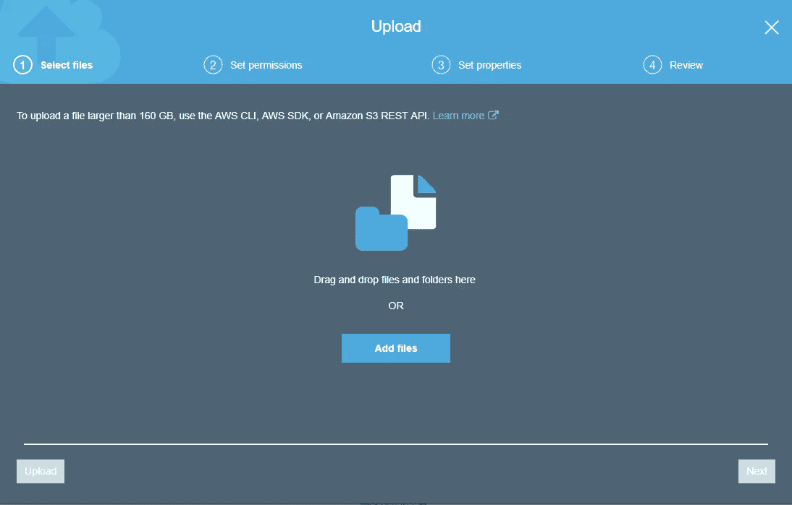

AWS S3 —上传文件第一步

选择要上传的文件后，单击“下一步”按钮。在第二步中，您需要单击*管理公共权限*下拉菜单，并将其更改为选项*授予对该对象*的公共读取权限。单击下一步。

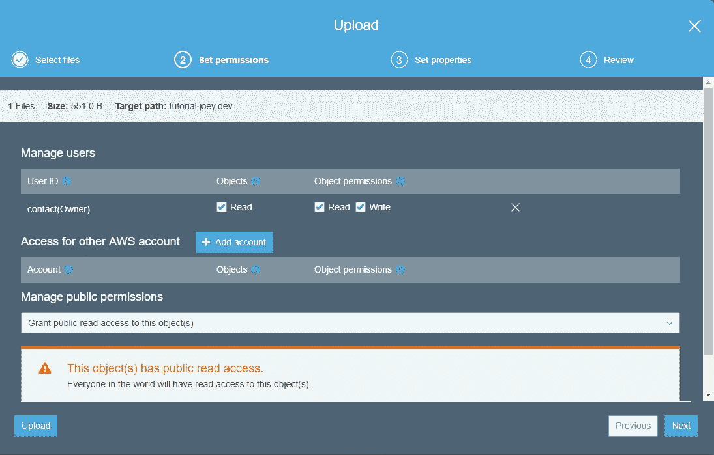

AWS S3 —上传文件第二步

从第三步开始，忽略所有选项，然后单击“下一步”按钮。第四步，点击*上传*按钮。上传后，你现在应该可以通过我告诉你保存的后端端点 URL 访问你的网站了。

万岁！让我们继续设置 Cloudflare。

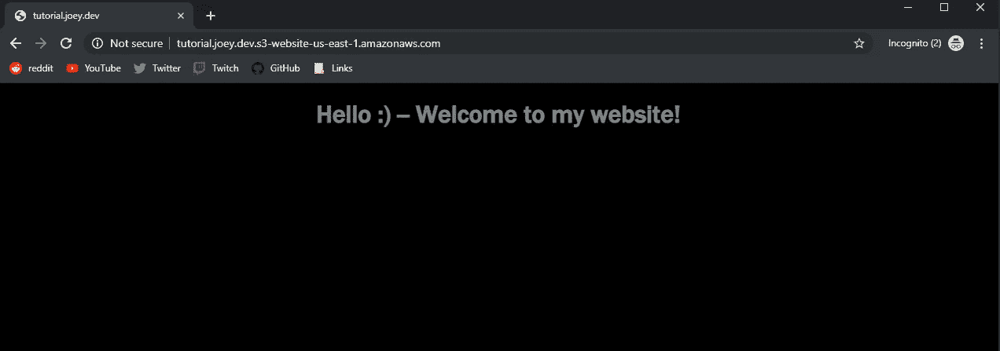

AWS S3 托管网站

## 设置 Cloudflare:

我假设您是第一次使用 Cloudflare，并且没有将您站点的域连接到 Cloudflare 的服务。从 Cloudflare 仪表盘中，单击*添加站点*按钮。输入您的网站 URL，然后单击下一步。再次单击 Next，当询问计划时，选择免费计划并继续。

当您到达 DNS 查询结果页面时，继续删除它扫描的所有记录。您的结果应该如下所示:

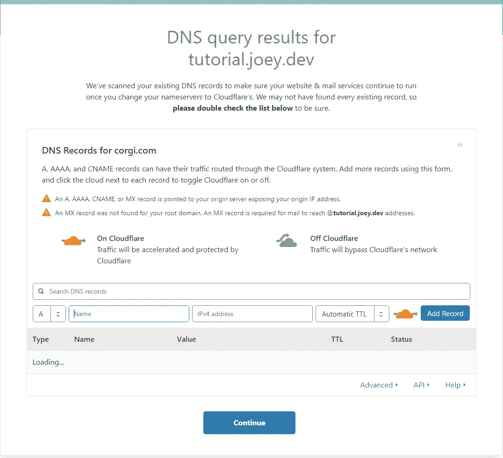

我们想添加两条不同的`**CNAME**`记录。

对于第一条记录，对于*名称*，输入`**www**`，对于*域名*，输入您的不带 http://的域名。例如`**tutorial.joey.dev**`)。

对于第二个记录，对于*名称*，输入您的域名，对于*域名*，输入您的后端 S3 存储桶端点，我们在本教程的前面已经介绍过了。添加这些记录时，确保启用橙色云。

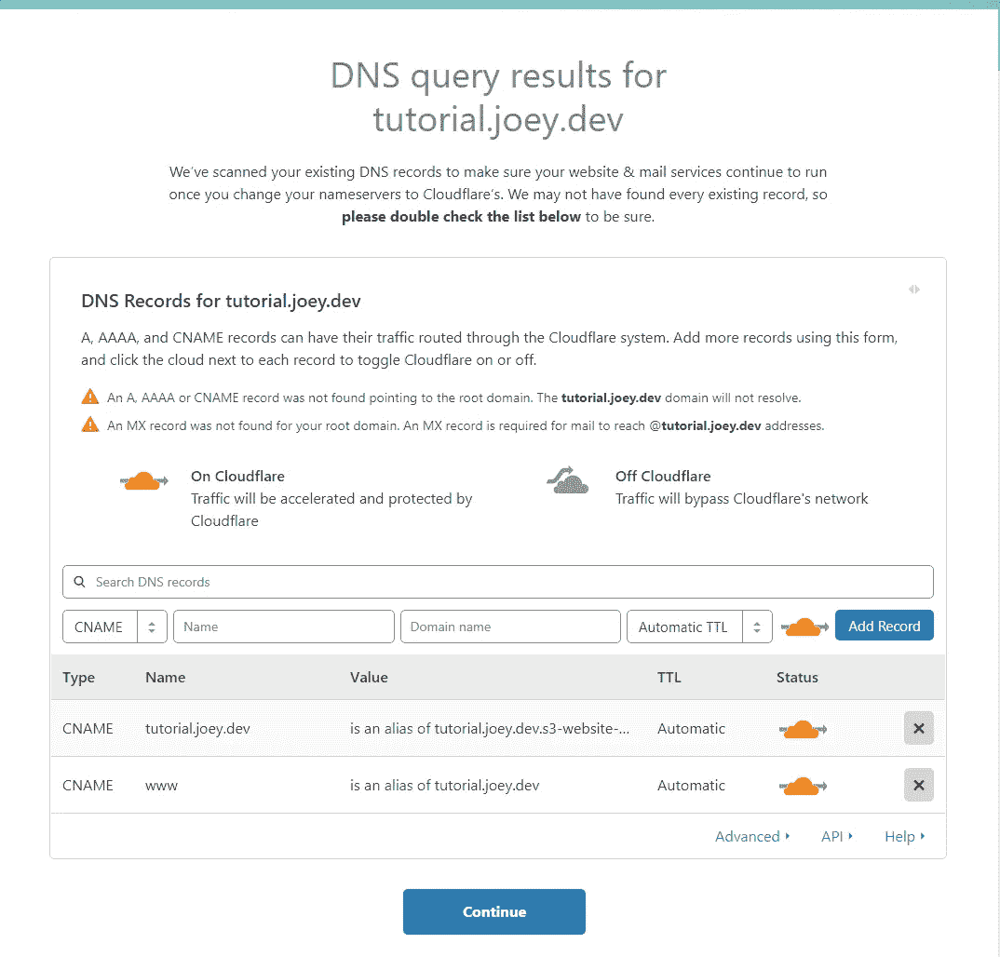

Cloudflare DNS 记录配置

在确认您的记录与“我的图片”相比设置正确后，请单击“继续”。现在，您必须将您的域名服务器从您的域名注册商更改为指向 Cloudflare 的域名服务器。你应该参考你的域名注册商的知识库来指导如何改变你的域名服务器，因为每个网站的布局都略有不同。

更改名称服务器后，您需要设置一些页面规则。在此之前，让我们确保 SSL 证书设置正确。从 Cloudflare 控制面板中，单击要重定向到域控制面板的域。点击*加密*标签，确保你的 SSL 设置为*灵活*。

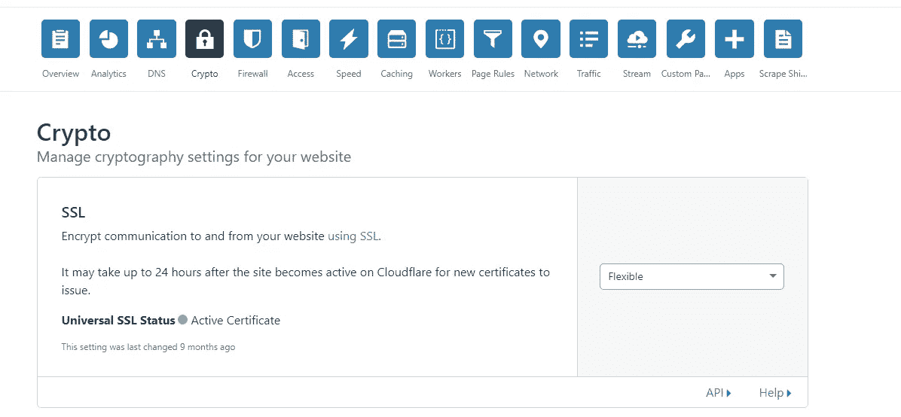

Cloudflare SSL 配置

末日即将来临！单击页面规则选项卡。我们需要创建两个页面规则，将所有非 SSL 流量重定向到 SSL。对于这一节，我将包括我的实际网站使用的页面规则。如果您在一个. dev 域中，您将只需要这个页面规则(所有其他域 TLD 扩展也需要这个规则):

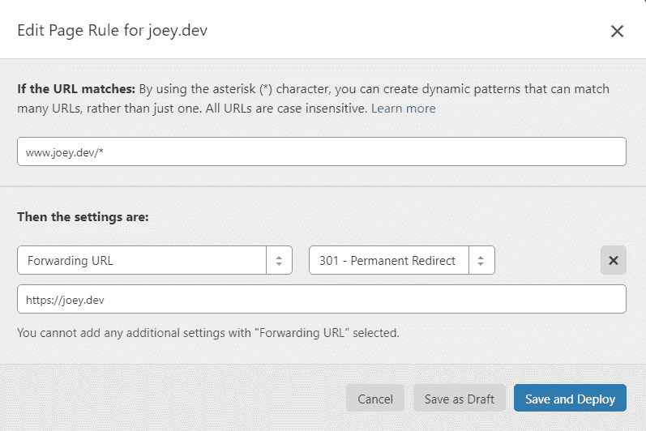

自从。开发域自动重定向到 SSL，你需要注意的唯一情况是当有人进入 *www.domain.dev* 时的情况。这条规则与那条相反。

如果您不在. dev 域上，您还必须包括附加的此页面规则:

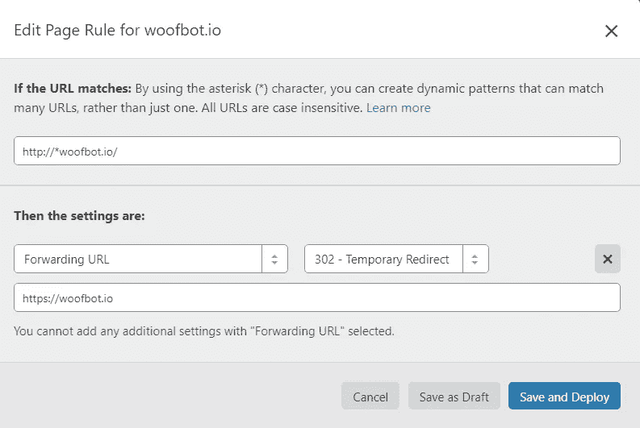

使用您的自定义域名访问您的网站。嗒哒！您将访问一个启用了 SSL 的网站版本，该版本使用 AWS S3 存储桶托管在云上。