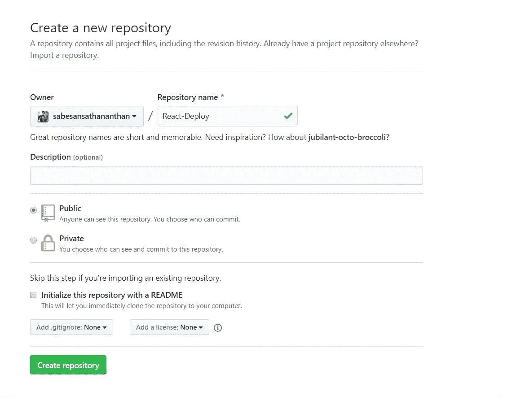
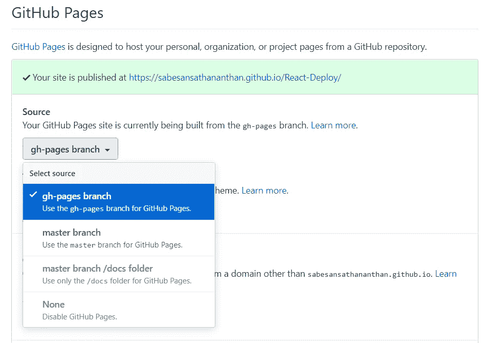
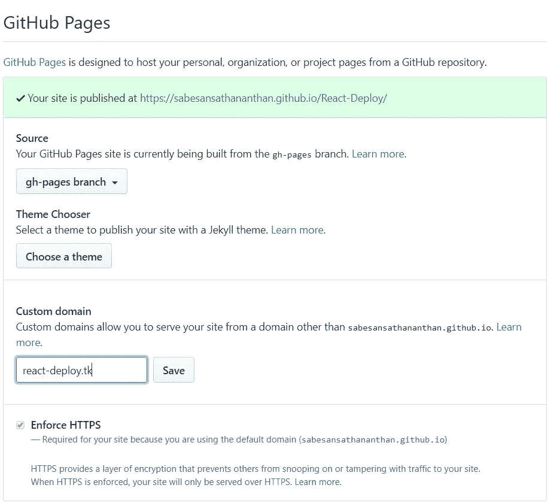

# 如何在 GitHub 页面上免费托管 React 应用

> 原文：<https://betterprogramming.pub/how-to-host-your-react-app-on-github-pages-for-free-919ad201a4cb>

## 主办；主持

## 在 GitHub 上托管您的 React 应用程序


[卡洛斯·穆扎](https://unsplash.com/@kmuza?utm_source=unsplash&utm_medium=referral&utm_content=creditCopyText)在 [Unsplash](https://unsplash.com/s/photos/hosting-web?utm_source=unsplash&utm_medium=referral&utm_content=creditCopyText) 上的照片

对于职场人士来说，花钱托管他们的网站很容易，但对于学生来说，这确实是个大问题。像我和你一样的学生已经有经济困难，托管 React 应用程序的费用是一个严重的问题。

因此，我想描述一下如何在 GitHub Pages 上免费托管你的 React 应用。这是我第 27 篇关于媒介的文章。

GitHub 为我们这样的学生提供了一项名为 *GitHub Pages* 的免费服务。简单的名字和更简单的工作方式。在 GitHub 的服务器上免费托管静态网页，比如博客或作品集。

你的域名应该是这样的:`{username}.github.io/{repo-name}`，但是如果你有自己的域名，你也可以使用它。它们可以买到，因为它们相对便宜。让我们从如何使用 GitHub 页面托管一个基本的 React 应用程序开始。

我假设您对如何创建 React 应用程序以及 GitHub 是什么有所了解。我们走吧。

# 设置存储库

都在仓库里。转到您的 GitHub 配置文件并创建一个新的存储库。例如，我想创建一个名为 *React-Deploy 的存储库。*



如果您单击*创建存储库*绿色按钮，它将重定向到另一个页面。只保留页面，暂时不要关闭标签页或窗口。

# 设置和部署 React 应用程序

对于本教程，我想使用 [create-react-app](https://github.com/facebook/create-react-app) 。因此，我在 PowerShell/终端的特定文件夹中运行以下命令。

```
$ npx create-react-app react-deploy
$ cd react-deploy
```

然后，在 VS 代码中打开该项目，并在 VS 代码中的集成 PowerShell/终端中运行以下命令。用自己的 GitHub 用户名替换`username`。

```
$ git init
$ git add .
$ git commit -m "add: initialCommit"
$ git remote add origin https://github.com/***username***/React-Deploy.git
$ git push origin master
```

如果你已经开发了一个 React 应用程序，请遵循下一组说明。在此之前，请确保您的 React 应用程序代码已经推送到您的 GitHub 帐户。

第一步，安装`gh-pages`包作为 React 应用程序的开发依赖项。

```
npm install gh-pages --save-dev
```

第二步，在 React 应用程序中打开`package.json`并添加`homepage`属性。

将`homepage`的值定义为字符串`http://{username}.github.io/{repo-name}`，其中`username`是您的 GitHub 用户名，`{repo-name}`是 GitHub 库的名称。

因为我的 GitHub 用户名是“sabesansathananthan ”,而我的 GitHub 存储库的名称是“React-Deploy ”,所以我添加了下面提到的属性:

```
“homepage”: “http://sabesansathananthan.github.io/React-Deploy"
```


[https://guides.github.com/introduction/flow/](https://guides.github.com/introduction/flow/)

第三步，在项目的`package.json`文件中添加部署脚本命令。

在`package.json`文件中，用现有的`scripts`属性添加`predeploy`属性和`deploy`属性。你的`package.json` `scripts`应该是这样的:

`predeploy`脚本在运行我们的`deploy`脚本后启动，该脚本捆绑了我们的应用程序进行部署。

现在，将您的应用程序部署到 GitHub 页面。为此，在集成的 PowerShell/终端中用 VS 代码运行以下命令。

```
npm run deploy
```

当您成功部署应用程序后，在浏览器中打开 GitHub 存储库。

单击存储库的*设置*选项卡，向下滚动直到到达 GitHub Pages 部分，并选择`gh-pages`分支作为源。



嘣，你的 React 应用托管在 GitHub 页面上。

# 使用自定义域

如果你不喜欢默认域名中的 *github.io* ，那就选择另一个域名。Github Pages 允许您使用自己的自定义域名，设置它就像在沙滩上散步一样。

如果你还没有域名，去买一个。你可以从这个[链接](https://www.freenom.com/en/index.html?lang=en)获得一些免费域名。如果你打算买一个域名，大概要花 1 到 2 美元。

转到注册表中的设置，并添加一个新的域名。它将生成一个 CNAME 文件，不要在你的目录中删除它。



GitHub 部分在这里完成。现在，您需要进行域端更改。

转到您购买的域名，登录，然后选择您想要使用的域名。检查*管理 DNS* 或 *DNS 设置*。现在，您需要对 DNS 进行两项改进。

## ***记载***

这本质上是一个 apex 域，它确保如果任何用户只写`react-deploy.cf`而不是`https:/react-deploy.cf`或`[www.react-deploy.tk](http://www.react-deploy.cf,)` [，](http://www.react-deploy.cf,)它仍将运行。

您必须使用四个 IP 地址来连接到服务器。这些如下所示。但是请确保你去[官方文件](https://help.github.com/en/github/working-with-github-pages/managing-a-custom-domain-for-your-github-pages-site)并且使用新的。

```
185.199.108.153
185.199.109.153
185.199.110.153
185.199.111.153
```

## ***CNAME***

这可以通过使用 CNAME 来实现，如果你选择使用 www 或其他类似的子域。我们需要将我们的子域指向我们的主存储库选项卡。

因此，我们将它重定向到 sabesansathananthan.github.io/React-Deploy.请确保在地址的末尾，有一行。不是错别字。

现在两者都设置好了，反射可能需要 24 小时，但通常需要 45 分钟到 1 小时。完成后，请输入您的自定义域名搜索您的网站。它已经开始运行了。开始了。

# 子整环

我们只是建立了一个子域，但如果你有一个论坛，想要一个单独的子域，如，`blog.react-deploy.tk`，怎么办？那对你合适吗？我会掩护你的，别担心。

建立一个单独的文件，从头开始，遵循同样的方法。

现在转到您的域控制面板，并添加另一个 CNAME 记录。这一次，你的子域已经准备好滚动，而不是使用 www 页面，瞧。确保在存储库中的设置中使用您的子域(名称)。


[https://www.reason8.com.au/hosting-domains/](https://www.reason8.com.au/hosting-domains/)

# 结论

创建一个 React 应用程序并将其部署到 GitHub 很容易。还有其他免费托管网站，如 [Firebase](https://firebase.google.com/) 、 [Heroku](https://dashboard.heroku.com/) 、 [000webhost](https://www.000webhost.com/) 等。但是大部分开发者使用 GitHub。所以在 GitHub 上托管网站很容易。

GitHub 页面是免费的。您可以托管您的网站，包括自定义域名，子域，所有通过安全 HTTPS。你可以在我的 [GitHub 库](https://github.com/sabesansathananthan/React-Deploy)中找到示例代码。

感谢您的阅读。