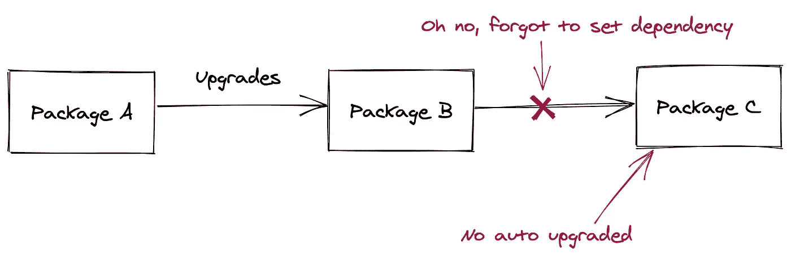
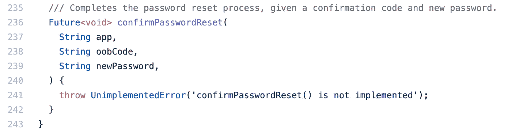
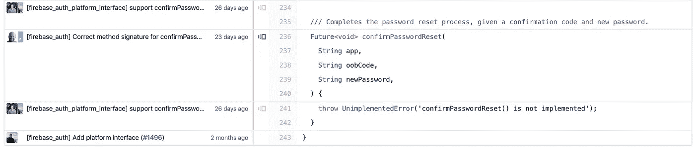
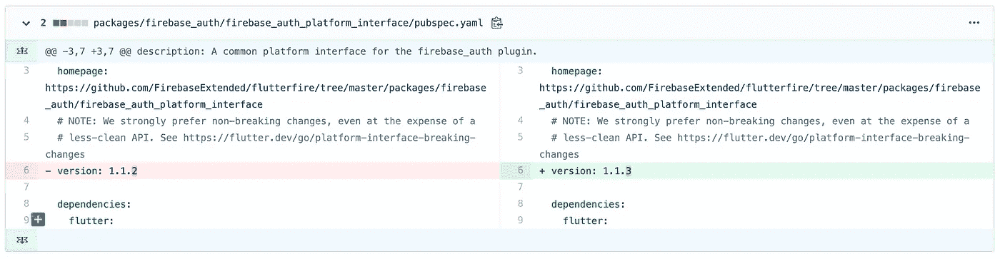
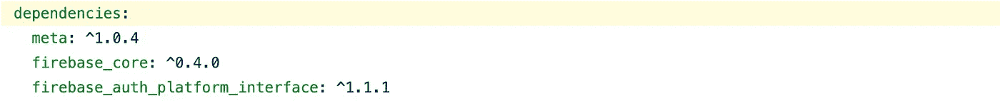

# 如何识别和修复颤振的传递依赖性误差

> 原文：<https://betterprogramming.pub/how-to-identify-and-fix-flutters-transitive-dependency-error-5141df37201>

## 澄清误导性的错误消息


由[大卫·特拉维斯](https://unsplash.com/@dtravisphd?utm_source=unsplash&utm_medium=referral&utm_content=creditCopyText)在 [Unsplash](https://unsplash.com/s/photos/clarity?utm_source=unsplash&utm_medium=referral&utm_content=creditCopyText) 上拍摄的照片

将项目拆分成包是现代软件开发的趋势，尤其是 2020 年以后。

[Flutter](https://flutter.dev/) 作为一个现代化的跨平台 app 框架，紧跟这一策略，很多 Flutter 库也是如此。

模块化模式将接口从实现中分离出来，提高了可重用性，但是在主动开发过程中，版本不匹配经常发生。

幸运的是(也许？)，大多数 Flutter 库和 Flutter/ [Dart](https://dart.dev/) 本身都在积极开发中，所以有效地识别和修复版本不匹配是必不可少的。

# 传递相关性错误:间接过期相关性

传递依赖:如果 A 依赖于 B and B 依赖于 C，那么 C 是 A 的传递依赖


传递相关性错误:

*   包 A 升级包 b。
*   包 B 依赖于包 c 的特定版本。
*   包 B 忘了撞包 c 的依赖版本。
*   包 A 升级到包 B 的更新版本，但包 C 保持不变。
*   包 A 编译项目。
*   包 A 得到一个接口/实现缺失/不匹配的错误。



# 识别操作中的传递依赖关系错误

传递性依赖错误的一个实践:`firebase_auth`包(最近发生的)。

当用户将`firebase_auth`从`v0.15.3`升级到`v0.15.4`时，错误信息:

```
Error: The method 'confirmPasswordReset' isn't defined for the class 'FirebaseAuthPlatform' 
```

将在编译期间出现。

感觉就像 Firebase 团队使用了一个虚构的类，然后忘记实现它。(哦，真的吗？)

让我们仔细看看发生了什么。

首先，让我们找到神秘的`confirmPasswordReset`方法:



来自[fire base extended/flutter fire](https://github.com/FirebaseExtended/flutterfire/blob/3372099ebbd0aa1578da5ec9fe1361c570a348b8/packages/firebase_auth/firebase_auth_platform_interface/lib/firebase_auth_platform_interface.dart#L236-L243)的代码

从上面的代码中，我们可以发现`confirmPasswordReset`是在`firebase_auth_platform_interface`中实现的，它是`firebase_auth`的间接依赖。


*   我们的 app 是 a 包。
*   `firebase_auth`是 b 包。
*   `firebase_auth_platform_interface`是包 c。

嗯，如果`confirmPasswordReset`实现了，为什么我们的应用程序会抱怨它不见了？

让历史来揭示真相。以下是该文件的历史记录:



来自[fire base extended/flutter fire](https://github.com/FirebaseExtended/flutterfire/blame/master/packages/firebase_auth/firebase_auth_platform_interface/lib/firebase_auth_platform_interface.dart#L234-L243)的代码

从历史记录中，我们可以看到这个方法是 26 天前在 [this commit](https://github.com/FirebaseExtended/flutterfire/commit/21d17109dde685357dfd6884f90f921ee47d94cf#diff-942fa3f85bddf2f344ace80d10dc9801R5-R8) 中添加的。

提交创建的版本是`v1.1.3`:



来自[fire base extended/flutter fire](https://github.com/FirebaseExtended/flutterfire/commit/21d17109dde685357dfd6884f90f921ee47d94cf#diff-942fa3f85bddf2f344ace80d10dc9801R5-R8)的代码

`firebase_auth`中使用的`firebase_auth_platform_interface`版本:



啊哈时刻:我们的应用程序依赖于一个版本的`firebase_auth`，而这个版本依赖于一个过时的版本`firebase_auth_plarform_interface`，这是一个典型的传递性依赖错误。

# 修复操作中的可传递依赖关系错误

## **解决方案 1**

升级所有依赖:`flutter pub upgrade`。

这个解决方案是面向未来的(当软件包发布新版本时仍然有效)，但是它会对其他软件包产生副作用，因为它会升级所有软件包，而不管您的需求。

## **解决方案 2**

明确列出更正的可传递依赖关系。

```
firebase_auth_platform_interface:
  dependency: transitive
  version: 1.1.3
  ...
```

这个解决方案明确地纠正了传递性依赖，但是当`firebase_auth_platform_interface`发布新版本时，您将需要停用这个代码。

祝您愉快，永远不会再陷入传递性依赖错误。