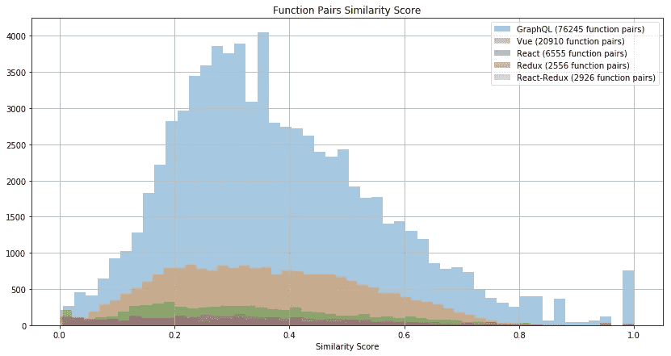
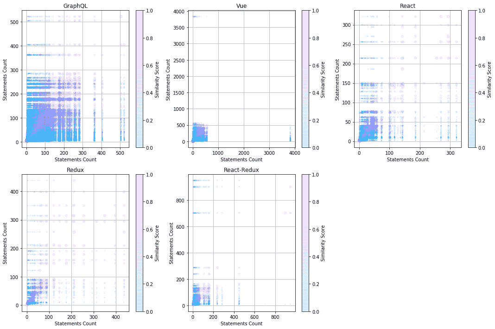

# 如何识别相似的代码片段

> 原文：<https://betterprogramming.pub/how-to-identify-similar-pieces-of-code-43d2a5cef5a6>

## 使用 DRY 来识别代码并清理您的代码库

由[马丁·亚当斯](https://unsplash.com/@martinadams?utm_source=unsplash&utm_medium=referral&utm_content=creditCopyText)在 [Unsplash](https://unsplash.com/s/photos/pairs?utm_source=unsplash&utm_medium=referral&utm_content=creditCopyText) 拍摄的照片

# 目标

最好是用尽可能少的代码库来获得想要的结果。
代码库中的实体越少，就越容易熟悉、支持和构建代码库。

然而，随着项目及其团队的成长，意外引入相同或相似代码的风险也会增加，对于自动代码生成的迭代更是如此。

[DRY](https://github.com/ch3rn0v/dry) 是我为了识别这种类似的作品而建立的项目。(好吧，好吧——和哈斯克尔一起玩。)

# 考虑过的方法

确定性地显示两段(可能不同的)代码是相同的，这并不是一个简单的任务，这意味着它们总是为相同的输入产生相同的输出。事实上，一个人必须为这样的主张或它的否定做出证明。

另一种方法是基于启发式。这是为干燥而选择的道路。这种方法有其缺点:可以很容易地创建两个函数，这两个函数可以欺骗任何给定的度量集，并且仍然可以证明函数是相同的。然而，在构建项目时，通常可以安全地忽略提到的漏洞。由于所有的最佳实践、命名约定、样式指南、自动语法测试等等，很可能相同的函数将具有相同的名称、arity、语句、计数和深度。因此，我决定尝试这种方法。

# 韵律学

为每个唯一的函数对计算一组度量。每个度量都绑定到[0；1].这是指标本身。

1.[**两个函数名之间的距离**](https://en.wikipedia.org/wiki/Levenshtein_distance) 。更准确地说，`1 / (1 + LD)`其中 LD 是 Levenshtein 距离。

2.**函数的 arity 差:**如果两个函数的 arity 都为零，则为 1，否则为较小值除以较大值。

3.**函数的语句差异:**相同的语句在每个深度级别上统计，与不同种类的语句分开考虑。还考虑了唯一语句。越深，差别越不重要。两个函数中任何一个的唯一语句越多，函数越不相似(反之亦然)。

4.**函数的语句总计数差**，计数方式类似于 arity:如果两个函数都有零个语句，则为 1，否则为较小值除以较大值。

最后，对于每一对函数，将上述得分乘以一个权重向量。然后计算这些值的平均值，这就是给定函数对的相似性得分。

有人可能会想，既然已经有了第三个指标(说明语句计数的差异，按语句类型分组),为什么我们还需要第四个指标(总语句计数差异)。和深度水平)。如果函数体由相似的语句组成，那么第四个度量标准可能是多余的。但是，如果它们由不同的语句组成，那么在用于定义它们的语句数量上，可能有也可能没有相似性。第四个指标说明了这一点。

最后一个度量(如上面的四个)被绑定到[0；1]其中 1 相同，0 完全不同。

# 结果

我对许多回购执行了 DRY，并用 Python 创建了这个可视化:

有趣的是，大多数相似的函数都具有相似的语句总数。这仅仅是分数计算方式的结果([见权重向量](https://github.com/ch3rn0v/dry/blob/master/src/Analyser.hs#L148))。同样值得注意的是，有些函数有数百条语句。例如，这里是有 3831 条语句的 [Vue 的](https://github.com/vuejs/vue/blob/8ead9d2a0d4ca686eaf5e35526eff4af1b8c79a7/src/core/vdom/patch.js#L70) `[createPatchFunction](https://github.com/vuejs/vue/blob/8ead9d2a0d4ca686eaf5e35526eff4af1b8c79a7/src/core/vdom/patch.js#L70)`。

Vue 是一个大到足以展示所有可能性的项目。我们先来看看完全相同的函数。他们数量相当多。

首先，这里是[一个平台](https://github.com/vuejs/vue/blob/8ead9d2a0d4ca686eaf5e35526eff4af1b8c79a7/src/platforms/web/runtime/modules/events.js#L32)和[另一个](https://github.com/vuejs/vue/blob/8ead9d2a0d4ca686eaf5e35526eff4af1b8c79a7/src/platforms/weex/runtime/modules/events.js#L7)的`createOnceHandler`。

然后`genData`为[类](https://github.com/vuejs/vue/blob/8ead9d2a0d4ca686eaf5e35526eff4af1b8c79a7/src/platforms/web/compiler/modules/class.js#L34)和[风格](https://github.com/vuejs/vue/blob/8ead9d2a0d4ca686eaf5e35526eff4af1b8c79a7/src/platforms/web/compiler/modules/style.js#L37)。这是一个特例。根据度量标准，这些函数完全相同(得分为`1.0`)。然而，实际上它们并不相同:字符串模板略有不同，对象属性名也是如此。从技术上讲，解释这种差异是可能的。是否有实际意义是另一个问题。

还有其他类似的`genData`的例子，比如[这个](https://github.com/vuejs/vue/blob/8ead9d2a0d4ca686eaf5e35526eff4af1b8c79a7/src/platforms/weex/compiler/modules/class.js#L38)。总共发现了六对独特的`genData`。这给了我们四个不同的`genData`函数，它们彼此相似(因为每一对都是唯一的，并且每一对中的顺序无关紧要)。

一对相似函数的另一个例子是`generate`。我假设[这个](https://github.com/vuejs/vue/blob/8ead9d2a0d4ca686eaf5e35526eff4af1b8c79a7/src/server/optimizing-compiler/codegen.js#L39)与服务器端渲染有关，而[这个](https://github.com/vuejs/vue/blob/8ead9d2a0d4ca686eaf5e35526eff4af1b8c79a7/src/compiler/codegen/index.js#L43)是客户端的。

好吧，那么几乎相似的功能呢？下面一对函数的相似性得分为`0.952695949955943`，语句计数分别为`105`和`100`:`[transformNode](https://github.com/vuejs/vue/blob/8ead9d2a0d4ca686eaf5e35526eff4af1b8c79a7/src/platforms/weex/compiler/modules/style.js#L18)`和`[transformNode](https://github.com/vuejs/vue/blob/8ead9d2a0d4ca686eaf5e35526eff4af1b8c79a7/src/platforms/weex/compiler/modules/class.js#L15)`。注意，在后一种情况下，如何测试`staticClass`是否等于`true`，而`staticStyle`没有被测试，即使它们被检索的方式是相同的:使用`getAndRemoveAttr`。

对于回购，总共有 167，331 个唯一对，其中最不相似的函数对的得分为`0.002267573696145`。我邀请读者自己来看看这些功能是什么。

# 结论

如上所示， [DRY](https://github.com/ch3rn0v/dry) 不仅可以用来识别相似的功能，以便将它们抽象出来，从而减少代码库中的任何重复，还可以用来发现不一致性，这可能有助于发现 bug。希望您会发现这个工具很有用。请随意尝试，指出任何问题和潜在的改进方法。

感谢您的阅读！