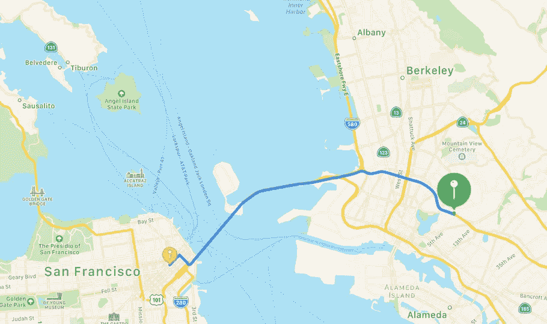
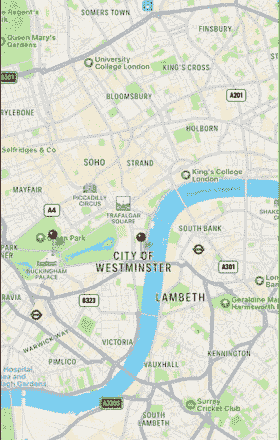
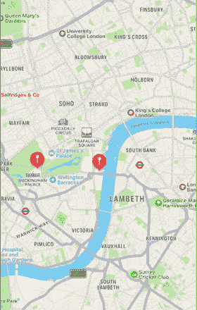

# 如何在 iOS 中实现自定义地图工具包标注

> 原文：<https://betterprogramming.pub/how-to-implement-a-custom-mapkit-callout-in-ios-e452cda98278>

## 关于自定义地图工具包标注,“互联网”没有告诉您什么

不久前，我不得不实现一个自定义的地图包标注。没什么特别的，它应该尽可能依赖于本机实现。

我把我的经历写下来留给后人，希望可以让其他人不用花太多时间去研究如何实现自定义的地图工具包标注 UI，同时仍然保持标记固定的原始外观。

因此，我开始钻研 Apple 文档来寻找解决方案，但是没有多少关于如何为标注构造和使用自定义 UI 的讨论。

所以，下一站，一些关于这个话题的谷歌搜索。正如所料，搜索开始产生一些方法，包括建议覆盖`hitTest`然后提供一些相当复杂的逻辑的方法，但我不会在这里谈论这种方法。

一是因为`hitTest`被弃用；第二，因为这种方法的复杂性实际上没有意义，即使最终结果是一样的。

在我的搜索过程中，有一种方法确实吸引了我的眼球，它的逻辑非常简单，非常有意义。这就是我在这篇文章中想要谈论的:它的优点是什么，缺点是什么，以及为什么它没有达到我的目的，我必须想出一种改进方法。

# 让我们编码

例如，假设我们在地图上有两个固定的地方:一个在白金汉宫，另一个在大本钟。为了填充这些数据，我创建了以下枚举:

一旦我们有了硬编码的应用数据，我们就可以定义我们的`annotation`模型:

我们的准备工作还需要添加一个组件:标注的实际定制 UI。它是`UIView`的一个子视图，在顶部显示了两个标签:一个是注释名，另一个代表实际地址。在底部，我们有一个伦敦景点的图像。这就是我们定制 UI 的全部内容。下面是它的代码:

请再忍耐一会儿。我们完成了所有繁重的编码工作，将定制视图和注释数据放置到位。接下来，我将讨论两种不同的方法:一种是通过子类化`MKPinAnnotationView`，另一种是我在之前的搜索中发现的，它实现了`viewForAnnotation`委托方法。

# 子类化`MKPinAnnotationView Approach`

我们将通过子类化 pin annotation 视图并提供一个定制的`detailCalloutAccessoryView`来创建我们的定制标注:

这看起来很好，很容易理解。接下来我们要补充的是如何利用这个`AnnotationView`。

在上面的代码片段中，我在故事板中创建了我的`mapView`来使事情变得简单。在`viewDidLoad()`工作之后，我创建了我的注释，将它们添加到`mapView`，然后注册我新创建的`AnnotationView`。这就是显示自定义标注视图所需的全部实现。让我们看看它是如何工作的。

当我点击批注时，标注显示良好；唯一让我抓狂的是展示的老式胸针。`MKPinAnnotationView`的每一个子类都带有这个老式的别针。

我想要一个新的大头针样式，当你点击它的时候会有一个跳跃的动画。如果这是我对这种方法的唯一质疑。这就是我想出的第二种方法，它既易于实现，又利用了原生 pin 外观的优点。

## **更新**

基于 [Gerd Castan](https://medium.com/u/232868446381?source=post_page-----e452cda98278--------------------------------) 的评论，`MKPinAnnotationView`被弃用，这解释了为什么引脚视图看起来很旧。这个旧注释视图的替代品是`MKMarkerAnnotationView`。子类化标记注释视图将带有新的大头针外观和动画。

# **实现视图注释方法**

我将继续编码。没有必要对在`viewController`中完成的所有实现进行子类化。

变化很小，但影响很大。我们没有注册一个`MKPinAnnotationView`子类，而是遵循`MKMapViewDelegate`并在给定的注释上提供必要的修饰。现在，让我们看看这种方法是如何工作的。

这是我实现自定义标注视图的经验。我希望你喜欢这个故事，找到有用的信息，甚至一些指导。

如果你想访问完整的代码，[这里是链接](https://github.com/iOSifMol/CustomCallout)。