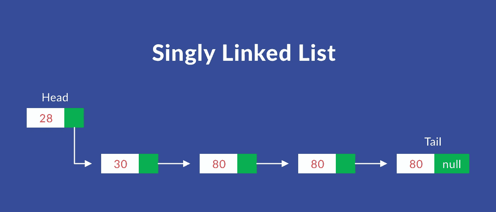

# 如何使用 JavaScript 实现一个链表

> 原文：<https://betterprogramming.pub/how-to-implement-a-linked-list-using-javascript-387729416a5b>

## 深入研究有用的数据结构

今天，我将向你展示如何从头开始实现一个单链表及其所有常用函数。(双向链表的实现即将到来！)

# 到底什么是单链表？

它是一种有序的数据结构，用于像数组一样存储值。

然而，它有一些关键的区别。与数组不同，链表没有索引。相反，一个链表包含使用*指针*指向下一个元素的*节点*。

一个节点包含一个值(一个数字、字符串或任何相关的东西)和一个指向下一个节点的指针。如果没有下一个节点，它指向 null。

让我们快速实现一个将用于链表实现的节点。

一个链表有一个`Head`属性、一个`Tail`属性和一个可选的`length` 属性来跟踪元素。`Head`是链表的第一个节点，`Tail`是最后一个节点。

为了能够访问列表中的任何节点，我们从位于`Head`的节点开始，使用节点的 next 属性遍历列表，以此类推，直到到达我们要寻找的节点。

参考这个[资源](https://visualgo.net/en/list)来更好的可视化遍历。

# 链表实现

现在，所有的技术术语都已经过时了，让我们最终实现链表。

## 基本实现

我们将从定义一个`class`开始，它在构造函数中接受以下值:

*   `head`指向第一个节点，当前设置为`null`。
*   `tail`指向最后一个节点，当前设置为`null`。
*   `length`包含列表的长度，最初设置为`0`。

现在让我们实现与链表相关的常见函数。它有助于保持上面列出的相同的[资源](https://visualgo.net/en/list)打开，以便更好地理解和可视化下一节中解释的每个功能。

**重要提示** : 下面实现的所有函数都定义在我们刚刚创建的`LinkedList`类中。为了可读性，我将分别分享每个函数的要点。

这里有一个关于 [GitHub](https://github.com/KaushikShivam/LinkedList-js) 的完整实现的链接。

## **推送功能**

就像数组一样，`push`函数接受一个值，并将其赋给列表的末尾。

*   `push`函数接受一个值，并用它创建一个实例节点。
*   然后检查`head`属性是否不是`null`。如果是，这意味着我们的列表中没有元素(节点)。因此，如果我们的列表中没有元素，函数会将新创建的节点分配给`head`和`tail`属性。
*   在那里，如果`head`属性不是`null`(也就是说，我们的列表中有元素(节点)，它将`tail`的 next 属性设置为指向新创建的节点，并将 new `tail`设置为指向新创建的节点。
*   最后，它将`length`属性加 1。

## 弹出功能

与数组一样，`pop`函数从列表末尾删除一个元素(节点)。然而，它要求我们遍历整个列表，因为没有索引。

我们遍历整个列表，直到到达倒数第二个节点。然后，我们将它的下一个属性设置为`null`，并将其设置为新的`tail`。让我们看看它的代码。

*   如果列表为空，函数返回`undefined`。您也可以选择返回`null`。
*   然后循环遍历列表，直到到达`tail`。它还跟踪前一个项目，因为我们将其设置为新的`tail`。
*   当它到达`tail`时，它将我们跟踪的倒数第二个时间指定为我们的新`tail`。
*   然后，它将列表的长度减 1。
*   最后，它返回弹出的项目。
*   **边缘情况** —检查所有项目是否弹出。如果是，将`head`和`tail`设置为`null`。

## **解除换档功能**

这是一个简单的函数，在列表的开头添加一个元素。

*   它用传递给函数的值创建一个节点。
*   如果列表为空，则设置`head`和`tail`指向该节点。
*   否则，将当前的`head`设置为指向该节点的`next`属性，并将该节点设置为新的`head`。
*   最后，它将`length`加 1。

## **换档功能**

这个函数也非常简单。它移除列表的第一个元素并返回它。

*   如果列表为空，它将返回`undefined`。可以选择返回`null`。
*   存储当前的`head`并设置新的`head`指向当前 head 的下一个属性。
*   将`length`减 1。
*   最后，返回移除的元素。

## 获取功能

get 函数接受一个数字(一个索引)并遍历列表，直到找到该索引处的节点并返回它。

*   如果传递的索引越界，则返回`undefined`。你可以选择返回`null`。
*   遍历列表，直到到达指定的索引，并返回该索引处的节点。

## 集合函数

set 函数接受一个索引和一个值。然后，它在指定的索引处分配该值。

*   它使用了`get`方法来查找指定索引处的节点。
*   如果找到节点，则分配该节点的值，并返回 true。
*   否则，返回 false。

## 插入功能

insert 函数接受一个索引和值，就像 set 函数一样。但是，与 set 函数不同的是，它在指定的索引处插入值。

*   如果索引超出界限，则返回 undefined。
*   如果索引与长度相同，它会将具有所提供值的节点推到列表的末尾。为了方便起见，我们将在这里使用我们的`push`函数。
*   如果索引为 0，它会将具有所提供值的节点推到列表的开头。为了方便起见，我们将在这里使用我们的`unshift`函数。
*   否则，它获取指定索引的 之前的元素*，并用指定值将其`next`属性赋给我们的新节点。*
*   然后分配新节点的`next`属性指向指定索引的 之前的*元素的`next`属性。*
*   最后，它将长度增加 1 并返回 true。

## 移除功能

remove 函数接受一个索引并删除指定索引处的值。

*   如果索引超出界限，则返回 undefined。
*   如果索引指向最后一个元素的索引，则从列表末尾移除该节点。为了方便起见，我们将在这里使用我们的`pop`函数。
*   如果索引为 0，则从列表的开头移除该节点。为了方便起见，我们将在这里使用我们的`shift`函数。
*   否则，获取指定索引处 之前的元素*，并赋予其`next`属性指向指定索引处节点的`next`属性！*
*   最后，它将长度减 1，并返回移除的节点。

# 从这里去哪里

唷！大概就是这样。

我们可以实施或改进的地方很多。但是如果你理解了这些常见的功能，你就能自己完成大部分的工作。

*   仔细阅读解释，并尝试自己实现它。
*   请参考 [VisuAlgo](https://visualgo.net/en/list) 以更好地理解和形象化每个功能的工作方式。
*   此外，通读[这篇文章](https://medium.com/@mckenziefiege/arrays-linked-lists-and-big-o-notation-486727b6259b)，进行 big-O 分析并与数组进行比较。

# 结论

下面是完整链接实现的 [GitHub repo](https://github.com/KaushikShivam/LinkedList-js) 。如果你有任何疑问，欢迎在下面评论，我会尽力澄清。