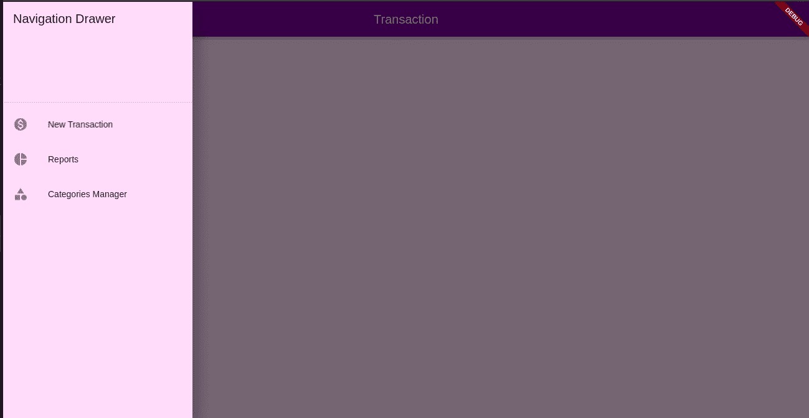
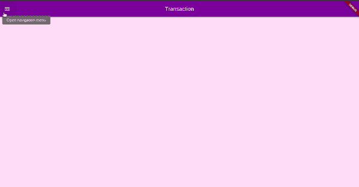

# 如何在 Flutter 中实现一个导航抽屉

> 原文：<https://betterprogramming.pub/how-to-implement-a-navigation-drawer-in-flutter-8d97d3b599d4>

## 在 Flutter 中创建一个简单的抽屉，并在菜单项之间导航


照片由[普里西拉·杜·普里兹](https://unsplash.com/@priscilladupreez?utm_source=unsplash&utm_medium=referral&utm_content=creditCopyText)在 [Unsplash](https://unsplash.com/s/photos/mac?utm_source=unsplash&utm_medium=referral&utm_content=creditCopyText) 上拍摄

[Flutter](https://flutter.dev/) 是一个快速发展的跨平台框架，用于创建漂亮的应用程序。它提供了一个包含大量材质小部件的目录。

通常，我们在应用程序中使用两种类型的导航——标签页和抽屉。当我们想要节省空间并在屏幕上显示许多选项时，抽屉就派上了用场。

在本教程中，我们将创建一个简单的抽屉，添加一些选项，并学习如何实现菜单项之间的导航。

我们开始吧！

# 创建颤振应用程序

## 先决条件

本文假设您已经安装了 Flutter。如果没有，请参考[文档](https://flutter.dev/docs/get-started/install)了解如何开始。

我将在网上演示导航抽屉，因此请确保您切换到`beta`频道，以便能够在您的浏览器中运行该应用程序。

要启用 web 开发，请在终端窗口中执行以下几行:

```
flutter channel beta
flutter upgrade
flutter config - enable-web
```

# 开发步骤

1.在你最喜欢的 IDE 中创建一个新的 Flutter 应用程序

现在我们的抽屉需要一些虚拟物品。想象一下，我们正在开发一个预算跟踪应用程序，我们想列出交易，报告和交易类别。

2.创建一个新文件`categoriesview.dart`，并在其中放入以下内容:

注意，我们必须为每个想要显示的视图提供一个`routeName`。它的工作方式类似于 URL 路径，例如，如果您想直接访问 categories 视图，您可以键入类似于`http://localhost:8080/categories`的内容。

3.创建一个`transactionview.dart`文件，并将以下代码粘贴到其中:

4.类似地，创建一个新文件`reportsview.dart`:

为了更清晰的代码，我们在单独的类中定义了我们的视图。

5.现在我们创建一个路径持有者类并引用每个视图的路径。在名为`routes`的新目录中创建一个`routes.dart`类:

6.让我们在名为`drawer.dart`的新文件中创建`Drawer`小部件:

`ListTiles`是我们想要显示和导航的菜单项。我在物品上添加了一些图标，让抽屉更有吸引力。

当用户点击一个项目时，调用`onTap()`方法。如您所见，通过调用`Navigator.pushReplacementNamed()`方法将用户重定向到请求的视图非常简单。

7.我们需要通过定义一个`drawer`参数将`Drawer`添加到我们之前创建的虚拟视图中。`categoriesview.dart`的完整代码应该是这样的:

8.对`transactionview.dart` 和 `reportsview.dart`重复相同的步骤。

9.最后，让我们通过修改负责运行应用程序的`main.dart`文件来连接到目前为止我们所做的一切。删除自动生成的代码，并添加以下内容来创建主应用程序:

为了让应用程序更加丰富多彩，我使用`_createTheme()`方法添加了一个自定义主题。

注意，我们已经定义了一个与视图路径相对应的`routes`列表。

通过添加`home`参数，我将`TransactionView()`设置为默认值。这意味着它将是用户打开应用程序时出现的第一个视图。

# 测试应用程序

最后，让我们看看新应用的运行情况。

在终端中运行以下命令:

`flutter run -d web`

使用生成的端口打开浏览器。或者，为了方便起见，您可以键入以下命令来定义一个自定义端口:

`flutter run -d web — web-port=8080`

您的应用程序应该如下所示:



导航抽屉的默认页面

现在，您可以尝试通过修改 URL 直接访问一些视图，例如`localhost:8080/#/transaction`等。

这是完整的演示:



演示导航抽屉

# 结论

我们已经看到了如何创建一个抽屉并实现其项目之间的导航。

快速回顾一下:

*   创建您的视图，并为每个视图定义路径
*   创建一个 routes 类来保存路径引用
*   创建抽屉并在`onTap()`方法中实现`Navigator.pushReplacementNamed()`
*   将抽屉添加到视图中
*   将路线传递给 main.dart 文件中的`routes`参数

如果你需要这个演示的完整代码，你可以在下面链接的我的 GitHub 库中找到它。

要探索更多的颤振主题，您可以查看我的相关文章:

[](https://medium.com/better-programming/how-to-create-flutter-charts-on-android-5a75b5fc337c) [## 如何在 Android 上创建颤振图表

### 在抖动图表中显示来自 Android 后端的数据

medium.com](https://medium.com/better-programming/how-to-create-flutter-charts-on-android-5a75b5fc337c) [](https://medium.com/better-programming/create-a-simple-admin-ui-with-flutter-and-etcd-1d00c788014d) [## 用 Flutter 和 etcd 创建一个简单的管理用户界面

### 处理来自 etcd 后端的数据，并在 Flutter 中显示数据

medium.com](https://medium.com/better-programming/create-a-simple-admin-ui-with-flutter-and-etcd-1d00c788014d) [](https://medium.com/better-programming/how-to-display-data-in-flutter-using-spring-boot-rest-service-e722ceb80d97) [## 如何使用 Spring Boot REST 服务在 Flutter 中显示数据

### 从 Spring REST 服务获取数据，并在动态网格卡中显示结果

medium.com](https://medium.com/better-programming/how-to-display-data-in-flutter-using-spring-boot-rest-service-e722ceb80d97) 

希望这篇教程对你有用。感谢您的阅读和快乐编码！

# 参考

*   [https://github.com/kirshiyin89/flutter_navigation](https://github.com/kirshiyin89/flutter_navigation)
*   https://api.flutter.dev/flutter/material/Drawer-class.html