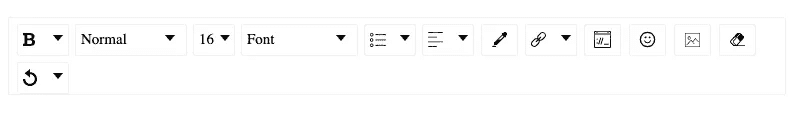
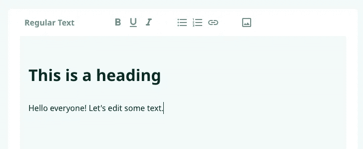

# 如何在 React 应用中实现富文本编辑器

> 原文：<https://betterprogramming.pub/how-to-implement-a-rich-text-editor-in-your-react-app-5c64d56ddec7>

## 定制您自己的编辑器的外观


由特雷弗·瓦诺伊在 [Unsplash](https://unsplash.com?utm_source=medium&utm_medium=referral) 拍摄的照片

我们想要完成的:为你的 React 应用程序提供一个漂亮可靠的文本编辑器。它将使用户能够像在 Medium、Google Docs 或任何其他支持块(普通文本、H1、H2 等)和内联(粗体、下划线、斜体等)格式的编辑器上一样编写文章/故事，并插入链接和图像，甚至是有序和无序的项目列表。我们还将看到如何访问用户插入的文本，以及应用的格式——以 HTML 的形式。

我们将使用一个由脸书开发的封装了 DraftJS 框架的库。简单地说——正如他们的文档中所说——draft js 是一个“React 的富文本编辑器框架”就是这样。我已经开始通过直接使用框架来实现编辑器。这当然是可行的，但感觉非常耗时。幸运的是，我发现了一个非常方便的包装器库: [react-draft-wysiwyg](https://github.com/jpuri/react-draft-wysiwyg) 。

Wysiwyg 代表`What you see is what you get`，这是对这种编辑器的完美描述:用户将应用某些格式，这正是他们的文章/故事之后的样子，比如说当它发布在网站上时。

首先，您需要添加所需的依赖项:

```
$ npm install --save react-draft-wysiwyg draft-js
```

由于这个库包装了前面提到的框架，我们需要将它们作为依赖项添加到我们的项目中。

很容易开始并将编辑器组件添加到您的项目中:

```
import { Editor } from "react-draft-wysiwyg";
import "react-draft-wysiwyg/dist/react-draft-wysiwyg.css";...
<Editor
  editorState={editorState}
  onEditorStateChange={this.onEditorStateChange}
/>;
...
```

不要省略 CSS 导入；否则，您将没有应用默认样式，并且您将花费 15 分钟试图理解为什么所有东西看起来都坏了。

在上面的代码片段中，我们传递了两个强制属性，这样编辑器就可以使用了。`editorState`对象是一个`[EditorState](https://draftjs.org/docs/api-reference-editor-state/)`，它包含(如文档中所述):

*   当前文本内容状态
*   当前选择状态
*   内容的完全修饰表示
*   撤消/重做堆栈
*   对内容所做的最新类型的更改

我们需要一个不同的库来将编辑器的内部状态转换成 HTML，但是我们很快就会实现。

你当然是在开发一个漂亮的、现代的 web 应用程序。而且说实话，编辑器的默认 UI 并不是最棒的。不要担心，我们将通过所需的步骤来提升你的编辑器。



编辑器的默认外观

我的任务是完全定制编辑器工具栏的外观，使用定制图标，区分桌面用户和移动设备用户看到的选项，并设计下拉菜单和弹出窗口的样式。



编辑器在样式化后的最终效果。

上面截图中的输入将转化为以下内容:

```
<h1>This is a heading</h1><p>Hello everyone! Let’s edit some text.</p>
```

首先，让我们看看如何定制我们的选项。

您需要将`toolbar`属性添加到您的编辑器组件中。以下代码会有所帮助:

```
<Editor
  toolbar={{
    // we'll add our config here
  }}
  ...
/>;
```

文件[写得很好，但是在我看来，还是有一些不足之处。我对它们进行了大量的研究，并通过反复试验和研究 GitHub 上的源代码，发现了如何配置这个库，但是我想为您节省一些时间，并提供一些具体的提示，告诉您如何实现关于这个编辑器的目标。](https://jpuri.github.io/react-draft-wysiwyg/#/docs?)

首先，让我们看看如何配置编辑器的内联样式(哪些样式可以应用于文本),以及如何在 UI 上定制这些选项的外观。

```
inline: {
   inDropdown: false,
   options: ['bold', 'underline', 'italic'],
   bold: { icon: FormatBoldIcon },
   italic: { icon: FormatItalicIcon }, 
   underline: { icon: FormatUnderlineIcon },
},
```

*   除了粗体、斜体、下划线，你还可以使用“删除线”、“等宽线”上标'或'下标'
*   您可以在下拉列表中显示您的选项，也可以在工具栏中展开它们。
*   对于每个行内编辑选项，您还可以提供自定义的 SVG 图标。
*   您的图标将按如下方式导入:

```
import FormatBoldIcon from './format_bold_icon.svg';
```

您可以配置的工具栏对象的其他字段包括:

```
blockType: { // text, H1, H2, etc
  ...
},
list: { // ordered or unordered lists
  ...
},
link: { // adding an URL with a custom text
  ...
},
image: { // for inserting an image in the editor
  ...
}
```

在[文档](https://jpuri.github.io/react-draft-wysiwyg/#/docs?)中，你会找到这些选项以及解释，所以我不会再赘述。配置它们类似于配置`inline`选项。

然而，让我们来看一个更棘手的问题(我见过一些人在插入图像的问题上挣扎)。

将`previewImage`选项设置为真非常重要。否则，您选择图像的弹出窗口将显示 URL，而不是图像本身。我认为其他选项很容易理解。但是`uploadCallback`呢？

最重要的部分是返回一个承诺，其`resolve`回调将解析返回到在`link`字段中提供的图像的 URL。

对于本教程的最后一部分(因为我想保持事物的整洁和粒度)，让我们获得输入状态的等效 HTML。

您需要为此添加一个不同的库。有一些选项——我不能说哪一个是最好的，但我已经使用了 [draft-convert](https://www.npmjs.com/package/draft-convert) 。方法`convertToHtml`将返回编辑器输入的 HTML。

```
useEffect(() => {
  const html = convertToHTML(editorState.getCurrentContent());
  props.setContentHtml(html);
}, [editorState]);
```

其中`editorState`被这样实例化:

```
const [editorState, setEditorState] = useState<EditorState>(
  EditorState.createEmpty()
);
```

我们还可以用下面的代码定制`convertToHtml`方法的 HTML 输出:

我需要上面的覆盖，因为该库插入图像的输出是`<figure> </figure>`，没有其他内容！现在输出是正确的— `</img>`。

在另一个教程中，我们还将介绍编辑器的高级样式，例如链接/图像弹出窗口的完全定制、编辑器的形状、工具栏图标之间的间距等。

这些是实现富文本编辑器的基本步骤。我真的希望这对你有帮助。不要犹豫开始一段对话，非常感谢你的阅读！