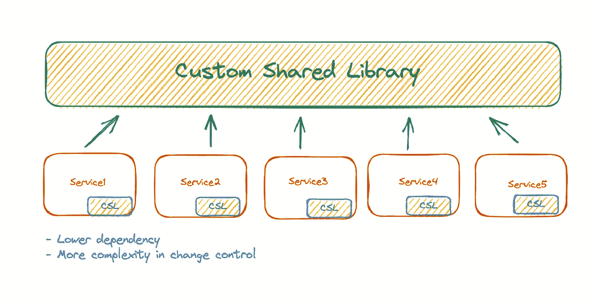
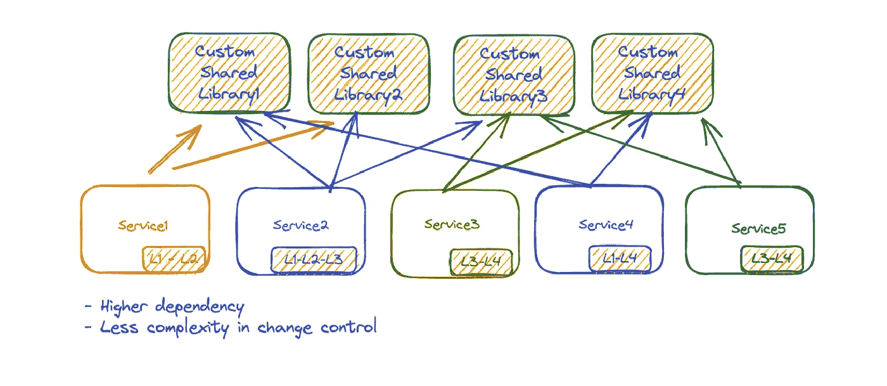
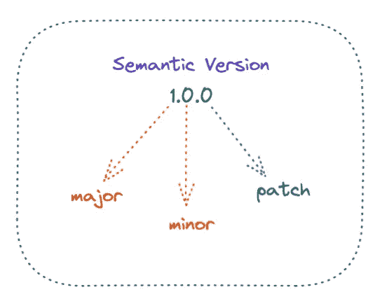
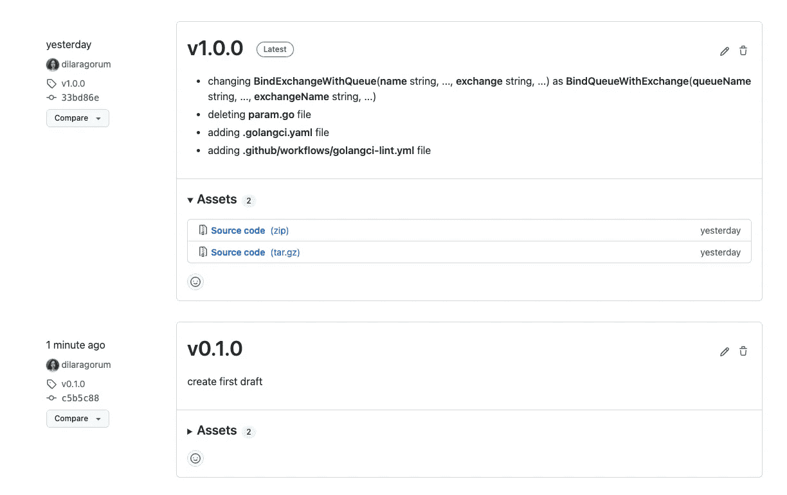

# 如何用 Golang 实现一个库

> 原文：<https://betterprogramming.pub/how-to-implement-a-shared-library-in-golang-eeaf466de9fd>

## 理解依赖管理和变更控制之间的权衡


在 [Unsplash](https://unsplash.com?utm_source=medium&utm_medium=referral) 上由 [Jaredd Craig](https://unsplash.com/@jareddc?utm_source=medium&utm_medium=referral) 拍照

当你踏入软件世界的第一步，几乎不可能不碰到[干](https://en.wikipedia.org/wiki/Don%27t_repeat_yourself)这个名词(不要重复自己)。这是因为我们使用了函数、抽象等等。，不要在我们的项目中重复自己。然而，这种想法在每种情况下都有效吗？

例如，考虑系统的两个不同部分。它们有完全不同的业务逻辑，但是在不同的环境中使用相同的功能来解决不同的问题。这样，我们应该在这些不同的部分使用共享库来防止代码重复吗？如果你的答案是“是”，你需要在阅读这篇文章的时候再想想你的答案。

在这两个部分中使用相同的库增加了依赖性和[耦合性](https://en.wikipedia.org/wiki/Coupling_(computer_programming))。这是因为它们有不同的业务逻辑，它们可以根据业务环境的需要独立进化。太棒了。您减少了代码行，但是增加了耦合和维护成本。

> 耦合是对两个组件相互了解和依赖程度的度量。耦合度越高，依赖性越强。松散耦合指的是不同的组件之间相互了解很少，而组件之间没有耦合，它们完全不知道彼此的存在。[【1】](https://www.amazon.com/Scalability-Startup-Engineers-Artur-Ejsmont/dp/0071843655)

由于耦合和依赖问题，在分布式架构中，著名的原则是 [WET](/when-dry-doesnt-work-go-wet-6befda0444bf) (每次都写或者所有内容都写两次)。WET 的关键点是减少共享代码的数量。然而，完全防止代码重用是不可能的。因此，一些技术被用于管理分布式系统中的代码重用。

今天，我将基于[软件架构的《分布式架构的硬部件现代权衡分析》一书来谈论这些技术中的一种——共享库。](https://www.amazon.com/Software-Architecture-Trade-Off-Distributed-Architectures/dp/1492086894)

# 共享库

尽管共享库有助于我们管理代码重用，但它也有一些缺点。当我们使用共享库时，我们需要考虑*依赖管理*和*变更控制*。

我们通过两个用例来理解依赖管理和变更控制之间的权衡。

在第一种情况下，有五个服务使用同一个共享库。



图:一个自定义共享库

*   当共享库发生变化时，每个服务最终都必须采用这种变化，因为库的版本会随着时间的推移而降低。在这种情况下，我们必须在每次更改时重新测试和部署我们的应用程序。我们需要确定是否有任何不推荐使用的功能。应用程序可以使用不同的版本；然而，当这个版本被否决，我们的服务将不再工作。
*   另一个缺点是当由于服务需求而改变库时。结果，我们失去了库的通用性，最终，它包含了其他服务的混乱和不相关的代码块。这不是我们想要的。

在第二种情况下，我们有五个服务和四个不同的共享库。



图:多个自定义共享库

这些不同的服务使用不同的库。看起来很乱，对吧？正如您所猜测的，在这种情况下，依赖性管理变得很困难，因为与前面的例子相比，我们的服务依赖于不止一个库:*共享库越多，依赖性就越强。*

另一方面，变更控制和可维护性变得更加易于管理。

然而，不要忘记，分享总是会增加我们决定分享的东西的耦合度:在这两种情况下，耦合度和依赖性都会增加。

尽管对共享库有各种各样的批评，但有时它对技术目的是有益的。例如，如果我们过多地使用 RabbitMQ SDK，我们可以编写它的包装器，并将其功能提取到一个库中，我们可以使用这个库来提供服务。

让我们看看如何使用 Golang 来实现这个功能。

# 创建库

我们需要创建一个带有适当版本的标签来共享这段代码。

# 创建版本和标签

要创建一个版本，我们需要遵守行业标准。一个流行的版本标准是 [**语义版本**](https://semver.org/) 。



图:语义版本化

您可以查看文档以了解主要版本、次要版本和补丁以及它们的使用方法。

在实现阶段，我做到了这一点，如下所示:



图:语义版本化的实现

# 使用库

首先，我们需要使用`go get`安装这个共享库。之后，我们必须在我们的项目中导入我们的库，如下所示。

ℹ️如果你想测试你的库而不发布它，你可以使用`replace`指令。为此，您需要打开服务的 go mod 文件并编写:

```
replace github.com/dilaragorum/calculations v1.3.1 => directory of your project
```

# 额外收获:在 Github 动作中添加 lint

如果你在 GitHub 中查看我们的库[，你会看到一个只有一个步骤的管道，叫做 lint。要在 GitHub 的 CI 中实现 lint，可以看](https://github.com/dilaragorum/rabbitmq-sdk/blob/master/.github/workflows/golangci-lint.yml)[文档](https://golangci-lint.run/usage/install#github-actions)。

# 源代码

[](https://github.com/dilaragorum/rabbitmq-sdk) [## GitHub-dilaragorum/rabbit MQ-SDK

### 此时您不能执行该操作。您已使用另一个标签页或窗口登录。您已在另一个选项卡中注销，或者…

github.com](https://github.com/dilaragorum/rabbitmq-sdk) 

感谢您的阅读。