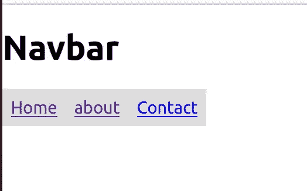
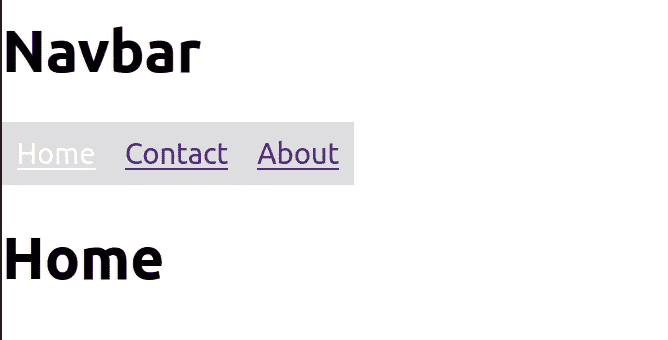
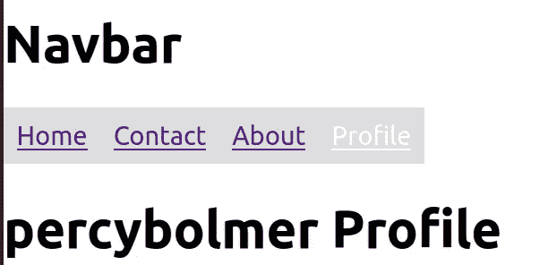
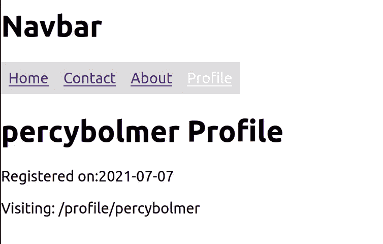

# 如何使用 React-Router 实现单页面应用程序

> 原文：<https://betterprogramming.pub/how-to-implement-a-single-page-application-using-react-router-cc6b9e5c3aec>

## 了解如何使用 React 路由器开发 SPA 网站


照片由 [Brando 在](https://unsplash.com/@brandomakesbranding?utm_source=medium&utm_medium=referral) [Unsplash](https://unsplash.com?utm_source=medium&utm_medium=referral) 上制作品牌

# 什么是 SPA？

SPA 代表单页应用程序。这是目前非常常见的网站编程方式。这个想法是网站在你第一次访问的时候加载所有的 HTML/JS。当您随后导航时，浏览器只会重新呈现内容，而不会刷新网站。

这是用来让用户体验感觉流畅很多的。当经常在菜单之间导航时，你可以分辨出它是 SPA 还是多页应用程序，因为多页应用程序会重新加载，使整个 UI 根据内容快速闪烁。这是因为它刷新了网站。取而代之的是，SPA 在交易中会感觉很流畅，因为它只是显示其他内容而没有刷新。

我们将看看如何使用 React-Router 来构建一个。

# 发展水疗中心

首先，使用 [create-react-app](https://reactjs.org/docs/create-a-new-react-app.html) 创建应用程序模板。

```
create-react-app app
```

进入新创建的 app 文件夹，安装 React 路由器，我们将使用它来创建 SPA。

```
npm i react-router-dom --save
```

我们将从修改创建的应用程序开始，打开`src/App.js`并用以下内容替换其中的所有内容:

App.js 删除原始闪屏

注意，我们正在返回`Main`组件。让我们创建它，这样应用程序就不会崩溃。创建一个名为 layouts 的文件夹和一个名为`layouts/main.js`的文件。这个文件将保存应用程序的基本布局。

```
mkdir layouts
touch layouts/main.js
```

在`main.js`中，我们将创建一个看起来非常糟糕的导航条，但我们是来学习 React Router 而不是 CSS 的。这将有一个关于页面和联系页面的导航链接。在 navbar 下面，我们将有一个内容 div，用于呈现所选的链接。这是一个非常常见的 SPA 设置，其中有一个带有导航的静态布局和一个可以改变内容的卡片。代码如下:

Main.js 应用程序的默认布局

让我们创建导航栏，然后访问页面。在 src 中创建一个名为 components 的文件夹，它将保存应用程序的组件。然后创造`components/navbar/navbar.js`。

```
mkdir -p components/navbar/
touch components/navbar/navbar.js
```

Navbar.js —一个简单的链接列表

最后，打开`src/index.css`，粘贴以下 CSS 代码片段，将导航条呈现为一个水平列表:

index.css —添加水平导航栏

启动应用程序并访问 [localhost:3000](http://localhost:3000) 以查看生成的应用程序。

```
npm start
```



这是当前不工作的导航栏

在我们开始实现路由器之前，我们需要创建三个组件，这都非常简单，因为它们只是打印它们的名称。

```
mkdir components/about
mkdir components/contact
mkdir components/home
```

About.js —打印名称

复制并粘贴以上所有三个组件的代码，并将名称改为正确的名称。所以你应该有`components/about/About.js`、`components/contact/Contact.js`和`components/home/Home.js`，它们看起来都像《约法三章》的主旨，只是名字变了。

# 学习使用 React 路由器

如果您已经创建了所有这三个组件，那么最后是时候学习如何使用 React 路由器了。我们将使每个链接将显示的内容更改为正确的组件。

我们需要修改两个文件来完成这项工作:必须更新`layouts/main.js`来包含路由器，然后`components/navbar/navbar.js`需要用 React 路由器中的一个名为`Link`的组件替换所有的`<a>` 标签。我们将一步一步地介绍它，这样我们可以检查每个组件是什么。

首先将下面的导入添加到`main.js` **:**

从 react-router-dom 导入所需的组件

在继续之前，我们将了解每个组件是什么。这很重要，我已经看到许多人学习模式而不是组件做什么。我坚信理解这些组件的作用会使使用它们变得更容易。

*   [路由器](https://reactrouter.com/core/api/Router) —路由器是一个接口，需要完成它才能充当路由器。有几种不同的默认路由器可用。我们将开始使用 HashRouter，但也有常用的 BrowserRouter。这里有一个很棒的[堆栈溢出](https://stackoverflow.com/questions/51974369/what-is-the-difference-between-hashrouter-and-browserrouter-in-react)关于它们之间区别的讨论。
*   [哈希路由器](https://reactrouter.com/web/api/HashRouter) —哈希路由器在 URL 中使用#来同步 UI。一个例子就是[http://localhost:3000/#/关于](http://localhost:3000/#/about)。我们将开始使用它，然后学习如何切换它。
*   [BrowserRouter](https://reactrouter.com/web/api/BrowserRouter) —使用 HTML5 历史 API 的路由器。这是我们将使用的路由器。
*   [Switch](https://reactrouter.com/web/api/Switch) —一个让我们控制如何渲染不同路线的组件。它将只呈现第一个匹配的子路由。非常适合避免同时渲染多条路线。
*   [Route](https://reactrouter.com/web/api/Route) —每当 URL 匹配指定的模式时就会呈现的组件。这意味着我们可以同时渲染多条路线，这也是开关如此重要的原因。
*   [NavLink/Link](https://reactrouter.com/web/api/NavLink) — Links 是允许路由器在您的应用程序中更改导航的组件。NavLink 只是 Link 的一个扩展，允许进行样式化。我倾向于使用 NavLink，因为它增加了。激活导航栏中当前选定链接的类。这使我们可以很容易地显示当前选择的链接。

我们将在`main.js`中的所有内容周围添加 HashRouter。这是为了确保正确使用内部的组件。如果路由组件在 HashRouter 之外，它将不起作用。所以我们必须让 HashRouter 成为父对象。这就是为什么经常在 App.js 里发现路由器的原因。

提示:我们将删除 HashRouter，稍后使用 BrowserRouter。

`Switch`将被放置在内容 div 中，因为我们希望在内容 div 中呈现所选页面。请记住，每当一个`Route`匹配的网址，它将渲染，开关将确保只有第一个匹配渲染。

因为我们一次只想渲染一个组件，所以所有的路径都将进入交换机内部。请注意，情况并非总是如此。相同的设置并不少见，但有几条路由位于交换机之外。代码如下:

Main.js —我们根据 URL 路由到正确组件的完整示例

接下来，我们需要更改 Navbar.js 来使用特殊的 NavLink 组件，而不是`<a>`。这是因为只有当我们使用链路组件时，路由器才会工作。

注意“/”路径中是如何包含精确的关键字的？这是因为默认情况下，“/”URL 将匹配所有路径，因为它们都包含“/”。还记得交换机会选择什么链路吗？第一个匹配，所以我们需要说，如果它是一个精确的匹配，只选择“/”。代码如下:

Navbar.js 完整的导航条，带有导航链接而不是标签

您可以选择修改。在`index.css`中激活 CSS 以高亮显示选中的链接。

index.css —突出显示选择导航链接

访问 [localhost:3000](http://localhost:3000/#/) 查看结果并尝试导航。当内容被切换时，你应该看到顶部的导航条还在。



[http://localhost:3000/#/](http://localhost:3000/#/about)—注意 hashrouter 在 URL 中使用的#。


[http://localhost:3000/#/关于](http://localhost:3000/#/about) —当选择另一个导航链接和内容时，URL 发生变化

# 向链接传递数据(UseParams 和 UseLocation)

链接的一个关键特性是我们可以将数据传递到组件中。这在设置用户简档等时可能很重要。

我们将研究使用当前路由器传递数据的两种方式。

第一种方法是使用 react-router 的`[useParams](https://reactrouter.com/web/api/Hooks/useparams)`钩子。这是一个钩子，允许您在 URL 中传递键值对。让我们添加用户配置文件并打印一个用户名来展示。

首先，创建一个名为 user 的新文件夹和一个名为`components/user/profile.js`的文件。

```
mkdir components/user
touch components/user/profile.js
```

在 profile.js 中，我们需要导入`useParams`钩子。然后，我们将使用这个钩子分配用户名的值。代码如下:

profile.js — useParams 用于从 URL 中提取用户名

`useParams`怎么知道要提取什么值？在路由声明中使用命名参数。所以我们需要改变在`main.js`的路线，将它包含在 URL 中。通过在路线上添加`:parameter`来命名参数。所以我们想加上`:username`。

main.js 添加了带有:username 参数的配置文件路径

我们需要更改的最后一件事是显示配置文件页面的导航栏，并在链接中插入一个值。这将是硬编码的，但是在真实的场景中，你的导航条会从某个地方获取用户名。

Navbar.js —添加了指向 profile/percybolmer 的链接，其中 percybolmer 是用户名值

再次访问[网站](http://localhost:3000)，查看结果。注意 URL 如何显示用户名的值。尝试在浏览器中更改 URL 以查看更改是否生效。



[http://localhost:3000/#/profile/percybolmer](http://localhost:3000/#/profile/percybolmer)—个人资料页面的 url

# 通过反应路由器传递数据(使用位置)

您可能已经发现，使用 URL 参数不允许我们轻松地添加许多参数。它只允许传递字符串，您可能希望传递更多的数据。

幸运的是这也是可能的，在链接中使用`**state**` 。每个链接都可以有一个`**to**`参数来接受对象，并且可以使用 state 来传递。该状态可以通过使用`[useLocation](https://reactrouter.com/web/api/Hooks/uselocation)`钩子来传递。

对象的[应该设置了状态和路径名变量，路径名是要使用的 URL 端点。](https://reactrouter.com/core/api/Redirect/to-object)

```
{
"pathname": "url",
"state": {
    "yourstatevar": "value"
  }
}
```

现在你在想，“太好了，该用它了。”然而，堆栈溢出和其他论坛上有一些非常常见的问题，这些问题都是由于我们将经历的以下事情而发生的。

*“是的，我故意犯这些错误，以确保我们能够解决它们。”*

*—邪恶的编程老师*

这些是问题:

1.  HashRouter 不支持`useLocation`钩子。
2.  不允许路由器与将路由器放在树上的组件在同一个组件中。你可以在这里阅读一篇关于它的博客文章。

首先，HashRouter 不支持 useLocation 钩子。了解这一点很重要，文档中也强调了这一点。所以我们将从 HashRouter 切换到 BrowserRouter。我们需要做的唯一更改是更改使用的名称，并确保导入它。

当我们更改名称时，我们需要解决第二个问题。我们将简单地把路由器移到`index.js`文件中。这将使路由器组件包装应用程序，从而使它不是同一个组件的一部分。代码如下:

Index.js —在我们的应用程序周围使用浏览器路由器

接下来，我们将从`main.js`中移除路由器。

Main.js —不再有路由器

然后我们需要更新`navbar.js`来确保 to 对象传递更多的数据。代码如下:

导航栏—链接中有一个“收件人”对象

最后，我们需要使用`useLocation`钩子。在这个例子中，我将向您展示如何分配状态变量和路径名。用法同`useParams`挂钩。

Profile.js —使用 useLocation 挂钩两次。

访问 [localhost:3000](http://localhost:3000) 查看结果。不要忘记注意，自从我们移除了 HashRouter 之后，URL 已经发生了变化。



[http://localhost:3000/profile/percybolmer](http://localhost:3000/profile/percybolmer)—显示来自 useLocation hook 的数据

# 使用 useHistory 以编程方式路由

有时，您可能希望基于某种事件以编程方式重新路由用户。这可以通过使用`[useHistory](https://reactrouter.com/core/api/Hooks/usehistory)`钩子来完成，它将返回一个历史对象，我们可以用它来重定向浏览器。使用它很简单。当您使用历史对象并使用`push(route)`时，它将重新激活浏览器。

让我们把导航栏中的`H1`标签做成一个点击后重定向到主页的按钮。

我们将使用和以前一样的方法，通过钩子给变量赋值。我们将添加一个使用该变量的函数，并推送路线。

navbar.js —使用历史示例重定向浏览器

尝试再次访问 [localhost:3000](http://localhost:3000) 。导航到/页面以外的页面，然后按按钮。瞧，它应该已经导航你回来了！

# 结论

您已到达这篇文章的结尾。希望你已经发现它是有用的。
你可以在 [GitHub](https://github.com/percybolmer/react-router) 找到文章中使用的完整代码。

今天，我们讨论了以下主题:

*   如何设置和使用 React 路由器
*   路由器的定位
*   使用交换机在多个链路之间路由
*   链接到子组件中的子页
*   使用`useParams`和`useLocation`钩子传递数据
*   使用`useHistory`挂钩编程重新布线

感谢阅读。现在走出去，环游世界。