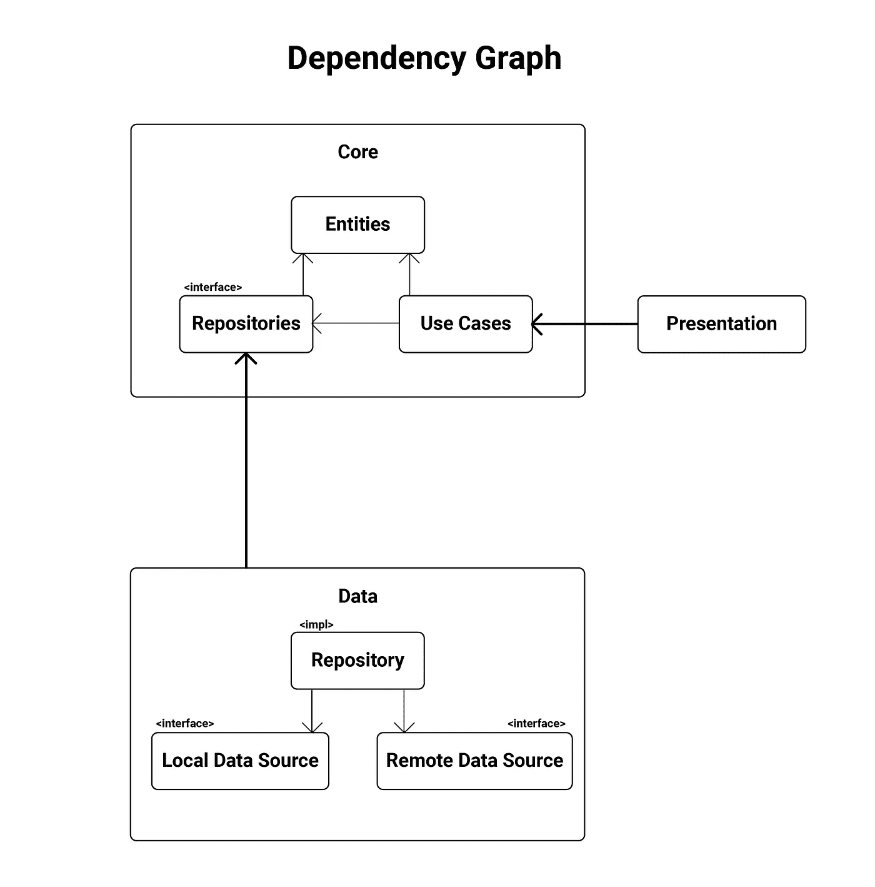
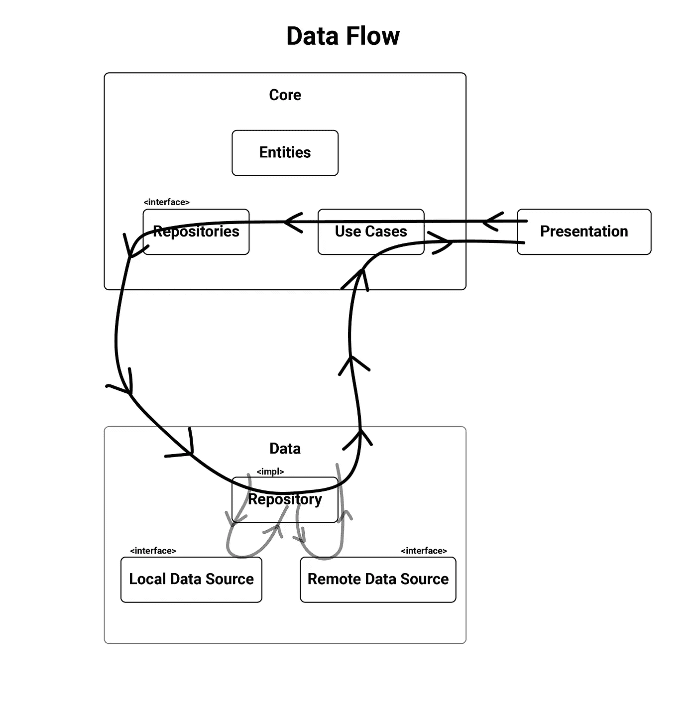
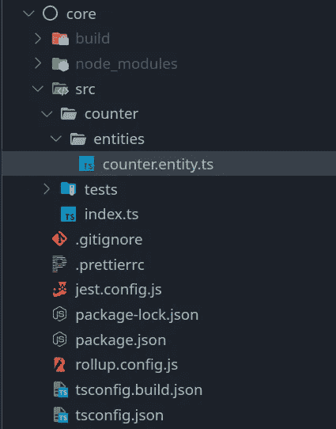
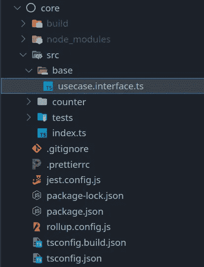
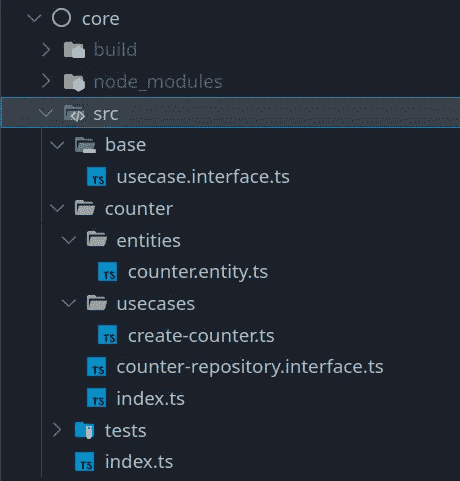
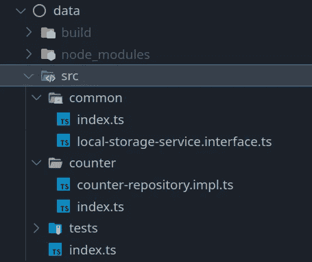
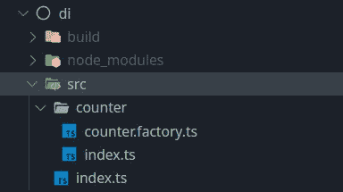
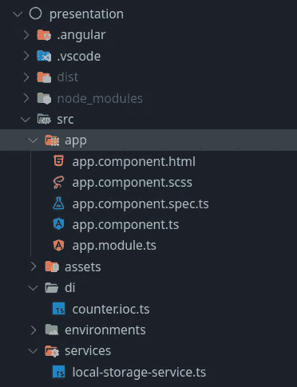
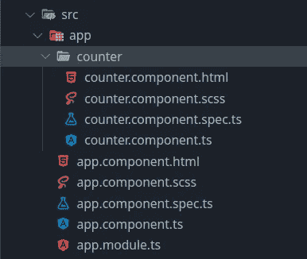

# 如何用干净的架构实现 TypeScript Web 应用程序

> 原文：<https://betterprogramming.pub/how-to-implement-a-typescript-web-app-with-clean-architecture-27c7eb745ab4>

## 如何构建下一个 web 应用程序的详细指南


里卡多·维亚纳在 [Unsplash](https://unsplash.com?utm_source=medium&utm_medium=referral) 上的照片

```
**Table of Contents**[Intro](#0cc9)[Getting Started](#57c7)
 —  [Layers of the architecture](#585f)
 —  [General File Structure](#25ac)
 —  [Defining an example application](#a5a6)
 —  [Writing your first entity and use case](#a7db)
 —  [Creating Data Sources](#280d)
 —  [Dependency Injection (with a little help from Angular)](#a8bb)
 —  [Creating a UI component that interacts with a use case](#96fd)
 —  [Testing](#7297)[Closing Notes](#9984)[References and Links](#6910)
```

在本指南中，我将向你展示如何使用我在本文中创建的[的 clean architecture 模板编写你的应用程序。](https://medium.com/@aziznal/creating-the-ultimate-clean-architecture-template-for-typescript-projects-e53936269bb9)

 [## 为 Typescript 应用程序创建最终的干净架构模板

### 遵循干净架构原则创建基于层的 typescript 项目模板的指南

medium.com](https://medium.com/@aziznal/creating-the-ultimate-clean-architecture-template-for-typescript-projects-e53936269bb9) 

为什么要清洁建筑？因为，根据你的应用程序的大小,“继续编码，希望不会出问题”的架构只能带你到这里！

> “走得快唯一的方法就是走得好。”—鲍伯·马丁

# 介绍

我认为我们在制作应用程序时过于依赖 web 框架。虽然他们处理了很多无聊的事情，但是他们夺走了我们对应用程序的控制权。

我制作了一个项目模板，通过将应用程序的不同层隔离到包中，将控制权从框架中拿走。

最后你会注意到，我们实际上根本不需要 Angular，我们可以很容易地把它换成任何其他框架，这就是干净架构的全部要点。

## **这种架构的优势**

*   明确定义的层边界
*   由于缓存，构建和测试运行时间更快
*   由于松耦合，编写测试明显更容易
*   不依赖于 Web 框架、数据库等细节
*   促进代码重用

## **缺点**

*   一些样板代码
*   需要经验(我在这篇文章里解释了一切，所以不用担心！)

# 入门指南

接下来的章节结构如下:

*   [架构的层次](#585f)
*   [通用文件结构](#25ac)
*   [定义示例应用](#a5a6)
*   [编写我们的第一个实体、用例以及存储库](#a7db)
*   [创建数据源](#280d)
*   [依赖注入(在 Angular 的一点帮助下)](#a8bb)
*   [创建与用例交互的 UI 组件](#96fd)
*   [测试](#7297)

在本文的底部，您会找到一个指向最终实现的链接。

## 架构的层次

我们将把我们的应用分成三个主要层:

*   核心:包含我们的实体、用例以及存储库接口。这是应用程序的核心(因此得名)。
*   数据:包含用于从本地和远程存储中检索数据的存储库的实现。这就是我们获取和存储数据的方式。
*   表示层:这一层是用户看到我们的应用程序并与之交互的方式。它包含我们的角度或反应代码。

还有第四个辅助层，叫做 DI(依赖注入)。这一层的工作是防止表示和数据之间的直接依赖，同时允许表示通过核心使用数据。

核心层包含我们的应用程序逻辑，并为数据层实现的存储库定义接口。用例使用存储库对数据进行操作，但是核心层并不关心数据来自哪里或者如何保存。它将责任委托给数据层，数据层决定数据是来自本地缓存还是远程 API 等。

接下来，表示层使用核心层的用例，并允许用户与应用程序进行交互。请注意，表示层不与数据层交互，因为表示层也不关心数据来自哪里。核心是将应用层联系在一起的东西。

下图解释了层之间和层内部的依赖关系。请注意，最终，一切都指向核心层。



至于数据流，一切都始于用户点击按钮或提交表单时的表现。演示调用一个用例，调用存储库中检索/存储数据的方法。这些数据是从本地数据源、远程数据源或者两者中检索的。存储库将调用的结果返回给用例，用例将其返回给表示。



我们将通过将存储库接口的实现从数据注入到核心层来实现这个数据流。通过这种方式，我们保持核心在控制中，因此满足了控制反转。这很令人满意，因为数据实现了 Core 定义的存储库。

## 通用文件结构

在我们的主项目中，我们有一个名为`packages`的文件夹，它为我们应用程序的每一层都有一个文件夹。我们将从在 Core 中创建一些东西开始。

## 定义示例应用程序


由 [Djim Loic](https://unsplash.com/@loic?utm_source=medium&utm_medium=referral) 在 [Unsplash](https://unsplash.com?utm_source=medium&utm_medium=referral) 拍摄的照片

假设我们刚刚收到了对某个应用程序的以下要求:

*   创建一个向用户显示计数器的应用程序
*   用户应该能够创建/删除计数器
*   用户应该能够通过按下按钮来增加/减少计数器
*   用户应该能够改变计数器的增量/减量
*   用户应该能够将标签分配给计数器
*   用户应该能够通过标签过滤计数器
*   如果用户关闭应用程序并再次打开它，应该保存用户的计数器。

根据这些要求，我们可以说:

*   我们的主要实体是`Counter`
*   我们的用例获取所有计数器，获取按标签过滤的计数器，递增，递减，分配标签，创建计数器，以及删除计数器
*   我们需要一种在本地存储数据的方式，即本地数据源

# 编写你的第一个实体和用例

现在我们开始有趣的部分。我们首先定义应用程序的单一实体:计数器。

我们将在名为 counter 的`core/src/` 下创建一个新目录，并在其中创建另一个名为`entities`的目录，在其中我们将创建一个名为`counter.entity.ts`的文件:



接下来，我们实现我们的用例。我们首先定义一种标准的方式来与我们的用例以及每个用例的依赖项进行交互。

我们在`core/src/base`下创建一个用例接口，并将其命名为`usecase.interface.ts`。



现在，每当我们创建一个新的用例时，我们让它实现`Usecase`,其中它也必须定义它的返回类型。这迫使我们考虑用例的输出。

让我们首先创建`CreateCounterUsecase`。

在 core 内部，在`src/counter`下创建一个名为`usecases`的文件夹，并在其中创建`create-counter.ts`。

您将会看到用例的一个接口，在它的正下方，是该接口的一个实现。这样做有助于我们定义流入/流出用例的数据流，也使依赖注入变得轻而易举。

这个用例将需要一种方法来创建一个持续存在的计数器，这样我们的用户将能够做像刷新页面这样的事情，而不会丢失他们的计数器。为此，我们在`src/counter/counter-repository.interface.ts`下创建一个存储库接口。

现在，我们将这个存储库添加到我们的 create-counter 用例的依赖项中，并调用我们添加的这个新方法。我喜欢在构造函数中定义依赖关系，因为在进行依赖注入时提供依赖关系很简单。

恭喜你！我们刚刚编写了我们的第一个实体、用例以及存储库接口！

我们还需要做最后一件事，那就是从核心包中导出我们的实体、用例以及存储库。我更喜欢使用`index.ts`文件。我们是这样做的。

在`core/src/counter`下，创建一个名为`index.ts`的文件。这个文件将使用`export`语句，通过一个非常简单的导入语句使计数器目录中的所有内容都可用。

每当我们向`counter`添加一个新文件，并且我们想要导出它，我们只需向这个文件添加一个导出语句。

接下来，更新`core/src/index.ts`,以包含以下出口声明:

我们不需要再次更新这个文件，除非我们在`counter`旁边添加另一个模块。



运行以下命令来构建您的`core`包，并将其分发给所有依赖于它的包:`npx lerna run build && npx lerna bootstrap`。如果是第一次使用模板，只需要运行 bootstrap 命令。

现在我们准备好下一步了。

# 创建数据源

我们需要实现 core 定义的存储库接口。我选择在一个名为 data 的包中做这件事。这样，我将我的业务规则隔离在`core`包中，并将支持它们的数据源隔离在另一个包中。

在`packages/data/src`下，创建一个名为`counter`的文件夹，并在其中创建一个名为`counter-repository.impl.ts`的文件。文件扩展名是完全可选的。我只是喜欢使用这些扩展名使文件的内部更加清晰。这也使得寻找它们变得更加容易。

您会注意到我已经将 core 中的所有内容作为关键字`core`导入。这也是个人喜好。你可以使用析构导入从`core`中获取东西，但是我认为最好让它更明确。

不管怎样？我们应该如何实现我们的存储库？我们需要某种方式让用户能够以某种方式保持他们的会话。*“哦，我知道了！”*我听到你热情地说，*“我们可以只使用浏览器的内置本地存储！”这是一个很好的解决方案，但是有一个小问题。*

`data`包不能访问浏览器的存储 API，因为它首先不知道浏览器。其实我们希望`data`是这样的。否则，我们会使它依赖于一个细节，即它运行的平台。

相反，我们为我们的回购实现提供了一个叫做`local storage`的东西。这是对我们在`data`中定义的接口的依赖，也是我们可以在任何地方定义的实现。这种`local storage`依赖性将被注入到我们的回购实现中。我们将很快到达这一部分。

我选择以`local-storage-service.interface.ts`的身份在`data/src/common`下创建这个接口，因为我们也想在其他库中使用它。下面是我们的`local storage`依赖关系的接口:

现在，我们将它作为依赖项添加到我们的 repo 实现中，并实现了`createCounter`方法:

我现在尽可能简单地实现这个方法。最酷的是，你可以选择让它成为你未来想要的任何东西，而不需要改变任何东西。

恭喜你。我们刚刚在`data`中实现了我们需要的所有功能。现在我们也需要导出它。同样，让我们利用索引文件。

在`data/src/counter`下创建一个`index.ts`文件。

还有一个在`data/src/common`下面

最后，在`data/src`下的索引文件中导出这两个文件。



我们导出本地存储服务接口，因为我们将在可以访问浏览器的存储 API: Presentation 的地方实现它！

但是让`data`依赖于`Presentation`不会破坏我们的依赖图吗？事实上，它不会，因为我们正在实现控制反转。这意味着表示将间接依赖于数据，而不是相反。在下一节中，您将看到这是如何工作的。

现在，让我们重新构建我们的数据包。再次运行`npx lerna run build`。

# 依赖注入(Angular 提供了一点帮助)

下面我们把`**core**`和`**data**`放在一起。我们希望将用例的实现和存储库与它们的接口联系起来。

我使用一个类来实现这一点，这个类生成这些对象，并赋予它们依赖关系，例如一个`Factory`。

在`di/src`下，创建一个名为`counter`的文件夹，并在其中创建一个名为`counter.factory.ts`的文件:

用实例化我们的存储库和用例所需的所有依赖关系实例化了`CounterFactory`类。我们不公开存储库，只公开它需要的接口。

我们通过在`di/src/counter`下创建一个`index.ts`文件来导出这个工厂以及它需要的本地存储服务接口，如下所示:

并且我们将这个文件导出到`di/src`下的`index.ts`文件中:

下面是`di`的项目目录:



运行`npx lerna run build`来构建你的包。请注意，Lerna 并没有重新构建核心和数据，而是使用以前构建的缓存版本，因为它们没有发生变化。有点酷，对吧？

现在我们准备好进入`Presentation`。

我们需要使我们刚刚创建的东西在演示中易于访问。为此，我使用 Angular 出色的依赖注入。我是这样做的。

有了 Angular，我们可以直接在我们的`app.module`文件中做这件事，但是我会把它放在`presentation/src/di`下的一个文件夹中，这样会更整洁，我会在其中创建一个名为`counter.ioc.ts`的文件

这个文件实例化了`CounterFactory`，并为它提供了所需的依赖项。然后，我们使用 Angular 的提供者类型创建一个`Provider[]`,并注入我们的依赖项，就像我们通常在 Angular 应用程序中做的那样。

在你惊慌之前，这里是我们在`presentation/src/services`下创建的`LocalStorageServiceImpl`文件(或者你认为合适的任何地方):

最后一件事(我发誓！).我们需要在我们的`app.module`中包含这个`CORE_IOC` provider 数组，使它在我们所有的应用程序中都可用。



我们正式结束了。我知道你能到达那里！

请记住，我们在前面的步骤中所做的很多事情我们只会做一次。一旦我们开始添加更多的用例，您就会看到。

我们现在可以开始编写 UI 代码了。

# 创建与用例交互的 UI 组件

这是你的标准角度编码程序。我们将在`presentation/src/app`下创建一个名为 counter 的新组件。



我将跳过 UI 代码，只展示控制器和用例是如何使用的。如果你感兴趣，你可以在这里看到代码。

我将从`app.component`中移除 Angular 生成的所有代码，并添加我自己的代码。我们现在需要一个按钮来创建计数器，并需要一种结构来显示它们。我会用一个基本的滚动列表。这是我们的用户界面的样子:


我将把蓝色按钮挂在`app.component.ts`中组件控制器的一个方法上:

我们有一个存储所有计数器的列表和一个创建计数器的方法，该方法在调用用例后将新的计数器推送到列表中。我们使用 Angular 出色的依赖注入将用例注入到构造函数中。很漂亮，对吧？

现在我们可以按下 add-counter 按钮，我们会看到一些东西在列表中弹出。(同样，我跳过了实际的 HTML 和 CSS，因为它们不相关)。


现在按下刷新键，然后…都没了。这是因为我们需要在控制器中添加一个方法，以便在页面加载时检索所有计数器。

为此，我们还需要一个这样的用例。让我们开始工作。

我们在`core/counter/usecases`下创建一个名为`get-all-counters.ts`的新用例

我们向 repo 接口添加了一个获取所有计数器的方法:

用`npx lerna run build`构建`core`，然后在`data`的回购实现中实现该方法:

存储库实现现在变得有点复杂了。这里可能有一个更好的实现(伏笔；)).

不管怎样，构建`data`并转移到`di`，所以我们更新计数器工厂来说明我们的新用例:

现在我们已经有了样板代码，这就简单多了，对吗？

最后，我们使用 Angular 的`di`注入我们的用例:

现在我们准备在`app.component`中使用这个用例:

我们在构造函数中提供用例，然后设置它在`ngOnInit`中被调用。现在，通过按按钮添加一个计数器并刷新页面；计数器将持续存在！至少在我们重置浏览器存储之前。

所以，概括一下:

1.  我们在`core`中创建了用例
2.  我们实现了`data`中用例所要求的回购方法
3.  我们在`di`中设置了一个方法来创建工厂及其依赖项
4.  在`presentation`中，我们使用 Angular 的 di 来提供整个项目的用例
5.  我们称之为用例！

步骤 1、2 和 5 是对我们有意义的步骤。其余的是胶水和使生活更容易的解决方案。

添加其余的用例只是冲洗和重复。你可以看到我是如何在这个回购中实现其余的[的。](https://github.com/aziznal/typescript-clean-architecture)

# 测试

在这一节中，我将提供一个为`data`中的计数器存储库实现编写单元测试的例子。

我们通过在`data/src/tests/counter`下创建一个名为`counter-repository.test.ts`的新文件来做到这一点

第 6 行到第 15 行是本地存储服务的基本模拟实现，这是计数器存储库实现所需要的。我们在第 17 到 40 行定义了测试代码的主体。在每个测试块运行之前，计数器存储库及其依赖项都被初始化，因此我们确保我们的单元测试每次都在干净的环境中运行。

我编写了一个测试，它创建一个新的计数器，然后通过调用方法检索所有计数器来查看它是否已被存储。剩下的就看你自己了！

# 结束语

我们已经涉及了相当多的内容，乍一看可能会让人不知所措。如果你第一次有困难，再试一次，慢慢来。理解每一层实际上负责什么将有助于让所有的部分都到位！

这肯定是一个比您可能习惯的要慢的开始，但是一旦您掌握了基本的步骤，您将会感谢知道谁负责什么以及哪个代码位于哪里的轻松。更不用说当一切都是松散耦合时，测试会变得多么容易。

最后，如果有人能对我在这里的工作给予反馈，我会非常高兴。这对你有用吗？复杂性和实用性之间的平衡足够好吗？是不是有个大问题盯着我的眼睛，让我看不见了？我完全接受建设性的批评，所以让我接受吧！


[陈静达](https://unsplash.com/@jingdachen?utm_source=medium&utm_medium=referral)在 [Unsplash](https://unsplash.com?utm_source=medium&utm_medium=referral) 上的照片

谢谢你通读了整本书。我希望你会发现它非常有用，它给你编程带来的快乐和它给我带来的一样多。

# 参考和链接

*   [我解释如何制作这个模板的文章](https://medium.com/@aziznal/creating-the-ultimate-clean-architecture-template-for-typescript-projects-e53936269bb9)
*   [已经完成实现的 github repo](https://github.com/aziznal/typescript-clean-architecture)
*   [鲍勃大叔的干净建筑](https://blog.cleancoder.com/uncle-bob/2012/08/13/the-clean-architecture.html)
*   [Lerna 文档](https://lerna.js.org/docs/introduction)
*   [NX 文档](https://nx.dev/getting-started/intro)