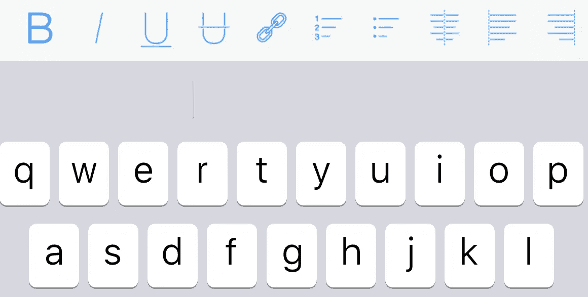
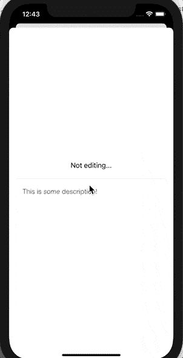

# 如何在 SwiftUI 中实现所见即所得编辑器

> 原文：<https://betterprogramming.pub/how-to-implement-a-wysiwyg-editor-in-swiftui-c60236749943>

## 通过结合 UIKit 和 SwiftUI，在您的 iOS 应用程序中实现富文本编辑器

[史蒂夫·哈维](https://unsplash.com/@trommelkopf?utm_source=unsplash&utm_medium=referral&utm_content=creditCopyText)在 [Unsplash](https://unsplash.com/?utm_source=unsplash&utm_medium=referral&utm_content=creditCopyText) 上的照片

# 介绍

对于我上一个 SwiftUI 项目，我想实现一个 WYSIWYG 编辑器。我已经开始在网上搜索，但没有在 SwiftUI 上找到合适的实现。网上连一个都没有！

所以我决定在 SwiftUI 上使用`[UIViewRepresentable](https://developer.apple.com/documentation/swiftui/uiviewrepresentable)`实现 UIKit 上最强的富文本编辑器库之一。幸运的是，在 SwiftUI 中为 UIView 创建自定义包装器并不难。

我选择工作的图书馆是凯撒·沃思的`[RichEditorView](https://github.com/cjwirth/RichEditorView)`。`RichEditorView`是一个简单的、模块化的、用于富文本编辑的嵌入式 UIView 子类。

我将跳过安装部分—使用[此链接](https://github.com/cjwirth/RichEditorView#installation)中的说明来安装库。

# 第一步

首先，让我们创建一个名为 RichTextEditor.swift 的初始文件，并实现以下代码:

如您所见，我们已经导入了`RichEditorView`库和 SwiftUI。然后，我们实现了我们的协议所需的两个方法。

我们还定义了一个存储 HTML 文本的变量`@Binding`，可以在存储数据的属性(`UIViewRepresentable`)和显示并更改数据的视图(`SwiftUI View`)之间创建双向连接。

在创建`UIView`对象并配置其初始状态的`makeUIView`函数中，我们已经为存储的 HTML 文本分配了初始的`RichEditorView`。

# 步骤 2(可选)

然后我们实现了我们的`Coordinator`类。在这里，我不会深入探讨协调者，但首先你可以看看保罗·哈德森的这个很棒的教程。

*简而言之，SwiftUI 的协调器旨在充当 UIKit 视图控制器的代表。请记住，“委托”是对其他地方发生的事件做出响应的对象。*

我们在这里使用了 Coordinator 类来访问`RichEditorDelegate`的`richEditorTookFocus` & `richEditorLostFocus`，并在我们的富文本编辑器开始/结束编辑时切换一个布尔值，这样我们就可以在 SwiftUI 视图中显示/隐藏一些视图:

我们实现了嵌套的协调器类，但是它*不需要*是嵌套类。然而，这是一个好主意，因为它巧妙地封装了功能。

# 第三步

在这里，我们将添加工具栏，以便在用户开始编辑所见即所得编辑器时启用编辑选项。该库准备了一个名为`RichEditorToolbar`的默认工具栏选项，可用于在编辑时显示在用户键盘的顶部:

`RichEditorToolbar example`

这里我们从第 36 行到第 38 行添加了默认的工具栏代码。在第 40 行，我们将它分配给了编辑器的视图输入附件，因此它将显示在键盘的顶部。这里我们使用了工具栏的所有可用选项，但是您可以传递一个包含您想要的选项的数组(默认选项可以立即使用，例如`RichEditorDefaultOption.bold`):

# 第四步

现在我们的 UIView 表示已经完成，我们可以在 SwiftUI 视图中使用它了。如您所见，我们定义了两个`@State`属性包装器，允许我们修改视图内部的值，并将它们传递给我们的`RichTextEditor`。

全部完成！在模拟器中运行应用程序，您应该会看到如下输出:

最终输出

# 包扎

当使用 SwiftUI 开发应用程序时，也缺少一些有用的视图或功能，但不要忘记，您可以随时使用`UIViewRepresentable`或`UIViewControllerRepresentable`的功能。此外，不要忘记苹果正在 SwiftUI 的每个新版本中添加如此多的新功能。

感谢阅读！我希望这有所帮助。如果你有任何问题，请随时回复。