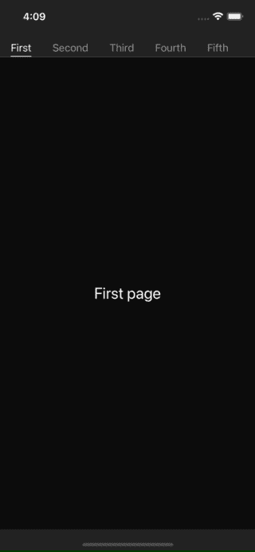
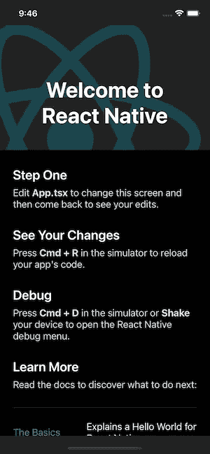
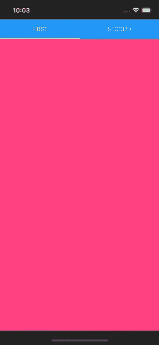
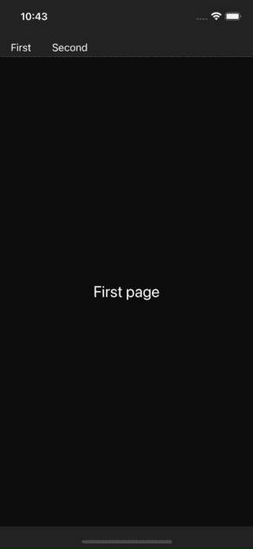

# 如何在 React Native 中实现动画标签

> 原文：<https://betterprogramming.pub/how-to-implement-an-animated-tab-in-react-native-c1952ad7103e>

## 使用 React Native 动画平滑选项卡动画


照片由 [Milad Fakurianon](https://unsplash.com/@fakurian) 在 [Unsplash](https://unsplash.com/?utm_source=medium&utm_medium=referral) 上拍摄。

这篇文章将指导你如何使用 [react-native-tab-view](https://github.com/satya164/react-native-tab-view) 和[React-Native-reanimated](https://github.com/software-mansion/react-native-reanimated)在 React Native 中创建动画选项卡视图。动画选项卡的最后一个示例如下所示:



最后一个例子

# 示例存储库

这是基于 [GitHub](https://github.com/manakuro/react-native-animated-tab-view-example) 的最终代码

# 概观

*   设置本地反应
*   介绍 react-native-tab-view
*   自定义标签栏

# 设置本地反应

首先，设置 React 原生 app。

```
npx react-native init AnimatedTabViewExample --template react-native-template-typescript
```

并启动 iOS 应用程序:

```
yarn ios
```

初始页面应该如下所示:



黑暗模式下的 ios 应用程序

# 介绍 react-native-tab-view

接下来，安装 react-native-tab-view。

```
yarn add react-native-tab-view@3.1.1 react-native-pager-view@5.4.24
```

转到 ios 文件夹并安装 Cocoapods:

```
$ cd ios
$ bundle exec pod install
```

打开`App.tsx`并编写如下标签视图:

这将创建两个如下所示的选项卡:



初始选项卡

# 自定义标签栏

既然我们已经在应用程序中引入了选项卡视图。接下来，让我们自定义选项卡栏。

首先，创建`src/components/TabBar.tsx`并编写一个标签栏组件，如下所示:

并创造出这样的`src/components/TabBarItem.tsx`:

为了定制默认的 dab 栏，给`App.tsx`中的`renderTabBar`道具提供一个组件。

并为`App.tsx`中的第一个和第二个选项卡调整一些样式。代码如下:

现在，选项卡视图如下所示:



# 不透明度动画

接下来，让我们使用[插值](https://reactnative.dev/docs/animations#interpolation)为标签栏添加不透明度动画。插值允许您控制和连接两个动画。您可以连接标签页的不透明度和位置，然后以完全相同的时间转换，并反向操作。

在这个应用程序中，我们将添加一个动画，当切换标签时，不透明度从 0 逐渐变为 1。

打开`src/components/TabBar.tsx`，向组件添加插值，如下所示:

`position`是一个动画节点，代表标签的当前位置，具有插值功能。当当前选项卡切换到下一个选项卡时，不透明度将从 0.5 变为 1。

打开`src/components/TabBarItem.tsx`，像这样添加不透明道具:

动画看起来是这样的:


不透明度动画

切换标签时，您可以看到标签栏中项目的不透明度发生了变化。

## 边框宽度动画

接下来，我们将使用 react-native-reanimated 实现一个边框宽度动画。react-native-reanimated 允许本机代码在 UI 线程而不是 JS 线程上动画显示宽度，以获得更好的性能。基本上，React Native 不支持宽度动画，除非`useNativeDriver`设置为 true。

安装 react-native-reaniated。

```
yarn react-native-reanimated
```

转到 ios 文件夹并安装 Cocoapods:

```
$ cd ios
$ bundle exec pod install
```

给`babel.config.js`添加 reanimated 的巴别塔插件像这样:

```
module.exports = {
  presets: ['module:metro-react-native-babel-preset'],
  plugins: ['react-native-reanimated/plugin'],
};
```

打开`src/components/TabBar.tsx`，写下这段代码。

`measureLayout`允许你根据父视图的尺寸动态计算子视图的尺寸。所以`measures`的结果包括这样的东西:

```
[
  {
    height: 23.333335876464844,
    width: 31.666667938232422,
    x: 16,
    y: 16,
  },
  {
    height: 23.333335876464844,
    width: 55.333335876464844,
    x: 79.66666793823242,
    y: 16,
  },
];
```

并且创建`src/components/TabBarIndicator.tsx`并这样写:

该组件跟踪选项卡的位置，并根据从父级传递的尺寸连接宽度和位置的动画。

因此，动画看起来应该是这样的:


如你所见，滑动标签改变了边框的宽度和位置。

最后，我们在`App.tsx`中添加了更多的标签项，如下所示:

所以，最终的动画应该是这样的:


# 结论

我们已经介绍了如何在 React Native 中实现选项卡视图的动画。最终的代码库在 [GitHub](https://github.com/manakuro/react-native-animated-tab-view-example) 上，你可以尝试一下。