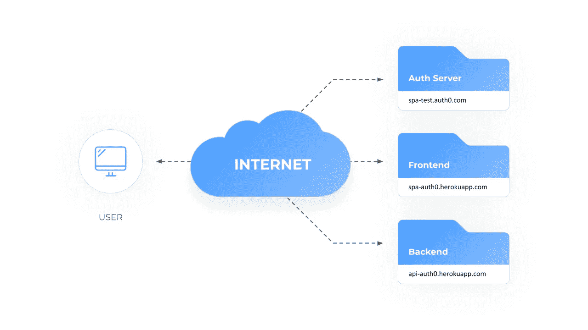
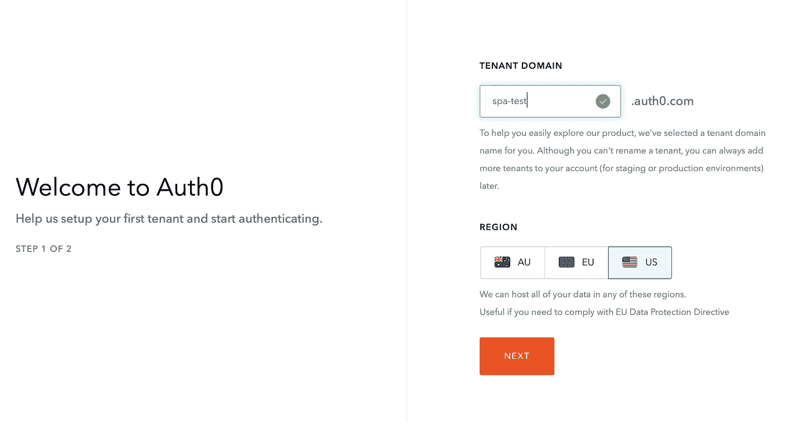
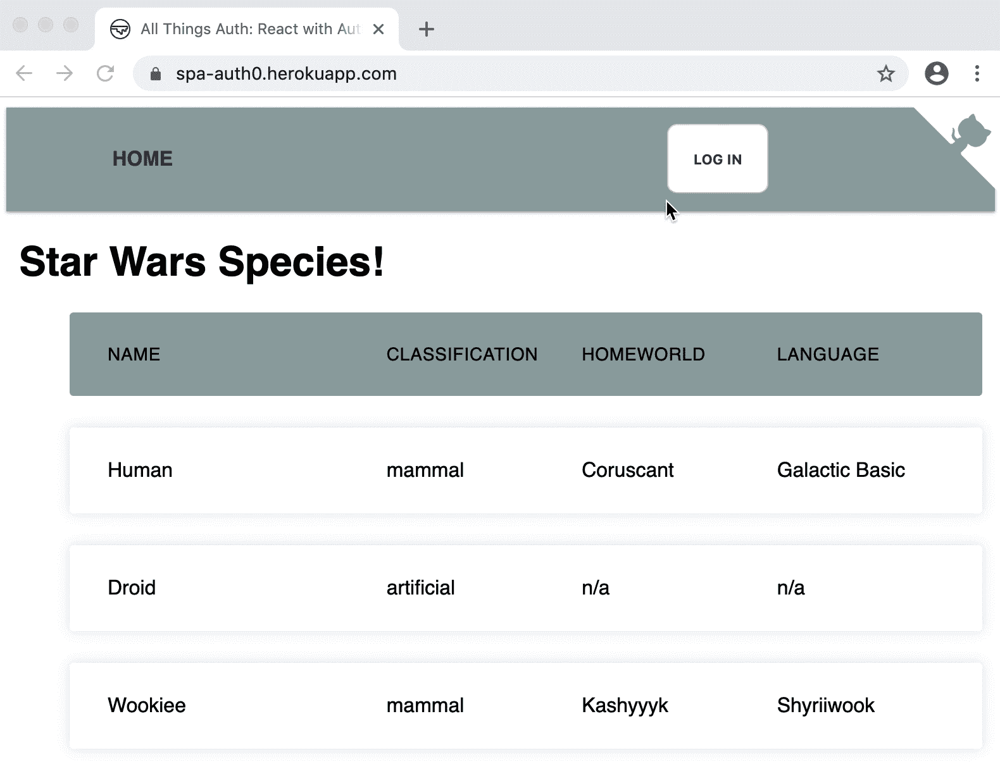
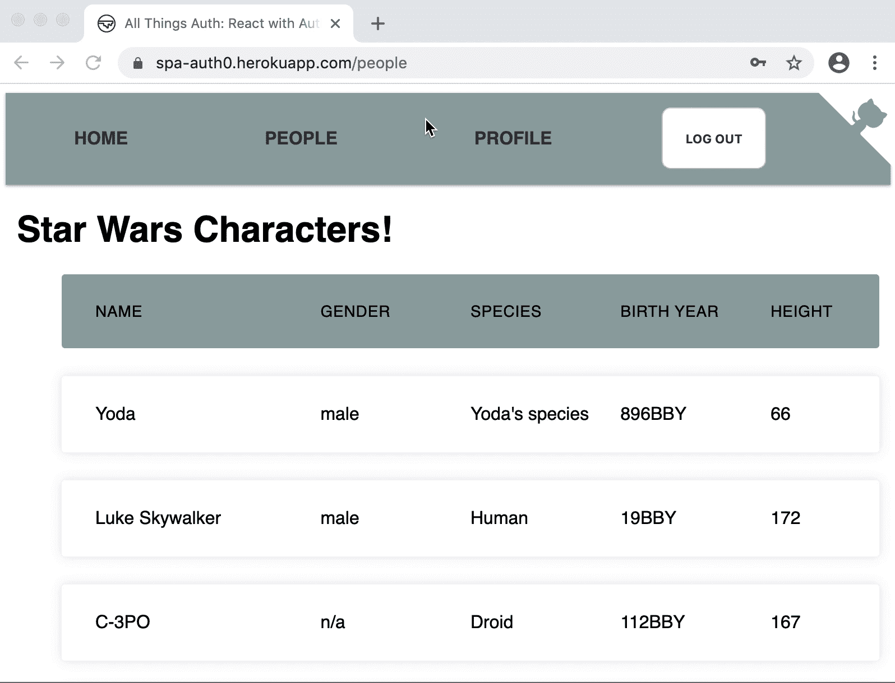
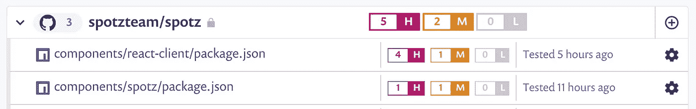
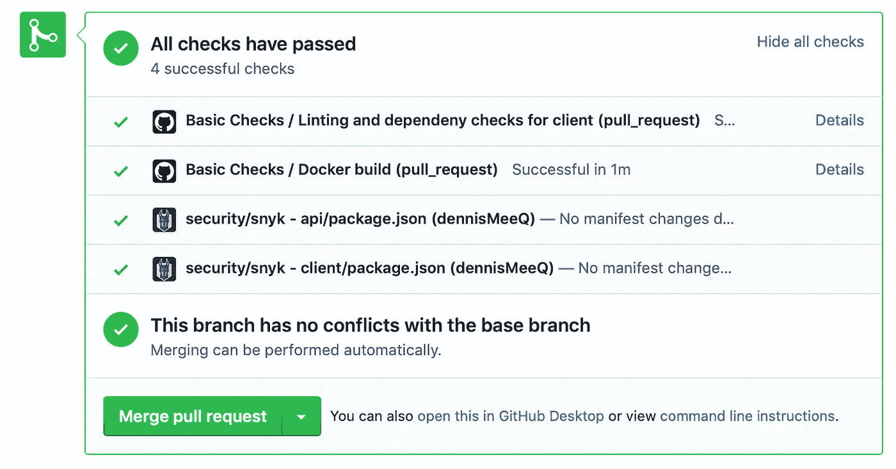

# 如何使用 Auth0 在 React 中实现认证

> 原文：<https://betterprogramming.pub/how-to-implement-authentication-in-react-using-auth0-1b5ecb6c8fe0>

## 现代技术堆栈中 PKCE 的授权代码流


杰森·黑眼在 [Unsplash](https://unsplash.com?utm_source=medium&utm_medium=referral) 上的照片

在我的[上一篇文章](https://medium.com/better-programming/how-to-securely-implement-authentication-in-single-page-applications-670534da746f)中，我讲述了在单页面应用程序中实现 OAuth 和 OpenID Connect 时的正确认证流程。我知道这是一个巨大的信息量，肯定难以下咽，但让我们把这些新知识投入使用。在这篇文章中，我将展示之前提出的概念的实现。

本文中讨论的所有代码都可以在下面的存储库中找到:

[](https://github.com/dennisMeeQ/auth0-react-express) [## dennisMeeQ/auth0-react-express

### 使用 Auth0、React 和 Express 在单个应用程序中实现 OAuth/OIDC 流的示例。请参考…

github.com](https://github.com/dennisMeeQ/auth0-react-express) 

您可以随意克隆它或直接试用部署的代码:

 [## 所有 Auth:用 Auth0 反应

### 使用 React 和 Auth0 的 OAuth/OpenID 连接流的示例实现

spa-auth0.herokuapp.com](https://spa-auth0.herokuapp.com) 

继续创建您自己的帐户。你可以使用一次性电子邮件地址或假电子邮件地址。别担心，我不会卖你邮箱的。

# 体系结构

上面显示的演示应用程序由三个组件组成:

*   [Auth0](https://auth0.com) 提供的授权服务器
*   前端或客户端，用 React 编写
*   后端或者 API，用 Node.js 和 Express 写的



单页应用程序的基本设置

所使用的技术(React、Express 和 Auth0)是我当前的首选堆栈，但这里显示的原则绝不仅限于此堆栈。

你可以用另一种 SPA 视图技术做同样的事情，比如 Vue.js 或者 Angular 任何服务器技术(Java & Spring，PHP 等。);以及任何 OAuth/OpenID 连接授权服务器(例如 Okta、Keycloak、AWS Cognito 等。).

我尽量不添加任何特定的技术决策，比如数据库(Mongo 或 SQL)或样式(material UI 或 bootstrap)，以尽可能简单地复制和粘贴这些代码。

客户端和 API 通过 Docker 构建和交付，并部署在令人惊叹的 Heroku 上。必要时，GitHub 通过[动作](https://github.com/features/actions)直接提供自动化。

该应用程序的相当一部分代码摘自 Auth0 关于单页应用程序的教程。它提供了一个很好的起点，但是，以我的拙见，它没有解释一些重要的细节。让我们来解决这个问题！

# 授权服务器

我们应该设置的第一件事是我们的授权服务器。为此，前往 https://auth0.com 的[，创建一个免费账户。](https://auth0.com)

在注册过程中，您将被要求提供您的租户域。这很重要，因为这将是您未来的应用程序用于登录的域。所以一定要选择比“foobar”更有意义的东西如果您需要遵守地区法律，例如欧洲的 GDPR，地区也很重要。否则最大的区别大概就是性能了。



登录后，创建一个新的应用程序。您将被要求输入名称和类型。名称并不重要，以后可以更改。对于类型，选择单页应用程序。后者很重要，因为它会自动配置一些重要的参数，比如 OAuth 认证流。

创建应用程序后，您将进入快速入门部分，该部分提供了设置和实现应用程序的基本指南。如上所述，您可以遵循该教程，最终您将获得一个非常好的基线。或者你可以在这里继续阅读，获得完整的图片。

在您的新应用程序中，在“设置”下，我们可以对设置进行更多更改:

*   在 Allowed Callback URLs 下，我们需要定义一组 URL，Auth0 可以在成功登录后将用户重定向到这些 URL。对于开发来说，React 的默认 URL([http://localhost:3000](http://localhost:3000`))就足够了。我还添加了我的高效前端 URL[(https://spa-auth0.herokuapp.com](https://spa-auth0.herokuapp.com`))。
*   应该在“允许的 Web 源”下设置相同的 URL 集。
*   使用允许的注销 URL，您可以设置在注销后允许 Auth0 重定向到哪里。我使用与这里允许的回调 URL 相同的 URL。
*   根据 JWT 到期，您可以设置令牌的生命周期。您可以保留默认值(10 小时)，但我通常根据应用程序将它设置为 1-2 小时(360-720)。
*   稍后配置我们的客户端应用程序时，将需要客户端 ID。

不过，目前，在开始编码之前，我们还有一件事要做:一个 API。用 Auth0 的术语来说，API 是一个端点，在您的客户端应用程序收到令牌后，它将消费令牌。在我们上面的图片中，它是后端。

转到 Auth0 菜单中的 API，并创建一个。您为它选择的名称无关紧要，但标识符很重要。如果你已经知道 API 的全限定 URL，你应该在这里选择——类似于[https://API . all things sauth . dev](https://api.allthingsauth.dev)。不要担心，它不一定要在互联网上可用，甚至还不存在。这只是一个名称，但它应该是唯一的，并标识您的端点。它的网址是一个很好的选择，但是如果你愿意，你也可以叫它“埃斯梅拉达”。我不会阻止你。

作为签名算法，对于在签名模式下使用 [RSA](https://en.wikipedia.org/wiki/RSA_(cryptosystem)) 和 [SHA256](https://en.wikipedia.org/wiki/SHA-2) 作为哈希算法的[非对称](https://en.wikipedia.org/wiki/Public-key_cryptography)密钥签名，您应该在这里选择 RS256。

就是这样！我们有一个正在运行的授权服务器，可以开始研究我们的 API 了。终于有代码了。

# API 保护

我们的 API 有两个简单的端点，显示来自“星球大战”的一些内容(我从 awesome [SWAPI](https://www.swapi.co/) 借用了这些内容):一个载入一些关于物种的信息，第二个载入关于“星球大战”宇宙中的角色的信息。您可以在浏览器中或通过 shell 上的 curl 亲自尝试:

*   [https://api-auth0.herokuapp.com/species](https://api-auth0.herokuapp.com/species)
*   [https://api-auth0.herokuapp.com/people](https://api-auth0.herokuapp.com/people)

第一个函数返回一个 JSON 对象，和预期的一样:

然而，第二个行为古怪，返回:

```
*{“msg”:”Invalid token”}*
```

让我们看看代码，并尝试找出原因:

如您所见，这里创建的两个端点在本质上非常相似。唯一的区别是其中一个使用了`authenticated` 中间件，而另一个没有。

这个中间件是奇迹发生的地方，接下来让我们来看看:

我们的中间件需要理解 OpenID Connect 定义的 JWT 格式的令牌。

因此，我们首先需要配置一些选项来将我们的授权服务器标识为我们的令牌的一个`issuer` 。在本例中，这是我们之前创建的 Auth0 租户。指定该值对于定义我们不希望接受来自任何其他服务器的令牌非常重要。将此配置值与令牌中包含的值进行比较是验证令牌的第一步。

`audience` 值向 Auth0 和客户端应用程序标识我们的 API，我们还需要用令牌上的值对此进行交叉检查。为什么？如果一个系统有不止一个 API，并且授权服务器想要发布对一个 API 有效但对另一个 API 无效的令牌，这就变得很重要了。

`algorithm` 设置指定了预期用于对令牌进行签名的签名算法。将它设置为我们之前在 Auth0: `RS256`创建 API 时选择的值。

为了能够实际验证令牌的签名，我们需要授权服务器的公钥。向我们的 API 提供这个的最简单的方法是作为一个配置值。但是这相当笨重，不太灵活，并且不能很好地处理授权服务器上的[密钥轮换](https://openid.net/specs/openid-connect-core-1_0.html#RotateSigKeys)。

更好的方法是在运行时从授权服务器加载公钥，然后缓存一段时间。

在上面的代码片段中，这是使用`jwks-rsa`包实现的，该包以 [JWK](https://tools.ietf.org/html/rfc7517) 格式从服务器加载密钥。在上面的代码示例中，用于加载此内容的 URL(在我们的示例中为[https://spa-test.auth0.com/v2/.well-known/jwks.json](https://spa-test.auth0.com/v2/.well-known/jwks.json))被指定为依赖于发布者 URL 的配置值。

或者，我们也可以将 OIDC 配置元数据端点([https://spa-test.auth0.com/v2/.知名/openid-configuration](https://spa-test.auth0.com/v2/.well-known/openid-configuration) )在运行时获取这个 URL(见`jwks_uri` 参数)。所有这些都是由 OpenID Connect 指定的。

因为为每个 API 请求加载公钥会非常低效和缓慢，所以密钥应该被缓存一段时间。缓存时间到期或签名无效会触发我们的 API 从授权服务器重新加载公钥。

# 令牌时间

汪，现在我们终于有了所有的成分来验证传递给 API 的令牌。当(base64)解码时，这样的标记可能如下所示:

```
{
  "typ": "JWT",
  "alg": "RS256",
  "kid": "RkU2MjcxOEU1N0JENzEzNzBBQ0QwREQ5NTM1NjU1ODU0QzQxNjc1Mw"
}.
{
  "iss": "https://spa-test.auth0.com/",
  "sub": "auth0|5daaba984718d10c5d15dd1e",
  "aud": [
    "https://api.allthingsauth.dev",
    "https://spa-test.auth0.com/userinfo"
  ],
  "iat": 1577204248,
  "exp": 1577290648,
  "azp": "melxSZVFgL9ONwTaggwozHOsjeTVvJOF",
  "scope": "openid profile email"
}.
[...signature...]
```

总而言之，需要检查令牌的以下方面，以确保它是有效的:

*   `iss`值与来自配置(*发行方*)的预期值一致
*   `alg`值是我们所期望的(配置*算法*
*   `aud`数组包含我们的 API 的*观众*值
*   令牌未过期。为了检查这一点，我们需要确保`exp`时间戳不是在过去。在这里，允许几分钟的[时钟偏差](https://en.wikipedia.org/wiki/Clock_skew)是可以的。
*   最后但同样重要的是，签名与令牌的内容相匹配

幸运的是，我们不需要自己实现所有这些，因为我们使用了`express-jwt` npm 包(由 Auth0 提供)来为我们完成所有这些。

该库返回一个 express 中间件，我们可以将它传递给经过身份验证的端点。通过这样做，我们只允许在请求包含前面定义的有效令牌的情况下访问这个端点。让我们试试这个:

```
$> curl 'https://api-auth0.herokuapp.com/people' -H 'Authorization: Bearer eyJ0eXAiO…cFA94GEhPqnt5w'{“people”:[{“name”:”Yoda”,”height”:”66",”birth_year”:”896BBY”,”gender”:”male”,”species”:”Yoda’s species”},{“name”:”Luke Skywalker”,”height”:”172",”birth_year”:”19BBY”,”gender”:”male”,”species”:”Human”},{“name”:”C-3PO”,”height”:”167",”birth_year”:”112BBY”,”gender”:”n/a”,”species”:”Droid”},{“name”:”Leia Organa”,”height”:”150",”birth_year”:”19BBY”,”gender”:”female”,”species”:”Human”},{“name”:”R2-D2",”height”:”96",”birth_year”:”33BBY”,”gender”:”n/a”,”species”:”Droid”},{“name”:”Chewbacca”,”height”:”228",”birth_year”:”200BBY”,”gender”:”male”,”species”:”Wookiee”},{“name”:”Jabba Desilijic Tiure”,”height”:”175",”birth_year”:”600BBY”,”gender”:”hermaphrodite”,”species”:”Hutt”}]}
```

# 注册

现在，让我们看看前端应用程序以及用户获取这种令牌的方式。

因为我们将使用 Auth0 作为我们的授权服务器，所以我们也将使用 Auth0 的连接 SDK——它与服务器接口良好。由于我们使用了非常标准的 OAuth 和 OIDC 流，我们可以使用任何其他的 React 库，甚至(我几乎不敢写)自己实现它。

使用 Auth0 认证的核心是一个名为 [react-auth0-spa.js](https://github.com/dennisMeeQ/auth0-react-express/blob/master/client/src/auth/react-auth0-spa.js) 的文件。Auth0 提供了一个完全工作的实现,我用它做了一些小的改动。我不会在这里详细讨论这个文件。它基本上只是初始化一个 Auth0 客户端，并将其放入一个具有现代和性感的自定义钩子的 React 上下文中，并公开提供者。有了钩子，每当我们需要在一个组件中使用 Auth0 时，我们只需调用它:

为了设置`Auth0Provider`，我们需要在应用程序的根目录(通常是`index.js`)中用 React `App`对象包装它:

上面提到的三个配置值是:

*   `domain`只是我们之前配置的 Auth0 端点的 URL
*   `client_id`惟一地标识了我们的客户端应用程序，我们可以在 Auth0 客户端配置中找到正确的值
*   `audience`是我们想要调用的 API 端点的 ID，可以在 Auth0 API 配置中找到

至此，我们有了 Auth0 SDK 的基本设置，现在可以开始工作了。第一:登录。我们只是为用户提供一个登录按钮来点击，仅此而已:

我们将使用的登录流程是 PKCE 的授权代码流程。所有血淋淋的细节请参考我的[上一篇文章](https://medium.com/better-programming/how-to-securely-implement-authentication-in-single-page-applications-670534da746f)。我们的客户端应用程序需要担心这个流程中的三件事:

1.  将用户的浏览器重定向到 Auth0
2.  用户在 Auth0 处输入凭据后，他们将被重定向回带有授权代码的客户端应用程序。我们的应用程序需要提供一个回调来正确地响应这个重定向。
3.  重定向之后，客户端需要对 Auth0 执行 POST 请求，以将授权代码交换为令牌

听起来很复杂？不要担心 Auth0 库会自动为您完成所有这些工作。

继续[尝试一下](https://spa-auth0.herokuapp.com)。



演示应用中经过验证的组件

# 经过身份验证的组件和 API 调用

如果您尝试过该应用程序，您可能会注意到在登录后，顶部导航中会出现两个新的菜单项:People 和 Profile。当您注销时，它们会消失。这就是我所说的*认证组件。请注意，这不是一项安全功能，而是一项 UX 功能。*

为了实现这一点，我们需要教会我们的 React 路由器仅在当前用户通过身份验证的情况下路由到这些组件:

这里使用的`AuthenticatedRoute`组件是 Auth0 提供的[示例实现](https://github.com/auth0-samples/auth0-react-samples/blob/master/01-Login/src/components/PrivateRoute.js)，我没有做任何改动就使用了它。

它基本上包装了一个普通的组件，并检查用户是否经过身份验证。如果不是，它首先尝试让用户静默登录。如果失败，它会将用户重定向到 Auth0 登录屏幕。只有在用户通过身份验证后，它才会将用户路由到目标组件:



调用经过身份验证的组件时自动登录

现在，在这样一个经过身份验证的组件中，我们通常希望调用一个本身经过身份验证的 API 端点。正如我们在上面看到的，我们需要在`Authorization`头中提供一个令牌，以允许从中读取数据。让我们看看如何做到这一点:

在这个代码片段中，我们使用`getTokenSilently()`从 Auth0 模块请求令牌。

然后，我们调用[https://api-auth0.herokuapp.com/people](https://api-auth0.herokuapp.com/people)并将令牌放入适当的报头中。如果 API 端点认为我们的令牌有价值，它将返回请求的数据。

# 令牌刷新

有两种情况我们需要刷新用户的令牌:

1.  当令牌过期但用户执行另一个操作时，如加载经过身份验证的 API
2.  当页面重新加载时。请记住，我们是在一个单页面应用程序中，所有的应用程序状态，包括用户的令牌，都保存在内存中。当页面重新加载时，这个内存范围被销毁并重新初始化。

我们希望对用户来说，这两种情况都能尽可能平稳地处理，最好是在用户没有察觉的情况下。Auth0 库会为您做这件事，您不必担心。

首先，当用户在 Auth0 登录时，将在用户的浏览器中为该主机设置一个会话 cookie。稍后，当我们由于上述两个原因之一需要会话刷新时，Auth0 库将使用不可见的 iframe 和 web 消息执行不可见的令牌刷新。这个过程在我的[上一篇](https://medium.com/better-programming/how-to-securely-implement-authentication-in-single-page-applications-670534da746f)中有描述，这里就不赘述了。

如果我们需要从 React 应用程序内部自己触发这个不可见的刷新，我们总是可以调用`getTokenSilently()`方法。这将为您提供缓存的令牌，或者，如果它不可用，执行不可见的流来获取令牌。

# 注销

与令牌刷新类似，注销也非常简单:Auth0 库处理繁重的工作。当用户单击注销按钮时，我们可以调用相应的函数——就像之前看到的登录一样:

Auth0 库将首先销毁客户端应用程序中的任何缓存令牌。然后，用户将被重定向到 Auth0，这将依次删除存储在那里的会话 cookie。之后，用户将被重定向回客户端应用程序。

# 安全性

在我的[上一篇文章](https://medium.com/better-programming/how-to-securely-implement-authentication-in-single-page-applications-670534da746f)中，我谈了很多关于安全性以及它在实现认证时的重要性。让我们仔细检查列表，看看我们是否修补了所有漏洞:

*   **TLS:** 安全第一法则？使用 TLS。在这种情况下，我可以依赖 Heroku——因为它会自动创建 TLS 证书并为我的应用程序部署它们。爱死了！
*   **重定向保护:**在这里，Auth0 保护了我们。之前在 Auth0 中配置我们的客户端时，我们配置了重定向 URL(*回调 URL，*作为 Auth0 调用它们)。Auth0 将拒绝重定向到除这些已配置的 URL 之外的任何 URL。
*   **CSRF 保护:**这也是 Auth0 开箱即用通过 PKCE 流和状态参数提供的。这两个都是在使用 Auth0 的库时自动设置的，我们不必担心。

这让我们只剩下一个我们必须自己花费一些脑力的领域:*跨站点脚本保护(XSS)。*

## XSS

[React](https://reactjs.org/docs/introducing-jsx.html#jsx-prevents-injection-attacks) 已经对[跨站脚本](https://www.owasp.org/index.php/Cross-site_Scripting_(XSS))攻击有了很好的内置保护。因此，仅仅通过我们的架构选择，我们已经朝着挫败这些讨厌的攻击迈出了一大步。

据我所知，还有两个攻击点。其中之一是，开发人员通过在 JSX 元素上使用[dangerouslySetInnerHTML](https://reactjs.org/docs/dom-elements.html#dangerouslysetinnerhtml)属性，选择明确放弃 React 的保护机制，如下所示:

该方法允许我们设置元素的 innerHTML，而不使用 React 的内置转义机制来防止 XSS。不太好。

为了防止一个开发者不小心使用这个，我们可以使用一个非常简单但是有效的保护:ESLint。它的 [react 插件](https://github.com/yannickcr/eslint-plugin-react)有一个内置的规则叫做 [react/no-danger](https://github.com/yannickcr/eslint-plugin-react/blob/master/docs/rules/no-danger.md) ，应该可以让你远离麻烦……我的意思是脱离危险区。

该规则会将任何对`dangerouslySetInnerHTML`的使用显示为错误，并让你三思。

如果您随后验证您的 ESLint 扫描在每次提交或至少每次构建或拉取请求时都是干净的，那么您就万事俱备了。你可以在你的 CI/CD 工具中或者直接在 GitHub 中用一些[动作](https://github.com/features/actions)来完成。我喜欢自己的一些好行为:

注意，我不仅在倒数第二个步骤中运行 ESLint，还将`npm audit`作为最后一个命令。这会检查 npm 自己的漏洞数据库，并在发现问题时中断构建。这试图解决第二个仍然开放的攻击媒介:第三方库。从历史上看，这些是 React 应用程序中许多[【XSS】](https://app.snyk.io/vuln/SNYK-JS-SERIALIZEJAVASCRIPT-536840)[问题](https://snyk.io/vuln/npm:handlebars:20151207)的来源。

我对此的解决方案是将内置的`npm audit`与一个良好的依赖检查工具如 [snyk](https://snyk.io) 结合起来。通常，snyk 在新的漏洞被添加到 npm 数据库之前就知道它们，但是`npm audit`有一个好处，当 npm 被安装时，它可以本地运行。

要设置 snyk，只需连接你的 GitHub repo，然后 snyk 会每天自动扫描你项目的依赖项，并向你发送一份有新漏洞的报告。



我们还可以将它配置为在 GitHub 中运行，处理每个 pull 请求以及我们的基本检查:



snyk 签入 GitHub pull 请求

如果您愿意，您甚至可以让 snyk 向您的存储库创建一个 pull 请求来修复漏洞。相当漂亮！

# 结论

我希望这篇文章让您对如何在 React 应用程序中实现 OAuth 和 OpenID Connect 有了一个好的印象。以我的拙见，结合 Node.js/Express 后端和作为授权服务器的 Auth0，这是一个很棒的单页面应用程序。但是，当然，还有其他的技术选择可以考虑。

在下一篇文章中，我将尝试用不同的授权服务器 Keycloak 实现相同的设置。敬请关注。